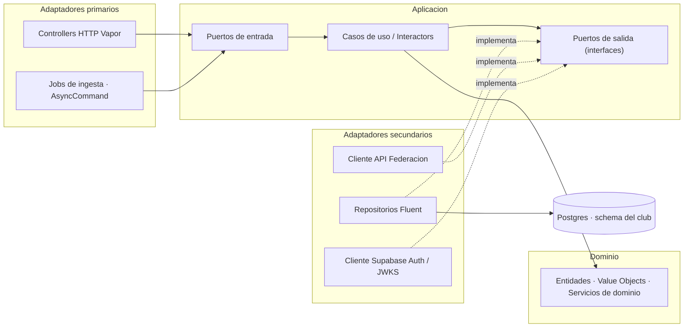
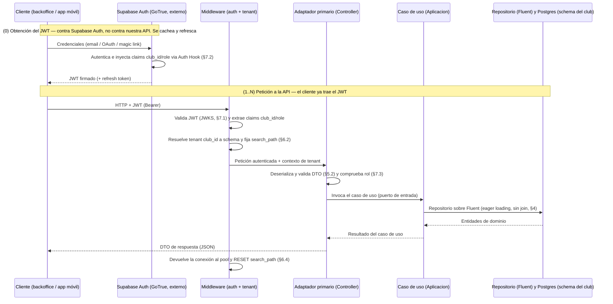
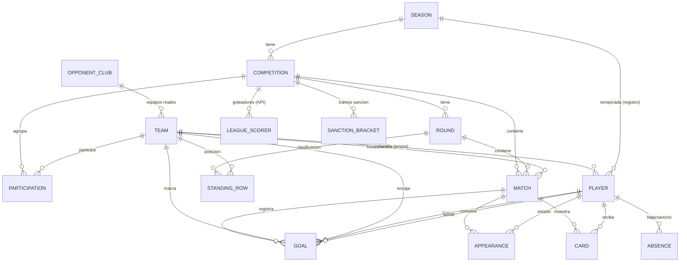

# LLD-001 · Diseño de bajo nivel — API backend y Base de datos

- **Estado:** Borrador — §2 (arquitectura Clean/Hexagonal/DDD), §3 (modelo de datos), §4 (Dominio, puertos y persistencia), §5 (contrato API — `Season` como plantilla) y §8.1 (testing) redactadas; resto del esqueleto por rellenar
- **Fecha:** 2026-08-01
- **Decisores:** desarrollador único (+ Claude Code)
- **Relacionado:** [HLD-001](./Project%20HLD-001.md) · [ADR-API_y_BBDD-001](./ADR-API_y_BBDD-001.md)

> **Alcance.** Diseño de bajo nivel **conjunto** de la API backend y la base de datos, por estar
> fuertemente acopladas (la API es la única frontera a la BD; ORM-first con Fluent). El **HLD-001** fija
> el marco de alto nivel y el **ADR-API_y_BBDD-001** las decisiones tecnológicas; este documento baja al
> **detalle de implementación**.
>
> **Convención de división futura:** §3–§4 (modelo de datos) y §5 (contrato de API) se mantienen como
> bloques de primer nivel para poder extraerlos a `LLD-BBDD` y `LLD-API` separados si el documento crece.

---

## 1. Propósito y alcance

*Qué cubre y qué no este LLD; supuestos de partida heredados del HLD/ADR.*

> Pendiente de redactar. Resumen del stack decidido (ADR): PostgreSQL/Supabase · API Swift (Vapor + Fluent)
> · Supabase Auth · multi-tenancy híbrida · despliegue PaaS con Docker (Fly.io).

---

## 2. Arquitectura del backend

*Capas y flujo de una petición; la API como única frontera a la BD.*

La API es la **única frontera de acceso a la BD** (requisito 6 del ADR): ningún cliente toca Postgres
directamente. Se organiza en **tres módulos funcionales** sobre una **arquitectura por capas** común, y es
**tenant-aware** de extremo a extremo (cada operación se resuelve contra el *schema* del club, §6).

### 2.1 Módulos funcionales

El backend se descompone en tres módulos. Dos son **superficie REST** (BFF y gestión de usuarios) y uno es
una **integración externa** con cadencia propia (Federación); la gestión de usuarios es además **transversal**
(protege a los otros dos).

| # | Módulo | Rol | Dirección de datos | Dónde se detalla |
|---|--------|-----|--------------------|------------------|
| 1 | **BFF** (Backend for Frontend) | CRUD sobre el modelo de dominio (§3) para el **backoffice web** (escritura) y las **apps móviles** (lectura). Es el grueso del contrato REST. | App ↔ *schema* del club | §5 |
| 2 | **Integración con la API de la Federación/liga** | **Ingesta** de datos externos (resultados/calendario, clasificación opcional, goleadores) y mapeo a `Match`/`StandingRow`/`LeagueScorer` (§3.7). Se construye por **ingeniería inversa** de la app iOS existente (RFFM Madrid + Federación Cataluña). | API externa → *schema* del club | Sección propia (§5-bis, pendiente del ejemplo de código) |
| 3 | **Gestión de usuarios** | **Autenticación** (validación del JWT de Supabase Auth), **autorización** (roles escritura/lectura) y **resolución/provisión de tenant** (§6, §7). Transversal a los otros dos. | Transversal (guarda cada petición) | §6, §7 |

**Cómo se relacionan.** La **gestión de usuarios** es una capa transversal: toda petición de los módulos 1 y
2 pasa por ella (identidad + `club_id` + rol). **BFF** y **Federación** escriben sobre el **mismo modelo y
*schema***, pero por vías distintas y **se encuentran en el dato**: la Federación aporta el **resultado** de un
`Match` (marcador/calendario) por ingesta periódica; el BFF/entrada manual añade el **detalle** de ese mismo
partido propio (goles con desglose, tarjetas, convocatorias). Es la división "resultado externo + detalle
manual" ya fijada en §3.7 — aquí queda reflejada como **frontera entre módulos**, no solo entre fuentes de dato.

> **Nota de división futura (actualiza la del encabezado):** al promover la Federación a bloque propio, los
> candidatos a extraerse a documentos separados quedan: §3–§4 → `LLD-BBDD`; §5 (BFF) + sección de Federación →
> `LLD-API`; §6–§7 (tenancy/auth) podrían ir a un `LLD-Tenancy-Auth` si crecen (ya previsto en el ADR).

### 2.2 Arquitectura por capas (Clean + Hexagonal + DDD)

Se adopta **Clean Architecture** como marco (círculos concéntricos + **Regla de dependencia** +
**independencia de frameworks**), articulada con **Puertos y Adaptadores** (Hexagonal) para las fronteras de
entrada/salida y con el **lenguaje ubicuo, Entidades y Value Objects** de **DDD** en el núcleo. Las
dependencias **apuntan siempre hacia el Dominio**; nada del Dominio conoce Vapor, Fluent ni HTTP.

**Las cuatro capas (de dentro hacia fuera):**

- **Dominio** *(núcleo, no depende de nada)* — **Entidades**, **Value Objects** y **servicios de dominio**
  que encierran las **reglas de negocio e invariantes** (unicidad de dorsal por equipo/temporada §3.5,
  consistencia de `scoring_team_id`/`conceding_team_id` del gol §3.6, tramos de sanción §3.6…). Tipos Swift
  **puros** (sin `import Vapor`/`Fluent`). Aquí vive el **lenguaje ubicuo**.
- **Aplicación** — **Casos de uso** (*interactors*) que orquestan el Dominio. Definen los **puertos**:
  **puertos de entrada** (contratos que invocan los adaptadores primarios) y **puertos de salida**
  (interfaces de **repositorio**, cliente de Federación, reloj/uuid…) que se resuelven por **Inversión de
  Dependencias (DIP)**.
- **Adaptadores (Interface Adapters)** —
  - **Primarios (*driving*)**: traducen entrada externa → caso de uso. **Controllers HTTP** de Vapor (BFF,
    usuarios) y **jobs/`AsyncCommand`** de ingesta (Federación, §2.3-b).
  - **Secundarios (*driven*)**: **implementan** los puertos de salida. **Repositorios Fluent** (persistencia
    Postgres), **cliente HTTP de la API de Federación**, **cliente Supabase Auth/JWKS** (§7.1).
- **Frameworks & Drivers (Infraestructura)** — el detalle **reemplazable**: Vapor, Fluent, PostgresNIO,
  Postgres, JWTKit, el runtime.



> **Regla de dependencia y DIP.** Las flechas continuas van **hacia el Dominio**. Los adaptadores secundarios
> (`REPO`/`FED`/`AUTH`) **no** son dependidos por la Aplicación: **implementan** puertos declarados en ella
> (flechas punteadas) → la dependencia queda **invertida**. Así el Dominio y los casos de uso se **testean sin
> BD ni red** (dobles de los puertos). **Los DTOs cruzan las fronteras** (§5.2): nunca se exponen al exterior
> Entidades de dominio ni modelos de persistencia; el adaptador primario mapea DTO ↔ Dominio, el secundario
> mapea Dominio ↔ modelo Fluent.

**Mapa capa → keyword → artefacto:**

| Capa (Clean) | Keyword (Hexagonal/DDD) | Artefacto Swift/Vapor |
|--------------|--------------------------|------------------------|
| **Dominio** | Entidades, Value Objects, servicios de dominio, lenguaje ubicuo | `struct`/`enum` Swift puros, **sin** `import Fluent/Vapor` |
| **Aplicación** | Casos de uso / *interactors*; puertos de entrada y de salida | Tipos de caso de uso + `protocol` (puertos) |
| **Adaptador primario** (*driving*) | Adaptador primario | `RouteCollection`/Controller de Vapor; `AsyncCommand` (jobs) |
| **Adaptador secundario** (*driven*) | Adaptador secundario | Repositorio Fluent; cliente HTTP Federación; cliente JWKS |
| **Frameworks & Drivers** | Infraestructura | Vapor, Fluent, PostgresNIO, Postgres, JWTKit |

**Los 3 módulos (§2.1) sobre estas capas:**
- **BFF** → casos de uso CRUD (Aplicación) + Controllers (primario) + repositorios Fluent (secundario).
- **Federación** → caso de uso de **ingesta** (Aplicación) + **job** disparador (primario, §2.3-b) + **cliente
  de la API externa** y repositorios (secundarios).
- **Gestión de usuarios** → **middleware de auth** = adaptador primario **transversal** que valida el JWT por
  un **puerto de identidad** (implementado por el cliente JWKS/Supabase); casos de uso de **resolución y
  provisión de tenant** (§6).

#### Decisión de diseño — Entidad de dominio vs *Active Record* de Fluent (impacta §4)

§4 modela hoy en estilo ***Active Record***: `final class Match: Model, Content` — el modelo **es** la
entidad y además conforma `Content` (se serializa directo como DTO). Eso **acopla el Dominio a Fluent/Vapor**
y **cruza la frontera con un objeto de framework**, justo lo que la Regla de dependencia y la independencia
de frameworks **prohíben**.

| Opción | Qué implica | Coste / veredicto |
|--------|-------------|-------------------|
| **A — Dominio independiente (Clean puro)** *(recomendada para el TFM)* | **Tres** representaciones: **Entidad de dominio** (`struct` puro), **modelo de persistencia** Fluent (en el adaptador secundario) y **DTO** (en el primario). El **repositorio** (puerto de salida) mapea Entidad ↔ modelo Fluent | Más *boilerplate* de mapeo; **defendible académicamente**: cumple la Regla de dependencia y hace el Dominio testeable sin BD |
| **B — *Active Record* pragmático** | El modelo Fluent hace de entidad; se **quita `Content`** y se mantienen DTOs explícitos (§5.2), pero el Dominio sigue importando Fluent | Menos código; **rompe** la independencia de frameworks (visible para el jurado) |

**Recomendación: Opción A.** Consecuencia → **revisar §4**: los modelos Fluent pasan a ser *modelos de
persistencia* del adaptador secundario (se les quita `Content`) y se añaden **Entidades de dominio** +
**repositorios** (puertos). Se aborda en el paso dedicado a §4.

### 2.3 Flujo de una petición (end-to-end)

Dos **adaptadores primarios** distintos (Controller HTTP y job de ingesta) invocan casos de uso que comparten
la **misma capa de acceso** (caso de uso → repositorio → Fluent → *schema* del club):

**(a) Petición HTTP** (BFF y gestión de usuarios) — dirigida por el cliente. Incluye el **paso (0) de
obtención del JWT**: el cliente se autentica **directamente contra Supabase Auth (GoTrue), no contra nuestra
API** — nuestra API **valida** el token (JWKS), pero **no lo emite** (ADR Decisión 3 / Anexo B.5). Ese paso
(0) ocurre **una vez por sesión** (con *refresh* mientras dure), no en cada petición; los pasos (1) en
adelante se repiten en cada llamada reutilizando el JWT cacheado:



**(b) Ingesta programada** (Federación) — **sin petición HTTP**: un `AsyncCommand`/tarea periódica (§8) es el
**adaptador primario** que, por cada club del tier gestionado (o el proyecto del silo), resuelve el tenant e
invoca el **caso de uso de ingesta**; este llama a la API externa (por el **puerto de salida** del cliente de
Federación) con los identificadores de federación (`federation_season_id`, `federation_group_id`, §3.7) y
**mapea y hace *upsert*** de `Match`/`StandingRow`/`LeagueScorer` sobre el *schema* del club (por el
**repositorio**). **Distinto adaptador primario, misma capa de acceso** (caso de uso → repositorio → Fluent →
*schema*), por lo que reutiliza el enrutado por tenant de §6.

> Detalle de cada capa transversal: **auth/authz** en §7, **resolución y enrutado de tenant** en §6, **contrato
> REST** (DTOs, errores, paginación) en §5, **contrato de ingesta** de la Federación en su sección propia.

---

## 3. Modelo de datos (BD)

Modelo derivado de los requisitos de estadística y de las pantallas de la app móvil (solo lectura) en
`docs/design-assets/mobile/`. Cubre: **estadísticas de liga** (resultados por jornada, clasificación por
jornada, goleadores de la liga), **estadísticas de equipo** (rendimiento total/local/visitante y desglose de
goles marcados/recibidos) y **estadísticas de jugador** (rol, disponibilidad, tarjetas, participación y goles).

> **Nota sobre los mockups:** los números de las pantallas de Stitch son **ilustrativos** y no siempre cuadran
> entre sí (p. ej. desgloses que no suman el total). El modelo trata cada dimensión de gol como **atributo
> independiente**; las reglas de partición/validación se listan en §3.6.

### 3.1 Diagrama entidad-relación



Todo vive dentro del *schema* del club (ver §6).

### 3.2 Entidades

Convenciones: `id` UUID PK, `created_at`/`updated_at` en todas; FKs con integridad referencial; *soft delete*
opcional (§3.5).

| Entidad                                           | Campos clave                                                                                                                                                       | Notas                                                                                                                                                                                                                                                                                                                                                                                                                                                                                                                                                                                                                                                                 |
| ------------------------------------------------- | ------------------------------------------------------------------------------------------------------------------------------------------------------------------ | --------------------------------------------------------------------------------------------------------------------------------------------------------------------------------------------------------------------------------------------------------------------------------------------------------------------------------------------------------------------------------------------------------------------------------------------------------------------------------------------------------------------------------------------------------------------------------------------------------------------------------------------------------------------- |
| **Club** (raíz del tenant)                        | `name`, `short_name`, `slug`, `crest_key?`, `settings` | Un registro por club/schema. **`name`** = nombre oficial largo; **`short_name`** = nombre corto para mostrar (cabeceras); **`slug`** = identificador **interno** para rutas y nombres de fichero — **inmutable, se fija al aprovisionar** y no se edita por API (§5.1). `crest_key` = clave del objeto en Storage, no una URL (§3.7) |
| **Season** (Temporada)                            | `label` ("2024/25"), `start_date`, `end_date`, **`federation_season_id`**, `archived_at?`                                                                          | `federation_season_id` = identificador de la temporada en la **API de la federación/liga**, distinto del `id` UUID interno; parámetro de entrada para llamar a la API externa. **Obligatorio** (toda temporada tiene contrapartida en la federación). `start_date`/`end_date` **fijas y derivadas de `label`** (01/07/AAAA → 30/06/AABB), **no overridables**. **`is_current` derivado en lectura, no se almacena**: es la temporada con el `end_date` **más próximo que aún es ≥ hoy** (el tiempo no retrocede → una sola current, sin invariante que gestionar). **`archived_at`** = archivado reversible (soft): oculta la temporada y, de facto, su subárbol (§5) |
| **OpponentClub** (Club rival)                     | `name`, `short_name`, `slug`, **`federation_club_id`**, `crest_key?` | **Identidad del club rival**, separada de sus equipos (§3.6). La crea la **ingesta** y la corrige el administrador. Un club rival suele tener equipo en **varias categorías** → varias filas `Team` apuntan a esta misma. **`federation_club_id`** = segmento numérico de la ruta del escudo en la API de la federación (§3.7); es la clave de emparejamiento de la ingesta |
| **Team** (Equipo)                                 | `opponent_club_id?`, `category`, `letter?`, `gender`, **`federation_team_id?`** | **`opponent_club_id` nulo ⇒ equipo propio** (del `Club` del tenant); no nulo ⇒ equipo rival → **`is_own` no se almacena: es derivado** (§3.6). **No lleva nombre ni escudo**: son del club. Nombre mostrado (derivado en lectura, §5) = nombre del club + `category` + `letter` → "CD Ejemplo Infantil A". **`federation_team_id`** = `codigo_equipo` de la API de la federación (§3.7): identifica al **equipo**, no al club — el mismo club tiene código distinto en cada categoría. **Anulable**: los equipos creados a mano que no están en competición federada no lo tienen. "Primer Equipo" = `category=senior` + `letter="A"` (o sin letra); filial = `category=senior` + `letter="B"` |
| **Competition** (Competición)                     | `season_id`, **`federation_group_id`**, `name`, **`age_category`**, **`division_label`**, `group_label` | Instancia de liga por temporada ("Infantil · Primera · G7"). `season_id` = FK al **UUID interno** de `Season` (no es el `federation_season_id`). `federation_group_id` = identificador de esta competición/grupo en la **API de la federación/liga** (distinto de `id`). **Obligatorio** (necesario para acceder a la API de la Federación). **`age_category`** = mismo enumerado que `Team.category` (§3.3) → permite **validar** que un equipo solo participe en una competición de su edad. **`division_label`** = nivel competitivo ("Primera", "Preferente", "Honor"…), **texto libre**: varía por federación y por categoría (§3.6). **`group_label`** = grupo ("G7") |
| **Participation**                                 | `competition_id`, `team_id`                                                                                                                                        | Únique(competición, equipo). Equipos que forman la liga                                                                                                                                                                                                                                                                                                                                                                                                                                                                                                                                                                                                               |
| **Round** (Jornada)                               | `competition_id`, `number`, `start_date`, `end_date`                                                                                                               | Único(competición, número)                                                                                                                                                                                                                                                                                                                                                                                                                                                                                                                                                                                                                                            |
| **Match** (Partido)                               | `competition_id`, `round_id`, `kickoff_at`, `home_team_id`, `away_team_id`, `home_score`, `away_score`, `status`, `venue?`                                         | *scores* nullables hasta jugado; `venue?` opcional (no siempre conocido)                                                                                                                                                                                                                                                                                                                                                                                                                                                                                                                                                                                              |
| **StandingRow** (Clasif./jornada)                 | `competition_id`, `round_id`, `team_id`, `position`, `played`, `won`, `drawn`, `lost`, `goals_for`, `goals_against`, `points`, `previous_position`                 | Único(jornada, equipo). **Snapshot por jornada** → clasificación de cada ronda + `PREV`                                                                                                                                                                                                                                                                                                                                                                                                                                                                                                                                                                               |
| **Player** (Jugador)                              | `team_id`, `season_id`, `full_name`, `photo_url`, `shirt_number`, `position`                                                                                       | Solo equipos propios. **Registro por temporada**: una fila = un jugador en un equipo en una temporada concreta (ver §3.6). Stats derivadas por temporada desde eventos ligados a este `Player`                                                                                                                                                                                                                                                                                                                                                                                                                                                                        |
| **Absence** (Disponibilidad)                      | `player_id`, `type`, `start_date` (INIC), `expected_return_date` (ALTA EST.), `actual_return_date`, `active`                                                       | Disponibilidad actual = ausencia activa                                                                                                                                                                                                                                                                                                                                                                                                                                                                                                                                                                                                                               |
| **Appearance** (Convocatoria)                     | `player_id`, `match_id`, `status`, `minutes?`                                                                                                                      | Único(jugador, partido). Cuenta JUGADOS/BAJA MÉDICA/SANCIÓN/NO CONVOCADO                                                                                                                                                                                                                                                                                                                                                                                                                                                                                                                                                                                              |
| **Card** (Tarjeta)                                | `player_id`, `match_id`, `type`, `is_second_yellow`, `minute?`                                                                                                     | "Amarillas pendientes de sanción" se calcula (§3.6)                                                                                                                                                                                                                                                                                                                                                                                                                                                                                                                                                                                                                   |
| **Goal** (Gol)                                    | `match_id`, `scoring_team_id`, `conceding_team_id`, `scorer_player_id?`, `assist_player_id?`, `minute?`, `zone?`, `side?`, `body_part?`, `play_type?`, `assisted?` | **Denormalizado a propósito** (§3.6): `scoring_team_id`/`conceding_team_id` se copian del `Match` al crear el gol → goles a favor de un equipo = `WHERE scoring_team_id = :id_del_equipo`; goles en contra = `WHERE conceding_team_id = :id_del_equipo`, **sin join**. Todos los campos de clasificación (`zone`…`assisted`) son **opcionales** (entrada manual parcial)                                                                                                                                                                                                                                                                                              |
| **LeagueScorer** (Goleador de liga)               | `competition_id`, `full_name`, `team_label`, `goals`, `rank?`, `synced_at?`                                                                                        | **Ingerida de la API de la liga** (§3.7); no ligada a `Player`; solo lectura                                                                                                                                                                                                                                                                                                                                                                                                                                                                                                                                                                                          |
| **CompetitionSanctionBracket** (Tramo de sanción) | `competition_id`, `seq`, `yellow_from`, `yellow_to`                                                                                                                | Config por competición (§3.6). Sanción al alcanzar `yellow_to`; "pendientes" = `yellow_to − acumuladas`                                                                                                                                                                                                                                                                                                                                                                                                                                                                                                                                                               |

### 3.3 Enumerados (propuesta)

- **Team.category:** `prebenjamin, benjamin, alevin, infantil, cadete, juvenil, senior` (`senior` cubre tanto "Primer Equipo" como equipos filiales; se distinguen por `letter`).
- **Team.gender:** `masculino, femenino, mixto`.
- **Player.position:** `portero, defensa, centrocampista, delantero`.
- **Match.status:** `programado, finalizado, aplazado, suspendido`.
- **Appearance.status:** `jugado, baja_medica, sancionado, no_convocado`.
- **Card.type:** `amarilla, roja`.
- **Absence.type:** `lesion, enfermedad, sancion, otro`.
- **Goal.zone:** `area_chica, area_penalti, fuera_area` — **partición exclusiva** (cada gol tiene exactamente una zona).
- **Goal.side:** `derecha, izquierda, centro`.
- **Goal.body_part:** `pie, cabeza, otro`.
- **Goal.play_type:** `juego_abierto, penalti, falta, en_propia_puerta`.

### 3.4 Vistas derivadas (agregaciones, no tablas base)

Calculadas por consulta o vistas materializadas:
- **Rendimiento de equipo por temporada** (Total/Local/Visitante): J, G, E, P, GF, GC, PTS — desde `Match`.
- **Desglose de goles del equipo** (marcados/recibidos por dimensión) — desde `Goal`, filtrando directamente por `scoring_team_id = :id_del_equipo` (marcados) o `conceding_team_id = :id_del_equipo` (recibidos); **sin join** a `Match`.
- **Estadísticas de jugador por temporada** — goles, asistencias, participaciones por estado, tarjetas — desde eventos.
- **Amarillas pendientes de sanción** (por jugador) — según los *brackets* de la competición (`CompetitionSanctionBracket`): distancia al siguiente `yellow_to`. Reinicio de ciclo tras cumplir sanción.
- **Racha (forma)** — últimos N resultados por equipo — desde `Match`/`StandingRow`.
- **Goleadores de la liga (global)** — **directamente desde `LeagueScorer`** (ingerida de la API de la liga; **no** se calcula desde `Goal` — ver §3.7).

### 3.5 Convenciones y restricciones
- PK `id` UUID; `created_at`/`updated_at` (`timestamptz`).
- Tablas en `snake_case` plural; enums como tipos Postgres o `text` + `CHECK`.
- Índices en FKs y en columnas de filtro frecuente (temporada, competición, jornada, equipo) **y en las usadas por RLS**. En particular, índice en `Goal.scoring_team_id` y en `Goal.conceding_team_id` (consultas de desglose de goles marcados/recibidos, §3.4).
- *Soft delete* (`deleted_at`) opcional para entidades de edición manual (auditoría/recuperación). Caso aparte: `Season` lleva **`archived_at`** (archivado reversible, no borrado), con filtro por defecto en las lecturas (§5).
- Unicidades: `Season`(`label`), `Season`(`federation_season_id`), `Club`(`slug`), `OpponentClub`(`slug`), `OpponentClub`(`name`), `OpponentClub`(**`federation_club_id`**), `Team`(**`federation_team_id`**), `Team`(`opponent_club_id`, `category`, `letter`, `gender`), `Competition`(`season_id`, **`federation_group_id`**), `Participation`(competición, equipo), `Round`(competición, número), `StandingRow`(jornada, equipo), `Appearance`(jugador, partido), `Player`(equipo, temporada, dorsal) — todas **dentro del *schema* del club** (§6); el dorsal se valida dentro del mismo equipo y temporada.
- **Cuidado con los `NULL` en la unicidad de `Team`.** En Postgres los `NULL` **no comparan iguales**, así que un `UNIQUE` normal sobre (`opponent_club_id`, `category`, `letter`, `gender`) **no protegería a los equipos propios** (todos con `opponent_club_id` nulo) — se podrían crear dos "Infantil A" propios. Dos formas de resolverlo: `UNIQUE NULLS NOT DISTINCT` (Postgres **15+**, disponible en Supabase) o un **índice único parcial** `WHERE opponent_club_id IS NULL` que complemente al normal. Lo mismo aplica a `letter`, que también es opcional.
- **`Competition` se identifica por (`season_id`, `federation_group_id`), no por el grupo a secas.** El identificador de grupo envuelve categoría + división + grupo (§3.7), pero **no la temporada**: la llamada a la API externa se construye con `federation_season_id` **y** `federation_group_id`. Restringir solo por el grupo impediría tener la misma competición en dos temporadas — que es el caso normal.
- **En cambio, en `federation_team_id` y `federation_club_id` el comportamiento por defecto es el que se quiere:** son anulables (equipos y clubes dados de alta a mano no tienen contrapartida federada) y, al no comparar iguales los `NULL`, un `UNIQUE` normal permite **muchas filas sin código** mientras garantiza que **no se repita un código concreto**. Aquí **no** se usa `NULLS NOT DISTINCT`. Conviene tenerlo presente porque es justo el criterio opuesto al del punto anterior, en la misma tabla.

### 3.6 Supuestos y cuestiones abiertas (dominio)

**Supuestos vigentes:**
- **Datos de liga por tenant:** cada club mantiene su **propia copia** de rivales/competición/clasificación (aislamiento por club, §6). Dos clubs que sigan la misma liga duplican esos datos.
- **Detalle por tipo de partido:** el **resultado** (marcador/calendario) de **todos** los partidos —propios y rivales— llega de la API de la Federación (§3.7). Los partidos del **equipo propio** llevan además, de entrada manual, los eventos detallados (goles con desglose, tarjetas, convocatorias); los partidos solo-rivales se quedan en resultado + clasificación (sin detalle, al no existir su plantilla).

**Resueltas (esta iteración):**
- ✅ **Goleadores de la liga:** los provee el **propietario de la liga vía API** (tarjeta "LIGA"). Se almacenan en `LeagueScorer` (solo lectura); **no** se modelan rosters ni goles de rivales para esto. Ver §3.7.
- ✅ **Zona de gol:** **tres** valores (`area_chica`, `area_penalti`, `fuera_area`), **partición exclusiva** (una por gol).
- ✅ **Sanción por amarillas:** **configurable por competición y por tramos** (`CompetitionSanctionBracket`), p. ej. `0-5, 6-10, 11-13, 14-16, …`. Sanción al alcanzar el `yellow_to` del tramo; "pendientes" = distancia al siguiente umbral. Las **rojas** provocan sanción directa.
- ✅ **Clasificación por jornada:** válida tanto **ingerida de la API de la liga** como **manual/calculada** (según el propietario la provea o no). **No cambia el modelo** (`StandingRow` es agnóstico a la fuente); es tarea de API/ingesta (§3.7, §5).
- ✅ **Doble identificador (interno vs API de federación/liga):** `Season` y `Competition` tienen su `id` UUID **interno** (PK) **y** un identificador **externo** de la API de la federación/liga (`federation_season_id`, `federation_group_id` respectivamente). Son campos **distintos** y no intercambiables: el UUID es la PK/FK dentro de nuestro *schema*; el identificador externo es el parámetro que se usa para **llamar a esa API**. Ver §3.7.
- ✅ **Nombres de equipo que no siguen literalmente "categoría + letra":** cubiertos con `category=senior`: **"Primer Equipo"** = `category=senior` + `letter` (p. ej. "A" o sin letra); **equipo filial** = `category=senior` + `letter="B"`. No hace falta un campo de nombre especial.
- ✅ **Registro de jugador entre temporadas / traspasos:** la pregunta era si `Player` debía ser una **identidad estable** que persiste entre temporadas (un mismo registro que se traslada de equipo/categoría cada año, requiriendo una tabla de "registro por temporada" aparte) o si cada temporada genera **directamente una fila nueva**. Se opta por lo segundo: **`Player` lleva `season_id`** (además de `team_id`) → **una fila = un jugador en un equipo en una temporada concreta**. Un jugador que sube de categoría, cambia de equipo o continúa la temporada siguiente es, simplemente, **otra fila** (sin vínculo formal entre ellas). Encaja con la introducción manual de datos (la plantilla se da de alta cada temporada) y con las pantallas (todas navegan con selector de temporada). *No* se modela una identidad "persona" estable entre filas — si en el futuro hiciera falta un total de carrera multi-temporada, sería una extensión posterior (fuera de alcance ahora).
- ✅ **Minutos jugados:** se registran, pero como **campo opcional** (`Appearance.minutes?`, entrada manual) — ya reflejado así en §3.2. No es obligatorio para contar una convocatoria/participación.
- ✅ **Copas/otras competiciones:** se modelan **con las mismas entidades** que la liga regular — una copa es, sencillamente, otra `Competition` (dentro de la misma `Season`) con sus propias `Round`/`Match`. **No hace falta ninguna entidad nueva.** `StandingRow`, `LeagueScorer` y `CompetitionSanctionBracket` son tablas normales ligadas a `competition_id`: si una copa de eliminatorias no tiene clasificación, simplemente no tendrá filas en `StandingRow` para esa competición (nada que forzar en el esquema). Los formatos de ronda (ida/vuelta, eliminación directa) son variaciones de **cómo se generan/leen** `Round`/`Match`, no del modelo.
- ✅ **`Goal`: "a favor"/"en contra" sin join, y campos de clasificación opcionales.** Con solo `team_id` (el equipo que marca), saber si un gol es "recibido" por un equipo dado exige un **join** a `Match` (para saber quién era el rival) y comparar. Se **denormaliza a propósito**: `Goal` guarda **dos** FKs a `Team` — `scoring_team_id` (quién marca) y `conceding_team_id` (quién encaja) — copiadas del `Match` al crear el gol. Así, para un equipo cualquiera (ej. "Juvenil A", `id = a1b2c3…`): goles **a favor** = `WHERE scoring_team_id = 'a1b2c3…'`; goles **en contra** = `WHERE conceding_team_id = 'a1b2c3…'` — ambas **consultas directas e indexadas**, sin join. Se descarta un booleano único tipo `a_favor/en_contra` porque solo funcionaría con una perspectiva fija (p. ej. "el equipo propio"), y se rompería si dos equipos propios del mismo club se enfrentan entre sí. **Contrapartida asumida:** hay que mantener ambos campos consistentes con el `Match` al escribir (los rellena la capa de aplicación, no el usuario). Además, se marcan como **opcionales** todos los campos de clasificación del gol (`zone`, `side`, `body_part`, `play_type`, `assisted`) — reflejan entrada manual parcial; no todos los goles llevan el desglose completo.

- ✅ **`Team` no lleva identidad de club: se extrae a `OpponentClub`.** El diseño previo daba a `Team` los campos `short_name`, `crest_url` e `is_own`, pero **ninguno de los tres es un atributo del equipo**: son del **club** al que pertenece. `Team` estaba mezclando dos conceptos — *de qué club es* y *qué equipo de ese club es* (`category`, `letter`, `gender`, los únicos realmente suyos). Las consecuencias eran dos: (a) en equipos **propios**, `short_name`/`crest_url` **duplican** los de `Club` en N filas → cambias el escudo del club y tus equipos siguen mostrando el viejo; (b) en **rivales** es peor, porque **el mismo club rival aparece muchas veces**: tu Infantil juega la liga infantil, tu Cadete la cadete —**competiciones distintas**— y el club rival del barrio tiene equipo en casi todas, así que su nombre y su escudo se repiten **una vez por categoría**. Eso agravaba justamente el problema del emparejamiento por nombre (§3.7): corregir a mano una errata del proveedor obligaría a repetir el `PATCH` en una fila por categoría. **Solución:** entidad `OpponentClub` (`name`, `crest_url?`) y `Team.opponent_club_id` **anulable**; `Team` pierde nombre y escudo. **`is_own` desaparece como columna** — es `opponent_club_id IS NULL`, con lo que se elimina de raíz la posibilidad de que la bandera y los datos se contradigan. El nombre mostrado se **compone en lectura**. **Contrapartida asumida:** una entidad más, un *join* para componer el nombre, y la ingesta debe **separar** el texto libre del proveedor ("C.D. RIVAL «B»") en club + letra. A cambio, la corrección manual de la ingesta se hace **en un solo sitio** (`OpponentClub`), que es donde de verdad hacía falta.

- ✅ **Arranque en frío ("el principio de los tiempos") y reclamación de equipo propio.** En t=0 el club no
  tiene **nada**: ni equipos, ni escudos, ni rivales. Todo eso lo trae la **ingesta** de la Federación — y
  eso incluye **el equipo propio**, que aparece en la competición igual que los demás. Pero la ingesta **no
  puede saber cuál de los equipos eres tú**: los crea todos como rivales (con su `OpponentClub`). Hace falta,
  por tanto, un acto explícito de **reclamación**. Choca con la regla de que el `PATCH` de `Team` **no** puede
  cambiar `opponent_club_id` (§5.1) — regla que se mantiene, porque evita que un equipo cambie de bando por
  un `PATCH` descuidado. La salida es un **sub-recurso de estado dedicado**, `PUT/DELETE /v1/teams/{id}/ownership`
  (§5.1), en la línea de `/archive`. No es un cambio de campo sino una **orquestación**: al reclamar un
  equipo, el `OpponentClub` que la ingesta le había asignado resulta ser **el club propio**, así que de ahí
  salen el nombre y el escudo con los que rellenar `Club`. Es la pieza central del **onboarding**.

- ✅ **División: ya estaba, pero escondida bajo un nombre equívoco.** Al ver que un mismo equipo juega en
  divisiones distintas en temporadas distintas surge la duda de si falta modelar la **división**. La
  respuesta es que **`Team` no la necesita** —y no debe tenerla—: la división es un atributo de **dónde
  compite**, no de **quién es** el equipo. Un equipo que asciende o desciende sigue siendo el mismo (lo
  confirma la muestra 4 de §3.7: mismo `codigo_equipo` en dos divisiones), y el cambio ya queda registrado en
  que su `Participation` apunta a una `Competition` distinta. **El modelo lo soportaba sin tocar nada.** El
  problema real era otro: `Competition` tenía un campo **`category_label`** que en el ejemplo valía "Honor"
  —o sea, **una división**— mientras que `Team.category` significa **categoría de edad** (`infantil`,
  `cadete`…). Dos cosas distintas con el mismo nombre en el mismo modelo: una trampa garantizada. Se separan
  en tres campos explícitos: **`age_category`** (enumerado, el mismo que `Team.category`), **`division_label`**
  y **`group_label`**. Beneficio adicional: al ser `age_category` un enumerado y no texto, se puede
  **validar que un equipo solo participe en competiciones de su edad**, cosa que con una etiqueta libre era
  imposible. `division_label` se deja **como texto libre** a propósito: los nombres de división varían por
  federación y por categoría ("Primera", "Preferente", "Honor", "Autonómica"…) y no forman un enumerado
  cerrado que podamos fijar hoy.

  > **Ojo con el origen del dato:** la división **no viene en el objeto de partido** de la API de la
  > federación (ninguna de las cuatro muestras de §3.7 la incluye). Tiene que llegar del endpoint de
  > competición/grupo, el que se consulta con `federation_group_id`. Pendiente de confirmar cuando haya
  > ejemplo de esa llamada (§5.6).

**Pendientes:** ninguna por ahora.

### 3.7 Fuentes de datos y *provenance*

Dos orígenes conviven; el modelo es agnóstico a la fuente, pero la **ingesta** es tarea de la API (§5/§8).
La división es por **tipo de dato**, no por partido propio/rival: los **resultados** (el marcador y el
calendario) llegan de la Federación para **todos** los partidos de la competición; **todo lo demás**
(cómo se hizo cada gol, tarjetas, convocatorias, bajas) es entrada manual del club y solo existe para el
**equipo propio** (no hay plantilla de rivales):

| Origen | Datos | Entidades | Notas |
|--------|-------|-----------|-------|
| **Externo** (API de la Federación/liga) | **Resultados de cada jornada** (marcador y calendario de **todos** los partidos de la competición, propios y rivales); **clasificación por jornada** (si el propietario la provee); **goleadores de la liga** (siempre) | `Match` (resultado/calendario), `StandingRow`, `LeagueScorer` | Ingesta/sincronización periódica. La clasificación **no** todos los propietarios la ofrecen → *fallback* manual (no afecta al modelo, es tarea de API) |
| **Externo** (API de la Federación/liga) | **Estructura de la competición** (categoría/división/grupo y jornadas) y **clubes y equipos rivales** que la forman — necesarios para poder insertar los `Match` | `Competition`, `Round`, `OpponentClub`, `Team` (rivales) | La estructura sale de la **cadena de selección** (ver más abajo), que recorre el módulo de Federación (§2.1) y **no** el BFF. Los equipos llegan con `codigo_equipo` y nombre con la letra embebida → la ingesta separa club + letra y empareja por código |
| **Interno** (entrada manual del club) | **Todas las estadísticas de equipo/jugador excepto el resultado**: desglose de cada gol (zona/lado/parte del cuerpo/tipo de jugada/asistencia), tarjetas, convocatorias/disponibilidad, plantilla | `Team` (propios), `Player`, `Goal`, `Card`, `Appearance`, `Absence` | Solo aplica al **equipo propio** (`opponent_club_id IS NULL`); es la capa de detalle ("cómo pasó") sobre el `Match` cuyo resultado ya viene de fuera |

> Implicación para la API (§5): definir el **contrato de ingesta** de la API de la federación/liga
> (resultados/calendario de cada jornada, clasificación opcional, goleadores), la cadencia de
> sincronización y el *fallback* manual de clasificación. El usuario aportará un **ejemplo** de esa API
> más adelante (afecta a tareas de API, no al modelo).

**Identificadores externos (parámetros de la API de la federación/liga).** Para poder llamar a la API
externa, `Season` y `Competition` guardan el identificador que esa API usa para nombrar esos recursos,
**separado** de nuestro `id` UUID interno:

| Entidad | PK interna (nuestro *schema*) | Identificador externo (API federación/liga) |
|---------|-------------------------------|-----------------------------------------------|
| `Season` | `id` (UUID) | `federation_season_id` — parámetro de temporada |
| `Competition` | `id` (UUID) | `federation_group_id` — parámetro de competición/grupo |

Nunca se usa el identificador externo como PK/FK dentro del *schema*; es un dato más, propio de la
integración, que la capa de ingesta usa para construir las llamadas a la API externa.

**`federation_group_id` es opaco: envuelve categoría de edad + división + grupo en un solo valor** (al menos
en esta federación). Es decir, un `federation_group_id` identifica exactamente una `Competition` dentro de
una temporada. Esto **no** hace redundantes los tres campos `age_category` / `division_label` /
`group_label` de §3.2 — al contrario, son su **descomposición**, y son necesarios por tres razones que el
identificador opaco no cubre:

1. **Mostrar.** De `federation_group_id` no se puede pintar "Infantil · Primera · G7".
2. **Validar.** `age_category` como enumerado permite comprobar que un equipo solo participe en
   competiciones de su edad (§3.6); de un valor opaco no se deduce nada.
3. **Portar.** El desglose es **agnóstico de la federación**; el identificador opaco no. Si aparece otra
   federación con otra numeración, los tres campos siguen significando lo mismo y solo cambia la clave de
   integración. Es la parte del modelo que sobrevive al proveedor.

**De dónde salen esos tres valores: la API es una cadena de selección.** No hay que parsear el identificador
opaco ni teclear los datos a mano — la propia navegación de la federación los va entregando por niveles:

```
temporada
   └─→ lista de (categoría de edad + división)
          └─→ lista de grupos
                 └─→ calendario del grupo (con resultados si los hay)
```

Cada paso se alimenta de la selección del anterior. La descomposición de §3.2 **se rellena por el camino**:
`age_category` y `division_label` en el segundo nivel, `group_label` en el tercero, y el
`federation_group_id` resultante es lo que queda guardado para las sincronizaciones posteriores — a partir
de ahí ya no hace falta recorrer la cadena, se va directo al calendario.

> **Lo que queda por confirmar:** el segundo nivel entrega categoría de edad y división **juntas**. Si vienen
> como **un único rótulo** ("INFANTIL PRIMERA"), habrá que separarlas para poblar `age_category`
> (enumerado) y `division_label` (texto). Es un parseo mucho más acotado que el del nombre de un equipo —
> las categorías de edad son un **enumerado cerrado de siete valores** (§3.3), así que basta reconocer el
> prefijo y lo que sobra es la división. Si el nivel devuelve los dos campos por separado, no hay ni eso.
> Pendiente del ejemplo de esa llamada.

**Sí hay identificador externo de equipo (`codigo_equipo`) — *abierto*.** Los equipos **no son parámetro**
de ninguna llamada (no van en *path* ni en *query*), pero **sí vienen identificados en las respuestas**. Una
respuesta real de partido de la RFFM:

```json
{
  "codacta": "5594142",
  "codigo_equipo_local": "2032",
  "equipo_local": "C.D. FUTBOL TRES CANTOS 'A'",
  "escudo_equipo_local": "/pnfg/pimg/Clubes/00100_0012158828_Escudo_Tres_Cantos_CDF.png",
  "goles_casa": "",
  "codigo_equipo_visitante": "821",
  "equipo_visitante": "CELTIC CASTILLA C.F. 'A'",
  "escudo_equipo_visitante": "/pnfg/pimg/Clubes/00100_0010940034_ESC_CELTIC_CASTILLA.png",
  "goles_visitante": "",
  "codigo_campo": "1114",
  "campo": "TRES CANTOS - JAIME MATA - FORESTA 1 (HA)(HA)",
  "fecha": "26-09-2026",
  "hora": ""
}
```

Y esta otra, del **mismo club** (Celtic Castilla) en **otra categoría**, que es la que resuelve la
granularidad del identificador:

```json
{
  "codacta": "5589418",
  "codigo_equipo_local": "3349086",
  "equipo_local": "CELTIC CASTILLA C.F. 'A'",
  "escudo_equipo_local": "/pnfg/pimg/Clubes/00100_0010940034_ESC_CELTIC_CASTILLA.png",
  "codigo_equipo_visitante": "291",
  "equipo_visitante": "C.D. EL ESCORIAL",
  "escudo_equipo_visitante": "/pnfg/pimg/Clubes/00100_0011702833_escudo_CD_Escorial.png",
  "codigo_campo": "103",
  "campo": "CANAL ISABEL II (HA)(HA)",
  "fecha": "06-06-2027"
}
```

**Comparando las dos muestras para el mismo club** se deduce todo lo que necesitábamos:

| Campo | Celtic Castilla (muestra 1) | Celtic Castilla (muestra 2) | Conclusión |
|-------|------------------------------|------------------------------|------------|
| `equipo_*` | `CELTIC CASTILLA C.F. 'A'` | `CELTIC CASTILLA C.F. 'A'` | **Idéntico** — el nombre **no lleva la categoría** |
| `escudo_*` | `…00100_`**`0010940034`**`_ESC_CELTIC_CASTILLA.png` | `…00100_`**`0010940034`**`_ESC_CELTIC_CASTILLA.png` | **Idéntico** — identifica al **club** |
| `codigo_equipo_*` | **`821`** | **`3349086`** | **Distinto** — identifica al **equipo** |

- ✅ **`codigo_equipo` identifica al EQUIPO, no al club** (§3.6): el mismo club tiene código distinto en cada
  categoría. Es la clave externa de `Team`.
- ✅ **Casar por nombre no era solo frágil: era incorrecto.** Como el nombre es idéntico en ambas categorías,
  un emparejamiento por nombre habría **fusionado dos equipos distintos en uno**. Queda descartado como
  estrategia de ingesta, no solo desaconsejado.
- ✅ **La clave de club está en la ruta del escudo.** El segmento numérico (`0010940034`) es **el mismo para
  el mismo club en distintas categorías** y distinto entre clubes (Tres Cantos `0012158828`, El Escorial
  `0011702833`). Formato observado: `{00100}_{id_club}_{etiqueta}.png`, donde `00100` es constante
  (presumiblemente el código de la RFFM). Es la clave externa de `OpponentClub`.

> **Salvedad sobre la clave de club.** Se obtiene **parseando el nombre de un fichero**, no de un campo
> propio de la API: es una **inferencia a partir de los datos observados**, no un contrato publicado. Si un
> club cambia de escudo y el fichero se renombra, la clave podría cambiar y generaría un `OpponentClub`
> duplicado. Por eso la ingesta debe **tolerar el fallo** (si el patrón no casa, caer a la revisión manual de
> §5.1) y por eso sigue teniendo sentido la operación de **fusión** pendiente.

Lo que esto aporta al modelo de `Team`/`OpponentClub`:

- **La ingesta casa por identificador, nunca por nombre** → `Team.federation_team_id` = `codigo_equipo`;
  `OpponentClub.federation_club_id` = segmento numérico de la ruta del escudo.
- **El nombre trae la letra embebida**: `"C.D. FUTBOL TRES CANTOS 'A'"` → club + `letter`, entre comillas
  simples. La ingesta debe separarlos (§3.6). Nótese que `"C.D. EL ESCORIAL"` **no lleva letra** → `letter`
  ha de seguir siendo opcional.
- **El escudo es del *club*, no del equipo** — la ruta lo dice: `/pnfg/pimg/Clubes/…`. Confirma
  independientemente la separación `OpponentClub` / `Team` de §3.6.
- **`goles_casa`/`goles_visitante` vienen como cadena vacía**, no como `null`, cuando el partido no se ha
  jugado → el mapeo a `Match.home_score`/`away_score` (nullables) debe traducir `""` a `NULL`.
- **`codigo_campo` + `campo`**: hay identificador de campo. Hoy `Match.venue?` es texto libre (§3.2); si el
  campo llegara a merecer entidad propia, aquí está la clave. Fuera de alcance por ahora.

✅ **`codigo_equipo` es estable ENTRE TEMPORADAS.** Tercera muestra, el mismo equipo en la misma categoría
la **temporada anterior** (`"fecha":"14-09-2025"`, frente al `06-06-2027` de la muestra 2):

```json
{
  "codacta": "5348330",
  "codigo_equipo_local": "334286",
  "equipo_local": "C.F. POZUELO DE ALARCON 'B'",
  "escudo_equipo_local": "/pnfg/pimg/Clubes/00100_0010960678_escudo_Rffm_-_CFPOZUELO.jpg",
  "goles_casa": "3",
  "codigo_equipo_visitante": "3349086",
  "escudo_equipo_visitante": "/pnfg/pimg/Clubes/00100_0010940034_ESC_CELTIC_CASTILLA.png",
  "equipo_visitante": "CELTIC CASTILLA C.F. 'A'",
  "goles_visitante": "0",
  "fecha": "14-09-2025",
  "hora": "12:00"
}
```

Y una cuarta, del **otro** equipo del mismo club (el de código `821`), también de la temporada anterior y
**en otra división** — el equipo cambió de división entre campañas:

```json
{
  "codacta": "5375152",
  "codigo_equipo_local": "821",
  "escudo_equipo_local": "/pnfg/pimg/Clubes/00100_0010940034_ESC_CELTIC_CASTILLA.png",
  "equipo_local": "CELTIC CASTILLA C.F. 'A'",
  "goles_casa": "3",
  "codigo_equipo_visitante": "2032",
  "equipo_visitante": "C.D. FUTBOL TRES CANTOS 'A'",
  "goles_visitante": "2",
  "fecha": "28-03-2026",
  "hora": "12:00"
}
```

**Las cuatro muestras cruzadas para Celtic Castilla C.F. 'A'** (mismo nombre y mismo escudo `0010940034` en
todas):

| Muestra | Fecha | Temporada | `codigo_equipo` | Contexto |
|---------|-------|-----------|-----------------|----------|
| 1 | 26-09-2026 | 26/27 | **821** | categoría A |
| 4 | 28-03-2026 | 25/26 | **821** | categoría A, **otra división** |
| 2 | 06-06-2027 | 26/27 | **3349086** | categoría B |
| 3 | 14-09-2025 | 25/26 | **3349086** | categoría B |

**Consecuencias:**

- **Dos códigos distintos = dos equipos distintos del mismo club** (categorías de edad distintas), pese a
  compartir nombre y escudo. Reconfirma que `codigo_equipo` es del equipo y que el nombre no distingue nada.
- **Cada código se repite en ambas temporadas** → estable entre campañas.
- **`821` se repite aunque el equipo cambió de división** → el código **no depende de la competición**. Es
  identidad de equipo pura.

Por tanto `federation_team_id` se queda en **`Team`** (§3.2) y **no** hay que moverlo a `Participation` —
`Team` es independiente de la temporada (§3.6) y el código lo acompaña toda su vida. El equivalente vale
para `federation_club_id` en `OpponentClub`.

Esta muestra aporta además el caso de **partido ya jugado**: `goles_casa`/`goles_visitante` traen `"3"`/`"0"`
(frente a `""` en los no jugados) y `hora` trae `"12:00"` (frente a `""`). Al mapear a `Match`: `fecha`+`hora`
componen `kickoff_at`, pero **la hora puede faltar** aun conociéndose la fecha → el mapeo debe contemplarlo.

> **Estos códigos NO son claves de unión.** Son **datos de integración**, propiedad de un tercero, y se
> tratan como el resto de identificadores externos (§3.7, arriba): **nunca** PK, **nunca** FK, **nunca** un
> `JOIN` interno. Dentro del *schema* se une siempre por el `id` UUID. Sirven exclusivamente para que la
> ingesta **reconozca** a qué fila corresponde lo que llega de fuera. Si la Federación cambiara su
> numeración, o si un endpoint concreto no los trajera, el modelo **sigue en pie**: se degradaría la calidad
> del emparejamiento, no la integridad de los datos.
>
> Por eso los tres son **anulables** y la ingesta usa una **cadena de emparejamiento con degradación**:
> 1. `federation_team_id` / `federation_club_id` si vienen;
> 2. si no, nombre normalizado (sin la letra, sin puntuación, sin acentos) **más** categoría — nunca el
>    nombre a secas, que no distingue categorías;
> 3. si tampoco, alta nueva marcada para **revisión manual** (§5.1).
>
> Y si aparecen duplicados, hará falta la operación de **fusión**: un `PATCH` de nombre **no** fusiona nada.

**Ingesta de escudos: se descargan y se guardan, no se enlazan.** Las rutas de `escudo_*` son relativas al
*host* de la federación (`https://appweb.rffm.es` + ruta). La ingesta **descarga el fichero y lo almacena en
Supabase Storage**; el modelo guarda la **clave del objeto** (`crest_key`), no una URL. Dos razones: no
depender de que un tercero siga sirviendo ese fichero, y **no atarse a un dominio/bucket/CDN** — si cambia,
se cambia la composición de la URL en la respuesta y no hay migración de datos. La API compone la URL
pública en el DTO.

**Cómo se nombra el fichero — y por qué NO se deriva del código de federación.** La tentación es usar
`crests/opponents/{federation_club_id}.png`, pero eso ataría un identificador **interno y permanente** al
valor de un sistema de terceros que puede no estar disponible (es una inferencia sobre un nombre de fichero)
ni ser estable indefinidamente. La clave se deriva del **`slug`**, y el `slug` se genera **al crear la fila,
a partir del nombre, y queda inmutable** (con sufijo de desempate si colisiona). Así:

- es **legible** (`crests/opponents/celtic-castilla.png`), que era el objetivo de tener `slug`;
- **no depende de la Federación** en absoluto;
- **sobrevive a las correcciones de nombre** — no porque se recalcule, sino porque **no se recalcula
  nunca**. Si el administrador arregla la grafía, el fichero conserva su nombre original: un poco desfasado,
  pero estable y sin huérfanos. Un `slug` interno no se muestra, así que que envejezca no molesta.

Queda **pendiente** la política de **refresco** del escudo (la ruta de origen es detectablemente distinta si
el club lo cambia).

**Un único proveedor de API para todas las competiciones (supuesto).** Según la información disponible,
la Federación expone **la misma API** (mismo *host*/contrato) para todas las competiciones, distinguiendo
cada recurso solo por los parámetros `federation_season_id` y `federation_group_id`. Por eso **no** se
modela una configuración de proveedor/endpoint por competición (URL, credenciales…); si en el futuro
aparecen federaciones distintas con APIs distintas, sería una extensión (p. ej. una entidad de
"proveedor" referenciada desde `Competition`), fuera de alcance por ahora.

---

## 4. Del modelo de datos al código: Dominio, Puertos y persistencia

*Traducción del modelo de datos (§3) a las capas de §2.2, bajo la **Opción A** (Dominio independiente de
frameworks). Cada entidad de §3.2 se materializa en **tres representaciones** repartidas por capas.*

> **Las tres representaciones (Opción A, §2.2).**
> 1. **Entidad de dominio** (`struct`/`enum` Swift puro, capa Dominio) — reglas e invariantes; **sin**
>    `import Fluent/Vapor`.
> 2. **Modelo de persistencia** (`…Record: Model` de Fluent, adaptador secundario) — mapea a la tabla;
>    **no** conforma `Content`.
> 3. **DTO** (adaptador primario, §5.2) — lo que cruza la frontera HTTP.
>
> El **repositorio** (puerto de salida, §4.3) traduce Entidad ↔ modelo de persistencia; el **Controller**
> traduce Entidad ↔ DTO. Ni una entidad de dominio ni un modelo Fluent se exponen al exterior.
>
> **Nota de división futura (§2.1):** 4.1–4.3 (Dominio, agregados, puertos) son material de **Aplicación/API**;
> 4.4–4.7 (persistencia, migraciones) son **BBDD/infraestructura**. Se mantienen juntos como la *traducción*
> de §3; si el documento se divide, 4.4–4.7 irían a `LLD-BBDD` y 4.1–4.3 a `LLD-API`.

### 4.1 Entidades de dominio y Value Objects (capa Dominio)

- **Tipos Swift puros** (`struct` para entidades, `enum` para los enumerados de §3.3), **sin** `import
  Fluent/Vapor`. El compilador garantiza así la Regla de dependencia: el Dominio no puede referirse a
  infraestructura porque literalmente no la importa.
- **Value Objects (VO):**
  - **Identificadores tipados** — `struct MatchID: Hashable { let raw: UUID }`, `TeamID`, `PlayerID`… en
    lugar de `UUID` desnudo: impiden pasar el id de un equipo donde se espera el de un jugador (error de
    compilación, no de ejecución) y refuerzan el lenguaje ubicuo.
  - **Valores con invariante** — p. ej. `MatchResult` (`homeScore`/`awayScore ≥ 0`), `ShirtNumber`,
    `SanctionBracket` (`yellowFrom ≤ yellowTo`). Se construyen por *init* que **valida y lanza**; un VO que
    existe es siempre válido.
- **Referencias entre entidades por identidad, no por objeto:** una entidad guarda `competitionID:
  CompetitionID`, **no** un `Competition` cargado. La carga/navegación es tarea de los casos de uso vía
  repositorios (§4.3); así los agregados quedan desacoplados (§4.2) y no se arrastra Fluent al Dominio.
- **Invariantes en el Dominio:** los *init*/*factory* validan reglas de §3 (`Match`: `homeTeamID ≠ awayTeamID`;
  `status == .finalizado ⇒ result != nil`; `Goal`: `scoringTeamID ≠ concedingTeamID`).

```swift
// Capa Dominio — sin import Fluent/Vapor
enum MatchStatus: String { case programado, finalizado, aplazado, suspendido }

struct MatchResult {                        // Value Object
    let homeScore, awayScore: Int
    init(homeScore: Int, awayScore: Int) throws {
        guard homeScore >= 0, awayScore >= 0 else { throw DomainError.invalidResult }
        self.homeScore = homeScore; self.awayScore = awayScore
    }
}

struct Match: Identifiable {                 // Entidad de dominio (raíz de agregado, §4.2)
    let id: MatchID
    let competitionID: CompetitionID         // referencia a OTRO agregado, por id
    let roundID: RoundID
    let homeTeamID, awayTeamID: TeamID
    let kickoffAt: Date
    let status: MatchStatus
    let result: MatchResult?                 // nil hasta jugado
    let venue: String?
    // init valida invariantes (home ≠ away; finalizado ⇒ result != nil)
}
```

### 4.2 Agregados y raíces (DDD)

Un **agregado** es la frontera de **consistencia transaccional**: se carga y se guarda como una unidad a
través de su **raíz**; las referencias **entre** agregados son **por identidad** (§4.1). Diseño propuesto:

| Entidad (§3.2) | Rol DDD | Modelo de persistencia | tabla |
|----------------|---------|------------------------|-------|
| **Club** | Raíz (singleton del tenant) | `ClubRecord` | `clubs` |
| **Season** | Raíz | `SeasonRecord` | `seasons` |
| **OpponentClub** | Raíz | `OpponentClubRecord` | `opponent_clubs` |
| **Team** | Raíz | `TeamRecord` | `teams` |
| **Player** | Raíz | `PlayerRecord` | `players` |
| Absence | Interna de **Player** | `AbsenceRecord` | `absences` |
| **Competition** | Raíz | `CompetitionRecord` | `competitions` |
| Round | Interna de **Competition** | `RoundRecord` | `rounds` |
| Participation | Interna de **Competition** (pivote N:N) | `ParticipationRecord` | `participations` |
| CompetitionSanctionBracket | Interna de **Competition** (catálogo) | `SanctionBracketRecord` | `competition_sanction_brackets` |
| **Match** | Raíz | `MatchRecord` | `matches` |
| Goal | Interna de **Match** | `GoalRecord` | `goals` |
| Card | Interna de **Match** | `CardRecord` | `cards` |
| Appearance | Interna de **Match** | `AppearanceRecord` | `appearances` |
| StandingRow | **Modelo de lectura** (ingesta/cálculo, §4.5) | `StandingRowRecord` | `standing_rows` |
| LeagueScorer | **Modelo de lectura** (ingesta, solo lectura, §4.5) | `LeagueScorerRecord` | `league_scorers` |

- **`Match` como raíz de sus eventos** (`Goal`/`Card`/`Appearance`): un gol/tarjeta/convocatoria solo existe
  dentro de un partido y se escribe con él → consistencia natural. `Goal` referencia a `Player` y `Team` de
  **otros** agregados **por id**, no los contiene.
- **`Player` como raíz** (no interno de `Team`): tiene ciclo de vida propio (alta por temporada, §3.6) y lo
  referencian eventos de `Match` por id. `Absence` sí es interna (disponibilidad del jugador).
- **`OpponentClub` como raíz, y `Team` **no** interno suyo** (§3.6): aunque un equipo rival "pertenece" a su
  club, `Team` es referenciado **por id** desde `Match`, `Participation` y `StandingRow` —agregados
  distintos—, y los equipos **propios** ni siquiera tienen `OpponentClub`. Meterlo dentro obligaría a cargar
  el club para tocar un equipo y dejaría a los propios sin raíz. Se referencian **por identidad**.
- **Tensión con la estadística (lectura) y su resolución.** Un diseño de agregados puro optimiza la
  **escritura/consistencia**, pero esta app es intensiva en **lectura** con `Goal` **denormalizado** para
  filtrar "sin *join*" (§3.6). No se fuerzan esas consultas a pasar por la raíz `Match`: las agregaciones de
  §3.4 se sirven como **modelos de lectura** (CQRS-lite, §4.5) con puerto de consulta propio. Así conviven
  agregados limpios para escribir y consultas directas indexadas para leer.

> **Decisión abierta (a confirmar):** la granularidad de arriba es una **propuesta**. Lo más discutible es si
> `Competition` debe **contener** `Round`/`Participation`/`SanctionBracket` o si alguno merece raíz propia (si
> se editan de forma muy independiente). No bloquea §5; se afina más adelante.

### 4.3 Puertos de salida: repositorios y otros (capa Aplicación)

- **Un repositorio por raíz de agregado**, declarado como **`protocol` en la capa Aplicación** (puerto de
  salida) y **resuelto por DIP**: lo implementa el adaptador Fluent (§4.4). Los casos de uso dependen del
  **protocolo**, nunca de Fluent.

```swift
// Capa Aplicación — puerto de salida (no sabe nada de Fluent)
protocol MatchRepository {
    func find(_ id: MatchID) async throws -> Match?
    func listByRound(_ id: RoundID) async throws -> [Match]
    func save(_ match: Match) async throws           // upsert del agregado
}
```

- **Repositorios previstos:** `ClubRepository`, `SeasonRepository`, `OpponentClubRepository`,
  `TeamRepository`, `PlayerRepository`, `CompetitionRepository`, `MatchRepository` (uno por raíz, §4.2).
- **Otros puertos de salida** (no son repositorios, también invertidos por DIP):
  - **`FederationClient`** — el módulo de Federación (§2.1) llama a la API externa por este puerto; lo
    implementa un adaptador HTTP (sección de Federación, §5-bis).
  - **`IdentityProvider`** — validación del JWT/JWKS de Supabase (§7.1); lo implementa un cliente JWKS.
  - **`Clock` / `UUIDProvider`** — tiempo e ids inyectables → Dominio y casos de uso **testeables y
    deterministas**.
- **Puertos de lectura** — para las vistas derivadas de §3.4, separados de los repositorios de escritura (§4.5).

### 4.4 Adaptador de persistencia: modelos Fluent y mapeo

Los modelos Fluent son el **adaptador secundario** que implementa los repositorios; **no** son el Dominio.

**Convención de los `…Record`** (entidades de §3.2 con tabla):
- `final class XRecord: Model` — **sin `Content`** (cambio frente al borrador anterior): un modelo de
  persistencia **no** cruza la frontera HTTP; para eso están los DTOs (§5.2).
- `static let schema = "xs"` — tabla en `snake_case` plural (§3.5), dentro del *schema* del club activo
  (§6.2), no cualificado en el modelo.
- `@ID(key: .id) var id: UUID?` — PK UUID por `gen_random_uuid()` (§4.6).
- `@Field`/`@OptionalField` para escalares; opcionales de §3.2 como `T?`.
- `@Timestamp` `created_at`/`updated_at` en todas; **soft delete** `@Timestamp(..., on: .delete) deletedAt`
  solo en las de edición manual (`PlayerRecord`, `GoalRecord`, `CardRecord`, `AppearanceRecord`,
  `AbsenceRecord`, `TeamRecord`); **no** en las de ingesta (`LeagueScorerRecord`, `StandingRowRecord`,
  resultado de `MatchRecord`) ni en catálogos (`SanctionBracketRecord`) — misma decisión que el borrador
  anterior, ahora expresada sobre el `Record`.
- **Archivado de `Season` (distinto del soft delete):** `SeasonRecord` lleva `@OptionalField(key:
  "archived_at") var archivedAt: Date?` **explícito** (no el *wrapper* `on: .delete` de Fluent), para no
  confundir "archivar" con "borrar": `Season` **sí** admite borrado físico (DELETE 204/cascada, §5), y el
  archivado es una acción reversible aparte. Las lecturas aplican por defecto un *scope* `archivedAt == nil`;
  `archive`/`restore` (§5) fijan/limpian el campo. Ver §5.
- **Enumerados:** el `Record` guarda el *raw value* como `String` (`@Field`), con `CHECK` en la migración
  (§4.6); el `enum` **vive en el Dominio** (§4.1) y es la fuente de verdad. El repositorio convierte
  `String` ↔ `enum` al mapear.

**Relaciones en los `…Record`** (útiles para el *eager loading* de las lecturas, §4.5; el mapeo a Dominio
siempre entrega **ids**, §4.1):
- **`@Parent`/`@Children`** para FK 1:N (`RoundRecord.$competition` / `CompetitionRecord.$rounds`).
- **Doble `@Parent` al mismo modelo**, `key` propio: `MatchRecord` → `home_team_id`/`away_team_id`;
  `GoalRecord` → `scoring_team_id`/`conceding_team_id` (mantiene el filtrado "sin *join*" de §3.6, indexado).
- **`@OptionalParent`** para FK *nullable*: `GoalRecord` → `scorer_player_id`/`assist_player_id`.
- **`PlayerRecord` con doble `@Parent`** (`team_id` **y** `season_id`): "un jugador en un equipo en una
  temporada" (§3.6).
- **`@Siblings` vía `ParticipationRecord`** para la N:N `Competition`↔`Team`; `ParticipationRecord` mantiene
  su propio `Model` (pivote real de Fluent).

**Mapeo Record ↔ Entidad** (lo hace la implementación del repositorio):

```swift
// Adaptador secundario — modelo de persistencia (sin Content)
final class MatchRecord: Model {
    static let schema = "matches"
    @ID(key: .id) var id: UUID?
    @Parent(key: "competition_id") var competition: CompetitionRecord
    @Parent(key: "round_id")       var round: RoundRecord
    @Parent(key: "home_team_id")   var homeTeam: TeamRecord
    @Parent(key: "away_team_id")   var awayTeam: TeamRecord
    @Field(key: "kickoff_at")         var kickoffAt: Date
    @OptionalField(key: "home_score") var homeScore: Int?
    @OptionalField(key: "away_score") var awayScore: Int?
    @Field(key: "status")             var status: String     // text + CHECK (§4.6)
    @OptionalField(key: "venue")      var venue: String?
    @Timestamp(key: "created_at", on: .create) var createdAt: Date?
    @Timestamp(key: "updated_at", on: .update) var updatedAt: Date?
    init() {}
}

// El repositorio Fluent traduce Record -> Entidad de dominio
extension MatchRecord {
    func toDomain() throws -> Match {
        let result = try homeScore.flatMap { h in
            try awayScore.map { a in try MatchResult(homeScore: h, awayScore: a) }
        }
        return Match(
            id: .init(raw: try requireID()),
            competitionID: .init(raw: $competition.id),
            roundID: .init(raw: $round.id),
            homeTeamID: .init(raw: $homeTeam.id),
            awayTeamID: .init(raw: $awayTeam.id),
            kickoffAt: kickoffAt,
            status: MatchStatus(rawValue: status)!,     // el CHECK garantiza el dominio
            result: result, venue: venue)
    }
}
```

### 4.5 Modelos de lectura (estadística y vistas derivadas)

Las **vistas derivadas de §3.4** (rendimiento de equipo, desglose de goles "sin *join*", stats de jugador,
amarillas pendientes, racha, goleadores de liga) **no** son agregados de escritura: son **modelos de lectura**
(CQRS-lite). Se sirven por **puertos de consulta** propios en la capa Aplicación, implementados en el adaptador
con consultas SQL/Fluent optimizadas (índices de §3.5, *eager loading* donde toque):

```swift
protocol TeamStatsQuery {
    func seasonPerformance(teamID: TeamID, seasonID: SeasonID) async throws -> TeamPerformance
    func goalBreakdown(teamID: TeamID, seasonID: SeasonID) async throws -> GoalBreakdown
}
protocol StandingQuery { func byRound(_ roundID: RoundID) async throws -> [StandingRow] }
```

- El *eager loading* (`.with(\.$homeTeam)…`, que el borrador anterior atribuía a "services") vive **aquí**, en
  las implementaciones de estos puertos de lectura y en los repositorios, para evitar *N+1* en listados
  (clasificación con nombre de equipo, partidos de una jornada con ambos equipos).
- `StandingRow` y `LeagueScorer` (ingesta) se **leen** por estos puertos; su **escritura** la hace el módulo
  de Federación (§2.3-b) por *upsert*, no un repositorio de agregado.

### 4.6 Migraciones (del modelo de persistencia)

Las migraciones crean las tablas de los `…Record` (§4.4); son **infraestructura**, no Dominio.

**Decisión: enumerados como `text` + `CHECK`, no `ENUM` nativo de Postgres.**

| Opción | Pros | Contras |
|--------|------|---------|
| **`text` + `CHECK`** *(elegida)* | Añadir un valor = migración simple (`DROP CONSTRAINT` + `ADD CONSTRAINT`, transaccional); el tipo Swift (`enum ... CaseIterable`) sigue siendo la fuente de verdad | No hay catálogo de tipo a nivel Postgres |
| **`ENUM` nativo** (`Database.enum()` de Fluent) | Validación a nivel de tipo; algo más compacto en disco | Un tipo `ENUM` **vive en un *schema*** (igual que las tablas) → en el tier *managed* (§6, *schema* por club) habría que **crear/alterar el tipo en cada *schema* de tenant**, duplicando ese paso en cada migración por tenant (§4.7); `ALTER TYPE ... ADD VALUE` además no es transaccional en el mismo bloque que otros cambios en versiones antiguas de Postgres |

Se prioriza que **añadir un valor a un enumerado sea una migración uniforme** en los dos tiers (managed
*N* veces por *schema*, dedicado 1 vez por proyecto) sin tratamiento especial por tipo Postgres.

**Convención de migraciones:**
- Una `AsyncMigration` por entidad (`CreateTeam`, `CreateMatch`, …), cada una con su `prepare(on:)`
  (`schema(...).id().field(...).unique(on:).create()`) y `revert(on:)` simétrico.
- **Orden = orden de dependencia de FK**, y es el orden de **registro** en `configure.swift`
  (`app.migrations.add(...)`), no el nombre de fichero:
  `Club → Season → OpponentClub → Team → Competition → Participation → Round → Match → StandingRow → Player → Absence →
  Appearance → Card → Goal → LeagueScorer → CompetitionSanctionBracket`.
- `CHECK` de enumerados junto a la columna: `.field("status", .string, .required)` +
  `.sql(raw: "ALTER TABLE matches ADD CONSTRAINT chk_matches_status CHECK (status IN ('programado', ...))")`
  (`SQLKit`, ver Anexo D.1 del ADR).
- Unicidades e índices de §3.5 con `.unique(on:)` (p. ej. `Participation`: `.unique(on: "competition_id",
  "team_id")`) y `.field(..., .required).index()` o `.sql(raw:)` para índices explícitos
  (`Goal.scoring_team_id`, `Goal.conceding_team_id`).
- PK con default `gen_random_uuid()` vía `.id(custom: .id, .uuid, .generated)` o `DEFAULT` en el `.sql(raw:)`
  de creación de tabla, según lo que exponga la versión de Fluent en uso (a confirmar al implementar).

### 4.7 Aplicación de migraciones por tenant

- **Tier dedicado (silo, §6.3):** un proyecto Supabase = una base con *schema* `public` único → las
  migraciones se aplican con el comando estándar de Fluent (`app.autoMigrate()` / `vapor run migrate`)
  contra esa base, sin tratamiento especial.
- **Tier *managed* (*schema* por club, §6.3):** el comando estándar de Fluent migra **una** base/*schema*;
  con varios clubes en el mismo proyecto Supabase hace falta **recorrer los *schemas*** existentes y
  aplicar el mismo juego de migraciones a cada uno. Mecanismo previsto:
  - Un registro de control **de plano de control** en un *schema* compartido (p. ej. `public.tenants`, fuera
    de cualquier *schema* de tenant) con la lista de clubes del tier *managed* y su nombre de *schema*. **No
    es la entidad de dominio `Club`** (§3.2, tabla `clubs` **dentro** de cada *schema* de tenant): son cosas
    distintas — este `public.tenants` es infraestructura de tenancy (ver §6.3), no datos de un club.
  - Un `AsyncCommand` propio (p. ej. `migrate-tenants`, distinto del `migrate` de serie) que: obtiene esa
    lista, y para cada club abre conexión con `SET search_path TO <schema_del_club>` (o registra
    dinámicamente un `DatabaseID` por tenant, según lo que permita la API de configuración de Fluent) y
    ejecuta el migrador sobre esa conexión.
  - Cada *schema* de tenant acaba con su propia tabla de control de Fluent (`_fluent_migrations`), aislada
    igual que el resto de sus datos — el progreso de migración se rastrea **por club**, no globalmente.
  - Altas de club nuevas (tier *managed*): crear el *schema* y ejecutar el migrador completo contra él (no
    solo la migración "pendiente" más reciente), ya que parte de cero.

> El detalle final de automatización (orquestación, idempotencia ante fallos a mitad de recorrido,
> paralelismo) queda como cuestión abierta — ver §9.3.

---

## 5. Contrato de la API

*Superficie REST que consumen backoffice (escritura) y apps móviles (lectura). Cada endpoint es un
**adaptador primario** (Controller) que mapea DTO ↔ dominio, invoca un **caso de uso** y usa el
**repositorio** (§4.3). **`Season` se desarrolla como plantilla**; el resto de recursos siguen el mismo
patrón.*

### 5.1 Recursos y endpoints

**Convenciones:** prefijo de versión **`/v1`**; nombres de recurso en **plural**; `id` = UUID; **sub-recursos
de estado** para acciones (p. ej. `/archive`); mutaciones parciales con **PATCH** (no PUT — §4/§2 decisión).

> **Lo que crea la ingesta no se crea por el BFF.** Si el ciclo de vida de una entidad pertenece al módulo de
> Federación (§2.1), **el BFF no expone `POST`** para ella. Aplica a **`Competition`** (decidido: sin `POST`,
> se crea al sincronizar — recorrer la cadena de selección es trabajo de la ingesta, §5.6), a `Round`, a los
> `Team` **rivales** (§5.1) y a `LeagueScorer`/`StandingRow`. No es una limitación temporal: es la frontera
> entre lo que el club **gestiona** y lo que solo **recibe**. Ofrecer un alta manual paralela crearía filas
> que la ingesta no sabría reconciliar con las suyas.

**`Club` (recurso *singleton* — excepción a la convención de plural):**

| Método | Ruta | Caso de uso | Éxito | Errores |
|--------|------|-------------|-------|---------|
| **GET** | `/v1/club` | `GetClub` | **200** + `ClubResponse` | — |
| **PATCH** | `/v1/club` | `UpdateClub` | **200** + `ClubResponse` | 400, **403** (rol) |

- **Singular a propósito, y sin `{id}` en la ruta:** `Club` es el **singleton del tenant** (§3.2, §4.2) — hay
  exactamente **un** registro por *schema* y el tenant ya lo determina el JWT (§6.1), así que un `id` en la
  ruta sería redundante y una colección `/v1/clubs` sería engañosa (siempre devolvería un elemento). Es la
  **única excepción** a la convención de plural de este contrato.
- **No hay `POST` ni `DELETE`:** el **alta** de un club es **provisión** (crear el *schema* + ejecutar el
  migrador, §6.3/§4.7) y la **baja** es *deprovisioning*; ambas viven en el **plano de control**
  (`public.tenants`, §6), **no** en el BFF. Crear/borrar clubes nunca es una operación de esta API.
- **Pero su *contenido* sí es dato de negocio editable**, no configuración de despliegue: `name`,
  `crest_url` los consumen las apps móviles (cabeceras, escudo) y `settings` son preferencias
  del club → deben poder cambiarse desde el backoffice **sin redespliegue ni tocar la BD a mano**. De ahí el
  `PATCH`. La distinción a retener: **el alta del club es configuración de despliegue; su contenido no**.
- **`PATCH` exige rol elevado** (§7.3) → **403** si no lo tiene. El `GET` es accesible a cualquier rol
  autenticado del tenant (las apps de consulta lo necesitan).

**`Season`:**

| Método | Ruta | Caso de uso | Éxito | Errores |
|--------|------|-------------|-------|---------|
| **POST** | `/v1/seasons` | `CreateSeason` | **201** + `SeasonResponse` | 400 (`label` mal formado), 409 (`label` o `federationSeasonId` duplicados) |
| **GET** | `/v1/seasons` | `ListSeasons` | **200** + `[SeasonResponse]` | — |
| **GET** | `/v1/seasons/{id}` | `GetSeason` | **200** + `SeasonResponse` | 404 |
| **PATCH** | `/v1/seasons/{id}` | `UpdateSeason` | **200** + `SeasonResponse` | 400, 404, 409 |
| **DELETE** | `/v1/seasons/{id}` | `DeleteSeason` | **204** (sin dependientes) | 404, **409** (tiene dependientes) |
| **GET** | `/v1/seasons/{id}/purge-preview` | `PreviewPurge` | **200** + `PurgePreviewResponse` (incluye `confirmationToken`) | 404, **403** (rol) |
| **DELETE** | `/v1/seasons/{id}?cascade=true` | `PurgeSeason` | **204** | 404, **403** (rol), **428** (falta confirmación), **412** (confirmación caducada/inválida) — **operación protegida** (§5.4) |
| **PUT** | `/v1/seasons/{id}/archive` | `ArchiveSeason` | **204** (idempotente) | 404 |
| **DELETE** | `/v1/seasons/{id}/archive` | `RestoreSeason` | **204** (idempotente) | 404 |

- **`GET /v1/seasons`** excluye archivadas por defecto; **`?includeArchived=true`** las incluye. Orden por
  `end_date` descendente (más reciente primero).
- **POST** solo recibe `label` + `federationSeasonId`; el servidor **deriva** `start_date`/`end_date`
  (01/07/AAAA → 30/06/AABB) y calcula `is_current` en lectura (§3.2). **No** hay campo de fechas ni de
  `isCurrent` en la entrada → menos superficie de error.
- **`/archive`** (PUT) oculta la temporada y, de facto, su subárbol (la app navega por selector de temporada,
  §3.6); **`DELETE /archive`** la restaura. Reversible, conserva datos.
- **`?cascade=true`** = borrado **físico e irreversible** de la temporada y todo su subárbol; caso de uso
  **orquestado** que respeta fronteras de agregado (§4.2) y aplica el borrado por entidad. Reservado a
  erasure RGPD ("derecho al olvido"); es **operación protegida en dos pasos** (preview → purge, §5.4).

**`OpponentClub`:**

| Método | Ruta | Caso de uso | Éxito | Errores |
|--------|------|-------------|-------|---------|
| **POST** | `/v1/opponent-clubs` | `CreateOpponentClub` | **201** + `OpponentClubResponse` | 400, 409 (`name` duplicado) |
| **GET** | `/v1/opponent-clubs` | `ListOpponentClubs` | **200** + página de `OpponentClubResponse` | — |
| **GET** | `/v1/opponent-clubs/{id}` | `GetOpponentClub` | **200** + `OpponentClubResponse` | 404 |
| **PATCH** | `/v1/opponent-clubs/{id}` | `UpdateOpponentClub` | **200** + `OpponentClubResponse` | 400, 404, 409 |
| **DELETE** | `/v1/opponent-clubs/{id}` | `DeleteOpponentClub` | **204** | 404, **409** (tiene equipos) |

- **La vía normal de alta es la ingesta**, no el `POST` (§3.7): los clubes rivales aparecen al sincronizar la
  competición. El `POST` existe para los casos en que hace falta darlos de alta a mano (p. ej. un amistoso).
- **El `PATCH` es la herramienta de corrección** del emparejamiento por nombre (§3.7). Como la identidad del
  club rival está en **una sola fila**, corregir una errata del proveedor es **un `PATCH`**, y se propaga a
  todos sus equipos y a todas las categorías. Es la razón de ser de esta entidad.
- **Colección potencialmente grande** (todos los rivales de todas las categorías) → **paginada** (§5.3), con
  filtro de búsqueda por nombre `?q=` para la pantalla de revisión.
- **`DELETE` → 409 si tiene equipos.** Borrar un club rival con equipos referenciados por partidos rompería
  el histórico. No se ofrece cascada aquí: si lo que hay es un **duplicado**, lo que hace falta es una
  **fusión** (pendiente, §3.7), no un borrado.

**`Team`:**

| Método | Ruta | Caso de uso | Éxito | Errores |
|--------|------|-------------|-------|---------|
| **POST** | `/v1/teams` | `CreateOwnTeam` | **201** + `TeamResponse` | 400, 409 (equipo duplicado) |
| **GET** | `/v1/teams` | `ListTeams` | **200** + `[TeamResponse]` | — |
| **GET** | `/v1/teams/{id}` | `GetTeam` | **200** + `TeamResponse` | 404 |
| **PATCH** | `/v1/teams/{id}` | `UpdateTeam` | **200** + `TeamResponse` | 400, 404, 409 |
| **DELETE** | `/v1/teams/{id}` | `DeleteTeam` | **204** (sin dependientes) | 404, **409** (tiene dependientes) |
| **PUT** | `/v1/teams/{id}/ownership` | `ClaimTeam` | **204** (idempotente) | 404, **403** (rol), **409** (ya reclamado por otro) |
| **DELETE** | `/v1/teams/{id}/ownership` | `ReleaseTeam` | **204** (idempotente) | 404, **403** (rol) |

- **`/ownership` es la pieza de *onboarding*** (§3.6). En el arranque en frío la ingesta crea **todos** los
  equipos como rivales, incluido el tuyo, porque no puede saber cuál eres. `PUT /ownership` lo **reclama**:
  pone `opponent_club_id` a nulo y, del `OpponentClub` que la ingesta le había asignado, **toma el nombre y
  el escudo para rellenar `Club`**. No es un cambio de campo, es una orquestación — por eso es un
  sub-recurso de estado (como `/archive`) y **no** una relajación del `PATCH`.
- **`POST` crea únicamente equipos *propios*.** El cuerpo **no lleva `opponentClubId`** (ni el desaparecido
  `isOwn`): el servidor lo fija a nulo. Los equipos **rivales** los crea la **ingesta** (§3.7), no el BFF —
  mismo criterio que con `LeagueScorer`. Tras el descubrimiento del arranque en frío, el `POST` deja de ser
  la vía principal de alta (lo normal es ingerir y reclamar) y queda para equipos que **no están** en
  competición federada — de ahí que `federationTeamId` sea anulable (§3.2). Es la **excepción** a la regla de
  arriba, y se sostiene solo porque los equipos propios sí los gestiona el club; `Competition` no la tiene.
- **`displayName` se compone en el servidor** y solo aparece en las **respuestas**: no se envía en el `POST`,
  no se almacena en BD. Se forma con el nombre del club (`Club.name` si es propio, `OpponentClub.name` si es
  rival) + `category` + `letter`. Mismo patrón que `isCurrent` en `Season`: **derivado en lectura**.
- **`isOwn` sigue existiendo en la respuesta, pero como campo derivado** (`opponentClubId == null`), no como
  columna (§3.6). Los clientes lo siguen leyendo igual; la BD ya no puede contradecirse.
- **`crestUrl` también es derivado** en la respuesta (escudo del club propio o del rival) → las apps pintan
  la fila del equipo **sin una segunda llamada** ni *join* propio.
- **Filtros de `GET /v1/teams`:** `?isOwn=true|false`, `?category=`, `?gender=`, `?opponentClubId=` y
  **`?seasonId=`**. Este último merece explicación: **`Team` no tiene temporada** (§3.2) — "Infantil A" es la
  misma entidad año tras año. `?seasonId=` filtra **por participación**: equipos con `Participation` en
  alguna `Competition` de esa temporada. Sin paginación, como `Season` (colección pequeña por club).

### 5.2 DTOs

Los DTOs **conforman `Content`** (cruzan HTTP) y están **desacoplados** tanto de la entidad de dominio como
del `…Record` de Fluent (§4.4); el Controller mapea entre ellos.

```swift
// Adaptador primario — DTOs (Content)

// --- Club (singleton del tenant) ---
struct ClubResponse: Content {
    let id: UUID
    let name: String                  // oficial, largo
    let shortName: String             // corto, para mostrar
    let slug: String                  // interno (rutas, ficheros) — solo lectura
    let crestUrl: String?             // compuesta desde crest_key (§3.7), no almacenada
    let settings: ClubSettings
    let createdAt, updatedAt: Date
}
struct UpdateClubRequest: Content {   // PATCH: todo opcional (parcial)
    let name: String?
    let shortName: String?
    let settings: ClubSettings?
    // sin `slug`  → inmutable, se fija al aprovisionar
    // sin `crest` → los binarios no viajan en un PATCH JSON (endpoint aparte, pendiente)
}

// --- Season ---
struct CreateSeasonRequest: Content {
    let label: String                 // pattern ^\d{4}/\d{2}$ (OpenAPI) + VO SeasonLabel (dominio)
    let federationSeasonId: String
}
struct UpdateSeasonRequest: Content {  // PATCH: todo opcional (parcial)
    let label: String?
    let federationSeasonId: String?
}
struct SeasonResponse: Content {
    let id: UUID
    let label: String
    let federationSeasonId: String
    let startDate: Date               // derivada (fija)
    let endDate: Date
    let isCurrent: Bool               // derivada en lectura (CurrentSeasonQuery)
    let archivedAt: Date?
    let createdAt, updatedAt: Date
}
struct PurgePreviewResponse: Content {   // paso 1 del purge en dos pasos (§5.4)
    let seasonId: UUID
    let label: String
    let impact: [String: Int]         // recuento a borrar por entidad dependiente (matches, goals…)
    let confirmationToken: String     // opaco, un solo uso, corta vida
    let expiresAt: Date
}

// --- OpponentClub (identidad del club rival) ---
struct CreateOpponentClubRequest: Content {
    let name: String
    let shortName: String?            // si falta, el servidor lo inicializa desde `name`
    // sin `slug`: lo genera el servidor (desde federationClubId si lo hay, si no desde `name`)
}
struct UpdateOpponentClubRequest: Content {   // PATCH: la vía de corrección de la ingesta (§3.7)
    let name: String?
    let shortName: String?
}
struct OpponentClubResponse: Content {
    let id: UUID
    let name: String
    let shortName: String
    let slug: String                  // solo lectura, inmutable
    let federationClubId: String?     // nulo si se creó a mano (§3.7)
    let crestUrl: String?             // compuesta desde crest_key
    let createdAt, updatedAt: Date
}

// --- Team ---
struct CreateTeamRequest: Content {    // solo equipos PROPIOS: sin opponentClubId, sin isOwn
    let category: TeamCategory
    let letter: String?
    let gender: TeamGender
}
struct UpdateTeamRequest: Content {    // PATCH: todo opcional (parcial)
    let category: TeamCategory?
    let letter: String?
    let gender: TeamGender?
}
struct TeamResponse: Content {
    let id: UUID
    let category: TeamCategory
    let letter: String?
    let gender: TeamGender
    let opponentClubId: UUID?         // nulo ⇒ equipo propio
    let federationTeamId: String?     // `codigo_equipo` (§3.7); nulo si se creó a mano
    let isOwn: Bool                   // derivado: opponentClubId == nil
    let clubName: String              // Club.name (propio) u OpponentClub.name (rival)
    let displayName: String           // derivado: clubName + category + letter
    let crestUrl: String?             // derivado: escudo del club propio o del rival
    let createdAt, updatedAt: Date
}
```

- **No existe `CreateClubRequest`** — es deliberado: no hay `POST /v1/club` (§5.1, el alta es provisión). El
  único DTO de escritura de `Club` es el de actualización parcial.
- **`ClubSettings` es un tipo *tipado*, no un `[String: Any]`.** El campo `settings` de §3.2 se persiste como
  `jsonb`, pero **cruza el contrato como estructura con campos declarados** (así aparece en el spec OpenAPI y
  las apps lo consumen con seguridad de tipos). Su contenido concreto está **pendiente**: se irá poblando
  cuando aparezcan preferencias reales (§9). Un `jsonb` opaco en el contrato sería una puerta trasera para
  meter dominio sin modelarlo.
- **`TeamResponse` es deliberadamente "gordo" en campos derivados** (`isOwn`, `clubName`, `displayName`,
  `crestUrl`): ninguno se almacena ni se acepta en escritura, todos se componen en el servidor. El criterio es
  que **la app móvil pinte una fila de equipo con una sola llamada**, sin resolver el club por su cuenta. Es
  el mismo compromiso que ya se aceptó al denormalizar `Goal` (§3.6): favorecer la lectura, que es el perfil
  de esta aplicación.
- **Validación en dos capas:** el `pattern` de `label` en el spec OpenAPI rechaza el *body* mal formado en el
  borde (400); el **VO `SeasonLabel`** (§4.1) garantiza la invariante también en la ruta de ingesta (que no
  pasa por OpenAPI). `federationSeasonId` no vacío.
- **`isCurrent`** lo resuelve `ListSeasons`/`GetSeason` con `CurrentSeasonQuery` (puerto de lectura, §4.5):
  la temporada con el `end_date` más próximo ≥ hoy.

### 5.3 Paginación, filtrado y ordenación

- **Convención general** (colecciones grandes: `Match`, `Goal`…): paginación `?page`/`?perPage` (u *cursor*),
  orden con `?sort=campo` y `?order=asc|desc`, filtros por campo. La respuesta paginada envuelve
  `{ data: [...], page, perPage, total }`.
- **`Season` es una colección pequeña** (pocas por club) → **sin paginación**; solo filtro `includeArchived`
  y orden fijo por `end_date` desc.

### 5.4 Manejo de errores

- **Formato:** **RFC 7807** *Problem Details* (`application/problem+json`): `{ type, title, status, detail,
  code }`. El Controller (adaptador primario) **traduce los errores de dominio → HTTP**; el dominio no conoce
  códigos HTTP.
- **Códigos:** `400` validación (formato), `401`/`403` auth (§7), `404` no encontrado, `409` **conflicto**
  (duplicado en POST; o DELETE de temporada **con dependientes** sin `cascade`), `422` regla de negocio.
- **Operación protegida (`?cascade=true`) — purge en dos pasos:** por su irreversibilidad, el borrado físico
  se ejecuta en dos llamadas:
  1. **`GET …/purge-preview`** → devuelve el *impacto* (recuento a borrar por entidad) y un
     **`confirmationToken`** opaco, de un solo uso y corta vida (p. ej. 5 min); sirve además de **ancla de
     auditoría** (deja constancia de qué se mostró antes de confirmar).
  2. **`DELETE …?cascade=true`** con el token como **precondición** en `If-Match: "<confirmationToken>"`.
  - **Autorización:** exige **rol elevado** (§7.3) → **403** si no lo tiene.
  - **Precondición:** **428** *Precondition Required* si falta el token; **412** *Precondition Failed* si está
    caducado, alterado o no corresponde a esta temporada. (`If-Match` se usa aquí como portador del token de
    confirmación —una cabecera dedicada sería equivalente, pero perdería la semántica de precondición.)
  - Se **audita** (quién, cuándo, impacto confirmado). Es la contrapartida al **409** de un DELETE normal.

### 5.5 OpenAPI

- **El *spec* existe y se mantiene al día: [`backend/openapi/openapi.yaml`](../backend/openapi/openapi.yaml)**
  (OpenAPI **3.1**). Cubre las entidades ya definidas en §5 — hoy `Club` y `Season` — y **se amplía entidad a
  entidad** a medida que avanza esta sección. Se valida con `npx @redocly/cli lint backend/openapi/openapi.yaml`.
- **Escribir el *spec* es parte del diseño, no un volcado posterior:** obliga a concretar lo que en prosa
  queda ambiguo (opcional vs anulable, qué es `readOnly`, qué códigos devuelve cada operación). Sirve de
  *harness* del diseño mientras aún no hay código.
- Enfoque a elegir (§9.1): **design-first** con `swift-openapi-generator` + `vapor/swift-openapi-vapor`
  (genera *stubs* tipados desde el *spec*) vs **code-first** con `VaporToOpenAPI`; publicación de Swagger UI.
  El fichero vale en ambos casos (contrato documentado); si se confirma **design-first**, pasa a ser la
  **fuente de verdad** y el Swift se genera de él — y entonces convendrá moverlo/enlazarlo dentro del
  *target* SwiftPM que lo consuma, según espera el generador.
- El **`pattern` de `SeasonLabel`** y los enums (§3.3) viven en el *spec* como validación de contrato, además
  de en el dominio (5.2).
- **Convención de `PATCH` fijada al escribir el *spec*:** cuerpo con `minProperties: 1` y
  `additionalProperties: false`; **campo ausente = no se modifica**, y en los campos anulables un `null`
  explícito **borra** el valor. Distinción relevante hoy solo en `Club.crestUrl`.

### 5.6 Integración con la API de la federación/liga *(externa)*

Contrato de **ingesta** de goleadores (siempre) y clasificación/resultados (opcional según propietario);
cadencia de sincronización, mapeo a `LeagueScorer`/`StandingRow` y *fallback* manual. Se detalla en la sección
propia de Federación (§2.1); **pendiente del ejemplo** de API que aportará el usuario.

> **La cadena de selección de la federación NO es superficie del BFF.** Recorrer temporada → (categoría +
> división) → grupo → calendario (§3.7) es trabajo del **módulo de Federación** (§2.1, módulo 2), no de este
> contrato: aquí no hay endpoints de descubrimiento ni un proxy a la federación. El BFF solo ve el
> **resultado** ya persistido — `Competition`, `Match`, `StandingRow`… — igual que ya ocurre con
> `LeagueScorer` y con los equipos rivales. La cadena se documenta en §3.7 porque **explica de dónde salen
> los campos del modelo** (`age_category`, `division_label`, `group_label`), no porque se exponga.

---

## 6. Multi-tenancy *(transversal)*

*Cómo se resuelve y aísla cada club en tiempo de ejecución y en provisión.*

- **6.1 Resolución del tenant** — subdominio / *claim* `club_id` del JWT.
- **6.2 Enrutado a datos** — `SET search_path` al *schema* del club; **reseteo** al devolver la conexión al *pool*.
- **6.3 Provisión** — tier gestionado (*schema* por club) vs tier dedicado (proyecto Supabase por club, Management API).
- **6.4 *Pooling* de conexiones** — implicaciones del cambio de *schema* por petición.

> **Registro de tenants (plano de control).** El tier gestionado necesita, **fuera** de los *schemas* de
> tenant, una tabla de plano de control (p. ej. `public.tenants`) que liste los clubes gestionados y su
> *schema* asociado. La usan la **resolución de tenant** (§6.1, subdominio/`club_id` → *schema*) y el
> recorrido de **migraciones por tenant** (§4.7). **No forma parte del modelo de dominio de §3** (que vive
> íntegro dentro de cada *schema* de club) ni debe confundirse con la entidad `Club` (§3.2): es
> infraestructura de tenancy. En el tier dedicado (un proyecto por club) no hace falta, porque el proyecto
> *es* el tenant.
>
> Resto pendiente. Ver decisiones 3–4 del ADR.

---

## 7. Autenticación y autorización *(transversal)*

*Identidad y permisos, coherentes con la multi-tenancy.*

- **7.1 Supabase Auth** — validación del JWT (JWKS) en Vapor (JWTKit).
- **7.2 Claims de tenant** — `club_id`, `role` inyectados vía **Auth Hook**.
- **7.3 Roles** — escritura (backoffice) vs solo lectura (apps móviles).
- **7.4 RLS** — políticas por *schema* como capa extra de autorización a nivel de fila.

> Pendiente. Ver decisión 3 del ADR y Anexo B.

---

## 8. Preocupaciones transversales

*Configuración, operación y calidad.*

### 8.1 Estrategia de testing (pirámide)

Consecuencia directa de la **Opción A** (§2.2/§4): al separar Dominio (`struct` puros) de persistencia
(`…Record` de Fluent) y depender de **puertos** (§4.3), la lógica de negocio se testea **sin I/O**. Esto
habilita una **pirámide** con base ancha y barata:

| Nivel | Qué prueba | Herramienta | Capa (§2.2) | I/O |
|-------|-----------|-------------|-------------|-----|
| **Unit de dominio** | Invariantes de entidades/VO y **reglas** (tramos de sanción §3.6, disponibilidad por ausencias, invariantes de `Match`/`Goal`) | XCTest puro | Dominio (§4.1) | **cero** |
| **Unit de casos de uso** | Orquestación de los *interactors* con **puertos falseados** (repos/clientes en memoria) | XCTest + dobles de los puertos (§4.3) | Aplicación | **cero** |
| **Integración de adaptadores** | Mapeo `Record ↔ Entidad`, consultas, migraciones, enrutado `search_path`, **RLS** | XCTVapor + **Postgres real** (contenedor efímero) | Adaptador secundario (§4.4) + §6/§7.4 | real |
| **E2E / contrato** | Rutas HTTP, DTOs, auth, códigos de error | XCTVapor `app.test(...)` | Adaptador primario (§5) | real |

Los dos niveles inferiores son **muchos, rápidos y deterministas** (los puertos `Clock`/`UUIDProvider` de
§4.3 hacen el tiempo y los ids inyectables); los dos superiores, **pocos y selectivos**.

**Resumen — Clean *barebone* vs Fluent *barebone* (enfoque de test):**

| Aspecto | Fluent *barebone* (*Active Record*) | Clean *barebone* (Opción A) |
|---------|--------------------------------------|------------------------------|
| Test de lógica de negocio | **Vía BD** (SQLite en memoria o Postgres) → integración | ***Unit* puro, sin I/O** |
| Atajo "rápido" (SQLite) | **Baja fidelidad**: sin *schemas*/RLS/`CHECK` de Postgres | No aplica: la lógica no toca BD |
| Frontera dominio/persistencia | **Convención** (puedes llamar a `.query`/relaciones sin querer) | **Compilador** (`struct` sin `import Fluent`) |
| Ubicación de la lógica | Tiende a **enredarse** con la persistencia | **Aislada** en Dominio/casos de uso |
| ¿Necesita integración? | Sí — es **casi toda** la suite | Sí, pero **solo adaptadores** (la cúspide) |
| Coste | Menos *boilerplate* | + mapeo, **− fragilidad** de tests |

> **Por qué pesa en ESTE proyecto:** *schema*-por-tenant y **RLS** son exclusivos de Postgres → el atajo
> in-memory SQLite **no sirve** para lo que de verdad importa; la capa de test **rápida tiene que salir de
> los *unit* de dominio/casos de uso**. Por eso la Opción A rinde más aquí que en un CRUD monotenant. La
> integración se reserva a Postgres real (§6/§7.4), donde es imprescindible.

### 8.2 Resto (pendiente)

- Configuración y **gestión de secretos** (variables de entorno / secret manager del PaaS).
- **Logging** y observabilidad; correlación por tenant.
- **Entornos** (dev/staging/prod) y datos semilla.
- **CI/CD** — *build* en CI/builder remoto, migraciones, despliegue; ejecución de la pirámide de §8.1 en CI
  (unit siempre; integración con Postgres de servicio).

> Resto pendiente.

---

## 9. Cuestiones abiertas

1. Enfoque OpenAPI definitivo (design-first vs code-first).
2. Forma exacta del tier dedicado (proyecto Supabase vs despliegue completo) y su provisión.
3. Estrategia de automatización de migraciones por tenant.
4. Estrategia de retención (RGPD, datos de menores): política de **archivado** (`Season.archived_at`, reversible, §5) frente a **erasure** físico (`DELETE ?cascade=true`) — plazos de conservación y "derecho al olvido" por decidir. El *mecanismo* ya está (archivar vs purgar); falta la **política**.

> Las **cuestiones de dominio del modelo de datos** (goleadores rivales, taxonomía de zona de gol, regla de
> sanción por amarillas, registro de jugador entre temporadas, minutos, copas) quedaron **resueltas** en
> §3.6 (*Pendientes: ninguna por ahora*), por lo que ya no figuran aquí.

> Se irá vaciando a medida que se rellenen las secciones anteriores.
