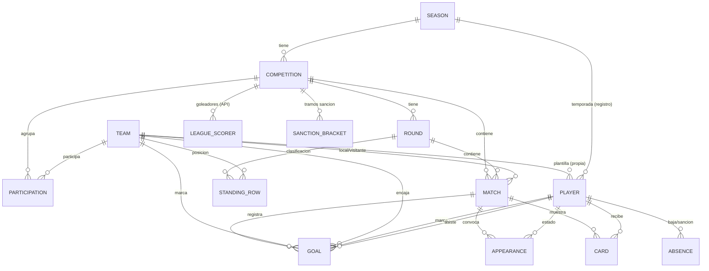

# LLD-001 · Diseño de bajo nivel — API backend y Base de datos

- **Estado:** Borrador — §3 (modelo de datos) y §4 (mapeo ORM) redactadas; resto del esqueleto por rellenar
- **Fecha:** 2026-08-01
- **Decisores:** desarrollador único (+ Claude Code)
- **Relacionado:** [HLD-001](./Project%20HLD-001.md) · [ADR-API_y_BBDD-001](./ADR-API_y_BBDD-001.md)

> **Alcance.** Diseño de bajo nivel **conjunto** de la API backend y la base de datos, por estar
> fuertemente acopladas (la API es la única frontera a la BD; ORM-first con Fluent). El **HLD-001** fija
> el marco de alto nivel y el **ADR-API_y_BBDD-001** las decisiones tecnológicas; este documento baja al
> **detalle de implementación**.
>
> **Convención de división futura:** §3–§4 (modelo de datos) y §5 (contrato de API) se mantienen como
> bloques de primer nivel para poder extraerlos a `LLD-BBDD` y `LLD-API` separados si el documento crece.

---

## 1. Propósito y alcance

*Qué cubre y qué no este LLD; supuestos de partida heredados del HLD/ADR.*

> Pendiente de redactar. Resumen del stack decidido (ADR): PostgreSQL/Supabase · API Swift (Vapor + Fluent)
> · Supabase Auth · multi-tenancy híbrida · despliegue PaaS con Docker (Fly.io).

---

## 2. Arquitectura del backend

*Capas y flujo de una petición; la API como única frontera a la BD.*

> Pendiente. Esbozo de capas: `routing/controllers → services (lógica de negocio) → Fluent models → Postgres`.
> Diagrama de una petición end-to-end (auth → resolución de tenant → acceso a datos → respuesta).

---

## 3. Modelo de datos (BD)

Modelo derivado de los requisitos de estadística y de las pantallas de la app móvil (solo lectura) en
`docs/design-assets/mobile/`. Cubre: **estadísticas de liga** (resultados por jornada, clasificación por
jornada, goleadores de la liga), **estadísticas de equipo** (rendimiento total/local/visitante y desglose de
goles marcados/recibidos) y **estadísticas de jugador** (rol, disponibilidad, tarjetas, participación y goles).

> **Nota sobre los mockups:** los números de las pantallas de Stitch son **ilustrativos** y no siempre cuadran
> entre sí (p. ej. desgloses que no suman el total). El modelo trata cada dimensión de gol como **atributo
> independiente**; las reglas de partición/validación se listan en §3.6.

### 3.1 Diagrama entidad-relación



Todo vive dentro del *schema* del club (ver §6).

### 3.2 Entidades

Convenciones: `id` UUID PK, `created_at`/`updated_at` en todas; FKs con integridad referencial; *soft delete*
opcional (§3.5).

| Entidad                                           | Campos clave                                                                                                                                       | Notas                                                                                                                                                                                                                               |
| ------------------------------------------------- | -------------------------------------------------------------------------------------------------------------------------------------------------- | ----------------------------------------------------------------------------------------------------------------------------------------------------------------------------------------------------------------------------------- |
| **Club** (raíz del tenant)                        | `name`, `short_name`, `crest_url`, `settings`                                                                                                      | Un registro por club/schema                                                                                                                                                                                                         |
| **Season** (Temporada)                            | `label` ("2024/25"), `start_date`, `end_date`, `is_current`, `federation_season_id?`                                                               | `federation_season_id` = identificador de la temporada en la **API de la federación/liga**, distinto del `id` UUID interno; parámetro de entrada para llamar a la API externa                                                                         |
| **Team** (Equipo)                                 | `letter?`, `short_name`, `crest_url`, `is_own`, `category`, `gender`                                                                               | Propios (`is_own=true`, con plantilla) y rivales (`is_own=false`, mínimos). Nombre mostrado = `category` + `letter` (p. ej. "Infantil" + "A" → "Infantil A"). "Primer Equipo" = `category=senior` + `letter="A"` (o sin letra); equipo filial = `category=senior` + `letter="B"`                                                                        |
| **Competition** (Competición)                     | `season_id`, `federation_group_id?`, `name`, `category_label`, `group_label`                                                                       | Instancia de liga por temporada ("Honor · G7"). `season_id` = FK al **UUID interno** de `Season` (no es el `federation_season_id`). `federation_group_id` = identificador de esta competición/grupo en la **API de la federación/liga** (distinto de `id`) |
| **Participation**                                 | `competition_id`, `team_id`                                                                                                                        | Únique(competición, equipo). Equipos que forman la liga                                                                                                                                                                             |
| **Round** (Jornada)                               | `competition_id`, `number`, `start_date`, `end_date`                                                                                               | Único(competición, número)                                                                                                                                                                                                          |
| **Match** (Partido)                               | `competition_id`, `round_id`, `kickoff_at`, `home_team_id`, `away_team_id`, `home_score`, `away_score`, `status`, `venue?`                          | *scores* nullables hasta jugado; `venue?` opcional (no siempre conocido)                                                                                                                                                                                                     |
| **StandingRow** (Clasif./jornada)                 | `competition_id`, `round_id`, `team_id`, `position`, `played`, `won`, `drawn`, `lost`, `goals_for`, `goals_against`, `points`, `previous_position` | Único(jornada, equipo). **Snapshot por jornada** → clasificación de cada ronda + `PREV`                                                                                                                                             |
| **Player** (Jugador)                              | `team_id`, `season_id`, `full_name`, `photo_url`, `shirt_number`, `position`                                                                       | Solo equipos propios. **Registro por temporada**: una fila = un jugador en un equipo en una temporada concreta (ver §3.6). Stats derivadas por temporada desde eventos ligados a este `Player`                                    |
| **Absence** (Disponibilidad)                      | `player_id`, `type`, `start_date` (INIC), `expected_return_date` (ALTA EST.), `actual_return_date`, `active`                                       | Disponibilidad actual = ausencia activa                                                                                                                                                                                             |
| **Appearance** (Convocatoria)                     | `player_id`, `match_id`, `status`, `minutes?`                                                                                                      | Único(jugador, partido). Cuenta JUGADOS/BAJA MÉDICA/SANCIÓN/NO CONVOCADO                                                                                                                                                            |
| **Card** (Tarjeta)                                | `player_id`, `match_id`, `type`, `is_second_yellow`, `minute?`                                                                                     | "Amarillas pendientes de sanción" se calcula (§3.6)                                                                                                                                                                                 |
| **Goal** (Gol)                                    | `match_id`, `scoring_team_id`, `conceding_team_id`, `scorer_player_id?`, `assist_player_id?`, `minute?`, `zone?`, `side?`, `body_part?`, `play_type?`, `assisted?` | **Denormalizado a propósito** (§3.6): `scoring_team_id`/`conceding_team_id` se copian del `Match` al crear el gol → goles a favor de un equipo = `WHERE scoring_team_id = :id_del_equipo`; goles en contra = `WHERE conceding_team_id = :id_del_equipo`, **sin join**. Todos los campos de clasificación (`zone`…`assisted`) son **opcionales** (entrada manual parcial) |
| **LeagueScorer** (Goleador de liga)               | `competition_id`, `full_name`, `team_label`, `goals`, `rank?`, `synced_at?`                                                                        | **Ingerida de la API de la liga** (§3.7); no ligada a `Player`; solo lectura                                                                                                                                                        |
| **CompetitionSanctionBracket** (Tramo de sanción) | `competition_id`, `seq`, `yellow_from`, `yellow_to`                                                                                                | Config por competición (§3.6). Sanción al alcanzar `yellow_to`; "pendientes" = `yellow_to − acumuladas`                                                                                                                             |

### 3.3 Enumerados (propuesta)

- **Team.category:** `prebenjamin, benjamin, alevin, infantil, cadete, juvenil, senior` (`senior` cubre tanto "Primer Equipo" como equipos filiales; se distinguen por `letter`).
- **Team.gender:** `masculino, femenino, mixto`.
- **Player.position:** `portero, defensa, centrocampista, delantero`.
- **Match.status:** `programado, finalizado, aplazado, suspendido`.
- **Appearance.status:** `jugado, baja_medica, sancionado, no_convocado`.
- **Card.type:** `amarilla, roja`.
- **Absence.type:** `lesion, enfermedad, sancion, otro`.
- **Goal.zone:** `area_chica, area_penalti, fuera_area` — **partición exclusiva** (cada gol tiene exactamente una zona).
- **Goal.side:** `derecha, izquierda, centro`.
- **Goal.body_part:** `pie, cabeza, otro`.
- **Goal.play_type:** `juego_abierto, penalti, falta, en_propia_puerta`.

### 3.4 Vistas derivadas (agregaciones, no tablas base)

Calculadas por consulta o vistas materializadas:
- **Rendimiento de equipo por temporada** (Total/Local/Visitante): J, G, E, P, GF, GC, PTS — desde `Match`.
- **Desglose de goles del equipo** (marcados/recibidos por dimensión) — desde `Goal`, filtrando directamente por `scoring_team_id = :id_del_equipo` (marcados) o `conceding_team_id = :id_del_equipo` (recibidos); **sin join** a `Match`.
- **Estadísticas de jugador por temporada** — goles, asistencias, participaciones por estado, tarjetas — desde eventos.
- **Amarillas pendientes de sanción** (por jugador) — según los *brackets* de la competición (`CompetitionSanctionBracket`): distancia al siguiente `yellow_to`. Reinicio de ciclo tras cumplir sanción.
- **Racha (forma)** — últimos N resultados por equipo — desde `Match`/`StandingRow`.
- **Goleadores de la liga (global)** — **directamente desde `LeagueScorer`** (ingerida de la API de la liga; **no** se calcula desde `Goal` — ver §3.7).

### 3.5 Convenciones y restricciones
- PK `id` UUID; `created_at`/`updated_at` (`timestamptz`).
- Tablas en `snake_case` plural; enums como tipos Postgres o `text` + `CHECK`.
- Índices en FKs y en columnas de filtro frecuente (temporada, competición, jornada, equipo) **y en las usadas por RLS**. En particular, índice en `Goal.scoring_team_id` y en `Goal.conceding_team_id` (consultas de desglose de goles marcados/recibidos, §3.4).
- *Soft delete* (`deleted_at`) opcional para entidades de edición manual (auditoría/recuperación).
- Unicidades: `Participation`(competición, equipo), `Round`(competición, número), `StandingRow`(jornada, equipo), `Appearance`(jugador, partido), `Player`(equipo, temporada, dorsal) — el dorsal se valida dentro del mismo equipo y temporada.

### 3.6 Supuestos y cuestiones abiertas (dominio)

**Supuestos vigentes:**
- **Datos de liga por tenant:** cada club mantiene su **propia copia** de rivales/competición/clasificación (aislamiento por club, §6). Dos clubs que sigan la misma liga duplican esos datos.
- **Detalle por tipo de partido:** el **resultado** (marcador/calendario) de **todos** los partidos —propios y rivales— llega de la API de la Federación (§3.7). Los partidos del **equipo propio** llevan además, de entrada manual, los eventos detallados (goles con desglose, tarjetas, convocatorias); los partidos solo-rivales se quedan en resultado + clasificación (sin detalle, al no existir su plantilla).

**Resueltas (esta iteración):**
- ✅ **Goleadores de la liga:** los provee el **propietario de la liga vía API** (tarjeta "LIGA"). Se almacenan en `LeagueScorer` (solo lectura); **no** se modelan rosters ni goles de rivales para esto. Ver §3.7.
- ✅ **Zona de gol:** **tres** valores (`area_chica`, `area_penalti`, `fuera_area`), **partición exclusiva** (una por gol).
- ✅ **Sanción por amarillas:** **configurable por competición y por tramos** (`CompetitionSanctionBracket`), p. ej. `0-5, 6-10, 11-13, 14-16, …`. Sanción al alcanzar el `yellow_to` del tramo; "pendientes" = distancia al siguiente umbral. Las **rojas** provocan sanción directa.
- ✅ **Clasificación por jornada:** válida tanto **ingerida de la API de la liga** como **manual/calculada** (según el propietario la provea o no). **No cambia el modelo** (`StandingRow` es agnóstico a la fuente); es tarea de API/ingesta (§3.7, §5).
- ✅ **Doble identificador (interno vs API de federación/liga):** `Season` y `Competition` tienen su `id` UUID **interno** (PK) **y** un identificador **externo** de la API de la federación/liga (`federation_season_id`, `federation_group_id` respectivamente). Son campos **distintos** y no intercambiables: el UUID es la PK/FK dentro de nuestro *schema*; el identificador externo es el parámetro que se usa para **llamar a esa API**. Ver §3.7.
- ✅ **Nombres de equipo que no siguen literalmente "categoría + letra":** cubiertos con `category=senior`: **"Primer Equipo"** = `category=senior` + `letter` (p. ej. "A" o sin letra); **equipo filial** = `category=senior` + `letter="B"`. No hace falta un campo de nombre especial.
- ✅ **Registro de jugador entre temporadas / traspasos:** la pregunta era si `Player` debía ser una **identidad estable** que persiste entre temporadas (un mismo registro que se traslada de equipo/categoría cada año, requiriendo una tabla de "registro por temporada" aparte) o si cada temporada genera **directamente una fila nueva**. Se opta por lo segundo: **`Player` lleva `season_id`** (además de `team_id`) → **una fila = un jugador en un equipo en una temporada concreta**. Un jugador que sube de categoría, cambia de equipo o continúa la temporada siguiente es, simplemente, **otra fila** (sin vínculo formal entre ellas). Encaja con la introducción manual de datos (la plantilla se da de alta cada temporada) y con las pantallas (todas navegan con selector de temporada). *No* se modela una identidad "persona" estable entre filas — si en el futuro hiciera falta un total de carrera multi-temporada, sería una extensión posterior (fuera de alcance ahora).
- ✅ **Minutos jugados:** se registran, pero como **campo opcional** (`Appearance.minutes?`, entrada manual) — ya reflejado así en §3.2. No es obligatorio para contar una convocatoria/participación.
- ✅ **Copas/otras competiciones:** se modelan **con las mismas entidades** que la liga regular — una copa es, sencillamente, otra `Competition` (dentro de la misma `Season`) con sus propias `Round`/`Match`. **No hace falta ninguna entidad nueva.** `StandingRow`, `LeagueScorer` y `CompetitionSanctionBracket` son tablas normales ligadas a `competition_id`: si una copa de eliminatorias no tiene clasificación, simplemente no tendrá filas en `StandingRow` para esa competición (nada que forzar en el esquema). Los formatos de ronda (ida/vuelta, eliminación directa) son variaciones de **cómo se generan/leen** `Round`/`Match`, no del modelo.
- ✅ **`Goal`: "a favor"/"en contra" sin join, y campos de clasificación opcionales.** Con solo `team_id` (el equipo que marca), saber si un gol es "recibido" por un equipo dado exige un **join** a `Match` (para saber quién era el rival) y comparar. Se **denormaliza a propósito**: `Goal` guarda **dos** FKs a `Team` — `scoring_team_id` (quién marca) y `conceding_team_id` (quién encaja) — copiadas del `Match` al crear el gol. Así, para un equipo cualquiera (ej. "Juvenil A", `id = a1b2c3…`): goles **a favor** = `WHERE scoring_team_id = 'a1b2c3…'`; goles **en contra** = `WHERE conceding_team_id = 'a1b2c3…'` — ambas **consultas directas e indexadas**, sin join. Se descarta un booleano único tipo `a_favor/en_contra` porque solo funcionaría con una perspectiva fija (p. ej. "el equipo propio"), y se rompería si dos equipos propios del mismo club se enfrentan entre sí. **Contrapartida asumida:** hay que mantener ambos campos consistentes con el `Match` al escribir (los rellena la capa de aplicación, no el usuario). Además, se marcan como **opcionales** todos los campos de clasificación del gol (`zone`, `side`, `body_part`, `play_type`, `assisted`) — reflejan entrada manual parcial; no todos los goles llevan el desglose completo.

**Pendientes:** ninguna por ahora.

### 3.7 Fuentes de datos y *provenance*

Dos orígenes conviven; el modelo es agnóstico a la fuente, pero la **ingesta** es tarea de la API (§5/§8).
La división es por **tipo de dato**, no por partido propio/rival: los **resultados** (el marcador y el
calendario) llegan de la Federación para **todos** los partidos de la competición; **todo lo demás**
(cómo se hizo cada gol, tarjetas, convocatorias, bajas) es entrada manual del club y solo existe para el
**equipo propio** (no hay plantilla de rivales):

| Origen | Datos | Entidades | Notas |
|--------|-------|-----------|-------|
| **Externo** (API de la Federación/liga) | **Resultados de cada jornada** (marcador y calendario de **todos** los partidos de la competición, propios y rivales); **clasificación por jornada** (si el propietario la provee); **goleadores de la liga** (siempre) | `Match` (resultado/calendario), `StandingRow`, `LeagueScorer` | Ingesta/sincronización periódica. La clasificación **no** todos los propietarios la ofrecen → *fallback* manual (no afecta al modelo, es tarea de API) |
| **Interno** (entrada manual del club) | **Todas las estadísticas de equipo/jugador excepto el resultado**: desglose de cada gol (zona/lado/parte del cuerpo/tipo de jugada/asistencia), tarjetas, convocatorias/disponibilidad, plantilla | `Team(is_own)`, `Player`, `Goal`, `Card`, `Appearance`, `Absence` | Solo aplica al **equipo propio**; es la capa de detalle ("cómo pasó") sobre el `Match` cuyo resultado ya viene de fuera |

> Implicación para la API (§5): definir el **contrato de ingesta** de la API de la federación/liga
> (resultados/calendario de cada jornada, clasificación opcional, goleadores), la cadencia de
> sincronización y el *fallback* manual de clasificación. El usuario aportará un **ejemplo** de esa API
> más adelante (afecta a tareas de API, no al modelo).

**Identificadores externos (parámetros de la API de la federación/liga).** Para poder llamar a la API
externa, `Season` y `Competition` guardan el identificador que esa API usa para nombrar esos recursos,
**separado** de nuestro `id` UUID interno:

| Entidad | PK interna (nuestro *schema*) | Identificador externo (API federación/liga) |
|---------|-------------------------------|-----------------------------------------------|
| `Season` | `id` (UUID) | `federation_season_id` — parámetro de temporada |
| `Competition` | `id` (UUID) | `federation_group_id` — parámetro de competición/grupo |

Nunca se usa el identificador externo como PK/FK dentro del *schema*; es un dato más, propio de la
integración, que la capa de ingesta usa para construir las llamadas a la API externa.

**Un único proveedor de API para todas las competiciones (supuesto).** Según la información disponible,
la Federación expone **la misma API** (mismo *host*/contrato) para todas las competiciones, distinguiendo
cada recurso solo por los parámetros `federation_season_id` y `federation_group_id`. Por eso **no** se
modela una configuración de proveedor/endpoint por competición (URL, credenciales…); si en el futuro
aparecen federaciones distintas con APIs distintas, sería una extensión (p. ej. una entidad de
"proveedor" referenciada desde `Competition`), fuera de alcance por ahora.

---

## 4. Mapeo ORM (Fluent)

*Traducción del modelo de datos (§3) a modelos Swift/Fluent.*

### 4.1 Models

**Convención común** (todas las entidades de §3.2, salvo excepción indicada):
- `final class X: Model, Content` — `Content` para poder servirlo directamente como DTO donde no haga
  falta un DTO separado (ver §5.2 sobre cuándo sí conviene desacoplar).
- `static let schema = "xs"` — nombre de tabla en `snake_case` plural (§3.5); vive dentro del *schema* del
  club activo en la conexión (§6.2), no cualificado en el modelo.
- `@ID(key: .id) var id: UUID?` — PK UUID generada por Postgres (`gen_random_uuid()`, ver 4.3).
- Campos escalares: `@Field(key: "field_name") var field: T`; los opcionales de §3.2 (p. ej.
  `Match.homeScore`, todos los campos de clasificación de `Goal`) se declaran `T?` — Fluent los trata como
  columna `NULL`able sin *wrapper* adicional.
- `@Timestamp(key: "created_at", on: .create) var createdAt: Date?` y
  `@Timestamp(key: "updated_at", on: .update) var updatedAt: Date?` en todas las entidades (§3.5).
- *Soft delete* (§3.5, opcional por entidad): `@Timestamp(key: "deleted_at", on: .delete) var deletedAt: Date?`
  — Fluent excluye automáticamente las filas con valor en las consultas normales (`.withDeleted()` para
  incluirlas). Se aplica a las entidades de edición manual señaladas en §3.5 (`Player`, `Goal`, `Card`,
  `Appearance`, `Absence`, `Team`); no a las de solo-ingesta (`LeagueScorer`, `StandingRow`, `Match` en su
  parte de resultado) ni a catálogos de configuración (`CompetitionSanctionBracket`). **Decisión explícita:**
  aunque §3.6/§3.7 admiten que `StandingRow` y el resultado de `Match` puedan introducirse/calcularse a mano
  como *fallback* cuando la federación no los provee, se dejan **fuera** del *soft delete* — se tratan como
  filas de ingesta reemplazables (se re-sincronizan/recalculan), no como registros de edición manual a
  auditar. Si en el futuro se quiere trazabilidad de esas ediciones manuales, se añade `deleted_at` a esas
  dos entidades sin más cambios.
- **Enumerados** (§3.3): cada uno es un `enum String, Codable, CaseIterable` en Swift (p. ej.
  `Team.Category`, `Match.Status`) y se mapea con `@Field(key:) var category: Category` — Fluent
  serializa el *raw value* como texto. Ligado a la decisión de 4.3 (texto + `CHECK` en vez de tipo `ENUM`
  nativo de Postgres): con `@Field` + `String` *raw value* no hace falta el *wrapper* `@Enum` (pensado para
  tipos `ENUM` nativos), y el modelo Swift sigue siendo la fuente de verdad de los valores válidos.

**Ejemplo completo** (`Match`, representativo por combinar *scores* opcionales, enum y relaciones dobles —
estas últimas se detallan en 4.2):

```swift
final class Match: Model, Content {
    static let schema = "matches"

    @ID(key: .id) var id: UUID?
    @Parent(key: "competition_id") var competition: Competition
    @Parent(key: "round_id") var round: Round
    @Field(key: "kickoff_at") var kickoffAt: Date
    @Parent(key: "home_team_id") var homeTeam: Team
    @Parent(key: "away_team_id") var awayTeam: Team
    @Field(key: "home_score") var homeScore: Int?
    @Field(key: "away_score") var awayScore: Int?
    @Field(key: "status") var status: Status
    @Field(key: "venue") var venue: String?
    @Timestamp(key: "created_at", on: .create) var createdAt: Date?
    @Timestamp(key: "updated_at", on: .update) var updatedAt: Date?

    enum Status: String, Codable, CaseIterable {
        case programado, finalizado, aplazado, suspendido
    }

    init() {}
}
```

**Mapeo entidad → tabla** (nombre de *schema* Fluent; el resto sigue la convención anterior):

| Entidad (§3.2) | `schema` | Notas fuera de convención |
|----------------|----------|----------------------------|
| Club | `clubs` | Un único registro por *schema* de tenant; sin `@Parent` a nada |
| Season | `seasons` | — |
| Team | `teams` | `is_own: Bool` distingue plantilla propia de rivales mínimos |
| Competition | `competitions` | `federation_group_id` es `String?` opaco (identificador externo, §3.7), no FK |
| Participation | `participations` | Tabla pivote pura (§4.2); sin campos propios más allá de las dos FK |
| Round | `rounds` | — |
| Match | `matches` | Ver ejemplo arriba |
| StandingRow | `standing_rows` | Solo-ingesta/cálculo; sin *soft delete* |
| Player | `players` | `season_id` **y** `team_id` (§3.6 — fila nueva por temporada, no identidad estable) |
| Absence | `absences` | — |
| Appearance | `appearances` | `minutes: Int?` |
| Card | `cards` | — |
| Goal | `goals` | Dos `@Parent` a `Team` y dos `@OptionalParent` a `Player` (§4.2); todos los campos de clasificación opcionales |
| LeagueScorer | `league_scorers` | Solo lectura (ingesta); sin `@Parent` a `Player` (§3.6) |
| CompetitionSanctionBracket | `competition_sanction_brackets` | Catálogo de configuración por competición |

### 4.2 Relaciones

- **`@Parent` / `@Children`** — el caso general (una FK ⇒ `@Parent` en el lado *N*, `@Children(for:)` en el
  lado *1* si se necesita navegar en ese sentido). Ejemplos: `Round.$competition` / `Competition.$rounds`;
  `Player.$team` / `Team.$players`.
- **`Player` con doble `@Parent` (`team` + `season`)** — rasgo definitorio del modelo (§3.6: *fila nueva por
  temporada*, no identidad estable): `Player` lleva **las dos** FK —
  `@Parent(key: "team_id") var team: Team` **y** `@Parent(key: "season_id") var season: Season`— de modo que
  cada fila es "un jugador en un equipo en una temporada". No son la misma relación repetida: apuntan a
  entidades distintas y ambas son obligatorias.
- **FK dobles al mismo modelo** (misma entidad referenciada dos veces con semántica distinta) — no son una
  relación *Siblings*, son dos `@Parent` independientes con `key` propio:
  - `Match`: `@Parent(key: "home_team_id") var homeTeam: Team` y
    `@Parent(key: "away_team_id") var awayTeam: Team`.
  - `Goal`: `@Parent(key: "scoring_team_id") var scoringTeam: Team` y
    `@Parent(key: "conceding_team_id") var concedingTeam: Team` — mantiene el diseño "sin *join*" de §3.6
    (filtrar por `$scoringTeam.$id` o `$concedingTeam.$id` directamente, indexado, sin traer `Match`).
- **FK opcionales** — `@OptionalParent(key:)` para relaciones *nullable*: `Goal.scorerPlayerId` /
  `Goal.assistPlayerId` (`@OptionalParent(key: "scorer_player_id") var scorer: Player?` y análogo para
  `assist`); ambas apuntan a `Player` sin colisionar entre sí ni con `Appearance`/`Card` (que sí usan
  `@Parent` no-opcional a `Player`, la convocatoria es obligatoria).
- **`@Siblings`** — reservado para *N:N* con tabla pivote intercambiable; el único candidato es
  `Participation` (`Competition` ↔ `Team`). Como `Participation` no añade columnas propias más allá de las
  dos FK y su unicidad (§3.5), se modela como pivote de Fluent:
  `@Siblings(through: Participation.self, from: \.$competition, to: \.$team) var teams: [Team]` en
  `Competition` (y su inverso en `Team`). `Participation` mantiene además su propio `Model` (con `@ID`,
  `@Parent` a cada lado) porque Fluent lo exige como tabla pivote real, aunque no se consulte directamente
  fuera de este mecanismo.
- ***Eager loading*** — por defecto Fluent no trae relaciones; se piden explícitamente con
  `.with(\.$homeTeam)` / `.with(\.$awayTeam)` (o anidado `.with(\.$competition) { $0.with(\.$season) }`) en
  el `services` (§2) que arma la respuesta, para evitar *N+1* en listados (p. ej. clasificación con nombre
  de equipo, partidos de una jornada con ambos equipos).

### 4.3 Migraciones

**Decisión: enumerados como `text` + `CHECK`, no `ENUM` nativo de Postgres.**

| Opción | Pros | Contras |
|--------|------|---------|
| **`text` + `CHECK`** *(elegida)* | Añadir un valor = migración simple (`DROP CONSTRAINT` + `ADD CONSTRAINT`, transaccional); el tipo Swift (`enum ... CaseIterable`) sigue siendo la fuente de verdad | No hay catálogo de tipo a nivel Postgres |
| **`ENUM` nativo** (`Database.enum()` de Fluent) | Validación a nivel de tipo; algo más compacto en disco | Un tipo `ENUM` **vive en un *schema*** (igual que las tablas) → en el tier *managed* (§6, *schema* por club) habría que **crear/alterar el tipo en cada *schema* de tenant**, duplicando ese paso en cada migración por tenant (4.4); `ALTER TYPE ... ADD VALUE` además no es transaccional en el mismo bloque que otros cambios en versiones antiguas de Postgres |

Se prioriza que **añadir un valor a un enumerado sea una migración uniforme** en los dos tiers (managed
*N* veces por *schema*, dedicado 1 vez por proyecto) sin tratamiento especial por tipo Postgres.

**Convención de migraciones:**
- Una `AsyncMigration` por entidad (`CreateTeam`, `CreateMatch`, …), cada una con su `prepare(on:)`
  (`schema(...).id().field(...).unique(on:).create()`) y `revert(on:)` simétrico.
- **Orden = orden de dependencia de FK**, y es el orden de **registro** en `configure.swift`
  (`app.migrations.add(...)`), no el nombre de fichero:
  `Club → Season → Team → Competition → Participation → Round → Match → StandingRow → Player → Absence →
  Appearance → Card → Goal → LeagueScorer → CompetitionSanctionBracket`.
- `CHECK` de enumerados junto a la columna: `.field("status", .string, .required)` +
  `.sql(raw: "ALTER TABLE matches ADD CONSTRAINT chk_matches_status CHECK (status IN ('programado', ...))")`
  (`SQLKit`, ver Anexo D.1 del ADR).
- Unicidades e índices de §3.5 con `.unique(on:)` (p. ej. `Participation`: `.unique(on: "competition_id",
  "team_id")`) y `.field(..., .required).index()` o `.sql(raw:)` para índices explícitos
  (`Goal.scoring_team_id`, `Goal.conceding_team_id`).
- PK con default `gen_random_uuid()` vía `.id(custom: .id, .uuid, .generated)` o `DEFAULT` en el `.sql(raw:)`
  de creación de tabla, según lo que exponga la versión de Fluent en uso (a confirmar al implementar).

### 4.4 Aplicación de migraciones por tenant

- **Tier dedicado (silo, §6.3):** un proyecto Supabase = una base con *schema* `public` único → las
  migraciones se aplican con el comando estándar de Fluent (`app.autoMigrate()` / `vapor run migrate`)
  contra esa base, sin tratamiento especial.
- **Tier *managed* (*schema* por club, §6.3):** el comando estándar de Fluent migra **una** base/*schema*;
  con varios clubes en el mismo proyecto Supabase hace falta **recorrer los *schemas*** existentes y
  aplicar el mismo juego de migraciones a cada uno. Mecanismo previsto:
  - Un registro de control **de plano de control** en un *schema* compartido (p. ej. `public.tenants`, fuera
    de cualquier *schema* de tenant) con la lista de clubes del tier *managed* y su nombre de *schema*. **No
    es la entidad de dominio `Club`** (§3.2, tabla `clubs` **dentro** de cada *schema* de tenant): son cosas
    distintas — este `public.tenants` es infraestructura de tenancy (ver §6.3), no datos de un club.
  - Un `AsyncCommand` propio (p. ej. `migrate-tenants`, distinto del `migrate` de serie) que: obtiene esa
    lista, y para cada club abre conexión con `SET search_path TO <schema_del_club>` (o registra
    dinámicamente un `DatabaseID` por tenant, según lo que permita la API de configuración de Fluent) y
    ejecuta el migrador sobre esa conexión.
  - Cada *schema* de tenant acaba con su propia tabla de control de Fluent (`_fluent_migrations`), aislada
    igual que el resto de sus datos — el progreso de migración se rastrea **por club**, no globalmente.
  - Altas de club nuevas (tier *managed*): crear el *schema* y ejecutar el migrador completo contra él (no
    solo la migración "pendiente" más reciente), ya que parte de cero.

> El detalle final de automatización (orquestación, idempotencia ante fallos a mitad de recorrido,
> paralelismo) queda como cuestión abierta — ver §9.3.

---

## 5. Contrato de la API

*Superficie REST que consumen backoffice (escritura) y apps móviles (lectura).*

- **5.1 Recursos y endpoints** — rutas REST, verbos, versionado (`/v1`).
- **5.2 DTOs** — modelos de petición/respuesta (desacoplados de los models de Fluent) y validación.
- **5.3 Paginación, filtrado y ordenación.**
- **5.4 Manejo de errores** — formato de error, códigos HTTP, mensajes.
- **5.5 OpenAPI** — enfoque elegido (design-first con `swift-openapi-generator`/`vapor/swift-openapi-vapor`
  vs code-first con `VaporToOpenAPI`); publicación de Swagger UI.
- **5.6 Integración con la API de la federación/liga** *(externa)* — contrato de **ingesta** de goleadores (siempre) y
  clasificación/resultados (opcional según propietario); cadencia de sincronización, mapeo a
  `LeagueScorer`/`StandingRow` y *fallback* manual. Pendiente del **ejemplo** que aportará el usuario.

> Pendiente. Se proyecta desde §3–§4.

---

## 6. Multi-tenancy *(transversal)*

*Cómo se resuelve y aísla cada club en tiempo de ejecución y en provisión.*

- **6.1 Resolución del tenant** — subdominio / *claim* `club_id` del JWT.
- **6.2 Enrutado a datos** — `SET search_path` al *schema* del club; **reseteo** al devolver la conexión al *pool*.
- **6.3 Provisión** — tier gestionado (*schema* por club) vs tier dedicado (proyecto Supabase por club, Management API).
- **6.4 *Pooling* de conexiones** — implicaciones del cambio de *schema* por petición.

> **Registro de tenants (plano de control).** El tier gestionado necesita, **fuera** de los *schemas* de
> tenant, una tabla de plano de control (p. ej. `public.tenants`) que liste los clubes gestionados y su
> *schema* asociado. La usan la **resolución de tenant** (§6.1, subdominio/`club_id` → *schema*) y el
> recorrido de **migraciones por tenant** (§4.4). **No forma parte del modelo de dominio de §3** (que vive
> íntegro dentro de cada *schema* de club) ni debe confundirse con la entidad `Club` (§3.2): es
> infraestructura de tenancy. En el tier dedicado (un proyecto por club) no hace falta, porque el proyecto
> *es* el tenant.
>
> Resto pendiente. Ver decisiones 3–4 del ADR.

---

## 7. Autenticación y autorización *(transversal)*

*Identidad y permisos, coherentes con la multi-tenancy.*

- **7.1 Supabase Auth** — validación del JWT (JWKS) en Vapor (JWTKit).
- **7.2 Claims de tenant** — `club_id`, `role` inyectados vía **Auth Hook**.
- **7.3 Roles** — escritura (backoffice) vs solo lectura (apps móviles).
- **7.4 RLS** — políticas por *schema* como capa extra de autorización a nivel de fila.

> Pendiente. Ver decisión 3 del ADR y Anexo B.

---

## 8. Preocupaciones transversales

*Configuración, operación y calidad.*

- Configuración y **gestión de secretos** (variables de entorno / secret manager del PaaS).
- **Logging** y observabilidad; correlación por tenant.
- **Entornos** (dev/staging/prod) y datos semilla.
- **CI/CD** — *build* en CI/builder remoto, migraciones, despliegue.

> Pendiente.

---

## 9. Cuestiones abiertas

1. Enfoque OpenAPI definitivo (design-first vs code-first).
2. Forma exacta del tier dedicado (proyecto Supabase vs despliegue completo) y su provisión.
3. Estrategia de automatización de migraciones por tenant.
4. Estrategia de *soft delete* / retención (RGPD, datos de menores).

> Las **cuestiones de dominio del modelo de datos** (goleadores rivales, taxonomía de zona de gol, regla de
> sanción por amarillas, registro de jugador entre temporadas, minutos, copas) quedaron **resueltas** en
> §3.6 (*Pendientes: ninguna por ahora*), por lo que ya no figuran aquí.

> Se irá vaciando a medida que se rellenen las secciones anteriores.
