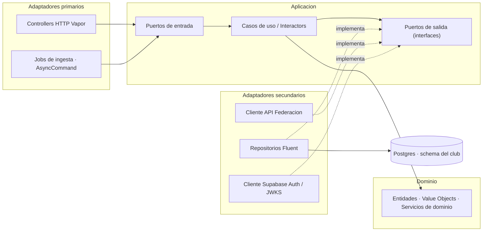
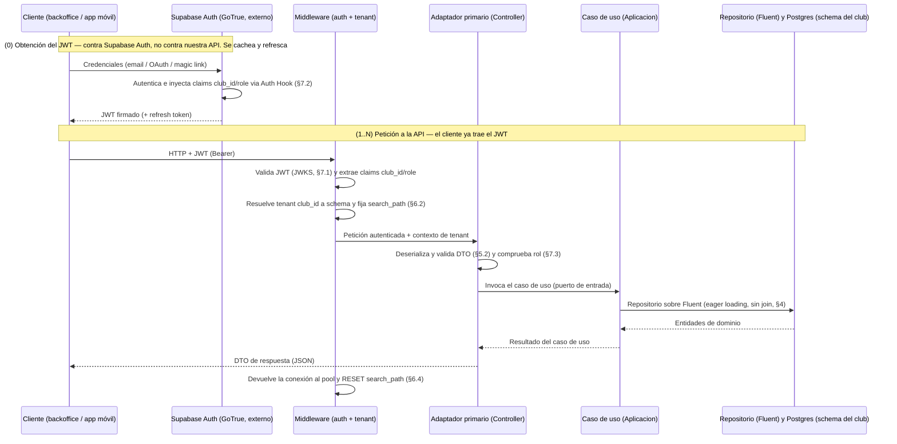
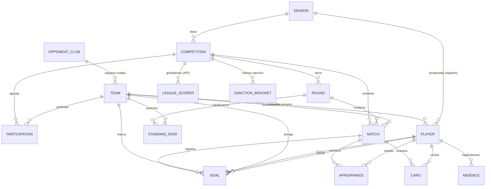

# LLD-001 · Diseño de bajo nivel — API backend y Base de datos

- **Estado:** Borrador — §2 (arquitectura Clean/Hexagonal/DDD), §3 (modelo de datos), §4 (Dominio, puertos y persistencia), §5 (contrato API — `Club`, `Season`, `Competition`, `OpponentClub`, `Team`) y §8.1 (testing) redactadas; resto del esqueleto por rellenar
- **Fecha:** 2026-08-11 (revisión: frontera BFF/Ingesta, modalidad y coordenadas de federación; extracción de anexos)
- **Decisores:** desarrollador único (+ Claude Code)
- **Relacionado:** [HLD-001](./Project%20HLD-001.md) · [ADR-API_y_BBDD-001](./ADR-API_y_BBDD-001.md)
- **Anexos:** [Decisiones de diseño · bitácora](./API_y_BBDD%20LLD-Anexo-Decisiones-Disenho-001.md) · [Federación de Madrid (RFFM) · API](./API_y_BBDD%20LLD-Anexo-Federacion-Madrid-RFFM.md)

> **Alcance.** Diseño de bajo nivel **conjunto** de la API backend y la base de datos, por estar
> fuertemente acopladas (la API es la única frontera a la BD; ORM-first con Fluent). El **HLD-001** fija
> el marco de alto nivel y el **ADR-API_y_BBDD-001** las decisiones tecnológicas; este documento baja al
> **detalle de implementación**.
>
> **Este documento es normativo: dice *qué* es el diseño, no *por qué* se descartaron otras opciones.**
> Esa deliberación vive en el **Anexo de Decisiones** (bitácora de decisiones, entradas `[D-nn]`) y el material de
> ingeniería inversa sobre la API de la Federación, en el **Anexo de la Federación**. Criterio de reparto en [D-26].
>
> **Convención de división futura:** §3–§4 (modelo de datos) y §5 (contrato de API) se mantienen como
> bloques de primer nivel para poder extraerlos a `LLD-BBDD` y `LLD-API` separados cuando §5 crezca con el
> resto de entidades. No se ha hecho aún: rompería las referencias `§x.y` del *spec* y del ADR ([D-26]).

---

## 1. Propósito y alcance

*Qué cubre y qué no este LLD; supuestos de partida heredados del HLD/ADR.*

> Pendiente de redactar. Resumen del stack decidido (ADR): PostgreSQL/Supabase · API Swift (Vapor + Fluent)
> · Supabase Auth · multi-tenancy híbrida · despliegue PaaS con Docker (Fly.io).

---

## 2. Arquitectura del backend

*Capas y flujo de una petición; la API como única frontera a la BD.*

La API es la **única frontera de acceso a la BD** (requisito 6 del ADR): ningún cliente toca Postgres
directamente. Se organiza en **tres módulos funcionales** sobre una **arquitectura por capas** común, y es
**tenant-aware** de extremo a extremo (cada operación se resuelve contra el *schema* del club, §6).

### 2.1 Módulos funcionales

El backend se descompone en tres módulos. Dos son **superficie REST** (BFF y gestión de usuarios) y uno es
una **integración externa** con cadencia propia (Federación); la gestión de usuarios es además **transversal**
(protege a los otros dos).

| # | Módulo | Rol | Dirección de datos | Dónde se detalla |
|---|--------|-----|--------------------|------------------|
| 1 | **BFF** (Backend for Frontend) | CRUD sobre el modelo de dominio (§3) para el **backoffice web** (escritura) y las **apps móviles** (lectura). Es el grueso del contrato REST. | App ↔ *schema* del club | §5 |
| 2 | **Integración con la API de la Federación/liga** | **Ingesta** de datos externos (resultados/calendario, clasificación opcional, goleadores) y mapeo a `Match`/`StandingRow`/`LeagueScorer` (§3.7). Se construye por **ingeniería inversa** de la app iOS existente (RFFM Madrid + Federación Cataluña). **No expone superficie HTTP propia** (§5.6): su *configuración* se crea desde el BFF y su disparo es un job. | API externa → *schema* del club | §5.6 |
| 3 | **Gestión de usuarios** | **Autenticación** (validación del JWT de Supabase Auth), **autorización** (roles escritura/lectura) y **resolución/provisión de tenant** (§6, §7). Transversal a los otros dos. | Transversal (guarda cada petición) | §6, §7 |

**Cómo se relacionan.** La **gestión de usuarios** es una capa transversal: toda petición de los módulos 1 y
2 pasa por ella (identidad + `club_id` + rol). **BFF** y **Federación** escriben sobre el **mismo modelo y
*schema***, pero por vías distintas y **se encuentran en el dato**: la Federación aporta el **resultado** de un
`Match` (marcador/calendario) por ingesta periódica; el BFF/entrada manual añade el **detalle** de ese mismo
partido propio (goles con desglose, tarjetas, convocatorias). Es la división "resultado externo + detalle
manual" ya fijada en §3.7 — aquí queda reflejada como **frontera entre módulos**, no solo entre fuentes de dato.

**La frontera no es "una entidad por módulo": son tres papeles.** El modelo de datos (§3) es **común** a los
dos módulos, pero cada entidad tiene **un solo dueño de escritura**, y el reparto tiene tres casillas, no dos:

| Papel | Quién escribe | Entidades | Superficie BFF |
|-------|---------------|-----------|----------------|
| **Entrada de la ingesta** (configuración) | administrador, vía **BFF** | `Season`, `Competition` | CRUD completo |
| **Salida de la ingesta** | módulo de **Federación** | `Round`, `Participation`, `Match`, `OpponentClub`, `Team`, `StandingRow`, `LeagueScorer` | lectura + `PATCH` de corrección |
| **Dominio manual** | administrador, vía **BFF** | `Player`, `Absence`, `Appearance`, `Card`, `Goal`, `CompetitionSanctionBracket` | CRUD completo |

La regla que se deriva —**el BFF corrige lo que la ingesta trae; nunca lo crea ni lo borra**— y su matriz
operación a operación están en **§5.1**; la política que impide que una sincronización pise una corrección,
en §3.7.

> **Nota de división futura (actualiza la del encabezado):** al promover la Federación a bloque propio, los
> candidatos a extraerse a documentos separados quedan: §3–§4 → `LLD-BBDD`; §5 (BFF) + sección de Federación →
> `LLD-API`; §6–§7 (tenancy/auth) podrían ir a un `LLD-Tenancy-Auth` si crecen (ya previsto en el ADR).

### 2.2 Arquitectura por capas (Clean + Hexagonal + DDD)

Se adopta **Clean Architecture** como marco (círculos concéntricos + **Regla de dependencia** +
**independencia de frameworks**), articulada con **Puertos y Adaptadores** (Hexagonal) para las fronteras de
entrada/salida y con el **lenguaje ubicuo, Entidades y Value Objects** de **DDD** en el núcleo. Las
dependencias **apuntan siempre hacia el Dominio**; nada del Dominio conoce Vapor, Fluent ni HTTP.

**Las cuatro capas (de dentro hacia fuera):**

- **Dominio** *(núcleo, no depende de nada)* — **Entidades**, **Value Objects** y **servicios de dominio**
  que encierran las **reglas de negocio e invariantes** (unicidad de dorsal por equipo/temporada §3.5,
  consistencia de `scoring_team_id`/`conceding_team_id` del gol §3.6, tramos de sanción §3.6…). Tipos Swift
  **puros** (sin `import Vapor`/`Fluent`). Aquí vive el **lenguaje ubicuo**.
- **Aplicación** — **Casos de uso** (*interactors*) que orquestan el Dominio. Definen los **puertos**:
  **puertos de entrada** (contratos que invocan los adaptadores primarios) y **puertos de salida**
  (interfaces de **repositorio**, cliente de Federación, reloj/uuid…) que se resuelven por **Inversión de
  Dependencias (DIP)**.
- **Adaptadores (Interface Adapters)** —
  - **Primarios (*driving*)**: traducen entrada externa → caso de uso. **Controllers HTTP** de Vapor (BFF,
    usuarios) y **jobs/`AsyncCommand`** de ingesta (Federación, §2.3-b).
  - **Secundarios (*driven*)**: **implementan** los puertos de salida. **Repositorios Fluent** (persistencia
    Postgres), **cliente HTTP de la API de Federación**, **cliente Supabase Auth/JWKS** (§7.1).
- **Frameworks & Drivers (Infraestructura)** — el detalle **reemplazable**: Vapor, Fluent, PostgresNIO,
  Postgres, JWTKit, el runtime.



> **Regla de dependencia y DIP.** Las flechas continuas van **hacia el Dominio**. Los adaptadores secundarios
> (`REPO`/`FED`/`AUTH`) **no** son dependidos por la Aplicación: **implementan** puertos declarados en ella
> (flechas punteadas) → la dependencia queda **invertida**. Así el Dominio y los casos de uso se **testean sin
> BD ni red** (dobles de los puertos). **Los DTOs cruzan las fronteras** (§5.2): nunca se exponen al exterior
> Entidades de dominio ni modelos de persistencia; el adaptador primario mapea DTO ↔ Dominio, el secundario
> mapea Dominio ↔ modelo Fluent.

**Mapa capa → keyword → artefacto:**

| Capa (Clean) | Keyword (Hexagonal/DDD) | Artefacto Swift/Vapor |
|--------------|--------------------------|------------------------|
| **Dominio** | Entidades, Value Objects, servicios de dominio, lenguaje ubicuo | `struct`/`enum` Swift puros, **sin** `import Fluent/Vapor` |
| **Aplicación** | Casos de uso / *interactors*; puertos de entrada y de salida | Tipos de caso de uso + `protocol` (puertos) |
| **Adaptador primario** (*driving*) | Adaptador primario | `RouteCollection`/Controller de Vapor; `AsyncCommand` (jobs) |
| **Adaptador secundario** (*driven*) | Adaptador secundario | Repositorio Fluent; cliente HTTP Federación; cliente JWKS |
| **Frameworks & Drivers** | Infraestructura | Vapor, Fluent, PostgresNIO, Postgres, JWTKit |

**Los 3 módulos (§2.1) sobre estas capas:**
- **BFF** → casos de uso CRUD (Aplicación) + Controllers (primario) + repositorios Fluent (secundario).
- **Federación** → caso de uso de **ingesta** (Aplicación) + **job** disparador (primario, §2.3-b) + **cliente
  de la API externa** y repositorios (secundarios).
- **Gestión de usuarios** → **middleware de auth** = adaptador primario **transversal** que valida el JWT por
  un **puerto de identidad** (implementado por el cliente JWKS/Supabase); casos de uso de **resolución y
  provisión de tenant** (§6).

#### Dominio independiente de frameworks, no *Active Record*

Un modelo Fluent que hiciera de entidad y además conformara `Content` **acoplaría el Dominio a
Fluent/Vapor** y cruzaría la frontera con un objeto de framework — justo lo que la Regla de dependencia
prohíbe. Se adopta por tanto **tres representaciones por entidad**: entidad de dominio (`struct` puro),
modelo de persistencia Fluent y DTO, con el repositorio y el Controller mapeando entre ellas (§4).

Alternativa descartada y contrapartidas asumidas: [D-01]. Consecuencia en la estrategia de test: §8.1.

### 2.3 Flujo de una petición (end-to-end)

Dos **adaptadores primarios** distintos (Controller HTTP y job de ingesta) invocan casos de uso que comparten
la **misma capa de acceso** (caso de uso → repositorio → Fluent → *schema* del club):

**(a) Petición HTTP** (BFF y gestión de usuarios) — dirigida por el cliente. Incluye el **paso (0) de
obtención del JWT**: el cliente se autentica **directamente contra Supabase Auth (GoTrue), no contra nuestra
API** — nuestra API **valida** el token (JWKS), pero **no lo emite** (ADR: Decisión 3 / Anexo B.5). Ese paso
(0) ocurre **una vez por sesión** (con *refresh* mientras dure), no en cada petición; los pasos (1) en
adelante se repiten en cada llamada reutilizando el JWT cacheado:



**(b) Ingesta programada** (Federación) — **sin petición HTTP**: un `AsyncCommand`/tarea periódica (§8) es el
**adaptador primario** que, por cada club del tier gestionado (o el proyecto del silo), resuelve el tenant e
invoca el **caso de uso de ingesta**; este llama a la API externa (por el **puerto de salida** del cliente de
Federación) con los identificadores de federación (`federation_season_id`, `federation_group_id`, §3.7) y
**mapea y hace *upsert*** de `Match`/`StandingRow`/`LeagueScorer` sobre el *schema* del club (por el
**repositorio**). **Distinto adaptador primario, misma capa de acceso** (caso de uso → repositorio → Fluent →
*schema*), por lo que reutiliza el enrutado por tenant de §6.

**(c) Verificación de la configuración de ingesta** (`POST /v1/competitions/preview`, §5.1) — el **único**
caso en que una petición HTTP del BFF llama a la API externa **en línea**: el administrador pega la URL del
calendario de la federación y el caso de uso la resuelve por el **puerto `FederationClient`** (el mismo que
usa el job) **sin persistir nada**, para devolverle qué hay ahí antes de confirmar. Es un adaptador primario
del BFF invocando un puerto de salida del módulo de Federación: no rompe ninguna frontera —los puertos son
justamente lo que permite compartirlo— pero conviene tenerlo presente porque es la única ruta síncrona con
latencia de terceros. Se trata como tal (*timeout* corto y error 502/504 explícito, §5.1).

> Detalle de cada capa transversal: **auth/authz** en §7, **resolución y enrutado de tenant** en §6, **contrato
> REST** (DTOs, errores, paginación) en §5, **contrato de ingesta** de la Federación en su sección propia.

---

## 3. Modelo de datos (BD)

Modelo derivado de los requisitos de estadística y de las pantallas de la app móvil (solo lectura) en
`docs/design-assets/mobile/`. Cubre: **estadísticas de liga** (resultados por jornada, clasificación por
jornada, goleadores de la liga), **estadísticas de equipo** (rendimiento total/local/visitante y desglose de
goles marcados/recibidos) y **estadísticas de jugador** (rol, disponibilidad, tarjetas, participación y goles).

> **Nota sobre los mockups:** los números de las pantallas de Stitch son **ilustrativos** y no siempre cuadran
> entre sí (p. ej. desgloses que no suman el total). El modelo trata cada dimensión de gol como **atributo
> independiente**; las reglas de partición/validación se listan en §3.5–§3.6.

### 3.1 Diagrama entidad-relación



Todo vive dentro del *schema* del club (ver §6).

### 3.2 Entidades

Convenciones: `id` UUID PK, `created_at`/`updated_at` en todas; FKs con integridad referencial; *soft delete*
opcional (§3.5).

| Entidad                                           | Campos clave                                                                                                                                                       | Notas                                                                                                                                                                                                                                                                                                                                                                                                                                                                                                                                                                                                                                                                 |
| ------------------------------------------------- | ------------------------------------------------------------------------------------------------------------------------------------------------------------------ | --------------------------------------------------------------------------------------------------------------------------------------------------------------------------------------------------------------------------------------------------------------------------------------------------------------------------------------------------------------------------------------------------------------------------------------------------------------------------------------------------------------------------------------------------------------------------------------------------------------------------------------------------------------------- |
| **Club** (raíz del tenant)                        | `name`, `short_name`, `slug`, `crest_key?`, **`federation`**, `settings` | Un registro por club/schema. **`name`** = nombre oficial largo; **`short_name`** = nombre corto para mostrar (cabeceras); **`slug`** = identificador **interno** para rutas y nombres de fichero — **inmutable, se fija al aprovisionar** y no se edita por API (§5.1). `crest_key` = clave del objeto en Storage, no una URL (§3.7). **`federation`** = valor del **catálogo de federaciones**, que vive **en código, no en BD** (§3.6): la federación es propiedad **del tenant** (un club de Madrid está en la RFFM, uno catalán en la FCF), y de ella salen la URL base, la numeración de temporada y el mapa de códigos de modalidad. Se fija al aprovisionar |
| **Season** (Temporada)                            | `label` ("2024/25"), `start_date`, `end_date`, **`federation_season_id`**, `archived_at?`                                                                          | `federation_season_id` = identificador de la temporada en la **API de la federación/liga**, distinto del `id` UUID interno; parámetro de entrada para llamar a la API externa (`temporada=21`). **Obligatorio** (toda temporada tiene contrapartida en la federación) y **tecleado por el administrador**, que lo copia de la URL del calendario (§3.7). Es un **secuencial de la federación** —`21` no guarda relación con "2024/25"—, propio de **cada** federación, y **cambia cada temporada**: es la única pieza de configuración que hay que actualizar cada año. `start_date`/`end_date` **fijas y derivadas de `label`** (01/07/AAAA → 30/06/AABB), **no overridables**. **`is_current` derivado en lectura, no se almacena**: es la temporada con el `end_date` **más próximo que aún es ≥ hoy** (el tiempo no retrocede → una sola current, sin invariante que gestionar). **`archived_at`** = archivado reversible (soft): oculta la temporada y, de facto, su subárbol (§5) |
| **OpponentClub** (Club rival)                     | `name`, `short_name`, `slug`, **`federation_club_id`**, `crest_key?` | **Identidad del club rival**, separada de sus equipos (§3.6). La crea la **ingesta** y la corrige el administrador. Un club rival suele tener equipo en **varias categorías** → varias filas `Team` apuntan a esta misma. **`federation_club_id`** = segmento numérico de la ruta del escudo en la API de la federación (§3.7); es la clave de emparejamiento de la ingesta |
| **Team** (Equipo)                                 | `opponent_club_id?`, `category`, `letter?`, `gender`, **`modality`**, **`federation_team_id?`** | **`modality`** (§3.3) forma parte de la **identidad** del equipo: el "Infantil A" de fútbol-11 y el de fútbol-sala son **equipos distintos**, con distinta competición y distinto `codigo_equipo` (§3.6) — por eso entra en la clave única (§3.5). **No es campo de entrada del contrato**: la fija la ingesta al crear el equipo, tomándola de la competición (§5.1). **`opponent_club_id` nulo ⇒ equipo propio** (del `Club` del tenant); no nulo ⇒ equipo rival → **`is_own` no se almacena: es derivado** (§3.6). **No lleva nombre ni escudo**: son del club. Nombre mostrado (derivado en lectura, §5) = nombre del club + `category` + `letter` → "CD Ejemplo Infantil A". **`federation_team_id`** = `codigo_equipo` de la API de la federación (§3.7): identifica al **equipo**, no al club — el mismo club tiene código distinto en cada categoría. **Anulable**: los equipos creados a mano que no están en competición federada no lo tienen. "Primer Equipo" = `category=senior` + `letter="A"` (o sin letra); filial = `category=senior` + `letter="B"` |
| **Competition** (Competición)                     | `season_id`, **`modality`**, **`federation_competition_id`**, **`federation_group_id`**, `name`, **`age_category`**, **`division_label`**, `group_label`, `last_synced_at?` | Instancia de liga por temporada ("Infantil · Primera · Grupo 1"). **`last_synced_at`** = última sincronización con éxito; nulo ⇒ nunca sincronizada, que es la condición bajo la cual las coordenadas externas siguen siendo editables (§5.1). `season_id` = FK al **UUID interno** de `Season` (no es el `federation_season_id`). **Los dos identificadores externos son los parámetros de la llamada al calendario** (§3.7) y **no son intercambiables**: `federation_competition_id` (`competicion=24037548`) designa **categoría de edad + división**, y `federation_group_id` (`grupo=24037549`) **solo el grupo**. Ambos **obligatorios** y **tecleados por el administrador** (pegando la URL, §5.1). **`modality`** (§3.3) es la contrapartida de dominio del parámetro `tipojuego`, que **no se almacena**: se codifica al llamar con el mapa de la federación (§3.6). **`age_category`** = mismo enumerado que `Team.category` (§3.3) → permite **validar** que un equipo solo participe en una competición de su edad **y de su modalidad**. **`division_label`** = nivel competitivo ("Primera", "Preferente", "Honor"…), **texto libre**: varía por federación y por categoría (§3.6). **`group_label`** = rótulo del grupo ("Grupo 1", "Grupo Único"), **texto libre y no deducible de `federation_group_id`**: se muestra, mientras que el id se llama (§3.7) |
| **Participation**                                 | `competition_id`, `team_id`                                                                                                                                        | Únique(competición, equipo). Equipos que forman la liga                                                                                                                                                                                                                                                                                                                                                                                                                                                                                                                                                                                                               |
| **Round** (Jornada)                               | `competition_id`, `number`, `start_date`, `end_date`                                                                                                               | Único(competición, número)                                                                                                                                                                                                                                                                                                                                                                                                                                                                                                                                                                                                                                            |
| **Match** (Partido)                               | `competition_id`, `round_id`, `kickoff_at`, `home_team_id`, `away_team_id`, `home_score`, `away_score`, `status`, `venue?`                                         | *scores* nullables hasta jugado; `venue?` opcional (no siempre conocido)                                                                                                                                                                                                                                                                                                                                                                                                                                                                                                                                                                                              |
| **StandingRow** (Clasif./jornada)                 | `competition_id`, `round_id`, `team_id`, `position`, `played`, `won`, `drawn`, `lost`, `goals_for`, `goals_against`, `points`, `previous_position`                 | Único(jornada, equipo). **Snapshot por jornada** → clasificación de cada ronda + `PREV`                                                                                                                                                                                                                                                                                                                                                                                                                                                                                                                                                                               |
| **Player** (Jugador)                              | `team_id`, `season_id`, `full_name`, `photo_url`, `shirt_number`, `position`                                                                                       | Solo equipos propios. **Registro por temporada**: una fila = un jugador en un equipo en una temporada concreta (ver §3.6). Stats derivadas por temporada desde eventos ligados a este `Player`                                                                                                                                                                                                                                                                                                                                                                                                                                                                        |
| **Absence** (Disponibilidad)                      | `player_id`, `type`, `start_date` (INIC), `expected_return_date` (ALTA EST.), `actual_return_date`, `active`                                                       | Disponibilidad actual = ausencia activa                                                                                                                                                                                                                                                                                                                                                                                                                                                                                                                                                                                                                               |
| **Appearance** (Convocatoria)                     | `player_id`, `match_id`, `status`, `minutes?`                                                                                                                      | Único(jugador, partido). Cuenta JUGADOS/BAJA MÉDICA/SANCIÓN/NO CONVOCADO                                                                                                                                                                                                                                                                                                                                                                                                                                                                                                                                                                                              |
| **Card** (Tarjeta)                                | `player_id`, `match_id`, `type`, `is_second_yellow`, `minute?`                                                                                                     | "Amarillas pendientes de sanción" se calcula (§3.6)                                                                                                                                                                                                                                                                                                                                                                                                                                                                                                                                                                                                                   |
| **Goal** (Gol)                                    | `match_id`, `scoring_team_id`, `conceding_team_id`, `scorer_player_id?`, `assist_player_id?`, `minute?`, `zone?`, `side?`, `body_part?`, `play_type?`, `assisted?` | **Denormalizado a propósito** (§3.6): `scoring_team_id`/`conceding_team_id` se copian del `Match` al crear el gol → goles a favor de un equipo = `WHERE scoring_team_id = :id_del_equipo`; goles en contra = `WHERE conceding_team_id = :id_del_equipo`, **sin join**. Todos los campos de clasificación (`zone`…`assisted`) son **opcionales** (entrada manual parcial)                                                                                                                                                                                                                                                                                              |
| **LeagueScorer** (Goleador de liga)               | `competition_id`, `full_name`, `team_label`, `goals`, `rank?`, `synced_at?`                                                                                        | **Ingerida de la API de la liga** (§3.7); no ligada a `Player`; solo lectura                                                                                                                                                                                                                                                                                                                                                                                                                                                                                                                                                                                          |
| **CompetitionSanctionBracket** (Tramo de sanción) | `competition_id`, `seq`, `yellow_from`, `yellow_to`                                                                                                                | Config por competición (§3.6). Sanción al alcanzar `yellow_to`; "pendientes" = `yellow_to − acumuladas`                                                                                                                                                                                                                                                                                                                                                                                                                                                                                                                                                               |

### 3.3 Enumerados (propuesta)

- **Team.category:** `prebenjamin, benjamin, alevin, infantil, cadete, juvenil, senior` (`senior` cubre tanto "Primer Equipo" como equipos filiales; se distinguen por `letter`).
- **Team.gender:** `masculino, femenino, mixto`.
- **Modality** (`Team.modality` y `Competition.modality`): `futbol_11, futbol_7, futbol_5, futbol_sala, futbol_playa`. Enumerado **de dominio**, no de integración: significa lo mismo en cualquier federación. Su codificación externa (el parámetro `tipojuego` de la RFFM) vive en el catálogo de federaciones, en código (§3.6).
- **Player.position:** `portero, defensa, centrocampista, delantero`.
- **Match.status:** `programado, finalizado, aplazado, suspendido`.
- **Appearance.status:** `jugado, baja_medica, sancionado, no_convocado`.
- **Card.type:** `amarilla, roja`.
- **Absence.type:** `lesion, enfermedad, sancion, otro`.
- **Goal.zone:** `area_chica, area_penalti, fuera_area` — **partición exclusiva** (cada gol tiene exactamente una zona).
- **Goal.side:** `derecha, izquierda, centro`.
- **Goal.body_part:** `pie, cabeza, otro`.
- **Goal.play_type:** `juego_abierto, penalti, falta, en_propia_puerta`.

### 3.4 Vistas derivadas (agregaciones, no tablas base)

Calculadas por consulta o vistas materializadas:
- **Rendimiento de equipo por temporada** (Total/Local/Visitante): J, G, E, P, GF, GC, PTS — desde `Match`.
- **Desglose de goles del equipo** (marcados/recibidos por dimensión) — desde `Goal`, filtrando directamente por `scoring_team_id = :id_del_equipo` (marcados) o `conceding_team_id = :id_del_equipo` (recibidos); **sin join** a `Match`.
- **Estadísticas de jugador por temporada** — goles, asistencias, participaciones por estado, tarjetas — desde eventos.
- **Amarillas pendientes de sanción** (por jugador) — según los *brackets* de la competición (`CompetitionSanctionBracket`): distancia al siguiente `yellow_to`. Reinicio de ciclo tras cumplir sanción.
- **Racha (forma)** — últimos N resultados por equipo — desde `Match`/`StandingRow`.
- **Goleadores de la liga (global)** — **directamente desde `LeagueScorer`** (ingerida de la API de la liga; **no** se calcula desde `Goal` — ver §3.7).

### 3.5 Convenciones y restricciones
- PK `id` UUID; `created_at`/`updated_at` (`timestamptz`).
- Tablas en `snake_case` plural; enums como tipos Postgres o `text` + `CHECK`.
- Índices en FKs y en columnas de filtro frecuente (temporada, competición, jornada, equipo) **y en las usadas por RLS**. En particular, índice en `Goal.scoring_team_id` y en `Goal.conceding_team_id` (consultas de desglose de goles marcados/recibidos, §3.4).
- *Soft delete* (`deleted_at`) opcional para entidades de edición manual (auditoría/recuperación). Caso aparte: `Season` lleva **`archived_at`** (archivado reversible, no borrado), con filtro por defecto en las lecturas (§5).
- Unicidades: `Season`(`label`), `Season`(`federation_season_id`), `Club`(`slug`), `OpponentClub`(`slug`), `OpponentClub`(`name`), `OpponentClub`(**`federation_club_id`**), `Team`(**`federation_team_id`**), `Team`(`opponent_club_id`, `category`, `letter`, `gender`, **`modality`**), `Competition`(`season_id`, **`federation_group_id`**), `Participation`(competición, equipo), `Round`(competición, número), `StandingRow`(jornada, equipo), `Appearance`(jugador, partido), `Player`(equipo, temporada, dorsal) — todas **dentro del *schema* del club** (§6); el dorsal se valida dentro del mismo equipo y temporada.
- **`modality` es parte de la clave única de `Team`, no un adorno.** Sin ella, el "Infantil A masculino" de fútbol-11 y el de fútbol-sala del mismo club **colisionan**, y el modelo no podría representar un club con equipos en dos modalidades (§3.6). Es la razón por la que la modalidad no puede quedarse como simple parámetro de la URL de integración.
- **Cuidado con los `NULL` en la unicidad de `Team`.** En Postgres los `NULL` **no comparan iguales**, así que un `UNIQUE` normal sobre (`opponent_club_id`, `category`, `letter`, `gender`, `modality`) **no protegería a los equipos propios** (todos con `opponent_club_id` nulo) — se podrían crear dos "Infantil A" propios. Dos formas de resolverlo: `UNIQUE NULLS NOT DISTINCT` (Postgres **15+**, disponible en Supabase) o un **índice único parcial** `WHERE opponent_club_id IS NULL` que complemente al normal. Lo mismo aplica a `letter`, que también es opcional.
- **La unicidad de `Competition` se queda en (`season_id`, `federation_group_id`).** Añadir `federation_competition_id` no aportaría nada: el id de grupo ya es único dentro de la temporada (identifica **un** grupo de **una** categoría+división). El de competición se guarda porque **hace falta para llamar**, no para identificar.
- **`Competition` se identifica por (`season_id`, `federation_group_id`), no por el grupo a secas.** El identificador de grupo envuelve categoría + división + grupo (§3.7), pero **no la temporada**: la llamada a la API externa se construye con `federation_season_id` **y** `federation_group_id`. Restringir solo por el grupo impediría tener la misma competición en dos temporadas — que es el caso normal.
- **En cambio, en `federation_team_id` y `federation_club_id` el comportamiento por defecto es el que se quiere:** son anulables (equipos y clubes dados de alta a mano no tienen contrapartida federada) y, al no comparar iguales los `NULL`, un `UNIQUE` normal permite **muchas filas sin código** mientras garantiza que **no se repita un código concreto**. Aquí **no** se usa `NULLS NOT DISTINCT`. Conviene tenerlo presente porque es justo el criterio opuesto al del punto anterior, en la misma tabla.

### 3.6 Supuestos y cuestiones de dominio

**Supuestos vigentes:**

- **Datos de liga por tenant:** cada club mantiene su **propia copia** de rivales/competición/clasificación
  (aislamiento por club, §6). Dos clubs que sigan la misma liga duplican esos datos.
- **Detalle por tipo de partido:** el **resultado** (marcador/calendario) de **todos** los partidos —propios
  y rivales— llega de la API de la Federación (§3.7). Los partidos del **equipo propio** llevan además, de
  entrada manual, los eventos detallados (goles con desglose, tarjetas, convocatorias); los partidos
  solo-rivales se quedan en resultado + clasificación, al no existir su plantilla.

**Cuestiones de dominio resueltas.** El razonamiento de cada una —qué alternativa se descartó y qué se asume
a cambio— está en la [bitácora de decisiones](./API_y_BBDD%20LLD-Anexo-Decisiones-Disenho-001.md). Aquí queda el enunciado y
dónde se materializa:

| Cuestión | Resolución | Detalle |
|----------|-----------|---------|
| Identidad de club en `Team` | Se extrae a **`OpponentClub`**; `Team` pierde nombre y escudo; `is_own` deja de ser columna y pasa a ser `opponent_club_id IS NULL` | [D-03] |
| Goles a favor / en contra | `Goal` **denormaliza** `scoring_team_id` y `conceding_team_id` → sin *join*. Campos de clasificación del gol, todos opcionales | [D-04] |
| Jugador entre temporadas | `Player` lleva `season_id`: **una fila = un jugador en un equipo en una temporada**. Sin identidad "persona" estable | [D-05] |
| Identificadores de la federación | **Doble identificador**: UUID interno (PK/FK) e id externo (solo integración, nunca clave de unión) | [D-06] |
| Modalidad de juego | Enumerado de dominio `modality` en `Competition` y `Team`, **dentro de la clave única** de `Team` | [D-07] |
| División del equipo | No es de `Team` sino de dónde compite. `Competition` se descompone en `age_category` + `division_label` + `group_label` | [D-08] |
| Goleadores de la liga | Se **ingieren** en `LeagueScorer` (solo lectura); no se modelan rosters ni goles de rivales | [D-09] |
| Sanción por amarillas | **Tramos configurables por competición** (`CompetitionSanctionBracket`); rojas → sanción directa | [D-10] |
| Zona de gol | Tres valores, **partición exclusiva**: `area_chica`, `area_penalti`, `fuera_area` | [D-11] |
| Copas y eliminatorias | **Sin entidades nuevas**: una copa es otra `Competition` con sus `Round`/`Match` | [D-12] |
| "Primer Equipo" y filiales | `category=senior` + `letter`; sin campo de nombre especial | [D-13] |
| Minutos jugados | Se registran, pero **opcionales** (`Appearance.minutes?`) | [D-14] |
| Clasificación sin fuente externa | `StandingRow` es **agnóstica a la fuente**; el *fallback* es **cálculo** desde `Match`, no entrada manual | [D-15] |
| Arranque en frío ("el principio de los tiempos") | La ingesta lo crea todo, incluido tu equipo; la propiedad se fija marcándolo en el alta de competición o reclamándolo con `/ownership` | [D-20] |

**Pendientes:** ninguna por ahora.

### 3.7 Fuentes de datos y *provenance*

Dos orígenes conviven; el modelo es agnóstico a la fuente, pero la **ingesta** es tarea de la API (§5/§8).
La división es por **tipo de dato**, no por partido propio/rival: los **resultados** (el marcador y el
calendario) llegan de la Federación para **todos** los partidos de la competición; **todo lo demás**
(cómo se hizo cada gol, tarjetas, convocatorias, bajas) es entrada manual del club y solo existe para el
**equipo propio** (no hay plantilla de rivales):

| Origen | Datos | Entidades | Notas |
|--------|-------|-----------|-------|
| **Externo** (API de la Federación/liga) | **Resultados de cada jornada** (marcador y calendario de **todos** los partidos de la competición, propios y rivales); **clasificación por jornada** (si el propietario la provee); **goleadores de la liga** (siempre) | `Match` (resultado/calendario), `StandingRow`, `LeagueScorer` | Ingesta/sincronización periódica. La clasificación no todos los propietarios la ofrecen → *fallback* **calculado** desde `Match`, no manual ([D-15]) |
| **Externo** (API de la Federación/liga) | **Jornadas** y **clubes y equipos** que forman la competición — incluido el **propio** — necesarios para poder insertar los `Match` | `Round`, `Participation`, `OpponentClub`, `Team` | Los equipos llegan con `codigo_equipo` y nombre con la letra embebida → la ingesta separa club + letra y empareja por código |
| **Configuración** (tecleada por el administrador) | **Coordenadas de la competición**: qué temporada y qué grupo de la federación hay que sincronizar | `Season`, `Competition` | **No las trae la ingesta: son su entrada.** Salen de una URL que el administrador copia de la web de la federación ([Anexo de la Federación §F.1]). Es la única parte del árbol que se crea desde el BFF (§5.1) |
| **Interno** (entrada manual del club) | **Todas las estadísticas de equipo/jugador excepto el resultado**: desglose de cada gol (zona/lado/parte del cuerpo/tipo de jugada/asistencia), tarjetas, convocatorias/disponibilidad, plantilla | `Team` (propios), `Player`, `Goal`, `Card`, `Appearance`, `Absence` | Solo aplica al **equipo propio** (`opponent_club_id IS NULL`); es la capa de detalle ("cómo pasó") sobre el `Match` cuyo resultado ya viene de fuera |

> **Implicación para la API (§5.6):** queda por fijar el **contrato de ingesta** (cadencia de
> sincronización, mapeo de clasificación y goleadores). Depende de muestras aún no observadas — inventario
> en el [Anexo de la Federación §F.6](./API_y_BBDD%20LLD-Anexo-Federacion-Madrid-RFFM.md).

**Identificadores externos.** Las entidades con contrapartida federativa llevan, además de su `id` UUID
interno, el identificador que usa la API de la federación. Son campos **distintos y no intercambiables**: el
UUID es la PK/FK dentro del *schema*; el externo es lo que se usa para **llamar** a esa API ([D-06]).

| Entidad | Identificador externo | Qué designa | Origen |
|---------|------------------------|-------------|--------|
| `Season` | `federation_season_id` | la temporada (`temporada=21`) | **lo teclea el administrador** |
| `Competition` | `federation_competition_id` | categoría de edad **+** división (`competicion=…`) | **lo teclea el administrador** |
| `Competition` | `federation_group_id` | **solo** el grupo (`grupo=…`) | **lo teclea el administrador** |
| `Team` | `federation_team_id` | el **equipo** (`codigo_equipo`) — no el club | lo pone la ingesta |
| `OpponentClub` | `federation_club_id` | el **club** (segmento de la ruta del escudo) | lo pone la ingesta |

**Regla dura:** el identificador externo **nunca** es PK, **nunca** FK y **nunca** participa en un `JOIN`
interno. Dentro del *schema* se une siempre por UUID. Si la federación cambiara su numeración, el modelo
sigue en pie: se degradaría el emparejamiento, no la integridad.

La **anatomía de la llamada**, las muestras de respuesta y las deducciones sobre qué identifica cada código
están en el [Anexo de la Federación](./API_y_BBDD%20LLD-Anexo-Federacion-Madrid-RFFM.md).

**Entrada y salida se comportan al revés, también en mutabilidad:**

|  | Anulables | Editables por API |
|--|-----------|-------------------|
| **Coordenadas de entrada** (`federation_season_id`, los de `Competition`) | **No** — sin ellas no hay llamada posible | **Sí**, las teclea un humano y las erratas hay que poder corregirlas — con la guarda de §5.1 (solo mientras no haya datos ingeridos) |
| **Claves de salida** (`federation_team_id`, `federation_club_id`) | **Sí** — la ingesta puede no lograr extraerlas | **No** — inmutables |

**Cadena de emparejamiento con degradación.** Como las claves de salida pueden faltar, la ingesta empareja
en tres pasos:

1. `federation_team_id` / `federation_club_id`, si vienen;
2. si no, **nombre normalizado** (sin la letra, sin puntuación, sin acentos) **más categoría** — nunca el
   nombre a secas, que no distingue categorías y **fusionaría equipos distintos** ([Anexo de la Federación §F.3]);
3. si tampoco, **alta nueva marcada para revisión manual** (§5.1).

Si aparecen duplicados, hace falta la operación de **fusión** (pendiente): un `PATCH` de nombre no fusiona
nada.

**Escudos: se descargan y se guardan, no se enlazan.** La ingesta descarga el fichero y lo almacena en
Supabase Storage; el modelo guarda la **clave del objeto** (`crest_key`), no una URL, y la API compone la URL
pública en el DTO. La clave se deriva del **`slug`** (inmutable), no del `federation_club_id` ([D-19]).
Pendiente: la política de **refresco**.

**Una federación por tenant.** `Club.federation` (§3.2) determina host, numeración y mapa de códigos de
modalidad para todo el *schema*. La federación en sí no es dato: es un **catálogo en código** ([D-17]).

**Política de *upsert*: la sincronización no pisa lo que el administrador corrigió.** Si el BFF solo puede
corregir datos ingeridos (§5.1), esa corrección **tiene que sobrevivir a la siguiente pasada**; si no, el
`PATCH` sería tan poco duradero como un `DELETE`. Regla por tipo de campo, sin necesidad de banderas nuevas:

| Tipo de campo | Ejemplos | Comportamiento de la ingesta |
|---------------|----------|------------------------------|
| **Descriptivo** (semilla) | `OpponentClub.name`/`short_name`/`crest_key`, `Competition.division_label`/`group_label` | Se escribe **solo en el INSERT**. En el UPDATE **no se toca**: el valor bueno es el del administrador |
| **Volátil** (propiedad de la federación) | marcador, `status`, `kickoff_at`, `venue`, posiciones de `StandingRow`, `LeagueScorer` | Se escribe **siempre**: es el dato que justifica la sincronización |
| **De propiedad** | `Team.opponent_club_id` | **Nunca** lo toca la ingesta en un UPDATE. Es del BFF (`/ownership`, §5.1) — si no, la primera sincronización tras reclamar un equipo lo devolvería a rival |
| **De emparejamiento** | `federation_team_id`, `federation_club_id` | Solo la ingesta, y solo al insertar. El BFF no los expone en escritura |

---

## 4. Del modelo de datos al código: Dominio, Puertos y persistencia

*Traducción del modelo de datos (§3) a las capas de §2.2, bajo la **Opción A** (Dominio independiente de
frameworks). Cada entidad de §3.2 se materializa en **tres representaciones** repartidas por capas.*

> **Las tres representaciones (Opción A, §2.2).**
> 1. **Entidad de dominio** (`struct`/`enum` Swift puro, capa Dominio) — reglas e invariantes; **sin**
>    `import Fluent/Vapor`.
> 2. **Modelo de persistencia** (`…Record: Model` de Fluent, adaptador secundario) — mapea a la tabla;
>    **no** conforma `Content`.
> 3. **DTO** (adaptador primario, §5.2) — lo que cruza la frontera HTTP.
>
> El **repositorio** (puerto de salida, §4.3) traduce Entidad ↔ modelo de persistencia; el **Controller**
> traduce Entidad ↔ DTO. Ni una entidad de dominio ni un modelo Fluent se exponen al exterior.
>
> **Nota de división futura (§2.1):** 4.1–4.3 (Dominio, agregados, puertos) son material de **Aplicación/API**;
> 4.4–4.7 (persistencia, migraciones) son **BBDD/infraestructura**. Se mantienen juntos como la *traducción*
> de §3; si el documento se divide, 4.4–4.7 irían a `LLD-BBDD` y 4.1–4.3 a `LLD-API`.

### 4.1 Entidades de dominio y Value Objects (capa Dominio)

- **Tipos Swift puros** (`struct` para entidades, `enum` para los enumerados de §3.3), **sin** `import
  Fluent/Vapor`. El compilador garantiza así la Regla de dependencia: el Dominio no puede referirse a
  infraestructura porque literalmente no la importa.
- **Value Objects (VO):**
  - **Identificadores tipados** — `struct MatchID: Hashable { let raw: UUID }`, `TeamID`, `PlayerID`… en
    lugar de `UUID` desnudo: impiden pasar el id de un equipo donde se espera el de un jugador (error de
    compilación, no de ejecución) y refuerzan el lenguaje ubicuo.
  - **Valores con invariante** — p. ej. `MatchResult` (`homeScore`/`awayScore ≥ 0`), `ShirtNumber`,
    `SanctionBracket` (`yellowFrom ≤ yellowTo`). Se construyen por *init* que **valida y lanza**; un VO que
    existe es siempre válido.
- **Referencias entre entidades por identidad, no por objeto:** una entidad guarda `competitionID:
  CompetitionID`, **no** un `Competition` cargado. La carga/navegación es tarea de los casos de uso vía
  repositorios (§4.3); así los agregados quedan desacoplados (§4.2) y no se arrastra Fluent al Dominio.
- **Invariantes en el Dominio:** los *init*/*factory* validan reglas de §3 (`Match`: `homeTeamID ≠ awayTeamID`;
  `status == .finalizado ⇒ result != nil`; `Goal`: `scoringTeamID ≠ concedingTeamID`).

```swift
// Capa Dominio — sin import Fluent/Vapor
enum MatchStatus: String { case programado, finalizado, aplazado, suspendido }

struct MatchResult {                        // Value Object
    let homeScore, awayScore: Int
    init(homeScore: Int, awayScore: Int) throws {
        guard homeScore >= 0, awayScore >= 0 else { throw DomainError.invalidResult }
        self.homeScore = homeScore; self.awayScore = awayScore
    }
}

struct Match: Identifiable {                 // Entidad de dominio (raíz de agregado, §4.2)
    let id: MatchID
    let competitionID: CompetitionID         // referencia a OTRO agregado, por id
    let roundID: RoundID
    let homeTeamID, awayTeamID: TeamID
    let kickoffAt: Date
    let status: MatchStatus
    let result: MatchResult?                 // nil hasta jugado
    let venue: String?
    // init valida invariantes (home ≠ away; finalizado ⇒ result != nil)
}
```

### 4.2 Agregados y raíces (DDD)

Un **agregado** es la frontera de **consistencia transaccional**: se carga y se guarda como una unidad a
través de su **raíz**; las referencias **entre** agregados son **por identidad** (§4.1). Diseño propuesto:

| Entidad (§3.2) | Rol DDD | Modelo de persistencia | tabla |
|----------------|---------|------------------------|-------|
| **Club** | Raíz (singleton del tenant) | `ClubRecord` | `clubs` |
| **Season** | Raíz | `SeasonRecord` | `seasons` |
| **OpponentClub** | Raíz | `OpponentClubRecord` | `opponent_clubs` |
| **Team** | Raíz | `TeamRecord` | `teams` |
| **Player** | Raíz | `PlayerRecord` | `players` |
| Absence | Interna de **Player** | `AbsenceRecord` | `absences` |
| **Competition** | Raíz | `CompetitionRecord` | `competitions` |
| Round | Interna de **Competition** | `RoundRecord` | `rounds` |
| Participation | Interna de **Competition** (pivote N:N) | `ParticipationRecord` | `participations` |
| CompetitionSanctionBracket | Interna de **Competition** (catálogo) | `SanctionBracketRecord` | `competition_sanction_brackets` |
| **Match** | Raíz | `MatchRecord` | `matches` |
| Goal | Interna de **Match** | `GoalRecord` | `goals` |
| Card | Interna de **Match** | `CardRecord` | `cards` |
| Appearance | Interna de **Match** | `AppearanceRecord` | `appearances` |
| StandingRow | **Modelo de lectura** (ingesta/cálculo, §4.5) | `StandingRowRecord` | `standing_rows` |
| LeagueScorer | **Modelo de lectura** (ingesta, solo lectura, §4.5) | `LeagueScorerRecord` | `league_scorers` |

- **`Match` como raíz de sus eventos** (`Goal`/`Card`/`Appearance`): un gol/tarjeta/convocatoria solo existe
  dentro de un partido y se escribe con él → consistencia natural. `Goal` referencia a `Player` y `Team` de
  **otros** agregados **por id**, no los contiene.
- **`Player` como raíz** (no interno de `Team`): tiene ciclo de vida propio (alta por temporada, §3.6) y lo
  referencian eventos de `Match` por id. `Absence` sí es interna (disponibilidad del jugador).
- **`OpponentClub` como raíz, y `Team` **no** interno suyo** (§3.6): aunque un equipo rival "pertenece" a su
  club, `Team` es referenciado **por id** desde `Match`, `Participation` y `StandingRow` —agregados
  distintos—, y los equipos **propios** ni siquiera tienen `OpponentClub`. Meterlo dentro obligaría a cargar
  el club para tocar un equipo y dejaría a los propios sin raíz. Se referencian **por identidad**.
- **Tensión con la estadística (lectura) y su resolución.** Un diseño de agregados puro optimiza la
  **escritura/consistencia**, pero esta app es intensiva en **lectura** con `Goal` **denormalizado** para
  filtrar "sin *join*" (§3.6). No se fuerzan esas consultas a pasar por la raíz `Match`: las agregaciones de
  §3.4 se sirven como **modelos de lectura** (CQRS-lite, §4.5) con puerto de consulta propio. Así conviven
  agregados limpios para escribir y consultas directas indexadas para leer.

> **Decisión abierta (a confirmar):** la granularidad de arriba es una **propuesta**. Lo más discutible es si
> `Competition` debe **contener** `Round`/`Participation`/`SanctionBracket` o si alguno merece raíz propia (si
> se editan de forma muy independiente). No bloquea §5; se afina más adelante.

### 4.3 Puertos de salida: repositorios y otros (capa Aplicación)

- **Un repositorio por raíz de agregado**, declarado como **`protocol` en la capa Aplicación** (puerto de
  salida) y **resuelto por DIP**: lo implementa el adaptador Fluent (§4.4). Los casos de uso dependen del
  **protocolo**, nunca de Fluent.

```swift
// Capa Aplicación — puerto de salida (no sabe nada de Fluent)
protocol MatchRepository {
    func find(_ id: MatchID) async throws -> Match?
    func listByRound(_ id: RoundID) async throws -> [Match]
    func save(_ match: Match) async throws           // upsert del agregado
}
```

- **Repositorios previstos:** `ClubRepository`, `SeasonRepository`, `OpponentClubRepository`,
  `TeamRepository`, `PlayerRepository`, `CompetitionRepository`, `MatchRepository` (uno por raíz, §4.2).
- **Otros puertos de salida** (no son repositorios, también invertidos por DIP):
  - **`FederationClient`** — el módulo de Federación (§2.1) llama a la API externa por este puerto; lo
    implementa un adaptador HTTP por federación (catálogo en código, §3.6; contrato en §5.6). Lo usan tanto
    el **job** de ingesta como el caso de uso de ***preview*** del BFF (§2.3-c).
  - **`IdentityProvider`** — validación del JWT/JWKS de Supabase (§7.1); lo implementa un cliente JWKS.
  - **`Clock` / `UUIDProvider`** — tiempo e ids inyectables → Dominio y casos de uso **testeables y
    deterministas**.
- **Puertos de lectura** — para las vistas derivadas de §3.4, separados de los repositorios de escritura (§4.5).

### 4.4 Adaptador de persistencia: modelos Fluent y mapeo

Los modelos Fluent son el **adaptador secundario** que implementa los repositorios; **no** son el Dominio.

**Convención de los `…Record`** (entidades de §3.2 con tabla):
- `final class XRecord: Model` — **sin `Content`** (cambio frente al borrador anterior): un modelo de
  persistencia **no** cruza la frontera HTTP; para eso están los DTOs (§5.2).
- `static let schema = "xs"` — tabla en `snake_case` plural (§3.5), dentro del *schema* del club activo
  (§6.2), no cualificado en el modelo.
- `@ID(key: .id) var id: UUID?` — PK UUID por `gen_random_uuid()` (§4.6).
- `@Field`/`@OptionalField` para escalares; opcionales de §3.2 como `T?`.
- `@Timestamp` `created_at`/`updated_at` en todas; **soft delete** `@Timestamp(..., on: .delete) deletedAt`
  solo en las de edición manual (`PlayerRecord`, `GoalRecord`, `CardRecord`, `AppearanceRecord`,
  `AbsenceRecord`, `TeamRecord`); **no** en las de ingesta (`LeagueScorerRecord`, `StandingRowRecord`,
  resultado de `MatchRecord`) ni en catálogos (`SanctionBracketRecord`) — misma decisión que el borrador
  anterior, ahora expresada sobre el `Record`.
- **Archivado de `Season` (distinto del soft delete):** `SeasonRecord` lleva `@OptionalField(key:
  "archived_at") var archivedAt: Date?` **explícito** (no el *wrapper* `on: .delete` de Fluent), para no
  confundir "archivar" con "borrar": `Season` **sí** admite borrado físico (DELETE 204/cascada, §5), y el
  archivado es una acción reversible aparte. Las lecturas aplican por defecto un *scope* `archivedAt == nil`;
  `archive`/`restore` (§5) fijan/limpian el campo. Ver §5.
- **Enumerados:** el `Record` guarda el *raw value* como `String` (`@Field`), con `CHECK` en la migración
  (§4.6); el `enum` **vive en el Dominio** (§4.1) y es la fuente de verdad. El repositorio convierte
  `String` ↔ `enum` al mapear.

**Relaciones en los `…Record`** (útiles para el *eager loading* de las lecturas, §4.5; el mapeo a Dominio
siempre entrega **ids**, §4.1):
- **`@Parent`/`@Children`** para FK 1:N (`RoundRecord.$competition` / `CompetitionRecord.$rounds`).
- **Doble `@Parent` al mismo modelo**, `key` propio: `MatchRecord` → `home_team_id`/`away_team_id`;
  `GoalRecord` → `scoring_team_id`/`conceding_team_id` (mantiene el filtrado "sin *join*" de §3.6, indexado).
- **`@OptionalParent`** para FK *nullable*: `GoalRecord` → `scorer_player_id`/`assist_player_id`.
- **`PlayerRecord` con doble `@Parent`** (`team_id` **y** `season_id`): "un jugador en un equipo en una
  temporada" (§3.6).
- **`@Siblings` vía `ParticipationRecord`** para la N:N `Competition`↔`Team`; `ParticipationRecord` mantiene
  su propio `Model` (pivote real de Fluent).

**Mapeo Record ↔ Entidad** (lo hace la implementación del repositorio):

```swift
// Adaptador secundario — modelo de persistencia (sin Content)
final class MatchRecord: Model {
    static let schema = "matches"
    @ID(key: .id) var id: UUID?
    @Parent(key: "competition_id") var competition: CompetitionRecord
    @Parent(key: "round_id")       var round: RoundRecord
    @Parent(key: "home_team_id")   var homeTeam: TeamRecord
    @Parent(key: "away_team_id")   var awayTeam: TeamRecord
    @Field(key: "kickoff_at")         var kickoffAt: Date
    @OptionalField(key: "home_score") var homeScore: Int?
    @OptionalField(key: "away_score") var awayScore: Int?
    @Field(key: "status")             var status: String     // text + CHECK (§4.6)
    @OptionalField(key: "venue")      var venue: String?
    @Timestamp(key: "created_at", on: .create) var createdAt: Date?
    @Timestamp(key: "updated_at", on: .update) var updatedAt: Date?
    init() {}
}

// El repositorio Fluent traduce Record -> Entidad de dominio
extension MatchRecord {
    func toDomain() throws -> Match {
        let result = try homeScore.flatMap { h in
            try awayScore.map { a in try MatchResult(homeScore: h, awayScore: a) }
        }
        return Match(
            id: .init(raw: try requireID()),
            competitionID: .init(raw: $competition.id),
            roundID: .init(raw: $round.id),
            homeTeamID: .init(raw: $homeTeam.id),
            awayTeamID: .init(raw: $awayTeam.id),
            kickoffAt: kickoffAt,
            status: MatchStatus(rawValue: status)!,     // el CHECK garantiza el dominio
            result: result, venue: venue)
    }
}
```

### 4.5 Modelos de lectura (estadística y vistas derivadas)

Las **vistas derivadas de §3.4** (rendimiento de equipo, desglose de goles "sin *join*", stats de jugador,
amarillas pendientes, racha, goleadores de liga) **no** son agregados de escritura: son **modelos de lectura**
(CQRS-lite). Se sirven por **puertos de consulta** propios en la capa Aplicación, implementados en el adaptador
con consultas SQL/Fluent optimizadas (índices de §3.5, *eager loading* donde toque):

```swift
protocol TeamStatsQuery {
    func seasonPerformance(teamID: TeamID, seasonID: SeasonID) async throws -> TeamPerformance
    func goalBreakdown(teamID: TeamID, seasonID: SeasonID) async throws -> GoalBreakdown
}
protocol StandingQuery { func byRound(_ roundID: RoundID) async throws -> [StandingRow] }
```

- El *eager loading* (`.with(\.$homeTeam)…`, que el borrador anterior atribuía a "services") vive **aquí**, en
  las implementaciones de estos puertos de lectura y en los repositorios, para evitar *N+1* en listados
  (clasificación con nombre de equipo, partidos de una jornada con ambos equipos).
- `StandingRow` y `LeagueScorer` (ingesta) se **leen** por estos puertos; su **escritura** la hace el módulo
  de Federación (§2.3-b) por *upsert*, no un repositorio de agregado.

### 4.6 Migraciones (del modelo de persistencia)

Las migraciones crean las tablas de los `…Record` (§4.4); son **infraestructura**, no Dominio.

**Enumerados como `text` + `CHECK`, no `ENUM` nativo de Postgres** ([D-02]): un tipo `ENUM` vive **dentro de
un *schema***, con lo que en el tier gestionado habría que crearlo y alterarlo en **cada *schema* de tenant**.

Se prioriza que **añadir un valor a un enumerado sea una migración uniforme** en los dos tiers (managed
*N* veces por *schema*, dedicado 1 vez por proyecto) sin tratamiento especial por tipo Postgres.

**Convención de migraciones:**
- Una `AsyncMigration` por entidad (`CreateTeam`, `CreateMatch`, …), cada una con su `prepare(on:)`
  (`schema(...).id().field(...).unique(on:).create()`) y `revert(on:)` simétrico.
- **Orden = orden de dependencia de FK**, y es el orden de **registro** en `configure.swift`
  (`app.migrations.add(...)`), no el nombre de fichero:
  `Club → Season → OpponentClub → Team → Competition → Participation → Round → Match → StandingRow → Player → Absence →
  Appearance → Card → Goal → LeagueScorer → CompetitionSanctionBracket`.
- `CHECK` de enumerados junto a la columna: `.field("status", .string, .required)` +
  `.sql(raw: "ALTER TABLE matches ADD CONSTRAINT chk_matches_status CHECK (status IN ('programado', ...))")`
  (`SQLKit`, ver Anexo D.1 del ADR).
- Unicidades e índices de §3.5 con `.unique(on:)` (p. ej. `Participation`: `.unique(on: "competition_id",
  "team_id")`) y `.field(..., .required).index()` o `.sql(raw:)` para índices explícitos
  (`Goal.scoring_team_id`, `Goal.conceding_team_id`).
- PK con default `gen_random_uuid()` vía `.id(custom: .id, .uuid, .generated)` o `DEFAULT` en el `.sql(raw:)`
  de creación de tabla, según lo que exponga la versión de Fluent en uso (a confirmar al implementar).

### 4.7 Aplicación de migraciones por tenant

- **Tier dedicado (silo, §6.3):** un proyecto Supabase = una base con *schema* `public` único → las
  migraciones se aplican con el comando estándar de Fluent (`app.autoMigrate()` / `vapor run migrate`)
  contra esa base, sin tratamiento especial.
- **Tier *managed* (*schema* por club, §6.3):** el comando estándar de Fluent migra **una** base/*schema*;
  con varios clubes en el mismo proyecto Supabase hace falta **recorrer los *schemas*** existentes y
  aplicar el mismo juego de migraciones a cada uno. Mecanismo previsto:
  - Un registro de control **de plano de control** en un *schema* compartido (p. ej. `public.tenants`, fuera
    de cualquier *schema* de tenant) con la lista de clubes del tier *managed* y su nombre de *schema*. **No
    es la entidad de dominio `Club`** (§3.2, tabla `clubs` **dentro** de cada *schema* de tenant): son cosas
    distintas — este `public.tenants` es infraestructura de tenancy (ver §6.3), no datos de un club.
  - Un `AsyncCommand` propio (p. ej. `migrate-tenants`, distinto del `migrate` de serie) que: obtiene esa
    lista, y para cada club abre conexión con `SET search_path TO <schema_del_club>` (o registra
    dinámicamente un `DatabaseID` por tenant, según lo que permita la API de configuración de Fluent) y
    ejecuta el migrador sobre esa conexión.
  - Cada *schema* de tenant acaba con su propia tabla de control de Fluent (`_fluent_migrations`), aislada
    igual que el resto de sus datos — el progreso de migración se rastrea **por club**, no globalmente.
  - Altas de club nuevas (tier *managed*): crear el *schema* y ejecutar el migrador completo contra él (no
    solo la migración "pendiente" más reciente), ya que parte de cero.

> El detalle final de automatización (orquestación, idempotencia ante fallos a mitad de recorrido,
> paralelismo) queda como cuestión abierta — ver §9.3.

---

## 5. Contrato de la API

*Superficie REST que consumen backoffice (escritura) y apps móviles (lectura). Cada endpoint es un
**adaptador primario** (Controller) que mapea DTO ↔ dominio, invoca un **caso de uso** y usa el
**repositorio** (§4.3). Redactados: `Club`, `Season`, `Competition`, `OpponentClub` y `Team`; el resto de
recursos siguen los mismos patrones —`Season` como plantilla de recurso gestionado, `Team` como plantilla de
recurso ingerido—.*

### 5.1 Recursos y endpoints

**Convenciones:** prefijo de versión **`/v1`**; nombres de recurso en **plural**; `id` = UUID; **sub-recursos
de estado** para acciones (p. ej. `/archive`); mutaciones parciales con **PATCH** (no PUT — §4/§2 decisión).

#### Regla de propiedad de escritura: el BFF corrige, no crea ni borra

El modelo de datos (§3) es común a los dos módulos, pero **cada entidad tiene un solo dueño de escritura**
(§2.1). De ahí la regla que gobierna toda esta sección:

> **El BFF *corrige* lo que la ingesta trae; nunca lo *crea* ni lo *borra*.**

Corregir es inocuo frente al emparejamiento; **crear y borrar bifurcan la identidad** — una fila creada a
mano nace sin código de federación y la siguiente sincronización la duplica; una fila borrada que la
federación sigue publicando reaparece. El razonamiento completo, y por qué caen las dos excepciones que
tenía la versión anterior de este contrato, en [D-21].

**Matriz de propiedad** (§2.1 da el reparto por papeles; aquí, operación a operación):

| Entidad | Papel | POST | GET | PATCH | DELETE |
|---------|-------|:----:|:---:|:-----:|:------:|
| `Club` | tenant (provisión) | ✗ *(el alta es provisión, §6.3)* | ✓ | ✓ | ✗ *(la baja es del plano de control)* |
| `Season` | **entrada de ingesta** | ✓ | ✓ | ✓ | ✓ |
| `Competition` | **entrada de ingesta** | ✓ *(+ `/preview`)* | ✓ | ✓ *(con guarda)* | ✓ |
| `OpponentClub` | salida de ingesta | ✗ | ✓ | ✓ *(corrección)* | ✗ *(→ fusión)* |
| `Team` | salida de ingesta | ✗ | ✓ | ✓ *(corrección)* | ✗ *(→ `/ownership`)* |
| `Round`, `Participation` | salida de ingesta | ✗ | ✓ | ✗ | ✗ |
| `Match` | salida de ingesta | ✗ | ✓ | ✗ | ✗ |
| `StandingRow`, `LeagueScorer` | salida de ingesta | ✗ | ✓ | ✗ | ✗ |
| `Player`, `Absence` | dominio manual | ✓ | ✓ | ✓ | ✓ |
| `Goal`, `Card`, `Appearance` | dominio manual | ✓ | ✓ | ✓ | ✓ |
| `CompetitionSanctionBracket` | dominio manual | ✓ | ✓ | ✓ | ✓ |

Tres lecturas que no son evidentes en la tabla:

- **`Competition` es entrada, no salida** ([D-22]): es el parámetro que la ingesta necesita para arrancar,
  igual que `Season`. Sin `POST` no hay forma de empezar.
- **`Match` queda de solo lectura en el BFF**: el detalle manual son sus **hijos** (`Goal`, `Card`,
  `Appearance`), no sus campos. *Consecuencia asumida:* **no hay amistosos** — fuera de alcance ([D-21]).
- **El *fallback* de clasificación es cálculo, no formulario** ([D-15]), para que `StandingRow` conserve un
  único escritor.

**`Club` (recurso *singleton* — excepción a la convención de plural):**

| Método | Ruta | Caso de uso | Éxito | Errores |
|--------|------|-------------|-------|---------|
| **GET** | `/v1/club` | `GetClub` | **200** + `ClubResponse` | — |
| **PATCH** | `/v1/club` | `UpdateClub` | **200** + `ClubResponse` | 400, **403** (rol) |

- **Singular a propósito y sin `{id}`**, y **sin `POST` ni `DELETE`**: `Club` es el *singleton* del
  tenant y su alta/baja es provisión, no una operación de esta API. Su **contenido** sí es dato de negocio
  editable, de ahí el `PATCH` ([D-23]).
- **`PATCH` exige rol elevado** (§7.3) → **403** si no lo tiene. El `GET` es accesible a cualquier rol
  autenticado del tenant (las apps de consulta lo necesitan).

**`Season`:**

| Método | Ruta | Caso de uso | Éxito | Errores |
|--------|------|-------------|-------|---------|
| **POST** | `/v1/seasons` | `CreateSeason` | **201** + `SeasonResponse` | 400 (`label` mal formado), 409 (`label` o `federationSeasonId` duplicados) |
| **GET** | `/v1/seasons` | `ListSeasons` | **200** + `[SeasonResponse]` | — |
| **GET** | `/v1/seasons/{id}` | `GetSeason` | **200** + `SeasonResponse` | 404 |
| **PATCH** | `/v1/seasons/{id}` | `UpdateSeason` | **200** + `SeasonResponse` | 400, 404, 409 |
| **DELETE** | `/v1/seasons/{id}` | `DeleteSeason` | **204** (sin dependientes) | 404, **409** (tiene dependientes) |
| **GET** | `/v1/seasons/{id}/purge-preview` | `PreviewPurge` | **200** + `PurgePreviewResponse` (incluye `confirmationToken`) | 404, **403** (rol) |
| **DELETE** | `/v1/seasons/{id}?cascade=true` | `PurgeSeason` | **204** | 404, **403** (rol), **428** (falta confirmación), **412** (confirmación caducada/inválida) — **operación protegida** (§5.4) |
| **PUT** | `/v1/seasons/{id}/archive` | `ArchiveSeason` | **204** (idempotente) | 404 |
| **DELETE** | `/v1/seasons/{id}/archive` | `RestoreSeason` | **204** (idempotente) | 404 |

- **`GET /v1/seasons`** excluye archivadas por defecto; **`?includeArchived=true`** las incluye. Orden por
  `end_date` descendente (más reciente primero).
- **POST** solo recibe `label` + `federationSeasonId`; el servidor **deriva** `start_date`/`end_date`
  (01/07/AAAA → 30/06/AABB) y calcula `is_current` en lectura (§3.2). **No** hay campo de fechas ni de
  `isCurrent` en la entrada → menos superficie de error.
- **`federationSeasonId` lo copia el administrador de la URL de la federación** (`temporada=21`, §3.7), y
  es la **primera** pieza del alta: sin temporada no se puede dar de alta ninguna competición. Al ser un
  secuencial ajeno a la etiqueta, **cambia cada año**. Un valor equivocado no da error de formato —devuelve
  otra temporada, o vacío—, así que la verificación real ocurre en el `preview` de `Competition`.
- **`/archive`** (PUT) oculta la temporada y, de facto, su subárbol (la app navega por selector de temporada,
  §3.6); **`DELETE /archive`** la restaura. Reversible, conserva datos.
- **`?cascade=true`** = borrado **físico e irreversible** de la temporada y su subárbol, reservado a
  *erasure* RGPD. Es **operación protegida en dos pasos** (§5.4, [D-24]).

**`OpponentClub`:**

| Método | Ruta | Caso de uso | Éxito | Errores |
|--------|------|-------------|-------|---------|
| **GET** | `/v1/opponent-clubs` | `ListOpponentClubs` | **200** + página de `OpponentClubResponse` | — |
| **GET** | `/v1/opponent-clubs/{id}` | `GetOpponentClub` | **200** + `OpponentClubResponse` | 404 |
| **PATCH** | `/v1/opponent-clubs/{id}` | `UpdateOpponentClub` | **200** + `OpponentClubResponse` | 400, 404, 409 |

- **Sin `POST` ni `DELETE`** ([D-21]): los rivales los crea la ingesta, y borrarlos solo los haría
  desaparecer hasta la siguiente sincronización. Para duplicados, la operación correcta es la **fusión**
  (pendiente, §3.7), que además preserva las referencias de los partidos.
- **El `PATCH` es la herramienta de corrección** del emparejamiento (§3.7) y la razón de ser de esta entidad:
  al vivir la identidad del club en **una sola fila**, corregir una errata del proveedor es **un `PATCH`**
  que se propaga a todos sus equipos y categorías. La corrección **sobrevive a la siguiente sincronización**
  ([D-18]).
- **Colección potencialmente grande** (todos los rivales de todas las categorías) → **paginada** (§5.3), con
  filtro de búsqueda por nombre `?q=` para la pantalla de revisión.

**`Team`:**

| Método | Ruta | Caso de uso | Éxito | Errores |
|--------|------|-------------|-------|---------|
| **GET** | `/v1/teams` | `ListTeams` | **200** + `[TeamResponse]` | — |
| **GET** | `/v1/teams/{id}` | `GetTeam` | **200** + `TeamResponse` | 404 |
| **PATCH** | `/v1/teams/{id}` | `UpdateTeam` | **200** + `TeamResponse` | 400, 404, 409 |
| **PUT** | `/v1/teams/{id}/ownership` | `ClaimTeam` | **204** (idempotente) | 404, **403** (rol), **409** (ya reclamado por otro) |
| **DELETE** | `/v1/teams/{id}/ownership` | `ReleaseTeam` | **204** (idempotente) | 404, **403** (rol) |

- **Sin `POST` ni `DELETE`, ni siquiera para equipos propios** ([D-21]): el alta manual no solo duplicaba,
  **bloqueaba el *onboarding*** con un 409 de unicidad sin salida. "Quitar" un equipo propio es
  **liberarlo**, no borrarlo.
- **`/ownership` fija la propiedad** ([D-20]): pone `opponent_club_id` a nulo y, del `OpponentClub` que la
  ingesta le había asignado, toma el nombre y el escudo para rellenar `Club`. Es una **orquestación**, por
  eso es sub-recurso de estado y no una relajación del `PATCH`. La ingesta **no la revierte** ([D-18]). Desde
  que el alta de competición permite marcar el equipo propio, esto es el **mecanismo de corrección**, no el
  camino feliz.
- **`displayName` se compone en el servidor** y solo aparece en las **respuestas**: no se envía en el `POST`,
  no se almacena en BD. Se forma con el nombre del club (`Club.name` si es propio, `OpponentClub.name` si es
  rival) + `category` + `letter`. Mismo patrón que `isCurrent` en `Season`: **derivado en lectura**.
- **`isOwn` sigue existiendo en la respuesta, pero como campo derivado** (`opponentClubId == null`), no como
  columna (§3.6). Los clientes lo siguen leyendo igual; la BD ya no puede contradecirse.
- **`crestUrl` también es derivado** en la respuesta (escudo del club propio o del rival) → las apps pintan
  la fila del equipo **sin una segunda llamada** ni *join* propio.
- **Filtros de `GET /v1/teams`:** `?isOwn=true|false`, `?category=`, `?gender=`, `?modality=`,
  `?opponentClubId=` y **`?seasonId=`**. Este último merece explicación: **`Team` no tiene temporada** (§3.2)
  — "Infantil A" es la misma entidad año tras año. `?seasonId=` filtra **por participación**: equipos con
  `Participation` en alguna `Competition` de esa temporada. Sin paginación, como `Season` (colección pequeña
  por club).

**`Competition`:**

| Método | Ruta | Caso de uso | Éxito | Errores |
|--------|------|-------------|-------|---------|
| **POST** | `/v1/competitions/preview` | `PreviewCompetition` | **200** + `CompetitionPreviewResponse` (no persiste) | 400 (URL no reconocible), **403** (rol), **502/504** (federación) |
| **POST** | `/v1/competitions` | `CreateCompetition` | **201** + `CompetitionResponse` | 400, **403** (rol), 409 (grupo ya dado de alta en esa temporada) |
| **GET** | `/v1/competitions` | `ListCompetitions` | **200** + `[CompetitionResponse]` | — |
| **GET** | `/v1/competitions/{id}` | `GetCompetition` | **200** + `CompetitionResponse` | 404 |
| **PATCH** | `/v1/competitions/{id}` | `UpdateCompetition` | **200** + `CompetitionResponse` | 400, **403** (rol), 404, **409** (repunte con datos ingeridos) |
| **DELETE** | `/v1/competitions/{id}` | `DeleteCompetition` | **204** (sin dependientes) | 404, **403** (rol), **409** (tiene dependientes) |

- **`Competition` tiene `POST` porque es *entrada* de la ingesta, no salida** ([D-22]): es la configuración
  con la que el job sabe **qué** sincronizar.
- **El alta es en dos pasos y el primero no persiste nada.** `POST /preview` recibe **la URL del calendario
  pegada del navegador** (§3.7), la parsea, llama a la federación y devuelve modalidad, categoría, división,
  grupo, jornadas y **la lista de equipos**. `POST /v1/competitions` confirma. Es **verificación**, no
  descubrimiento: no expone la navegación de la federación (§5.6). El porqué —de esos cuatro números cuelga
  todo el árbol y un dígito mal no da error— en [D-16].
- **Marcar ahí el equipo propio** (`ownTeamFederationId`) hace que la ingesta lo cree **directamente como
  propio**, sin pasar por rival ([D-20]). Opcional.
- **`POST` acepta también la forma descompuesta** (modalidad + los dos ids) además de la URL: aquella es la
  vía cómoda para un humano, esta la estable para semillas, *scripts* y tests. Se almacenan siempre los
  campos; **la URL no se guarda**, se reconstruye (§3.7).
- **`PATCH` con guarda:** los rótulos son siempre editables; las **coordenadas** solo mientras
  `last_synced_at` sea nulo — después, cambiarlas es repuntar a otro calendario y devuelve **409** ([D-22]).
- **`DELETE` → 409 si tiene dependientes.** Para deshacerse de una temporada entera con sus datos, la vía es
  el purgado de `Season` (§5.4).
- **Toda la escritura exige rol elevado** (§7.3): es configuración de integración, no dato del día a día.
- **Filtros de `GET /v1/competitions`:** `?seasonId=`, `?modality=`, `?ageCategory=`. Colección pequeña → sin
  paginación.

### 5.2 DTOs

Los DTOs **conforman `Content`** (cruzan HTTP) y están **desacoplados** tanto de la entidad de dominio como
del `…Record` de Fluent (§4.4); el Controller mapea entre ellos.

> **El detalle campo a campo vive en el *spec*, no aquí** ([D-25]). Cada DTO de esta sección tiene su
> esquema en [`backend/openapi/openapi.yaml`](../backend/openapi/openapi.yaml), que es la **fuente de
> verdad**: duplicarlo en prosa garantizaba que los dos se separasen. Aquí quedan las **convenciones** que
> el spec no puede expresar por sí solo.

**Ejemplo del patrón** (`Season`, plantilla de recurso gestionado — tres DTOs por recurso: alta,
actualización parcial y respuesta):

```swift
// Adaptador primario — DTOs (Content)
struct CreateSeasonRequest: Content {
    let label: String                 // pattern ^\d{4}/\d{2}$ (spec) + VO SeasonLabel (dominio)
    let federationSeasonId: String
}
struct UpdateSeasonRequest: Content {  // PATCH: todo opcional (parcial)
    let label: String?
    let federationSeasonId: String?
}
struct SeasonResponse: Content {
    let id: UUID
    let label: String
    let federationSeasonId: String
    let startDate, endDate: Date      // derivadas de `label`, fijas
    let isCurrent: Bool               // derivada en lectura (CurrentSeasonQuery, §4.5)
    let archivedAt: Date?
    let createdAt, updatedAt: Date
}
```

**Convenciones y decisiones de contrato:**

- **Qué DTOs de alta NO existen, y por qué importa.** No hay `CreateClubRequest` (el alta es provisión,
  [D-23]) ni `CreateTeamRequest`/`CreateOpponentClubRequest` (son entidades de **salida** de la ingesta,
  [D-21]). Que el DTO **no exista** —en vez de existir con validaciones que lo impidan— es la forma más
  barata de que la frontera no se salte por descuido: el generador ni siquiera produce el *stub*.
- **`PATCH` parcial:** `minProperties: 1` y `additionalProperties: false`; **campo ausente = no se
  modifica**, y en los anulables un `null` explícito **borra** el valor.
- **Campos derivados: solo en respuesta, nunca en escritura.** `Season.isCurrent`; `Team.isOwn`
  (`opponentClubId == null`), `clubName`, `displayName` y `crestUrl`; `Competition.displayName`. Ninguno se
  almacena. `TeamResponse` es deliberadamente "gordo" en derivados para que **la app móvil pinte una fila de
  equipo con una sola llamada**, sin resolver el club por su cuenta — el mismo compromiso pro-lectura que ya
  se aceptó al denormalizar `Goal` ([D-04]).
- **Campos de propiedad de la ingesta, `readOnly`:** `federationTeamId`, `federationClubId`,
  `Team.modality`, `slug`, `Competition.lastSyncedAt`. No aparecen en ningún DTO de escritura.
- **`ClubSettings` es un tipo *tipado*, no un `[String: Any]`.** Se persiste como `jsonb`, pero **cruza el
  contrato como estructura con campos declarados**. Su contenido está **pendiente** (§9); un `jsonb` opaco en
  el contrato sería una puerta trasera para meter dominio sin modelarlo.
- **`FederationCode` es un enumerado del catálogo en código** ([D-17]), no una FK. Aparece en `ClubResponse`
  como solo lectura.
- **La coordenada de `CreateCompetitionRequest` admite dos formas y exige una** (URL pegada **o** modalidad +
  los dos ids), expresada en el spec como `oneOf` de dos esquemas autocontenidos ([D-22]).
- **`CompetitionPreviewResponse` no tiene contrapartida en BD porque no escribe**: es un dato de pantalla
  para que el administrador reconozca su club antes de confirmar. Su campo `alreadyRegistered` evita el error
  más probable —dar de alta dos veces el mismo grupo— antes de que llegue a ser un 409.
- **Validación en dos capas:** el `pattern` del spec rechaza el cuerpo mal formado en el borde (400); el
  **Value Object** del dominio (§4.1) garantiza la invariante también en la ruta de **ingesta**, que no pasa
  por este contrato.

### 5.3 Paginación, filtrado y ordenación

- **Convención general** (colecciones grandes: `Match`, `Goal`…): paginación `?page`/`?perPage` (u *cursor*),
  orden con `?sort=campo` y `?order=asc|desc`, filtros por campo. La respuesta paginada envuelve
  `{ data: [...], page, perPage, total }`.
- **`Season` es una colección pequeña** (pocas por club) → **sin paginación**; solo filtro `includeArchived`
  y orden fijo por `end_date` desc.

### 5.4 Manejo de errores

- **Formato:** **RFC 7807** *Problem Details* (`application/problem+json`): `{ type, title, status, detail,
  code }`. El Controller (adaptador primario) **traduce los errores de dominio → HTTP**; el dominio no conoce
  códigos HTTP.
- **Códigos:** `400` validación (formato), `401`/`403` auth (§7), `404` no encontrado, `409` **conflicto**
  (duplicado en POST; o DELETE de temporada **con dependientes** sin `cascade`), `422` regla de negocio.
- **Operación protegida (`?cascade=true`) — purge en dos pasos:** por su irreversibilidad, el borrado físico
  se ejecuta en dos llamadas:
  1. **`GET …/purge-preview`** → devuelve el *impacto* (recuento a borrar por entidad) y un
     **`confirmationToken`** opaco, de un solo uso y corta vida (p. ej. 5 min); sirve además de **ancla de
     auditoría** (deja constancia de qué se mostró antes de confirmar).
  2. **`DELETE …?cascade=true`** con el token como **precondición** en `If-Match: "<confirmationToken>"`.
  - **Autorización:** exige **rol elevado** (§7.3) → **403** si no lo tiene.
  - **Precondición:** **428** *Precondition Required* si falta el token; **412** *Precondition Failed* si está
    caducado, alterado o no corresponde a esta temporada. (`If-Match` se usa aquí como portador del token de
    confirmación —una cabecera dedicada sería equivalente, pero perdería la semántica de precondición.)
  - Se **audita** (quién, cuándo, impacto confirmado). Es la contrapartida al **409** de un DELETE normal.
  - **La purga debe sacar la temporada del alcance de sincronización**, o parte de lo borrado **vuelve**. Los
    datos personales (`Player`, `Goal`, `Card`, `Appearance`, `Absence`) son de entrada manual y no
    reaparecen —el propósito RGPD se cumple—, pero `Match` y `StandingRow` los sigue publicando la
    federación: sin desactivar la ingesta de esa temporada, la siguiente pasada los repuebla y el borrado
    *parece* deshecho. El purgado **archiva la temporada** (`archived_at`) como parte de la orquestación, y
    el job **omite las temporadas archivadas**.

### 5.5 OpenAPI

- **El *spec* existe y se mantiene al día: [`backend/openapi/openapi.yaml`](../backend/openapi/openapi.yaml)**
  (OpenAPI **3.1**). Cubre las entidades ya definidas en §5 — hoy `Club`, `Season`, `Competition`,
  `OpponentClub` y `Team` — y **se amplía entidad a entidad** a medida que avanza esta sección. Se valida con `npx @redocly/cli lint backend/openapi/openapi.yaml`.
- **Escribir el *spec* es parte del diseño, no un volcado posterior:** obliga a concretar lo que en prosa
  queda ambiguo (opcional vs anulable, qué es `readOnly`, qué códigos devuelve cada operación). Sirve de
  *harness* del diseño mientras aún no hay código.
- Enfoque a elegir (§9.1): **design-first** con `swift-openapi-generator` + `vapor/swift-openapi-vapor`
  (genera *stubs* tipados desde el *spec*) vs **code-first** con `VaporToOpenAPI`; publicación de Swagger UI.
  El fichero vale en ambos casos (contrato documentado); si se confirma **design-first**, pasa a ser la
  **fuente de verdad** y el Swift se genera de él — y entonces convendrá moverlo/enlazarlo dentro del
  *target* SwiftPM que lo consuma, según espera el generador.
- El **`pattern` de `SeasonLabel`** y los enums (§3.3) viven en el *spec* como validación de contrato, además
  de en el dominio (5.2).
- **Convención de `PATCH` fijada al escribir el *spec*:** cuerpo con `minProperties: 1` y
  `additionalProperties: false`; **campo ausente = no se modifica**, y en los campos anulables un `null`
  explícito **borra** el valor. Distinción relevante hoy solo en `Club.crestUrl`.
- **La frontera de propiedad (§5.1) se expresa en el *spec*, no solo en prosa**, con dos mecanismos que el
  generador y el *linter* sí entienden:
  - **`readOnly: true`** en todo campo cuyo dueño sea la ingesta (`federationTeamId`, `federationClubId`,
    `crestUrl`, `slug`, `modality`, `lastSyncedAt`) y en los derivados. Un campo `readOnly` no aparece en los
    *stubs* de escritura: la regla deja de depender de que alguien recuerde aplicarla.
  - **Ausencia del esquema de alta** en las entidades de salida — no hay `CreateTeamRequest` que rellenar.
  - Cada `tag` declara en su descripción **quién escribe** el recurso, para que la frontera se lea también
    desde la documentación publicada.

### 5.6 Integración con la API de la federación/liga *(externa)*

Contrato de **ingesta** de goleadores (siempre) y clasificación/resultados (opcional según propietario);
cadencia de sincronización, mapeo a `LeagueScorer`/`StandingRow` y *fallback* calculado. Se detalla aquí a
medida que se disponga de muestras de cada llamada.

**Este módulo no expone superficie HTTP propia** (§2.1). Su relación con el exterior tiene exactamente tres
puntos de contacto, y ninguno es un contrato REST nuevo:

| Punto de contacto | Quién lo dispara | Qué hace |
|-------------------|------------------|----------|
| **Configuración** | administrador, por el **BFF** (`Season`, `Competition`, §5.1) | fija *qué* sincronizar; es dato del modelo, no un endpoint de este módulo |
| **Verificación** | administrador, por el **BFF** (`POST /v1/competitions/preview`, §2.3-c) | llama a la federación **sin persistir** y devuelve lo que hay en esa coordenada |
| **Sincronización** | **job** periódico (`AsyncCommand`, §2.3-b) | recorre las competiciones dadas de alta y hace *upsert* con la política de §3.7 |

> **No hay endpoints de descubrimiento, ni proxy a la federación.** Es una corrección de una versión anterior
> de este documento, que reservaba para este módulo el recorrido de una "cadena de selección"
> temporada → categoría+división → grupo → calendario. **Esa cadena no es una API**: es la navegación web de
> la federación, que recorre un humano con un navegador (§3.7). Lo único que este módulo necesita es la
> **coordenada resultante**, y llega como configuración. El BFF, por su parte, sigue viendo solo el
> **resultado ya persistido** — `Match`, `StandingRow`, `LeagueScorer`, rivales…

**Pendiente de muestra:** respuesta del endpoint de clasificación y del de goleadores; y confirmar que el
calendario devuelve `group_label` y `division_label` como texto (§3.7) — si no, son los dos únicos rótulos
que el administrador tendría que teclear en el alta en vez de confirmar.

---

## 6. Multi-tenancy *(transversal)*

*Cómo se resuelve y aísla cada club en tiempo de ejecución y en provisión.*

- **6.1 Resolución del tenant** — subdominio / *claim* `club_id` del JWT.
- **6.2 Enrutado a datos** — `SET search_path` al *schema* del club; **reseteo** al devolver la conexión al *pool*.
- **6.3 Provisión** — tier gestionado (*schema* por club) vs tier dedicado (proyecto Supabase por club, Management API).
- **6.4 *Pooling* de conexiones** — implicaciones del cambio de *schema* por petición.

> **Registro de tenants (plano de control).** El tier gestionado necesita, **fuera** de los *schemas* de
> tenant, una tabla de plano de control (p. ej. `public.tenants`) que liste los clubes gestionados y su
> *schema* asociado. La usan la **resolución de tenant** (§6.1, subdominio/`club_id` → *schema*) y el
> recorrido de **migraciones por tenant** (§4.7). **No forma parte del modelo de dominio de §3** (que vive
> íntegro dentro de cada *schema* de club) ni debe confundirse con la entidad `Club` (§3.2): es
> infraestructura de tenancy. En el tier dedicado (un proyecto por club) no hace falta, porque el proyecto
> *es* el tenant.
>
> Resto pendiente. Ver decisiones 3–4 del ADR.

---

## 7. Autenticación y autorización *(transversal)*

*Identidad y permisos, coherentes con la multi-tenancy.*

- **7.1 Supabase Auth** — validación del JWT (JWKS) en Vapor (JWTKit).
- **7.2 Claims de tenant** — `club_id`, `role` inyectados vía **Auth Hook**.
- **7.3 Roles** — escritura (backoffice) vs solo lectura (apps móviles).
- **7.4 RLS** — políticas por *schema* como capa extra de autorización a nivel de fila.

> Pendiente. Ver decisión 3 y Anexo B del ADR.

---

## 8. Preocupaciones transversales

*Configuración, operación y calidad.*

### 8.1 Estrategia de testing (pirámide)

Consecuencia directa de la **Opción A** (§2.2/§4): al separar Dominio (`struct` puros) de persistencia
(`…Record` de Fluent) y depender de **puertos** (§4.3), la lógica de negocio se testea **sin I/O**. Esto
habilita una **pirámide** con base ancha y barata:

| Nivel | Qué prueba | Herramienta | Capa (§2.2) | I/O |
|-------|-----------|-------------|-------------|-----|
| **Unit de dominio** | Invariantes de entidades/VO y **reglas** (tramos de sanción §3.6, disponibilidad por ausencias, invariantes de `Match`/`Goal`) | XCTest puro | Dominio (§4.1) | **cero** |
| **Unit de casos de uso** | Orquestación de los *interactors* con **puertos falseados** (repos/clientes en memoria) | XCTest + dobles de los puertos (§4.3) | Aplicación | **cero** |
| **Integración de adaptadores** | Mapeo `Record ↔ Entidad`, consultas, migraciones, enrutado `search_path`, **RLS** | XCTVapor + **Postgres real** (contenedor efímero) | Adaptador secundario (§4.4) + §6/§7.4 | real |
| **E2E / contrato** | Rutas HTTP, DTOs, auth, códigos de error | XCTVapor `app.test(...)` | Adaptador primario (§5) | real |

Los dos niveles inferiores son **muchos, rápidos y deterministas** (los puertos `Clock`/`UUIDProvider` de
§4.3 hacen el tiempo y los ids inyectables); los dos superiores, **pocos y selectivos**.

> **Por qué la separación de [D-01] pesa tanto aquí:** *schema*-por-tenant y **RLS** son exclusivos de
> Postgres, así que el atajo habitual de probar la lógica contra un SQLite en memoria **no sirve** para lo
> que de verdad importa. La capa de test rápida **tiene que salir de los *unit* de dominio y casos de uso**,
> y eso solo es posible con el Dominio desacoplado de Fluent. La integración se reserva a Postgres real
> (§6/§7.4), donde es imprescindible. Comparativa completa con el enfoque *Active Record*: [D-01].

### 8.2 Resto (pendiente)

- Configuración y **gestión de secretos** (variables de entorno / secret manager del PaaS).
- **Logging** y observabilidad; correlación por tenant.
- **Entornos** (dev/staging/prod) y datos semilla.
- **CI/CD** — *build* en CI/builder remoto, migraciones, despliegue; ejecución de la pirámide de §8.1 en CI
  (unit siempre; integración con Postgres de servicio).

> Resto pendiente.

---

## 9. Cuestiones abiertas

1. Enfoque OpenAPI definitivo (design-first vs code-first).
2. Forma exacta del tier dedicado (proyecto Supabase vs despliegue completo) y su provisión.
3. Estrategia de automatización de migraciones por tenant.
4. Estrategia de retención (RGPD, datos de menores): política de **archivado** (`Season.archived_at`, reversible, §5) frente a **erasure** físico (`DELETE ?cascade=true`) — plazos de conservación y "derecho al olvido" por decidir. El *mecanismo* ya está ([D-24]); falta la **política**.
5. **Operación de fusión** de `OpponentClub` (y de `Team`) para duplicados de emparejamiento. Al retirar el `DELETE` de las entidades ingeridas ([D-21]), es la **única** salida para un duplicado.
6. **Política de refresco de escudos** ([D-19]).

> **Dónde está lo demás.** Las cuestiones de **dominio del modelo de datos** quedaron resueltas (§3.6, con
> el razonamiento en el [Anexo de Decisiones](./API_y_BBDD%20LLD-Anexo-Decisiones-Disenho-001.md)). Lo que falta por **observar** de la
> API de la Federación —muestras de clasificación y goleadores, correspondencia de `tipojuego`, Federación
> Cataluña— se inventaría en el [Anexo de la Federación §F.6](./API_y_BBDD%20LLD-Anexo-Federacion-Madrid-RFFM.md), no aquí: no son
> decisiones pendientes, es información pendiente.

> Se irá vaciando a medida que se rellenen las secciones anteriores.

<!-- Definiciones de enlace -->
[D-01]: ./API_y_BBDD%20LLD-Anexo-Decisiones-Disenho-001.md
[D-02]: ./API_y_BBDD%20LLD-Anexo-Decisiones-Disenho-001.md
[D-03]: ./API_y_BBDD%20LLD-Anexo-Decisiones-Disenho-001.md
[D-04]: ./API_y_BBDD%20LLD-Anexo-Decisiones-Disenho-001.md
[D-05]: ./API_y_BBDD%20LLD-Anexo-Decisiones-Disenho-001.md
[D-06]: ./API_y_BBDD%20LLD-Anexo-Decisiones-Disenho-001.md
[D-07]: ./API_y_BBDD%20LLD-Anexo-Decisiones-Disenho-001.md
[D-08]: ./API_y_BBDD%20LLD-Anexo-Decisiones-Disenho-001.md
[D-09]: ./API_y_BBDD%20LLD-Anexo-Decisiones-Disenho-001.md
[D-10]: ./API_y_BBDD%20LLD-Anexo-Decisiones-Disenho-001.md
[D-11]: ./API_y_BBDD%20LLD-Anexo-Decisiones-Disenho-001.md
[D-12]: ./API_y_BBDD%20LLD-Anexo-Decisiones-Disenho-001.md
[D-13]: ./API_y_BBDD%20LLD-Anexo-Decisiones-Disenho-001.md
[D-14]: ./API_y_BBDD%20LLD-Anexo-Decisiones-Disenho-001.md
[D-15]: ./API_y_BBDD%20LLD-Anexo-Decisiones-Disenho-001.md
[D-16]: ./API_y_BBDD%20LLD-Anexo-Decisiones-Disenho-001.md
[D-17]: ./API_y_BBDD%20LLD-Anexo-Decisiones-Disenho-001.md
[D-18]: ./API_y_BBDD%20LLD-Anexo-Decisiones-Disenho-001.md
[D-19]: ./API_y_BBDD%20LLD-Anexo-Decisiones-Disenho-001.md
[D-20]: ./API_y_BBDD%20LLD-Anexo-Decisiones-Disenho-001.md
[D-21]: ./API_y_BBDD%20LLD-Anexo-Decisiones-Disenho-001.md
[D-22]: ./API_y_BBDD%20LLD-Anexo-Decisiones-Disenho-001.md
[D-23]: ./API_y_BBDD%20LLD-Anexo-Decisiones-Disenho-001.md
[D-24]: ./API_y_BBDD%20LLD-Anexo-Decisiones-Disenho-001.md
[D-25]: ./API_y_BBDD%20LLD-Anexo-Decisiones-Disenho-001.md
[D-26]: ./API_y_BBDD%20LLD-Anexo-Decisiones-Disenho-001.md
[Anexo de la Federación §F.1]: ./API_y_BBDD%20LLD-Anexo-Federacion-Madrid-RFFM.md
[Anexo de la Federación §F.3]: ./API_y_BBDD%20LLD-Anexo-Federacion-Madrid-RFFM.md
