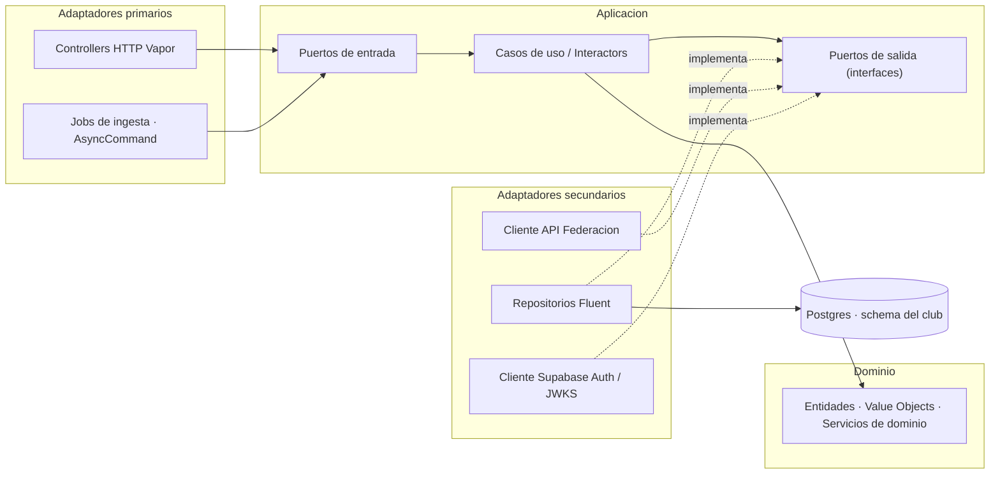
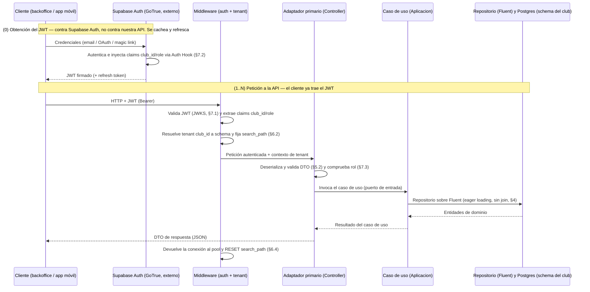
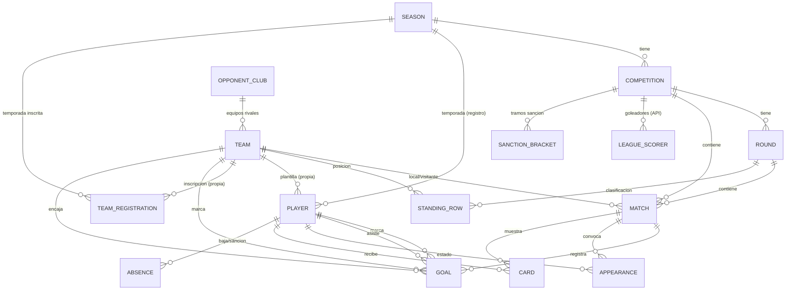

# LLD-001 · Diseño de bajo nivel — API backend y Base de datos

- **Estado:** Borrador — §2 (arquitectura Clean/Hexagonal/DDD), §3 (modelo de datos), §4 (Dominio, puertos y persistencia), §5 (contrato API — **las 20 entidades de §3.2, contrato completo**), §6 (multi-tenancy, **medida** contra Postgres y PgBouncer reales), §7 (auth y autorización) y §8.1 (testing) redactadas; **siguen siendo esqueleto §1 y §8.2**
- **Fecha:** 2026-08-20 (revisión: el género es de la competición, no una inferencia por equipo — [D-58])
- **Decisores:** desarrollador único (+ Claude Code)
- **Relacionado:** [HLD-001](./Project%20HLD-001.md) · [ADR-API_y_BBDD-001](./ADR-API_y_BBDD-001.md)
- **Anexos:** [Decisiones de diseño · bitácora](./API_y_BBDD%20LLD-Anexo-Decisiones-Disenho-001.md) · [Federación de Madrid (RFFM) · API](./API_y_BBDD%20LLD-Anexo-Federacion-Madrid-RFFM.md) · [Federación de Cataluña (FCF) · web](./API_y_BBDD%20LLD-Anexo-Federacion-Catalunya-FCF.md)

> **Alcance.** Diseño de bajo nivel **conjunto** de la API backend y la base de datos, por estar
> fuertemente acopladas (la API es la única frontera a la BD; ORM-first con Fluent). El **HLD-001** fija
> el marco de alto nivel y el **ADR-API_y_BBDD-001** las decisiones tecnológicas; este documento baja al
> **detalle de implementación**.
>
> **Este documento es normativo: dice *qué* es el diseño, no *por qué* se descartaron otras opciones.**
> Esa deliberación vive en el **Anexo de Decisiones** (bitácora de decisiones, entradas `[D-nn]`) y el material de
> ingeniería inversa sobre la API de la Federación, en el **Anexo de la Federación**. Criterio de reparto en [D-26].
>
> **Convención de división futura:** §3–§4 (modelo de datos) y §5 (contrato de API) se mantienen como
> bloques de primer nivel para poder extraerlos a `LLD-BBDD` y `LLD-API` separados cuando §5 crezca con el
> resto de entidades. No se ha hecho aún: rompería las referencias `§x.y` del *spec* y del ADR ([D-26]).

---

## 1. Propósito y alcance

*Qué cubre y qué no este LLD; supuestos de partida heredados del HLD/ADR.*

> Pendiente de redactar. Resumen del stack decidido (ADR): PostgreSQL/Supabase · API Swift (Vapor + Fluent)
> · Supabase Auth · multi-tenancy híbrida · despliegue PaaS con Docker (Fly.io).

---

## 2. Arquitectura del backend

*Capas y flujo de una petición; la API como única frontera a la BD.*

La API es la **única frontera de acceso a la BD** (requisito 6 del ADR): ningún cliente toca Postgres
directamente. Se organiza en **tres módulos funcionales** sobre una **arquitectura por capas** común, y es
**tenant-aware** de extremo a extremo (cada operación se resuelve contra el *schema* del club, §6).

### 2.1 Módulos funcionales

El backend se descompone en tres módulos. Dos son **superficie REST** (BFF y gestión de usuarios) y uno es
una **integración externa** con cadencia propia (Federación); la gestión de usuarios es además **transversal**
(protege a los otros dos).

| # | Módulo | Rol | Dirección de datos | Dónde se detalla |
|---|--------|-----|--------------------|------------------|
| 1 | **BFF** (Backend for Frontend) | CRUD sobre el modelo de dominio (§3) para el **backoffice web** (escritura) y las **apps móviles** (lectura). Es el grueso del contrato REST. | App ↔ *schema* del club | §5 |
| 2 | **Integración con la API de la Federación/liga** | **Ingesta** de datos externos (resultados/calendario, clasificación opcional, goleadores) y mapeo a `Match`/`StandingRow`/`LeagueScorer` (§3.7). Se construye por **ingeniería inversa** de la app iOS existente (RFFM Madrid + Federación Cataluña). **No expone superficie HTTP propia** (§5.6): su *configuración* se crea desde el BFF y su disparo es un job. | API externa → *schema* del club | §5.6 |
| 3 | **Gestión de usuarios** | **Autenticación** (validación del JWT de Supabase Auth), **autorización** (roles escritura/lectura) y **resolución/provisión de tenant** (§6, §7). Transversal a los otros dos. | Transversal (guarda cada petición) | §6, §7 |

**Cómo se relacionan.** La **gestión de usuarios** es una capa transversal: toda petición de los módulos 1 y
2 pasa por ella (identidad + `club_id` + rol). **BFF** y **Federación** escriben sobre el **mismo modelo y
*schema***, pero por vías distintas y **se encuentran en el dato**: la Federación aporta el **resultado** de un
`Match` (marcador/calendario) por ingesta periódica; el BFF/entrada manual añade el **detalle** de ese mismo
partido propio (goles con desglose, tarjetas, convocatorias). Es la división "resultado externo + detalle
manual" ya fijada en §3.7 — aquí queda reflejada como **frontera entre módulos**, no solo entre fuentes de dato.

**La frontera no es "una entidad por módulo": son tres papeles.** El modelo de datos (§3) es **común** a los
dos módulos, pero cada entidad tiene **un solo dueño de escritura**, y el reparto tiene tres casillas, no dos:

| Papel | Quién escribe | Entidades | Superficie BFF |
|-------|---------------|-----------|----------------|
| **Entrada de la ingesta** (configuración) | administrador, vía **BFF** | `Season`, `Competition` | CRUD completo |
| **Salida de la ingesta** | módulo de **Federación** | `Round`, `Match`, `OpponentClub`, `Team`, `StandingRow`, `LeagueScorer` | lectura + `PATCH` de corrección |
| **Dominio manual** | administrador, vía **BFF** | `Player`, `Absence`, `Appearance`, `Card`, `Goal` | CRUD completo |
| **Configuración manual** | administrador, vía **BFF** | `CompetitionSanctionBracket` | lectura + **`PUT` del conjunto** ([D-50]) |

La regla que se deriva —**el BFF corrige lo que la ingesta trae; nunca lo crea ni lo borra**— y su matriz
operación a operación están en **§5.1**; la política que impide que una sincronización pise una corrección,
en §3.7.

> **Nota de división futura (actualiza la del encabezado):** al promover la Federación a bloque propio, los
> candidatos a extraerse a documentos separados quedan: §3–§4 → `LLD-BBDD`; §5 (BFF) + sección de Federación →
> `LLD-API`; §6–§7 (tenancy/auth) podrían ir a un `LLD-Tenancy-Auth` si crecen (ya previsto en el ADR).

### 2.2 Arquitectura por capas (Clean + Hexagonal + DDD)

Se adopta **Clean Architecture** como marco (círculos concéntricos + **Regla de dependencia** +
**independencia de frameworks**), articulada con **Puertos y Adaptadores** (Hexagonal) para las fronteras de
entrada/salida y con el **lenguaje ubicuo, Entidades y Value Objects** de **DDD** en el núcleo. Las
dependencias **apuntan siempre hacia el Dominio**; nada del Dominio conoce Vapor, Fluent ni HTTP.

**Las cuatro capas (de dentro hacia fuera):**

- **Dominio** *(núcleo, no depende de nada)* — **Entidades**, **Value Objects** y **servicios de dominio**
  que encierran las **reglas de negocio e invariantes** (unicidad de dorsal por equipo/temporada §3.5,
  consistencia de `scoring_team_id`/`conceding_team_id` del gol §3.6, tramos de sanción §3.6…). Tipos Swift
  **puros** (sin `import Vapor`/`Fluent`). Aquí vive el **lenguaje ubicuo**.
- **Aplicación** — **Casos de uso** (*interactors*) que orquestan el Dominio. Definen los **puertos**:
  **puertos de entrada** (contratos que invocan los adaptadores primarios) y **puertos de salida**
  (interfaces de **repositorio**, cliente de Federación, reloj/uuid…) que se resuelven por **Inversión de
  Dependencias (DIP)**.
- **Adaptadores (Interface Adapters)** —
  - **Primarios (*driving*)**: traducen entrada externa → caso de uso. **Controllers HTTP** de Vapor (BFF,
    usuarios) y **jobs/`AsyncCommand`** de ingesta (Federación, §2.3-b).
  - **Secundarios (*driven*)**: **implementan** los puertos de salida. **Repositorios Fluent** (persistencia
    Postgres), **cliente HTTP de la API de Federación**, **cliente Supabase Auth/JWKS** (§7.1).
- **Frameworks & Drivers (Infraestructura)** — el detalle **reemplazable**: Vapor, Fluent, PostgresNIO,
  Postgres, JWTKit, el runtime.



> **Regla de dependencia y DIP.** Las flechas continuas van **hacia el Dominio**. Los adaptadores secundarios
> (`REPO`/`FED`/`AUTH`) **no** son dependidos por la Aplicación: **implementan** puertos declarados en ella
> (flechas punteadas) → la dependencia queda **invertida**. Así el Dominio y los casos de uso se **testean sin
> BD ni red** (dobles de los puertos). **Los DTOs cruzan las fronteras** (§5.2): nunca se exponen al exterior
> Entidades de dominio ni modelos de persistencia; el adaptador primario mapea DTO ↔ Dominio, el secundario
> mapea Dominio ↔ modelo Fluent.

**Mapa capa → keyword → artefacto:**

| Capa (Clean) | Keyword (Hexagonal/DDD) | Artefacto Swift/Vapor |
|--------------|--------------------------|------------------------|
| **Dominio** | Entidades, Value Objects, servicios de dominio, lenguaje ubicuo | `struct`/`enum` Swift puros, **sin** `import Fluent/Vapor` |
| **Aplicación** | Casos de uso / *interactors*; puertos de entrada y de salida | Tipos de caso de uso + `protocol` (puertos) |
| **Adaptador primario** (*driving*) | Adaptador primario | `RouteCollection`/Controller de Vapor; `AsyncCommand` (jobs) |
| **Adaptador secundario** (*driven*) | Adaptador secundario | Repositorio Fluent; cliente HTTP Federación; cliente JWKS |
| **Frameworks & Drivers** | Infraestructura | Vapor, Fluent, PostgresNIO, Postgres, JWTKit |

**Los 3 módulos (§2.1) sobre estas capas:**
- **BFF** → casos de uso CRUD (Aplicación) + Controllers (primario) + repositorios Fluent (secundario).
- **Federación** → caso de uso de **ingesta** (Aplicación) + **job** disparador (primario, §2.3-b) + **cliente
  de la API externa** y repositorios (secundarios).
- **Gestión de usuarios** → **middleware de auth** = adaptador primario **transversal** que valida el JWT por
  un **puerto de identidad** (implementado por el cliente JWKS/Supabase); casos de uso de **resolución y
  provisión de tenant** (§6).

#### Dominio independiente de frameworks, no *Active Record*

Un modelo Fluent que hiciera de entidad y además conformara `Content` **acoplaría el Dominio a
Fluent/Vapor** y cruzaría la frontera con un objeto de framework — justo lo que la Regla de dependencia
prohíbe. Se adopta por tanto **tres representaciones por entidad**: entidad de dominio (`struct` puro),
modelo de persistencia Fluent y DTO, con el repositorio y el Controller mapeando entre ellas (§4).

Alternativa descartada y contrapartidas asumidas: [D-01]. Consecuencia en la estrategia de test: §8.1.

### 2.3 Flujo de una petición (end-to-end)

Dos **adaptadores primarios** distintos (Controller HTTP y job de ingesta) invocan casos de uso que comparten
la **misma capa de acceso** (caso de uso → repositorio → Fluent → *schema* del club):

**(a) Petición HTTP** (BFF y gestión de usuarios) — dirigida por el cliente. Incluye el **paso (0) de
obtención del JWT**: el cliente se autentica **directamente contra Supabase Auth (GoTrue), no contra nuestra
API** — nuestra API **valida** el token (JWKS), pero **no lo emite** (ADR: Decisión 3 / Anexo B.5). Ese paso
(0) ocurre **una vez por sesión** (con *refresh* mientras dure), no en cada petición; los pasos (1) en
adelante se repiten en cada llamada reutilizando el JWT cacheado:



**(b) Ingesta programada** (Federación) — **sin petición HTTP**: un `AsyncCommand`/tarea periódica (§8) es el
**adaptador primario** que, por cada club del tier gestionado (o el proyecto del silo), resuelve el tenant e
invoca el **caso de uso de ingesta**; este llama a la API externa (por el **puerto de salida** del cliente de
Federación) con los identificadores de federación (`federation_season_id`, `federation_group_id`, §3.7) y
**mapea y hace *upsert*** de `Match`/`StandingRow`/`LeagueScorer` sobre el *schema* del club (por el
**repositorio**). **Distinto adaptador primario, misma capa de acceso** (caso de uso → repositorio → Fluent →
*schema*), por lo que reutiliza el enrutado por tenant de §6.

**(c) Verificación de la configuración de ingesta** (`POST /v1/teams/{id}/federation-link/preview` y su
gemelo `POST /v1/competitions/preview`, §5.1) — el **único** caso en que una petición HTTP del BFF llama a la
API externa **en línea y en la propia respuesta**. Su confirmación (`POST …/federation-link`) también llama a
la federación, pero **fuera de la petición**: devuelve **202** y encola la primera ingesta, precisamente para
no meter ~34 peticiones de la FCF (§5.6) dentro de una llamada HTTP ([D-67]): el administrador pega la URL del
calendario de la federación y el caso de uso la resuelve por el **puerto `FederationClient`** (el mismo que
usa el job) **sin persistir nada**, para devolverle qué hay ahí antes de confirmar. Es un adaptador primario
del BFF invocando un puerto de salida del módulo de Federación: no rompe ninguna frontera —los puertos son
justamente lo que permite compartirlo— pero conviene tenerlo presente porque es la única ruta síncrona con
latencia de terceros. Se trata como tal (*timeout* corto y error 502/504 explícito, §5.1).

> Detalle de cada capa transversal: **auth/authz** en §7, **resolución y enrutado de tenant** en §6, **contrato
> REST** (DTOs, errores, paginación) en §5, **contrato de ingesta** de la Federación en su sección propia.

---

## 3. Modelo de datos (BD)

Modelo derivado de los requisitos de estadística y de las pantallas de la app móvil (solo lectura) en
`docs/design-assets/mobile/`. Cubre: **estadísticas de liga** (resultados por jornada, clasificación por
jornada, goleadores de la liga), **estadísticas de equipo** (rendimiento total/local/visitante y desglose de
goles marcados/recibidos) y **estadísticas de jugador** (rol, disponibilidad, tarjetas, participación y goles).

> **Nota sobre los mockups:** los números de las pantallas de Stitch son **ilustrativos** y no siempre cuadran
> entre sí (p. ej. desgloses que no suman el total). El modelo trata cada dimensión de gol como **atributo
> independiente**; las reglas de partición/validación se listan en §3.5–§3.6.

### 3.1 Diagrama entidad-relación



Todo vive dentro del *schema* del club (ver §6).

### 3.2 Entidades

Convenciones: `id` UUID PK, `created_at`/`updated_at` en todas; FKs con integridad referencial; *soft delete*
opcional (§3.5).

| Entidad                                           | Campos clave                                                                                                                                                                    | Notas                                                                                                                                                                                                                                                                                                                                                                                                                                                                                                                                                                                                                                                                                                                                                                                                                                                                                                                                                                                                                                                                                                                                                                                                                                                                                                                                                                        |
| ------------------------------------------------- | ------------------------------------------------------------------------------------------------------------------------------------------------------------------------------- | ---------------------------------------------------------------------------------------------------------------------------------------------------------------------------------------------------------------------------------------------------------------------------------------------------------------------------------------------------------------------------------------------------------------------------------------------------------------------------------------------------------------------------------------------------------------------------------------------------------------------------------------------------------------------------------------------------------------------------------------------------------------------------------------------------------------------------------------------------------------------------------------------------------------------------------------------------------------------------------------------------------------------------------------------------------------------------------------------------------------------------------------------------------------------------------------------------------------------------------------------------------------------------------------------------------------------------------------------------------------------------- |
| **Club** (raíz del tenant)                        | `name`, `short_name`, `slug`, `crest_key?`, **`federation`**, `settings`                                                                                                        | Un registro por club/schema. **`name`** = nombre oficial largo; **`short_name`** = nombre corto para mostrar (cabeceras); **`slug`** = identificador **interno** para rutas y nombres de fichero — **inmutable, se fija al aprovisionar** y no se edita por API (§5.1). `crest_key` = clave del objeto en Storage, no una URL (§3.7). **`federation`** = valor del **catálogo de federaciones**, que vive **en código, no en BD** (§3.6): la federación es propiedad **del tenant** (un club de Madrid está en la RFFM, uno catalán en la FCF), y de ella salen la URL base, la numeración de temporada y el mapa de códigos de modalidad. Se fija al aprovisionar                                                                                                                                                                                                                                                                                                                                                                                                                                                                                                                                                                                                                                                                                                           |
| **Season** (Temporada)                            | `label` ("2024/25"), `start_date`, `end_date`, **`federation_season_id`**, `archived_at?`                                                                                       | `federation_season_id` = identificador de la temporada en la **API de la federación/liga**, distinto del `id` UUID interno; parámetro de entrada para llamar a la API externa (`temporada=21`). **Obligatorio** (toda temporada tiene contrapartida en la federación) y **tecleado por el administrador**, que lo copia de la URL del calendario (§3.7). Es un **secuencial de la federación** —`21` no guarda relación con "2024/25"—, propio de **cada** federación, y **cambia cada temporada**: es la única pieza de configuración que hay que actualizar cada año. `start_date`/`end_date` **fijas y derivadas de `label`** (01/07/AAAA → 30/06/AABB), **no overridables**. **`is_current` derivado en lectura, no se almacena**: es la temporada con el `end_date` **más próximo que aún es ≥ hoy** (el tiempo no retrocede → una sola current, sin invariante que gestionar). **`archived_at`** = archivado reversible (soft): oculta la temporada y, de facto, su subárbol (§5)                                                                                                                                                                                                                                                                                                                                                                                      |
| **OpponentClub** (Club rival)                     | `name`, `short_name`, `slug`, **`federation_club_id`**, `crest_key?`                                                                                                            | **Identidad del club rival**, separada de sus equipos (§3.6). La crea la **ingesta** y la corrige el administrador. Un club rival suele tener equipo en **varias categorías** → varias filas `Team` apuntan a esta misma. **`federation_club_id`** = segmento numérico de la ruta del escudo en la API de la federación (§3.7); es la clave de emparejamiento de la ingesta                                                                                                                                                                                                                                                                                                                                                                                                                                                                                                                                                                                                                                                                                                                                                                                                                                                                                                                                                                                                  |
| **Team** (Equipo)                                 | `opponent_club_id?`, `category`, `letter?`, `gender`, **`modality`**, **`federation_team_id?`**                                                                                 | **`modality`** (§3.3) forma parte de la **identidad** del equipo: el "Infantil A" de fútbol-11 y el de fútbol-sala son **equipos distintos**, con distinta competición y distinto `codigo_equipo` (§3.6) — por eso entra en la clave única (§3.5). **Es campo de entrada solo en el alta** ([D-66]): lo fija el club al crear el equipo y queda congelado; para los equipos que crea la ingesta lo toma de la competición (§5.1). **Nunca es campo del `PATCH`**. **`gender` se comporta exactamente igual** ([D-58]): también es identidad, también entra en la clave única (§3.5) y también lo **hereda de la competición** cuando es la ingesta quien crea el equipo —la federación no lo publica por equipo ([Anexo RFFM §F.14])—, y también es **campo de alta y no de `PATCH`** cuando lo crea el club ([D-66]). **`opponent_club_id` nulo ⇒ equipo propio** (del `Club` del tenant); no nulo ⇒ equipo rival → **`is_own` no se almacena: es derivado** (§3.6). **No lleva nombre ni escudo**: son del club. Nombre mostrado (derivado en lectura, §5) = nombre del club + `category` + `letter` → "CD Ejemplo Infantil A". **`federation_team_id`** = `codigo_equipo` de la API de la federación (§3.7): identifica al **equipo**, no al club — el mismo club tiene código distinto en cada categoría. **Anulable**: un equipo vive sin él desde que el club lo crea hasta que se engancha con la federación ([D-66], [D-67]); es también el discriminante de qué puede hacer el BFF con la fila (§5.1). "Primer Equipo" = `category=senior` + `letter="A"` (o sin letra); filial = `category=senior` + `letter="B"`                                                                                                                                                                                                                                                                                                        |
| **TeamRegistration** (Inscripción)                 | `team_id`, `season_id`                                                                                                                                                          | **Qué equipos del club juegan en qué temporada, afirmado por el club** ([D-68]). **Solo equipos propios** (`Team.opponent_club_id IS NULL`): un rival no se inscribe, aparece porque juega. Existe porque `Team` **no lleva temporada** a propósito ([D-28]) y la participación se **deriva de `Match`** ([D-27]) — pero entre junio (el club forma el equipo) y septiembre (la federación publica calendario) **no hay `Match` del que derivar**, y §9.8/§9.9 ocurren justo en ese tramo. **Sin atributos propios, y es deliberado**: la fuente es el club, que no tiene ni fecha ni estado federativo; una retirada es **borrar la fila**. **No es la vuelta de `Participation`**: aquella era un índice de `Match` mantenido a mano; esta contiene lo que `Match` todavía no puede implicar. La escribe el `POST /v1/teams` (`seasonId` **obligatorio**, §5.1) y la añade también la cascada del enganche ([D-67]) |
| **Competition** (Competición)                     | `season_id`, **`modality`**, **`gender`**, **`federation_competition_id`**, **`federation_group_id`**, `name`, **`age_category`**, **`division_label`**, `group_label`, `last_synced_at?`     | Instancia de liga por temporada ("Infantil · Primera · Grupo 1"). **`last_synced_at`** = última sincronización con éxito; nulo ⇒ nunca sincronizada, que es la condición bajo la cual las coordenadas externas siguen siendo editables (§5.1). `season_id` = FK al **UUID interno** de `Season` (no es el `federation_season_id`). **Los dos identificadores externos son los parámetros de la llamada al calendario** (§3.7) y **no son intercambiables**: `federation_competition_id` (`competicion=24037548`) designa **categoría de edad + división**, y `federation_group_id` (`grupo=24037549`) **solo el grupo**. Ambos **obligatorios** y **tecleados por el administrador** (pegando la URL, §5.1). **`modality`** (§3.3) es la contrapartida de dominio del parámetro `tipojuego`, que **no se almacena**: se codifica al llamar con el mapa de la federación (§3.6). **`age_category`** = mismo enumerado que `Team.category` (§3.3) → permite **validar** que un equipo solo participe en una competición de su edad, **de su modalidad y de su género**. **`gender`** (§3.3) es la tercera pieza de esa terna y llega por la misma vía que las otras dos: la federación **no publica campo de género** en ninguna entidad —lo embebe en el **nombre de la competición** ([Anexo RFFM §F.14])—, así que el `/preview` lo **infiere y lo propone**, el administrador lo **confirma** en el alta, y de aquí lo **hereda `Team`** ([D-58]). Es literalmente el tratamiento de `modality` ([D-07]) aplicado por segunda vez. **Editable solo mientras `last_synced_at` sea nulo**, con la guarda de [D-22]: después, cambiarlo desalinearía la competición de los equipos ya creados desde ella. **`division_label`** = nivel competitivo ("Primera", "Preferente", "Honor"…), **texto libre**: varía por federación y por categoría (§3.6). **`group_label`** = rótulo del grupo ("Grupo 1", "Grupo Único"), **texto libre y no deducible de `federation_group_id`**: se muestra, mientras que el id se llama (§3.7) |
| **Round** (Jornada)                               | `competition_id`, `number`, `start_date`, `end_date`                                                                                                                            | Único(competición, número)                                                                                                                                                                                                                                                                                                                                                                                                                                                                                                                                                                                                                                                                                                                                                                                                                                                                                                                                                                                                                                                                                                                                                                                                                                                                                                                                                   |
| **Match** (Partido)                               | `competition_id`, `round_id`, **`match_date`**, **`kickoff_time?`**, `home_team_id`, `away_team_id`, `home_score`, `away_score`, `status`, `venue?`, **`federation_match_id?`** | *scores* nullables hasta jugado; `venue?` opcional (no siempre conocido). **La fecha y la hora se separan porque el calendario nace provisional** ([D-30]): al publicarse la temporada, la federación reparte los partidos con una fecha por defecto (sábado) y **sin hora**, y solo el **domingo anterior a la semana del partido** fija la franja definitiva —que puede pasar a domingo—. `match_date` **siempre** tiene valor; `kickoff_time` es nulo mientras no se haya confirmado. Un `timestamptz` único obligaría a inventar un `00:00` indistinguible de la medianoche real. `is_kickoff_confirmed` **derivado en lectura, no se almacena** (= `kickoff_time` no nulo). Ambos campos son **volátiles** ([D-18]): confirmado **no** es inmutable —una suspensión por causa mayor los mueve— y la sincronización los pisa siempre. **`federation_match_id`** = `codacta` de la RFFM ([Anexo RFFM §F.5]); **anulable y no exigible**: es clave de emparejamiento *si* el proveedor la da, con degradación a coordenadas ([D-31])                                                                                                                                                                                                                                                                                                                           |
| **StandingRow** (Clasif./jornada)                 | `competition_id`, `round_id`, `team_id`, `position`, `played`, `won`, `drawn`, `lost`, `goals_for`, `goals_against`, `points`, **`previous_position?`**                         | Único(jornada, equipo). **Snapshot por jornada** → clasificación de cada ronda + `PREV`. **Agnóstica a la fuente** ([D-15]): la misma fila vale ingerida de la federación o calculada desde `Match`, y el cliente no distingue —la procedencia se expone una vez por tenant, en `ClubResponse.federationProvidesRoundStandings` ([D-29], [D-55])—. **No es agregado sino modelo de lectura** (§4.2, §4.5): la escribe el módulo de ingesta por *upsert*, nunca un repositorio de dominio. **`previous_position` se almacena, no se deriva** ([D-33]), y es **anulable**: en la primera jornada no hay anterior, y en un alta a mitad de temporada tampoco hay *snapshot* previo del que derivarla                                                                                                                                                                                                                                                                                                                                                                                                                                                                                                                                                                                                                                                                                         |
| **Player** (Jugador)                              | `team_id`, `season_id`, `full_name`, **`photo_key?`**, `shirt_number`, `position`, `deleted_at?`                                                                                | Solo equipos propios (`Team.opponent_club_id IS NULL`) — la federación no publica plantillas de fútbol base. **Registro por temporada**: una fila = un jugador en un equipo en una temporada concreta ([D-05]). `team_id` y `season_id` son **identidad, no atributos**: no se editan, un cambio de equipo o de año es **otra fila** ([D-37]). **`photo_key`** = clave del objeto en Storage, **no una URL** ([D-35]): mismo criterio que `Club.crest_key` ([D-19]) y aquí además obligado, porque es la foto de un menor; la URL firmada se deriva en lectura. **`deleted_at`** = *soft delete*, **sin guarda de dependientes**: los eventos del jugador borrado siguen contando para el equipo ([D-36]). Stats derivadas por temporada desde eventos ligados a este `Player`                                                                                                                                                                                                                                                                                                                                                                                                                                                                                                                                                                                               |
| **Absence** (Disponibilidad)                      | `player_id`, `type`, `start_date` (INIC), **`expected_return_date?`** (ALTA EST.), **`actual_return_date?`**, `deleted_at?`                                                     | Periodo de indisponibilidad. **`active` deja de ser columna**: se deriva de que no haya alta real **y** haya llegado `start_date` ([D-38]) — el mismo tratamiento que `is_own` ([D-03]) o `is_kickoff_confirmed` ([D-30]). Las dos fechas de vuelta son **anulables**: la estimada no se conoce los primeros días, la real solo al alta. **Ninguna FK a `Season` ni a `Team`**: se alcanzan por el jugador, que ya es identidad de ambos ([D-05], [D-28]). Un jugador puede tener **varias ausencias activas de tipos distintos** (lesionado y sancionado a la vez), pero **no dos del mismo tipo** ([D-39])                                                                                                                                                                                                                                                                                                                                                                                                                                                                                                                                                                                                                                                                                                                                                                 |
| **Appearance** (Convocatoria)                     | `player_id`, `match_id`, `status`, `minutes?`, `deleted_at?`                                                                                                                    | Único(jugador, partido) **entre las no borradas**. Cuenta JUGADOS/BAJA MÉDICA/SANCIÓN/NO CONVOCADO. **`player_id` y `match_id` son identidad, no atributos**: no se editan ([D-37]). **La ausencia de fila no es un estado** ([D-41]): `no_convocado` es un hecho registrado —decisión técnica— y cuenta en la estadística; que no haya fila significa que nadie apuntó esa convocatoria. **`minutes` solo con `status = jugado`** ([D-42]) y **opcional incluso entonces** ([D-14]): nulo es "jugó, no sé cuánto", que no es cero. **Ninguna FK a `Season`, `Team` ni `Competition`**: el equipo y la temporada se alcanzan por el jugador, la jornada y la competición por el partido ([D-05], [D-28]). Invariante cruzada: **el equipo del jugador disputa el partido**. **`deleted_at`** = *soft delete*, sin guarda de dependientes ([D-36])                                                                                                                                                                                                                                                                                                                                                                                                                                                                                                                            |
| **Card** (Tarjeta)                                | `player_id`, `match_id`, `type`, `is_second_yellow`, `minute?`, `deleted_at?`                                                                                                    | **Una fila es una sanción, no una cartulina** ([D-45]): la doble amarilla es **una** fila `roja` con `is_second_yellow = true`, y las amarillas que la causaron **no acumulan** ([D-10]). Único(jugador, partido, tipo) **entre las no borradas** — amarilla y roja directa sí conviven. `is_second_yellow = true` exige `type = roja` (segunda invariante entre columnas, como [D-42]). **`minute`** opcional ([D-14]). **No se exige `Appearance`** ([D-46]). "Amarillas pendientes" se calcula (§3.6). **`deleted_at`** = *soft delete* ([D-36]) |
| **Goal** (Gol)                                    | `match_id`, `scoring_team_id`, `conceding_team_id`, `scorer_player_id?`, `assist_player_id?`, `minute?`, `zone?`, `side?`, `body_part?`, `play_type?`, `assisted?`              | **Denormalizado a propósito** (§3.6): `scoring_team_id`/`conceding_team_id` se copian del `Match` al crear el gol → goles a favor de un equipo = `WHERE scoring_team_id = :id_del_equipo`; goles en contra = `WHERE conceding_team_id = :id_del_equipo`, **sin join**. Todos los campos de clasificación (`zone`…`assisted`) son **opcionales** (entrada manual parcial). **Cubre las dos direcciones** de los partidos del equipo propio (el mockup desglosa también los goles recibidos), pero no los partidos entre rivales (§3.7). **`conceding_team_id` no se escribe: se deriva del `Match`** ([D-54]) — la mitad de la denormalización que el cliente no puede contradecir. **`scorer_player_id` anulable** (los goles del rival no tienen goleador conocido, [D-09]) y **el equipo al que debe pertenecer depende de `play_type`** ([D-52]): el que marca en un gol normal, el que **encaja** en `en_propia_puerta` — donde además el gol **no suma** al goleador aunque quede registrado a su nombre. **`assisted` no es redundante con `assist_player_id`**: `true` con jugador nulo es el gol encajado con asistencia rival ([D-09]). **Sin unicidad alguna** —un jugador marca dos veces en un partido— y **sin cuadre con el marcador** ([D-53]). **`deleted_at`** = *soft delete* ([D-36])                                                                                                                                                                                                                                                                                                                                                                                                                                                                                                                                                                                                                                                                                                                                                                                                                                                                                                                                                                                                     |
| **LeagueScorer** (Goleador de liga)               | `competition_id`, `full_name`, `team_label`, `goals`, `rank?`, `synced_at?`                                                                                                     | **Ingerida de la API de la liga** (§3.7); no ligada a `Player`; solo lectura. **Se ingiere, no se calcula** ([D-09]): el ranking incluye rivales, de los que no hay plantilla — `full_name` y `team_label` son **texto del proveedor**, no claves, y no se emparejan con `Player` ni con `Team`. **Estado vigente único, no *snapshot* por jornada** (a diferencia de `StandingRow`): el *upsert* lo pisa en cada sincronización, sin histórico ni `PREV`. **`rank`** anulable —no todos los proveedores lo publican— y **se respeta el suyo** en vez de recalcularlo: los criterios de desempate son ajenos. **Sin *fallback*** ([D-48]): si la federación no lo publica, no hay nada que calcular y la tabla queda vacía. **`synced_at`** es marca del *upsert* (retirar filas que el proveedor dejó de publicar), **no viaja en el DTO** ([D-29])                                                                                                                                                                                                                                                                                                                                                                                                                                                                                                                                                                                                                                                                                                                                                                                                                                                                                                                                                                                                                                                                                                                                                                                                                                                                                                 |
| **CompetitionSanctionBracket** (Tramo de sanción) | `competition_id`, `seq`, `yellow_from`, `yellow_to`                                                                                                                             | Config por competición (§3.6). Sanción al alcanzar `yellow_to`; "pendientes" = `yellow_to − acumuladas`. **Es una secuencia, no filas independientes** ([D-50]): tramos contiguos y ordenados por `seq`, sin huecos ni solapes — la unidad de escritura es el **conjunto entero**, no la fila. **`seq` y `yellow_from` son derivados** ([D-51]): el conjunto queda determinado por la lista ascendente de `yellow_to`, así que un conjunto inválido no se puede ni expresar. **Sin borrado lógico** (§4.4): es configuración, no un hecho — una competición sin tramos simplemente no tiene filas ([D-10]). **Retroactivo**: las pendientes se calculan en vivo sobre `Card`, así que cambiar los umbrales reinterpreta las tarjetas ya registradas                                                                                                                                                                                                                                                                                                                                                                                                                                                                                                                                                                                                                                                                                                                                                                                                                                                                                                                                                                                                                                                                                                                                                                                                                                                                      |
| **StaffMember** (Personal del club)               | `full_name`, `email`, **`user_id?`**, `deleted_at?`                                                                                                                             | Una persona que trabaja en el club, **técnica o no**. **`user_id`** = UUID de `auth.users`: **identificador externo**, mismo patrón que los `federation_*_id` ([D-06]) — se guarda para vincular, nunca como clave de unión interna. **Anulable a propósito**, y es la razón de que esta entidad exista: el admin monta la estructura de la pretemporada en julio, cuando media plantilla técnica todavía no ha aceptado la invitación. Sin ella no se podría registrar "Juan entrena al Cadete A" hasta que Juan entrase por primera vez, ni pintar la lista de candidatos a un puesto en el backoffice. **El administrador también es un `StaffMember`**: la distinción técnico/administrativo se lee del puesto, no de la tabla. Único(`email`); único(`user_id`) entre los no nulos ([D-59]) |
| **StaffPosition** (Puesto)                        | `name`, **`level`**, **`scope_kind`**, `grants_all_verbs`, `is_technical`, `deleted_at?`                                                                                        | Catálogo **por tenant**, precargado y con CRUD del admin: cada club nombra sus cargos como quiera. **`level`** = la pirámide (0 = administración); **no autoriza escrituras** —eso lo hace el ámbito— sino que gobierna **quién puede nombrar a quién** ([D-62]). **`scope_kind`** (§3.3) dice sobre qué eje de la identidad de `Team` alcanza el puesto, y es lo que evita enumerar un puesto por categoría ([D-60]). **`grants_all_verbs`** solo lo lleva el puesto de administración ([D-61]). `is_technical` es cosmética: filtra listas en la UI. Único(`name`) |
| **PositionPermission** (Permiso de puesto)        | `staff_position_id`, **`verb`**                                                                                                                                                 | Qué casos de uso concede un puesto. **`verb` es `text` sin `CHECK` y sin tabla de catálogo** ([D-61]): el catálogo lo fija el código (un `enum … CaseIterable`) y lo publica `GET /v1/permissions/verbs`; la validación ocurre en el caso de uso (**422**), no en la BD. Único(`staff_position_id`, `verb`) |
| **StaffAssignment** (Asignación)                  | `staff_member_id`, `staff_position_id`, **`season_id`**, **`scope_kind`**, `team_id?`, `modality?`, `category?`, `gender?`, `deleted_at?`                                        | Quién ocupa qué puesto, sobre qué ámbito y en qué temporada. **Múltiple a propósito** —un coordinador casi siempre entrena además a un equipo—, y de ahí que el permiso se evalúe **por asignación** y nunca colapsando a la persona ([D-62]). **`season_id` es identidad, no atributo**, por el mismo criterio que `Player` ([D-05], [D-37]): cambiarlo es **otra fila**, de ahí que no haya `PATCH` (§5.1). **Las cuatro columnas de ámbito son anulables y excluyentes**: exactamente la que corresponde al `scope_kind` va informada, y `club` las lleva **todas** nulas. `scope_kind` se **duplica** aquí desde el puesto con **FK compuesta** (`staff_position_id`, `scope_kind`) → único caso en que [D-28] permite copiar un campo ([D-62]). Unicidad: ver §3.5 |

### 3.3 Enumerados (propuesta)

- **Team.category:** `prebenjamin, benjamin, alevin, infantil, cadete, juvenil, senior` (`senior` cubre tanto "Primer Equipo" como equipos filiales; se distinguen por `letter`).
- **Gender** (`Team.gender` y `Competition.gender`): `masculino, femenino, mixto`. **Compartido entre las dos
  entidades**, igual que `Modality`: el equipo lo hereda de la competición ([D-58]). La fuente solo sabe
  expresar dos de los tres valores — `mixto` lo pone siempre el administrador ([Anexo RFFM §F.14]).
- **Modality** (`Team.modality` y `Competition.modality`): `futbol_11, futbol_7, futbol_5, futbol_sala, futbol_playa`. Enumerado **de dominio**, no de integración: significa lo mismo en cualquier federación. Su codificación externa (el parámetro `tipojuego` de la RFFM) vive en el catálogo de federaciones, en código (§3.6).
- **Player.position:** `portero, defensa, centrocampista, delantero`.
- **Match.status:** `programado, finalizado, aplazado, suspendido`. Lo escribe la ingesta por **dos vías**
  ([D-57]): del **acta** en los partidos de equipos propios —donde los cuatro valores son alcanzables— y
  **derivado del marcador** en los ajenos, donde solo lo son los dos primeros.
- **Appearance.status:** `jugado, baja_medica, sancionado, no_convocado`.
- **Card.type:** `amarilla, roja`.
- **Absence.type:** `lesion, enfermedad, sancion, otro`.
- **Goal.zone:** `area_chica, area_penalti, fuera_area` — **partición exclusiva** (cada gol tiene exactamente una zona).
- **Goal.side:** `derecha, izquierda, centro`.
- **Goal.body_part:** `pie, cabeza, otro`.
- **Goal.play_type:** `juego_abierto, penalti, falta, en_propia_puerta`.
- **StaffPosition.scope_kind:** `club, modality, category, gender, team`. **No es un enumerado de negocio
  sino un discriminante estructural**: nombra sobre qué eje de la clave de identidad de `Team` (§3.5)
  alcanza un puesto, y por eso sus valores son nombres de columnas de `Team` más `club` (todos) — no una
  lista de cargos. Es lo que permite que "Coordinador Cadete", "Coordinador Juvenil" y los demás sean **un**
  puesto con distinto ámbito en vez de siete puestos ([D-60]).

### 3.4 Vistas derivadas (agregaciones, no tablas base)

Calculadas por consulta o vistas materializadas:
- **Composición de la competición** (qué equipos la forman) — `DISTINCT` de `home_team_id` ∪ `away_team_id` en los `Match` de esa competición. **No es tabla** ([D-27]): la ingesta descubre los equipos *desde* el calendario, así que `Match` ya los contiene todos. `StandingRow` ofrece una segunda derivación equivalente cuando la clasificación está disponible. De aquí sale el filtro `?seasonId=` de `GET /v1/teams` (§5) **para los equipos rivales**; los **propios** salen de `TeamRegistration`, porque en junio todavía no hay `Match` del que derivarlos ([D-68]). La derivación **no se sustituye**: se le añade un segundo sumando, y los dos conjuntos son disjuntos por construcción.
- **Rendimiento de equipo por temporada** (Total/Local/Visitante): J, G, E, P, GF, GC, PTS — desde `Match`.
- **Desglose de goles del equipo** (marcados/recibidos por dimensión) — desde `Goal`, filtrando directamente por `scoring_team_id = :id_del_equipo` (marcados) o `conceding_team_id = :id_del_equipo` (recibidos); **sin join** a `Match`.
- **Estadísticas de jugador por temporada** — goles, asistencias, participaciones por estado, tarjetas — desde eventos.
- **Amarillas pendientes de sanción** (por jugador) — según los *brackets* de la competición (`CompetitionSanctionBracket`): distancia al siguiente `yellow_to`. Reinicio de ciclo tras cumplir sanción.
- **Racha (forma)** — últimos **5** resultados por equipo, **desde `Match`** (no desde los *snapshots*, [D-34]). No se sirve como recurso propio: **viaja embebida en la clasificación** (§5.1), que es donde la pide la pantalla.
- **Goleadores de la liga (global)** — **directamente desde `LeagueScorer`** (ingerida de la API de la liga; **no** se calcula desde `Goal` — ver §3.7).

### 3.5 Convenciones y restricciones
- PK `id` UUID; `created_at`/`updated_at` (`timestamptz`).
- Tablas en `snake_case` plural; enums como tipos Postgres o `text` + `CHECK`.
- Índices en FKs y en columnas de filtro frecuente (temporada, competición, jornada, equipo) **y en las usadas por RLS**. En particular, índice en `Goal.scoring_team_id` y en `Goal.conceding_team_id` (consultas de desglose de goles marcados/recibidos, §3.4).
- *Soft delete* (`deleted_at`) opcional para entidades de edición manual (auditoría/recuperación). Caso aparte: `Season` lleva **`archived_at`** (archivado reversible, no borrado), con filtro por defecto en las lecturas (§5).
- Unicidades: `Season`(`label`), `Season`(`federation_season_id`), `Club`(`slug`), `OpponentClub`(`slug`), `OpponentClub`(`name`), `OpponentClub`(**`federation_club_id`**), `Team`(**`federation_team_id`**), `Team`(`opponent_club_id`, `category`, `letter`, `gender`, **`modality`**), **`TeamRegistration`(`team_id`, `season_id`)**, `Competition`(`season_id`, **`federation_group_id`**), `Round`(competición, número), **`Match`(`round_id`, `home_team_id`, `away_team_id`)**, **`Match`(**`federation_match_id`**)**, `StandingRow`(jornada, equipo), `Appearance`(jugador, partido), **`Card`(jugador, partido, tipo)** ([D-45]) y `Player`(equipo, temporada, dorsal) **entre los no borrados** — todas **dentro del *schema* del club** (§6); el dorsal se valida dentro del mismo equipo y temporada.
- **`StaffAssignment` vuelve a caer en la trampa de los `NULL`, y con la misma salida.** Lo único a impedir es ocupar el mismo puesto sobre el mismo ámbito dos veces en la misma temporada: `(staff_member_id, staff_position_id, season_id, team_id, modality, category, gender)`. Pero las cuatro columnas de ámbito son anulables y un puesto de `scope_kind = club` las lleva **todas** nulas — así que un `UNIQUE` normal **no protegería nada**: dos filas idénticas de "Director Técnico, temporada 2024/25" no comparan iguales. Es literalmente el caso de `Team` de más abajo, y se resuelve igual: **`UNIQUE NULLS NOT DISTINCT`** (Postgres 15+, disponible en Supabase). Aquí **no** sirve el índice parcial: no hay una condición que separe los casos, hay cinco combinaciones de ámbito ([D-62]).
- **La coherencia ámbito↔puesto es estructural, no de aplicación.** `StaffAssignment` duplica `scope_kind` desde `StaffPosition` con **FK compuesta** (`staff_position_id`, `scope_kind`) —lo que exige un `UNIQUE (id, scope_kind)` en `staff_positions`, redundante pero necesario para poder referenciarlo—, más un `CHECK` que ata `scope_kind` a qué columna de ámbito va informada. Es el **único** caso del modelo donde [D-28] autoriza copiar un campo, y precisamente por el motivo que esa decisión exige ([D-62]).
- **Que esas unicidades sean *por tenant* no necesita nada especial: comprobado.** Al vivir cada tabla en el *schema* de su club, un índice único normal ya es único **por club** — dos clubes pueden tener a la vez la temporada `2024/25` con el mismo `federation_season_id` sin colisionar, que es el comportamiento que se quiere y el que un `UNIQUE` global impediría. No hacen falta claves compuestas con `tenant_id` ni índices parciales por club: eso sería la solución del modelo *una tabla compartida con columna discriminadora*, que no es el elegido (§6). Ejecutado contra Postgres real en el [spike de tenancy](../spikes/tenancy/README.md).
- **La unicidad de `Match` no es un adorno: es la clave del *fallback* de la ingesta.** Dos equipos se enfrentan **una vez por jornada**, así que (`round_id`, `home_team_id`, `away_team_id`) identifica el partido sin depender de la fecha —que se mueve cada semana (§3.2)— ni del `federation_match_id` —que puede no venir—. Es exactamente el segundo paso de la cadena de emparejamiento de §3.7, y sin el índice único no sería una clave, solo una consulta. No lleva `competition_id` porque `Round` ya lo fija. *Asunción:* no hay repeticiones de partido dentro de la misma jornada; una eliminatoria a doble vuelta son **dos jornadas** ([D-12]).
- **`modality` es parte de la clave única de `Team`, no un adorno.** Sin ella, el "Infantil A masculino" de fútbol-11 y el de fútbol-sala del mismo club **colisionan**, y el modelo no podría representar un club con equipos en dos modalidades (§3.6). Es la razón por la que la modalidad no puede quedarse como simple parámetro de la URL de integración.
- **`gender` está en esa misma clave por el mismo motivo, y de ahí sale su regla de escritura** ([D-58]). El "Infantil A" masculino y el femenino del mismo club son **equipos distintos**; sin `gender` en la clave, uno pisaría al otro. Y como la clave es única, **una inferencia equivocada no produce un dato feo: produce un 409**. Por eso el valor no lo inventa la ingesta equipo a equipo, sino que lo hereda de una `Competition` cuyo género **confirmó un humano** en el alta (§5.1). Es el criterio general de este modelo: **lo que entra en una clave única no se infiere de texto libre sin que alguien lo valide**.
- **`Absence` lleva la otra unicidad parcial del modelo: `(player_id, type)` `WHERE actual_return_date IS
  NULL`** ([D-39]). No impide que un jugador esté a la vez lesionado y sancionado —son tipos distintos y es
  un estado real—, sí que acumule dos lesiones abiertas, que en la práctica es una sin cerrar. Es la única
  invariante de este tipo que se puede hacer **estructural** en vez de dejarla a la capa de aplicación, que
  es el criterio general de §3.5.
- **La unicidad del dorsal es *parcial*: `Player`(`team_id`, `season_id`, `shirt_number`) `WHERE deleted_at
  IS NULL`.** Sin el filtro, un jugador borrado seguiría ocupando el `9` y el club no podría reasignarlo —
  que es justo lo que se espera al borrar una ficha dada de alta por error ([D-36]). Es el mismo mecanismo
  de índice parcial del punto siguiente, pero por un motivo distinto: allí para **añadir** filas que un
  `UNIQUE` normal dejaría colar, aquí para **retirar** de la comprobación las que ya no cuentan.
- **Cuidado con los `NULL` en la unicidad de `Team`.** En Postgres los `NULL` **no comparan iguales**, así que un `UNIQUE` normal sobre (`opponent_club_id`, `category`, `letter`, `gender`, `modality`) **no protegería a los equipos propios** (todos con `opponent_club_id` nulo) — se podrían crear dos "Infantil A" propios. Dos formas de resolverlo: `UNIQUE NULLS NOT DISTINCT` (Postgres **15+**, disponible en Supabase) o un **índice único parcial** `WHERE opponent_club_id IS NULL` que complemente al normal. Lo mismo aplica a `letter`, que también es opcional.
- **En `TeamRegistration`, un `UNIQUE` normal basta** (`team_id`, `season_id`) ([D-68]): las dos columnas son
  **FK obligatorias**, así que no hay `NULL` que comparar y no aplica la trampa del punto anterior. Tampoco es
  parcial: no lleva `deleted_at` —una retirada es **borrado real**, no hay historial que auditar—. Y `ON DELETE
  CASCADE` **desde las dos**: borrar el equipo o purgar la temporada (§5.4) se lleva la inscripción por delante,
  **nunca al revés**. Es la cascada que hay que declarar explícitamente, o la purga de [D-24] se llevaría los
  equipos del club.
- **La unicidad de `Competition` se queda en (`season_id`, `federation_group_id`).** Añadir `federation_competition_id` no aportaría nada: el id de grupo ya es único dentro de la temporada (identifica **un** grupo de **una** categoría+división). El de competición se guarda porque **hace falta para llamar**, no para identificar.
- **`Competition` se identifica por (`season_id`, `federation_group_id`), no por el grupo a secas.** El identificador de grupo envuelve categoría + división + grupo (§3.7), pero **no la temporada**: la llamada a la API externa se construye con `federation_season_id` **y** `federation_group_id`. Restringir solo por el grupo impediría tener la misma competición en dos temporadas — que es el caso normal.
- **`season_id` no se propaga por el árbol** ([D-28]). Solo lo llevan `Competition` (FK estructural) y
  `Player`, donde la temporada es **identidad** y no hay otro camino hasta `Season` ([D-05]). En `Round`,
  `Match`, `StandingRow`, `Goal`, `Card` y `Appearance` la temporada se alcanza por FK; en `Team` y
  `OpponentClub` **no existe**, y es deliberado (§3.2). Regla general para futuras denormalizaciones:
  se copia un campo **solo si la deriva se puede hacer estructuralmente imposible** (FK compuesta), no por
  disciplina en la capa de aplicación.
- **En cambio, en `federation_team_id`, `federation_club_id` y `federation_match_id` el comportamiento por defecto es el que se quiere:** son anulables (equipos y clubes dados de alta a mano no tienen contrapartida federada; el identificador de partido depende de que el proveedor lo publique, [D-31]) y, al no comparar iguales los `NULL`, un `UNIQUE` normal permite **muchas filas sin código** mientras garantiza que **no se repita un código concreto**. Aquí **no** se usa `NULLS NOT DISTINCT`. Conviene tenerlo presente porque es justo el criterio opuesto al del punto anterior, en la misma tabla.

### 3.6 Supuestos y cuestiones de dominio

**Supuestos vigentes:**

- **Datos de liga por tenant:** cada club mantiene su **propia copia** de rivales/competición/clasificación
  (aislamiento por club, §6). Dos clubs que sigan la misma liga duplican esos datos.
- **Detalle por tipo de partido:** el **resultado** (marcador/calendario) de **todos** los partidos —propios
  y rivales— llega de la API de la Federación (§3.7). Los partidos del **equipo propio** llevan además, de
  entrada manual, los eventos detallados (goles con desglose, tarjetas, convocatorias); los partidos
  solo-rivales se quedan en resultado + clasificación, al no existir su plantilla.

**Cuestiones de dominio resueltas.** El razonamiento de cada una —qué alternativa se descartó y qué se asume
a cambio— está en la [bitácora de decisiones](./API_y_BBDD%20LLD-Anexo-Decisiones-Disenho-001.md). Aquí queda el enunciado y
dónde se materializa:

| Cuestión | Resolución | Detalle |
|----------|-----------|---------|
| Identidad de club en `Team` | Se extrae a **`OpponentClub`**; `Team` pierde nombre y escudo; `is_own` deja de ser columna y pasa a ser `opponent_club_id IS NULL` | [D-03] |
| Goles a favor / en contra | `Goal` **denormaliza** `scoring_team_id` y `conceding_team_id` → sin *join*. Campos de clasificación del gol, todos opcionales | [D-04] |
| Jugador entre temporadas | `Player` lleva `season_id`: **una fila = un jugador en un equipo en una temporada**. Sin identidad "persona" estable | [D-05] |
| Identificadores de la federación | **Doble identificador**: UUID interno (PK/FK) e id externo (solo integración, nunca clave de unión) | [D-06] |
| Modalidad de juego | Enumerado de dominio `modality` en `Competition` y `Team`, **dentro de la clave única** de `Team` | [D-07] |
| Género del equipo | La federación **no lo publica**: va en el nombre de la competición. `gender` pasa a `Competition`, el `/preview` lo propone, el administrador lo confirma y **`Team` lo hereda** | [D-58] |
| División del equipo | No es de `Team` sino de dónde compite. `Competition` se descompone en `age_category` + `division_label` + `group_label` | [D-08] |
| Goleadores de la liga | Se **ingieren** en `LeagueScorer` (solo lectura); no se modelan rosters ni goles de rivales | [D-09] |
| Sanción por amarillas | **Tramos configurables por competición** (`CompetitionSanctionBracket`); rojas → sanción directa | [D-10] |
| Zona de gol | Tres valores, **partición exclusiva**: `area_chica`, `area_penalti`, `fuera_area` | [D-11] |
| Gol en propia puerta | Se guarda su **autor**, pero **no le suma**: el goleador es del equipo que encaja y el conteo excluye ese tipo de jugada | [D-52] |
| Goles frente al marcador | **No se validan**: el resultado es de la federación, los goles son detalle manual y parcial. La discrepancia se avisa, no se bloquea | [D-53] |
| Escritura de la denormalización de `Goal` | Se escribe el equipo que **marca**; el que **encaja** lo deriva el servidor del `Match` | [D-54] |
| Copas y eliminatorias | **Sin entidades nuevas**: una copa es otra `Competition` con sus `Round`/`Match` | [D-12] |
| "Primer Equipo" y filiales | `category=senior` + `letter`; sin campo de nombre especial | [D-13] |
| Minutos jugados | Se registran, pero **opcionales** (`Appearance.minutes?`) | [D-14] |
| Clasificación sin fuente externa | `StandingRow` es **agnóstica a la fuente**; el *fallback* es **cálculo** desde `Match`, no entrada manual | [D-15] |
| Arranque en frío ("el principio de los tiempos") | La ingesta lo crea todo, incluido tu equipo; la propiedad se fija marcándolo en el alta de competición o reclamándolo con `/ownership` | [D-20] |
| Qué equipos forman la competición | **Sin tabla pivote**: se deriva de `Match` (§3.4). `Participation` era un índice de `Match`, no un hecho | [D-27] |
| Fecha y hora de un partido | El calendario **nace provisional**: `match_date` siempre, `kickoff_time` anulable, confirmación **derivada** de que haya hora. Confirmado ≠ inmutable | [D-30] |
| Identificar un partido de la federación | `federation_match_id` (`codacta`) **anulable y no exigible**; el emparejamiento degrada a (jornada, local, visitante), que es único | [D-31] |
| Foto del jugador | **Clave de Storage** (`photo_key`), no URL; la URL firmada se deriva en lectura. Sube por su propio sub-recurso y **la API la sanea** (recodifica y descarta el EXIF). Extiende [D-19] al dato personal de un menor | [D-35] |
| Borrar un jugador con historial | *Soft delete* **sin guarda de dependientes**: los eventos sobreviven y cuentan para el equipo; el dorsal se libera con índice parcial | [D-36] |
| Alcance y mutabilidad de la plantilla | La plantilla es un hecho de **(equipo, temporada)**: ámbito obligatorio en la lectura e **identidad inmutable** en la escritura | [D-37] |
| Disponibilidad de un jugador | **`Absence.active` deja de ser columna**: se deriva de que no haya alta real y haya llegado la fecha de inicio | [D-38] |
| Ausencias simultáneas | Varias activas **de tipos distintos** sí (lesión + sanción); dos del mismo tipo no — índice único parcial | [D-39] |
| Dar de alta a un lesionado | Es **escribir `actual_return_date` con un `PATCH`**, no un sub-recurso de estado: cerrar una baja no orquesta nada | [D-40] |

**Pendientes:** ninguna por ahora.

### 3.7 Fuentes de datos y *provenance*

Dos orígenes conviven; el modelo es agnóstico a la fuente, pero la **ingesta** es tarea de la API (§5/§8).
La división es por **tipo de dato**, no por partido propio/rival: los **resultados** (el marcador y el
calendario) llegan de la Federación para **todos** los partidos de la competición; **todo lo demás**
(cómo se hizo cada gol, tarjetas, convocatorias, bajas) es entrada manual del club y solo existe para el
**equipo propio** (no hay plantilla de rivales):

| Origen | Datos | Entidades | Notas |
|--------|-------|-----------|-------|
| **Externo** (API de la Federación/liga) | **Resultados de cada jornada** (marcador y calendario de **todos** los partidos de la competición, propios y rivales); **clasificación por jornada** (si el propietario la provee); **goleadores de la liga** (siempre) | `Match` (resultado/calendario), `StandingRow`, `LeagueScorer` | Ingesta/sincronización periódica. La clasificación no todos los propietarios la ofrecen → *fallback* **calculado** desde `Match`, no manual ([D-15]) |
| **Externo** (API de la Federación/liga) | **Jornadas** y **clubes y equipos** que forman la competición — incluido el **propio** — necesarios para poder insertar los `Match` | `Round`, `OpponentClub`, `Team` | Los equipos llegan con `codigo_equipo` y nombre con la letra embebida → la ingesta separa club + letra y empareja por código. **La composición de la liga no se materializa**: es el `DISTINCT` de los equipos de sus `Match` (§3.4, [D-27]). Al insertar cada `Match`, la ingesta **valida** que ambos equipos son de la edad y la modalidad de la competición ([D-07]) |
| **Configuración** (tecleada por el administrador) | **Coordenadas de la competición**: qué temporada y qué grupo de la federación hay que sincronizar | `Season`, `Competition` | **No las trae la ingesta: son su entrada.** Salen de una URL que el administrador copia de la web de la federación ([Anexo RFFM §F.1]). Es la única parte del árbol que se crea desde el BFF (§5.1) |
| **Configuración** (propuesta por el `/preview`, **confirmada** por el administrador) | Rótulos y clasificadores que la fuente publica como **texto libre**: `division_label`, `group_label` y **`gender`** | `Competition` | Existen en la fuente pero **no como campo estructurado** ([Anexo RFFM §F.12], [Anexo RFFM §F.14]). El `/preview` los extrae y los propone; el alta los confirma. El género además **se hereda a `Team`** y entra en su clave única, así que confirmarlo no es cosmética ([D-58]) |
| **Interno** (entrada manual del club) | **Todas las estadísticas de equipo/jugador excepto el resultado**: desglose de cada gol (zona/lado/parte del cuerpo/tipo de jugada/asistencia), tarjetas, convocatorias/disponibilidad, plantilla | `Team` (propios), `Player`, `Goal`, `Card`, `Appearance`, `Absence` | Solo aplica al **equipo propio** (`opponent_club_id IS NULL`); es la capa de detalle ("cómo pasó") sobre el `Match` cuyo resultado ya viene de fuera |

> **Implicación para la API (§5.6):** queda por fijar el **contrato de ingesta** (cadencia de
> sincronización, mapeo de clasificación y goleadores). Depende de muestras aún no observadas — inventario
> en el [Anexo de la Federación §F.6](./API_y_BBDD%20LLD-Anexo-Federacion-Madrid-RFFM.md).

**Identificadores externos.** Las entidades con contrapartida federativa llevan, además de su `id` UUID
interno, el identificador que usa la API de la federación. Son campos **distintos y no intercambiables**: el
UUID es la PK/FK dentro del *schema*; el externo es lo que se usa para **llamar** a esa API ([D-06]).

| Entidad | Identificador externo | Qué designa | Origen |
|---------|------------------------|-------------|--------|
| `Season` | `federation_season_id` | la temporada (`temporada=21`) | **lo teclea el administrador** |
| `Competition` | `federation_competition_id` | categoría de edad **+** división (`competicion=…`) | **lo teclea el administrador** |
| `Competition` | `federation_group_id` | **solo** el grupo (`grupo=…`) | **lo teclea el administrador** |
| `Team` | `federation_team_id` | el **equipo** (`codigo_equipo`) — no el club | lo pone la ingesta |
| `OpponentClub` | `federation_club_id` | el **club** (segmento de la ruta del escudo) | lo pone la ingesta |
| `Match` | `federation_match_id` | el **acta** del partido (`codacta` en la RFFM) | lo pone la ingesta **si el proveedor lo publica** ([D-31]) |

**Regla dura:** el identificador externo **nunca** es PK, **nunca** FK y **nunca** participa en un `JOIN`
interno. Dentro del *schema* se une siempre por UUID. Si la federación cambiara su numeración, el modelo
sigue en pie: se degradaría el emparejamiento, no la integridad.

La **anatomía de la llamada**, las muestras de respuesta y las deducciones sobre qué identifica cada código
están en el [Anexo de la Federación](./API_y_BBDD%20LLD-Anexo-Federacion-Madrid-RFFM.md).

**Entrada y salida se comportan al revés, también en mutabilidad:**

|  | Anulables | Editables por API |
|--|-----------|-------------------|
| **Coordenadas de entrada** (`federation_season_id`, los de `Competition`) | **No** — sin ellas no hay llamada posible | **Sí**, las teclea un humano y las erratas hay que poder corregirlas — con la guarda de §5.1 (solo mientras no haya datos ingeridos) |
| **Claves de salida** (`federation_team_id`, `federation_club_id`, `federation_match_id`) | **Sí** — la ingesta puede no lograr extraerlas, o el proveedor no publicarlas | **No** — inmutables |

**Cadena de emparejamiento con degradación.** Como las claves de salida pueden faltar, la ingesta empareja
en tres pasos. Para **equipos y clubes**:

1. `federation_team_id` / `federation_club_id`, si vienen;
2. si no, **nombre normalizado** (sin la letra, sin puntuación, sin acentos) **más categoría** — nunca el
   nombre a secas, que no distingue categorías y **fusionaría equipos distintos** ([Anexo RFFM §F.3]);
3. si tampoco, **alta nueva marcada para revisión manual** (§5.1).

Para **partidos**, la cadena tiene solo dos pasos y **el segundo es fiable**, no un apaño ([D-31]):

1. `federation_match_id`, si el proveedor lo publica;
2. si no, las **coordenadas** (`round_id`, `home_team_id`, `away_team_id`), que son índice único (§3.5).

La diferencia con los equipos es que aquí **no hay tercer paso**: el emparejamiento de partidos no degrada a
"alta nueva para revisar", porque sus dos claves son exactas y la segunda **siempre** existe —los equipos ya
están emparejados cuando se llega al partido—. **Ni la fecha ni la hora entran nunca en la cadena**: son el
dato que cambia cada semana ([D-30]), así que casar por fecha duplicaría el partido en cuanto se moviese.

Si aparecen duplicados, hace falta la operación de **fusión** (pendiente): un `PATCH` de nombre no fusiona
nada.

**Escudos: se descargan y se guardan, no se enlazan.** La ingesta descarga el fichero y lo almacena en
Supabase Storage; el modelo guarda la **clave del objeto** (`crest_key`), no una URL, y la API compone la URL
pública en el DTO. La clave se deriva del **`slug`** (inmutable), no del `federation_club_id` ([D-19]).
Pendiente: la política de **refresco**.

**Una federación por tenant.** `Club.federation` (§3.2) determina host, numeración y mapa de códigos de
modalidad para todo el *schema*. La federación en sí no es dato: es un **catálogo en código** ([D-17]).

**Del catálogo salen también las *capacidades* del proveedor, no solo sus coordenadas.** La primera:
**si la clasificación se puede pedir por jornada pasada**. **Las dos federaciones publican clasificación**;
la RFFM deja recuperar cualquier jornada y la FCF solo la vigente ([D-55]), así que allí las jornadas
anteriores al alta se calculan desde `Match` ([D-15]). Es capacidad **de la federación**, no de la
competición ni de la jornada, y como hay una por tenant el valor es constante dentro del *schema*: se expone
derivado en `ClubResponse.federationProvidesRoundStandings` para que el backoffice pueda rotular la
clasificación calculada
como no oficial ([D-29]). **No condiciona que haya clasificación** —la hay siempre—, solo de dónde viene.

**Política de *upsert*: la sincronización no pisa lo que el administrador corrigió.** Si el BFF solo puede
corregir datos ingeridos (§5.1), esa corrección **tiene que sobrevivir a la siguiente pasada**; si no, el
`PATCH` sería tan poco duradero como un `DELETE`. Regla por tipo de campo, sin necesidad de banderas nuevas:

| Tipo de campo | Ejemplos | Comportamiento de la ingesta |
|---------------|----------|------------------------------|
| **Descriptivo** (semilla) | `OpponentClub.name`/`short_name`/`crest_key`, `Competition.division_label`/`group_label` | Se escribe **solo en el INSERT**. En el UPDATE **no se toca**: el valor bueno es el del administrador |
| **Volátil** (propiedad de la federación) | marcador, `status`, **`match_date` y `kickoff_time`**, `venue`, posiciones de `StandingRow`, `LeagueScorer` | Se escribe **siempre que la fuente diga algo** ([D-56]): un campo **ausente o vacío no es un valor** y nunca sobrescribe — la FCF **borra fecha y hora al jugarse el partido**, y pisar a ciegas destruiría el dato. El horario es volátil **incluso ya confirmado** ([D-30]): una suspensión lo devuelve a provisional o lo desplaza. Lo desambigua el marcador: **sin marcador**, un `kickoff_time` vacío es «aún sin confirmar» y se escribe; **con marcador**, es pérdida de dato y se ignora |
| **De propiedad** | `Team.opponent_club_id` | **Nunca** lo toca la ingesta en un UPDATE. Es del BFF (`/ownership`, §5.1) — si no, la primera sincronización tras reclamar un equipo lo devolvería a rival |
| **De emparejamiento** | `federation_team_id`, `federation_club_id` | Solo la ingesta, y solo al insertar. El BFF no los expone en escritura |

---

## 4. Del modelo de datos al código: Dominio, Puertos y persistencia

*Traducción del modelo de datos (§3) a las capas de §2.2, bajo la **Opción A** (Dominio independiente de
frameworks). Cada entidad de §3.2 se materializa en **tres representaciones** repartidas por capas.*

> **Las tres representaciones (Opción A, §2.2).**
> 1. **Entidad de dominio** (`struct`/`enum` Swift puro, capa Dominio) — reglas e invariantes; **sin**
>    `import Fluent/Vapor`.
> 2. **Modelo de persistencia** (`…Record: Model` de Fluent, adaptador secundario) — mapea a la tabla;
>    **no** conforma `Content`.
> 3. **DTO** (adaptador primario, §5.2) — lo que cruza la frontera HTTP.
>
> El **repositorio** (puerto de salida, §4.3) traduce Entidad ↔ modelo de persistencia; el **Controller**
> traduce Entidad ↔ DTO. Ni una entidad de dominio ni un modelo Fluent se exponen al exterior.
>
> **Nota de división futura (§2.1):** 4.1–4.3 (Dominio, agregados, puertos) son material de **Aplicación/API**;
> 4.4–4.7 (persistencia, migraciones) son **BBDD/infraestructura**. Se mantienen juntos como la *traducción*
> de §3; si el documento se divide, 4.4–4.7 irían a `LLD-BBDD` y 4.1–4.3 a `LLD-API`.

### 4.1 Entidades de dominio y Value Objects (capa Dominio)

- **Tipos Swift puros** (`struct` para entidades, `enum` para los enumerados de §3.3), **sin** `import
  Fluent/Vapor`. El compilador garantiza así la Regla de dependencia: el Dominio no puede referirse a
  infraestructura porque literalmente no la importa.
- **Value Objects (VO):**
  - **Identificadores tipados** — `struct MatchID: Hashable { let raw: UUID }`, `TeamID`, `PlayerID`… en
    lugar de `UUID` desnudo: impiden pasar el id de un equipo donde se espera el de un jugador (error de
    compilación, no de ejecución) y refuerzan el lenguaje ubicuo.
  - **Valores con invariante** — p. ej. `MatchResult` (`homeScore`/`awayScore ≥ 0`), `ShirtNumber`,
    `SanctionBracket` (`yellowFrom ≤ yellowTo`). Se construyen por *init* que **valida y lanza**; un VO que
    existe es siempre válido.
- **Referencias entre entidades por identidad, no por objeto:** una entidad guarda `competitionID:
  CompetitionID`, **no** un `Competition` cargado. La carga/navegación es tarea de los casos de uso vía
  repositorios (§4.3); así los agregados quedan desacoplados (§4.2) y no se arrastra Fluent al Dominio.
- **Invariantes en el Dominio:** los *init*/*factory* validan reglas de §3 (`Match`: `homeTeamID ≠ awayTeamID`;
  `status == .finalizado ⇒ result != nil`; `Goal`: `scoringTeamID ≠ concedingTeamID`).

```swift
// Capa Dominio — sin import Fluent/Vapor
enum MatchStatus: String { case programado, finalizado, aplazado, suspendido }

struct MatchResult {                        // Value Object
    let homeScore, awayScore: Int
    init(homeScore: Int, awayScore: Int) throws {
        guard homeScore >= 0, awayScore >= 0 else { throw DomainError.invalidResult }
        self.homeScore = homeScore; self.awayScore = awayScore
    }
}

struct Kickoff {                            // Value Object — el calendario nace provisional (D-30)
    let date: Date                          // siempre; por defecto sábado, puede pasar a domingo
    let time: TimeOfDay?                    // nil mientras la federación no fije la franja
    var isConfirmed: Bool { time != nil }   // derivado: no puede contradecir al dato
}

struct Match: Identifiable {                 // Entidad de dominio (raíz de agregado, §4.2)
    let id: MatchID
    let competitionID: CompetitionID         // referencia a OTRO agregado, por id
    let roundID: RoundID
    let homeTeamID, awayTeamID: TeamID
    let kickoff: Kickoff
    let status: MatchStatus
    let result: MatchResult?                 // nil hasta jugado
    let venue: String?
    let federationMatchID: String?           // `codacta`; nil si el proveedor no lo publica (D-31)
    // init valida invariantes (home ≠ away; finalizado ⇒ result != nil)
}
```

- **`AbsenceWindow` es el mismo caso** (`startDate`, `expectedReturn?`, `actualReturn?`, con
  `isActive(on:)` derivado, [D-38]): la disponibilidad de un jugador es una **pregunta con fecha**, no una
  bandera, y quien la responde es el Dominio con un `Clock` inyectado (§4.3) — por eso §8.1 la lista entre
  las reglas que se testean **sin I/O**. El *init* valida el orden de las fechas.
- **`Kickoff` es un VO y no dos campos sueltos** porque la regla "sin hora ⇒ por confirmar" ([D-30]) es una
  invariante de dominio, y encapsularla evita que cada consumidor —Controller, ingesta, modelo de lectura—
  la reimplemente. `isConfirmed` significa *"la federación ya publicó franja"*, **no** *"esto ya no se
  mueve"*: el horario sigue siendo volátil (§3.7) y una suspensión lo devuelve a `nil`.

### 4.2 Agregados y raíces (DDD)

Un **agregado** es la frontera de **consistencia transaccional**: se carga y se guarda como una unidad a
través de su **raíz**; las referencias **entre** agregados son **por identidad** (§4.1). Diseño propuesto:

| Entidad (§3.2) | Rol DDD | Modelo de persistencia | tabla |
|----------------|---------|------------------------|-------|
| **Club** | Raíz (singleton del tenant) | `ClubRecord` | `clubs` |
| **Season** | Raíz | `SeasonRecord` | `seasons` |
| **OpponentClub** | Raíz | `OpponentClubRecord` | `opponent_clubs` |
| **Team** | Raíz | `TeamRecord` | `teams` |
| TeamRegistration | Interna de **Team** | `TeamRegistrationRecord` | `team_registrations` |
| **Player** | Raíz | `PlayerRecord` | `players` |
| Absence | Interna de **Player** | `AbsenceRecord` | `absences` |
| **Competition** | Raíz | `CompetitionRecord` | `competitions` |
| Round | Interna de **Competition** | `RoundRecord` | `rounds` |
| CompetitionSanctionBracket | Interna de **Competition** (catálogo) | `SanctionBracketRecord` | `competition_sanction_brackets` |
| **Match** | Raíz | `MatchRecord` | `matches` |
| Goal | Interna de **Match** | `GoalRecord` | `goals` |
| Card | Interna de **Match** | `CardRecord` | `cards` |
| Appearance | Interna de **Match** | `AppearanceRecord` | `appearances` |
| StandingRow | **Modelo de lectura** (ingesta/cálculo, §4.5) | `StandingRowRecord` | `standing_rows` |
| LeagueScorer | **Modelo de lectura** (ingesta, solo lectura, §4.5) | `LeagueScorerRecord` | `league_scorers` |

- **`Match` como raíz de sus eventos** (`Goal`/`Card`/`Appearance`): un gol/tarjeta/convocatoria solo existe
  dentro de un partido y se escribe con él → consistencia natural. `Goal` referencia a `Player` y `Team` de
  **otros** agregados **por id**, no los contiene.
- **`Player` como raíz** (no interno de `Team`): tiene ciclo de vida propio (alta por temporada, §3.6) y lo
  referencian eventos de `Match` por id. `Absence` sí es interna (disponibilidad del jugador).
- **`OpponentClub` como raíz, y `Team` **no** interno suyo** (§3.6): aunque un equipo rival "pertenece" a su
  club, `Team` es referenciado **por id** desde `Match` y `StandingRow` —agregados
  distintos—, y los equipos **propios** ni siquiera tienen `OpponentClub`. Meterlo dentro obligaría a cargar
  el club para tocar un equipo y dejaría a los propios sin raíz. Se referencian **por identidad**.
- **`TeamRegistration` interna de `Team`, no raíz** ([D-68]): no tiene ciclo de vida propio —se escribe y se
  borra desde la página del equipo— y su consistencia es la del equipo. Referencia a `Season` **por identidad**,
  como el resto del modelo. **No es un agregado nuevo disfrazado de pivote**: no hay `TeamRegistrationResponse`
  ni ruta por `{registrationId}` (§5.1), que era exactamente el síntoma que delató a `Participation` ([D-27]).
- **Tensión con la estadística (lectura) y su resolución.** Un diseño de agregados puro optimiza la
  **escritura/consistencia**, pero esta app es intensiva en **lectura** con `Goal` **denormalizado** para
  filtrar "sin *join*" (§3.6). No se fuerzan esas consultas a pasar por la raíz `Match`: las agregaciones de
  §3.4 se sirven como **modelos de lectura** (CQRS-lite, §4.5) con puerto de consulta propio. Así conviven
  agregados limpios para escribir y consultas directas indexadas para leer.

> **Las tres dudas de granularidad que tenía esta tabla quedaron resueltas al escribir §5:**
> `Participation` se eliminó ([D-27]); `Round` es interna y de solo lectura ([D-21]); y
> `SanctionBracket` es interna y **se escribe como conjunto a través de su competición** ([D-50]), que era
> justo la pregunta —si se editaba de forma tan independiente como para merecer raíz propia—. No la merece.

### 4.3 Puertos de salida: repositorios y otros (capa Aplicación)

- **Un repositorio por raíz de agregado**, declarado como **`protocol` en la capa Aplicación** (puerto de
  salida) y **resuelto por DIP**: lo implementa el adaptador Fluent (§4.4). Los casos de uso dependen del
  **protocolo**, nunca de Fluent.

```swift
// Capa Aplicación — puerto de salida (no sabe nada de Fluent)
protocol MatchRepository {
    func find(_ id: MatchID) async throws -> Match?
    func listByRound(_ id: RoundID) async throws -> [Match]
    func save(_ match: Match) async throws           // upsert del agregado
}
```

- **Repositorios previstos:** `ClubRepository`, `SeasonRepository`, `OpponentClubRepository`,
  `TeamRepository`, `PlayerRepository`, `CompetitionRepository`, `MatchRepository` (uno por raíz, §4.2).
- **Otros puertos de salida** (no son repositorios, también invertidos por DIP):
  - **`FederationClient`** — el módulo de Federación (§2.1) llama a la API externa por este puerto; lo
    implementa un adaptador HTTP por federación (catálogo en código, §3.6; contrato en §5.6). Lo usan tanto
    el **job** de ingesta como el caso de uso de ***preview*** del BFF (§2.3-c).
  - **`IdentityProvider`** — validación del JWT/JWKS de Supabase (§7.1); lo implementa un cliente JWKS.
  - **`Clock` / `UUIDProvider`** — tiempo e ids inyectables → Dominio y casos de uso **testeables y
    deterministas**.
- **Puertos de lectura** — para las vistas derivadas de §3.4, separados de los repositorios de escritura (§4.5).

### 4.4 Adaptador de persistencia: modelos Fluent y mapeo

Los modelos Fluent son el **adaptador secundario** que implementa los repositorios; **no** son el Dominio.

**Convención de los `…Record`** (entidades de §3.2 con tabla):
- `final class XRecord: Model` — **sin `Content`** (cambio frente al borrador anterior): un modelo de
  persistencia **no** cruza la frontera HTTP; para eso están los DTOs (§5.2).
- `static let schema = "xs"` — tabla en `snake_case` plural (§3.5), dentro del *schema* del club activo
  (§6.2), no cualificado en el modelo.
- `@ID(key: .id) var id: UUID?` — PK UUID por `gen_random_uuid()` (§4.6).
- `@Field`/`@OptionalField` para escalares; opcionales de §3.2 como `T?`.
- `@Timestamp` `created_at`/`updated_at` en todas; **soft delete** `@Timestamp(..., on: .delete) deletedAt`
  solo en las de edición manual (`PlayerRecord`, `GoalRecord`, `CardRecord`, `AppearanceRecord`,
  `AbsenceRecord`, `TeamRecord`); **no** en las de ingesta (`LeagueScorerRecord`, `StandingRowRecord`,
  resultado de `MatchRecord`) ni en catálogos (`SanctionBracketRecord`) — misma decisión que el borrador
  anterior, ahora expresada sobre el `Record`.
- **Archivado de `Season` (distinto del soft delete):** `SeasonRecord` lleva `@OptionalField(key:
  "archived_at") var archivedAt: Date?` **explícito** (no el *wrapper* `on: .delete` de Fluent), para no
  confundir "archivar" con "borrar": `Season` **sí** admite borrado físico (DELETE 204/cascada, §5), y el
  archivado es una acción reversible aparte. Las lecturas aplican por defecto un *scope* `archivedAt == nil`;
  `archive`/`restore` (§5) fijan/limpian el campo. Ver §5.
- **Enumerados:** el `Record` guarda el *raw value* como `String` (`@Field`), con `CHECK` en la migración
  (§4.6); el `enum` **vive en el Dominio** (§4.1) y es la fuente de verdad. El repositorio convierte
  `String` ↔ `enum` al mapear.

**Relaciones en los `…Record`** (útiles para el *eager loading* de las lecturas, §4.5; el mapeo a Dominio
siempre entrega **ids**, §4.1):
- **`@Parent`/`@Children`** para FK 1:N (`RoundRecord.$competition` / `CompetitionRecord.$rounds`).
- **Doble `@Parent` al mismo modelo**, `key` propio: `MatchRecord` → `home_team_id`/`away_team_id`;
  `GoalRecord` → `scoring_team_id`/`conceding_team_id` (mantiene el filtrado "sin *join*" de §3.6, indexado).
- **`@OptionalParent`** para FK *nullable*: `GoalRecord` → `scorer_player_id`/`assist_player_id`.
- **`PlayerRecord` con doble `@Parent`** (`team_id` **y** `season_id`): "un jugador en un equipo en una
  temporada" (§3.6).
- **`TeamRegistrationRecord`, también con doble `@Parent`** (`team_id` **y** `season_id`) ([D-68]): misma
  forma que `PlayerRecord` y por la misma razón — la fila *es* el par. Sin campos propios, sin `deleted_at`.
- **Sin `@Siblings` ni pivote para la N:N `Competition`↔`Team`** ([D-27]): esa relación **no se materializa**.
  Los equipos de una competición se obtienen por **consulta de lectura** (§4.5) sobre `MatchRecord`
  (`DISTINCT` de `home_team_id` ∪ `away_team_id`), que es de donde la ingesta los saca (§3.7). Es coherente
  con el resto del §4.5: lo derivado se sirve por puerto de lectura, no por relación del ORM. **`Team`↔`Season`
  sí se materializa, y no es una excepción a esto** ([D-68]): aquella era derivable de `MatchRecord` y esta no
  —en junio no hay partidos—, que es justo el criterio que separa la tabla de la consulta.

**Mapeo Record ↔ Entidad** (lo hace la implementación del repositorio):

```swift
// Adaptador secundario — modelo de persistencia (sin Content)
final class MatchRecord: Model {
    static let schema = "matches"
    @ID(key: .id) var id: UUID?
    @Parent(key: "competition_id") var competition: CompetitionRecord
    @Parent(key: "round_id")       var round: RoundRecord
    @Parent(key: "home_team_id")   var homeTeam: TeamRecord
    @Parent(key: "away_team_id")   var awayTeam: TeamRecord
    @Field(key: "match_date")            var matchDate: Date      // date; siempre (D-30)
    @OptionalField(key: "kickoff_time")  var kickoffTime: String? // time; nil = sin confirmar
    @OptionalField(key: "home_score")    var homeScore: Int?
    @OptionalField(key: "away_score")    var awayScore: Int?
    @Field(key: "status")                var status: String       // text + CHECK (§4.6)
    @OptionalField(key: "venue")         var venue: String?
    @OptionalField(key: "federation_match_id") var federationMatchID: String?  // `codacta` (D-31)
    @Timestamp(key: "created_at", on: .create) var createdAt: Date?
    @Timestamp(key: "updated_at", on: .update) var updatedAt: Date?
    init() {}
}

// El repositorio Fluent traduce Record -> Entidad de dominio
extension MatchRecord {
    func toDomain() throws -> Match {
        let result = try homeScore.flatMap { h in
            try awayScore.map { a in try MatchResult(homeScore: h, awayScore: a) }
        }
        return Match(
            id: .init(raw: try requireID()),
            competitionID: .init(raw: $competition.id),
            roundID: .init(raw: $round.id),
            homeTeamID: .init(raw: $homeTeam.id),
            awayTeamID: .init(raw: $awayTeam.id),
            kickoff: Kickoff(date: matchDate, time: kickoffTime.map(TimeOfDay.init)),
            status: MatchStatus(rawValue: status)!,     // el CHECK garantiza el dominio
            result: result, venue: venue,
            federationMatchID: federationMatchID)
    }
}
```

- **El `Kickoff` del dominio (§4.1) se arma en el mapeo, no en la tabla.** Persistencia guarda dos columnas
  planas —`date` y `time` de Postgres— y el repositorio las compone en el VO; `isConfirmed` **no tiene
  columna** porque se deriva de que haya hora ([D-30]). Es el mismo reparto que en el resto del modelo: la
  invariante vive en el Dominio, la tabla solo guarda los datos de los que se deduce.

### 4.5 Modelos de lectura (estadística y vistas derivadas)

Las **vistas derivadas de §3.4** (rendimiento de equipo, desglose de goles "sin *join*", stats de jugador,
amarillas pendientes, racha, goleadores de liga) **no** son agregados de escritura: son **modelos de lectura**
(CQRS-lite). Se sirven por **puertos de consulta** propios en la capa Aplicación, implementados en el adaptador
con consultas SQL/Fluent optimizadas (índices de §3.5, *eager loading* donde toque):

```swift
protocol TeamStatsQuery {
    func seasonPerformance(teamID: TeamID, seasonID: SeasonID) async throws -> TeamPerformance
    func goalBreakdown(teamID: TeamID, seasonID: SeasonID) async throws -> GoalBreakdown
}
// Clasificación de una jornada, con la racha de cada equipo resuelta en la misma consulta (§5.1, D-34).
protocol StandingQuery { func byRound(_ roundID: RoundID) async throws -> [StandingView] }

// Jornadas de una competición, con `isCurrent` resuelto en la propia consulta (§5.1).
protocol RoundQuery { func byCompetition(_ id: CompetitionID) async throws -> [RoundView] }
```

- El *eager loading* (`.with(\.$homeTeam)…`, que el borrador anterior atribuía a "services") vive **aquí**, en
  las implementaciones de estos puertos de lectura y en los repositorios, para evitar *N+1* en listados
  (clasificación con nombre de equipo, partidos de una jornada con ambos equipos).
- `StandingRow` y `LeagueScorer` (ingesta) se **leen** por estos puertos; su **escritura** la hace el módulo
  de Federación (§2.3-b) por *upsert*, no un repositorio de agregado.
- **`StandingQuery` devuelve `StandingView`, no `StandingRow`**: la fila de la tabla más lo que la pantalla
  necesita alrededor —la proyección del equipo (nombre corto, escudo, `isOwn`) y la **racha**—. Es el mismo
  puerto el que las resuelve, en una consulta, porque el *N+1* que se evita no es de una fila sino de
  **veinte** ([D-32], [D-34]). Ese "resolver alrededor" es exactamente el trabajo que §4.2 delegó en los
  modelos de lectura al aceptar la tensión entre agregados limpios y una app intensiva en lectura.
- **La racha se calcula desde `Match`, no diferenciando *snapshots* consecutivos** ([D-34]): con los
  índices compuestos de §4.6 es una consulta acotada a las últimas jornadas, y no depende de que la cadena
  de clasificaciones esté completa.

### 4.6 Migraciones (del modelo de persistencia)

Las migraciones crean las tablas de los `…Record` (§4.4); son **infraestructura**, no Dominio.

**Enumerados como `text` + `CHECK`, no `ENUM` nativo de Postgres** ([D-02]): un tipo `ENUM` vive **dentro de
un *schema***, con lo que en el tier gestionado habría que crearlo y alterarlo en **cada *schema* de tenant**.

Se prioriza que **añadir un valor a un enumerado sea una migración uniforme** en los dos tiers (managed
*N* veces por *schema*, dedicado 1 vez por proyecto) sin tratamiento especial por tipo Postgres.

**Convención de migraciones:**
- Una `AsyncMigration` por entidad (`CreateTeam`, `CreateMatch`, …), cada una con su `prepare(on:)`
  (`schema(...).id().field(...).unique(on:).create()`) y `revert(on:)` simétrico.
- **Orden = orden de dependencia de FK**, y es el orden de **registro** en `configure.swift`
  (`app.migrations.add(...)`), no el nombre de fichero:
  `Club → Season → OpponentClub → Team → TeamRegistration → Competition → Round → Match → StandingRow → Player → Absence →
  Appearance → Card → Goal → LeagueScorer → CompetitionSanctionBracket →
  StaffMember → StaffPosition → PositionPermission → StaffAssignment`.
- **Las cuatro de *staff* (§7.3) van al final** porque `StaffAssignment` depende de `StaffMember`,
  `StaffPosition`, `Season` y `Team`. Dos de ellas llevan además **datos de precarga**: el catálogo de
  puestos y sus permisos nacen con una propuesta razonable que el admin luego edita, así que su migración
  no es solo DDL. Es el primer caso del juego en que una migración inserta filas, y conviene que la semilla
  sea **idempotente** — un club nuevo la recibe entera (§4.7), pero un club existente no debe duplicarla.
- `CHECK` de enumerados junto a la columna: `.field("status", .string, .required)` +
  `.sql(raw: "ALTER TABLE matches ADD CONSTRAINT chk_matches_status CHECK (status IN ('programado', ...))")`
  (`SQLKit`, ver Anexo D.1 del ADR).
- Unicidades e índices de §3.5 con `.unique(on:)` (p. ej. `Round`: `.unique(on: "competition_id", "number")`)
  y `.field(..., .required).index()` o `.sql(raw:)` para índices explícitos (`Goal.scoring_team_id`,
  `Goal.conceding_team_id`). **Índice compuesto en `Match`(`competition_id`, `home_team_id`) y
  (`competition_id`, `away_team_id`)**: son los que sostienen la composición de la competición ahora que no
  hay tabla pivote (§3.4, [D-27]).
- **En `Match`, además, los dos índices únicos de §3.5**: `.unique(on: "round_id", "home_team_id",
  "away_team_id")` —clave del *fallback* de emparejamiento— y `.unique(on: "federation_match_id")`, que al
  ser anulable admite muchas filas sin código (§3.5). El listado por jornada y el listado por equipo (§5.1)
  se apoyan en `round_id` y en los compuestos ya citados; el orden del calendario, en
  `(match_date, kickoff_time)`.
- **En `StandingRow`, `.unique(on: "round_id", "team_id")`** (§3.5), que además es el índice que sirve la
  única consulta del recurso —la tabla de una jornada, ordenada por `position` (§5.1)—. No hace falta índice
  por `competition_id` para el contrato: no hay ningún endpoint que pida la clasificación de una competición
  entera ([D-34]). El *upsert* de la ingesta entra por esa misma clave única.
- **En `Absence`, mismo caso y misma técnica**: `CREATE UNIQUE INDEX uq_absences_open ON absences
  (player_id, type) WHERE actual_return_date IS NULL` ([D-39]), más un índice por `player_id` para el
  historial. La lista por plantilla (§5.1) llega por `players` (`team_id`, `season_id`), que ya está
  indexado por la consulta de plantilla — no hace falta uno propio en `absences`.
- **En `Player`, el único de §3.5 es *parcial* y por eso no puede ser un `.unique(on:)`**: Fluent no expresa
  la cláusula `WHERE`, así que va por `.sql(raw: "CREATE UNIQUE INDEX uq_players_shirt ON players (team_id,
  season_id, shirt_number) WHERE deleted_at IS NULL")` ([D-36]). Un `.unique(on:)` normal dejaría el dorsal
  de un jugador borrado ocupado para siempre. El listado de plantilla (§5.1) se apoya en un índice por
  (`team_id`, `season_id`), y el orden por dorsal cabe en el mismo.
- **En `Appearance`, la unicidad *(jugador, partido)* es parcial como la del dorsal** —hay `deleted_at`
  (§3.2)— así que va también por `.sql(raw: "CREATE UNIQUE INDEX uq_appearances ON appearances (player_id,
  match_id) WHERE deleted_at IS NULL")`. Índices por `match_id` (la convocatoria) y por `player_id` (el
  historial), uno por cada puerta de ámbito ([D-43]).
- **Y lleva el primer `CHECK` *entre columnas* del esquema** ([D-42]): `CHECK (minutes IS NULL OR status =
  'jugado')`, junto al `CHECK` de enumerado del propio `status`. No sustituye a la validación de dominio
  —que es la que sabe decir cuál de los dos campos está mal y devuelve **422**—: protege la tabla de la
  ingesta y de los *scripts*, que es el criterio de [D-28] para bajar una invariante al esquema.
- **En `Card`, misma técnica y una columna más en la clave**: `CREATE UNIQUE INDEX uq_cards ON cards
  (player_id, match_id, type) WHERE deleted_at IS NULL` ([D-45]) — el `type` es lo que permite convivir a la
  amarilla que acumula y a la roja directa del mismo partido. Índices por `match_id` y por `player_id`, uno
  por puerta ([D-47]); el de `player_id` es además el que sostiene la cuenta de amarillas pendientes
  ([D-10]), que filtra por `type = 'amarilla'`.
- **Y el segundo `CHECK` entre columnas**: `CHECK (NOT is_second_yellow OR type = 'roja')` ([D-45]), gemelo
  del de `Appearance`. Con dos ya es patrón: **la invariante entre columnas se refuerza en el esquema y se
  reporta desde el dominio**.
- **En `Goal`, ninguna unicidad** —es el único caso del modelo— y en cambio **los índices más cargados**:
  `scoring_team_id` y `conceding_team_id` por separado (§3.5, [D-04]), que son los que sirven los dos
  bloques de la pantalla de estadísticas sin *join*; `match_id` para el relato del partido; y
  `scorer_player_id` para el historial del goleador. Los tres `CHECK` de la fila: `scoring_team_id <>
  conceding_team_id` (§4.1), `NOT assisted ⇒ assist_player_id IS NULL` —la tercera invariante entre
  columnas ([D-52])— y `play_type = 'en_propia_puerta' ⇒ assist_player_id IS NULL`. **La pertenencia del
  goleador a su equipo no se expresa en SQL** —depende de `Match` y de `play_type`— y se queda en el
  dominio, que es donde [D-28] la deja cuando no se puede hacer estructuralmente imposible.
- **En `CompetitionSanctionBracket`, `.unique(on: "competition_id", "seq")`** —normal, no parcial: no hay
  `deleted_at` (§4.4)— más `CHECK (yellow_from <= yellow_to)`, que es la invariante del *Value Object*
  `SanctionBracket` (§4.1) bajada al esquema. La contigüidad **entre** filas no se expresa en SQL y no hace
  falta: el `PUT` del conjunto la hace irrepresentable en el DTO ([D-51]), y la escritura es un
  `DELETE`+`INSERT` del conjunto **en una transacción**, nunca fila a fila ([D-50]).
- PK con default `gen_random_uuid()` vía `.id(custom: .id, .uuid, .generated)` o `DEFAULT` en el `.sql(raw:)`
  de creación de tabla, según lo que exponga la versión de Fluent en uso (a confirmar al implementar).

### 4.7 Aplicación de migraciones por tenant

- **Tier dedicado (silo, §6.3):** un proyecto Supabase = una base con *schema* `public` único → las
  migraciones se aplican con el comando estándar de Fluent (`app.autoMigrate()` / `vapor run migrate`)
  contra esa base, sin tratamiento especial.
- **Tier *managed* (*schema* por club, §6.3):** el comando estándar de Fluent migra **una** base/*schema*;
  con varios clubes en el mismo proyecto Supabase hace falta **recorrer los *schemas*** existentes y
  aplicar el mismo juego de migraciones a cada uno. Mecanismo previsto:
  - Un registro de control **de plano de control** en un *schema* compartido (p. ej. `public.tenants`, fuera
    de cualquier *schema* de tenant) con la lista de clubes del tier *managed* y su nombre de *schema*. **No
    es la entidad de dominio `Club`** (§3.2, tabla `clubs` **dentro** de cada *schema* de tenant): son cosas
    distintas — este `public.tenants` es infraestructura de tenancy (ver §6.3), no datos de un club.
  - Un `AsyncCommand` propio (`migrate-tenants`, distinto del `migrate` de serie) que obtiene esa lista y,
    para cada club, **registra dinámicamente un `DatabaseID` por tenant** y ejecuta el migrador sobre él.
    De las dos vías que este punto dejaba abiertas, **funciona y se elige ésta**: `Databases.use` está
    protegido por *lock* y los drivers se crean bajo demanda, así que **registrar *pools* en caliente es
    seguro**. Con `SQLPostgresConfiguration.searchPath` el driver emite el `SET search_path` **al abrir cada
    conexión**, de modo que el DDL sin cualificar (`CREATE TABLE "seasons"`) aterriza en el *schema* del club
    — y con él la propia `_fluent_migrations`. Comprobado en el [spike](../spikes/tenancy/README.md).
  - **Restricción dura: este comando va por la conexión *directa*, nunca por el *pooler*** (§6.4). Se apoya
    en un `SET` de **sesión**, que en modo transacción deja de significar lo que parece; el precio de que
    falle no es leer mal, es crear la tabla en el *schema* equivocado, y eso no se deshace reintentando.
  - **El contraste de `space` es lo que hace que esto encaje**, y conviene tenerlo presente al añadir
    modelos: `TenantRecord` lleva `space = "public"` y se emite **cualificado**, así que la resolución de
    tenant no depende del `search_path`; las tablas de dominio (§3) **no** llevan `space` y las resuelve el
    `search_path` de la conexión. Es el mecanismo, no un detalle de estilo (§6.2).
  - Cada *schema* de tenant acaba con su propia tabla de control de Fluent (`_fluent_migrations`), aislada
    igual que el resto de sus datos — el progreso de migración se rastrea **por club**, no globalmente.
  - Altas de club nuevas (tier *managed*): crear el *schema* y ejecutar el migrador completo contra él (no
    solo la migración "pendiente" más reciente), ya que parte de cero.

> **La idempotencia por club está resuelta**: `_fluent_migrations` vive dentro de cada *schema*, así que el
> progreso se rastrea por club (revertir uno no toca a los demás), y un alta nueva recibe el juego completo,
> no solo la última pendiente — las tres cosas comprobadas. Lo que sigue abierto es el **fallo a mitad de
> recorrido** y el **paralelismo entre clubes** — ver §9.3.

---

## 5. Contrato de la API

*Superficie REST que consumen backoffice (escritura) y apps móviles (lectura). Cada endpoint es un
**adaptador primario** (Controller) que mapea DTO ↔ dominio, invoca un **caso de uso** y usa el
**repositorio** (§4.3). **El contrato está completo: las 20 entidades de §3.2 tienen sus endpoints**, y cada
una fija una plantilla que reutilizan las siguientes:*

| Plantilla | Recurso que la fija | Rasgos |
|-----------|---------------------|--------|
| *Singleton* del tenant | `Club` | sin plural, sin `{id}`, sin `POST`/`DELETE` |
| Recurso gestionado | `Season` | CRUD completo + sub-recursos de estado (`/archive`) |
| **Entrada** de la ingesta | `Competition` | `POST` en dos pasos (`/preview` + alta), `PATCH` con guarda |
| Recurso del club **emparejable** | `Team` | CRUD mientras no esté emparejado + enganche con la federación ([D-66], [D-67]) |
| Recurso ingerido **corregible** | `OpponentClub` | solo `GET` + `PATCH` de corrección |
| Recurso ingerido **de solo lectura** | `Round` | solo `GET`; ningún DTO de escritura |
| Colección ingerida **grande** | `Match` | ámbito obligatorio + paginación + proyecciones embebidas |
| **Modelo de lectura puro** | `StandingRow`, `LeagueScorer` | un solo endpoint, sin `{id}`, orden fijo |
| **Dominio manual** | `Player` | CRUD completo, ámbito obligatorio, identidad inmutable, borrado lógico |
| Entidad **interna de un agregado** | `Absence`, `Appearance`, `Card`, `Goal` | ruta plana con ámbito (fijo o alternativo) |
| **Configuración** (no hechos) | `CompetitionSanctionBracket` | `PUT` del conjunto, sin borrado lógico |
| **Control de acceso** | `StaffMember`, `StaffPosition`, `StaffAssignment` | CRUD del admin; asignación sin `PATCH` (es identidad); catálogo de verbos **servido desde código** |

### 5.1 Recursos y endpoints

**Convenciones:** prefijo de versión **`/v1`**; nombres de recurso en **plural**; `id` = UUID; **sub-recursos
de estado** para acciones (p. ej. `/archive`); mutaciones parciales con **PATCH** (no PUT — §4/§2 decisión).

#### Regla de propiedad de escritura: el BFF corrige, no crea ni borra

El modelo de datos (§3) es común a los dos módulos, pero **cada entidad tiene un solo dueño de escritura**
(§2.1). De ahí la regla que gobierna toda esta sección:

> **El BFF *corrige* lo que la ingesta trae; no *crea* ni *borra* filas *emparejadas* con la federación.**

Corregir es inocuo frente al emparejamiento; **crear y borrar bifurcan la identidad** — una fila creada a
mano nace sin código de federación y la siguiente sincronización la duplica; una fila borrada que la
federación sigue publicando reaparece. El razonamiento completo, y por qué caen las dos excepciones que
tenía la versión anterior de este contrato, en [D-21].

**La cláusula «emparejadas» no es un matiz, es lo que hace la regla verdadera** ([D-66]). Una fila con
`federation_team_id` nulo **no tiene segundo escritor**: la federación no sabe que existe, así que ni puede
duplicarla al sincronizar ni puede resucitarla tras borrarla. Eso es lo que permite a `Team` —y **solo** a
`Team`, porque es la única entidad que el club forma **antes** de que la federación publique nada— tener
`POST` y `DELETE` mientras esté sin emparejar. Su contrapartida es la mitad que sostiene la regla: **la
ingesta no crea equipos propios**; todo lo que encuentra y no reconoce es, por construcción, de un
`OpponentClub`.

**Matriz de propiedad** (§2.1 da el reparto por papeles; aquí, operación a operación):

| Entidad                       | Papel                                 |               POST               | GET |           PATCH            |                 DELETE                  |
| ----------------------------- | ------------------------------------- | :------------------------------: | :-: | :------------------------: | :-------------------------------------: |
| `Club`                        | tenant (provisión)                    | ✗ *(el alta es provisión, §6.3)* |  ✓  |             ✓              |  ✗ *(la baja es del plano de control)*  |
| `Season`                      | **entrada de ingesta**                |                ✓                 |  ✓  |             ✓              |                    ✓                    |
| `Competition`                 | **entrada de ingesta**                |        ✓ *(+ `/preview`)*        |  ✓  |      ✓ *(con guarda)*      |                    ✓                    |
| `OpponentClub`                | salida de ingesta                     |                ✗                 |  ✓  |      ✓ *(corrección)*      |             ✗ *(→ fusión)*              |
| `Team`                        | **del club**, emparejable             |     ✓ *([D-66])*     |  ✓  |      ✓ *(corrección)*      | ✓ *sin emparejar* · ✗ *emparejado* (→ `/ownership`) |
| `Round`                       | salida de ingesta                     |                ✗                 |  ✓  |             ✗              |                    ✗                    |
| `Match`                       | salida de ingesta                     |                ✗                 |  ✓  |             ✗              |                    ✗                    |
| `StandingRow`, `LeagueScorer` | salida de ingesta                     |                ✗                 |  ✓  |             ✗              |                    ✗                    |
| `Player`, `Absence`           | dominio manual                        |                ✓                 |  ✓  |             ✓              |                    ✓                    |
| `Goal`, `Card`, `Appearance`  | dominio manual                        |                ✓                 |  ✓  |             ✓              |                    ✓                    |
| `CompetitionSanctionBracket`  | dominio manual (**configuración**)    |                ✗                 |  ✓  |             ✗              |   ✗ — **`PUT` del conjunto** ([D-50])   |
| `StaffMember`                 | **control de acceso**                 |                ✓                 |  ✓  |             ✓              |              ✓ *(lógico)*               |
| `StaffPosition`               | **control de acceso**                 |                ✓                 |  ✓  |             ✓              |              ✓ *(lógico)*               |
| `PositionPermission`          | control de acceso (**configuración**) |                ✗                 |  ✓  |             ✗              | ✗ — **`PUT` del conjunto**, como [D-50] |
| `StaffAssignment`             | **control de acceso**                 |                ✓                 |  ✓  | ✗ *(es identidad, [D-37])* |              ✓ *(lógico)*               |

Tres lecturas que no son evidentes en la tabla:

- **`Competition` es entrada, no salida** ([D-22]): es el parámetro que la ingesta necesita para arrancar,
  igual que `Season`. Sin `POST` no hay forma de empezar.
- **`Team` no es salida de la ingesta: es del club** ([D-66]). El club forma el equipo, lo inscribe en la
  federación y **solo entonces** la federación publica calendario. La federación es fuente de verdad del
  **calendario**, no del **equipo**. Sin esto, el tramo junio-septiembre —donde ocurren §9.8 y §9.9— era
  inexpresable: sin `Team` no hay `Player` ([D-05]) ni `StaffAssignment` ([D-60]).
- **`Match` queda de solo lectura en el BFF**: el detalle manual son sus **hijos** (`Goal`, `Card`,
  `Appearance`), no sus campos. *Consecuencia asumida:* **no hay amistosos** — fuera de alcance ([D-21]).
- **El *fallback* de clasificación es cálculo, no formulario** ([D-15]), para que `StandingRow` conserve un
  único escritor.

**`Club` (recurso *singleton* — excepción a la convención de plural):**

| Método | Ruta | Caso de uso | Éxito | Errores |
|--------|------|-------------|-------|---------|
| **GET** | `/v1/club` | `GetClub` | **200** + `ClubResponse` | — |
| **PATCH** | `/v1/club` | `UpdateClub` | **200** + `ClubResponse` | 400, **403** (rol) |

- **Singular a propósito y sin `{id}`**, y **sin `POST` ni `DELETE`**: `Club` es el *singleton* del
  tenant y su alta/baja es provisión, no una operación de esta API. Su **contenido** sí es dato de negocio
  editable, de ahí el `PATCH` ([D-23]).
- **`PATCH` exige rol elevado** (§7.3) → **403** si no lo tiene. El `GET` es accesible a cualquier rol
  autenticado del tenant (las apps de consulta lo necesitan).

**`Season`:**

| Método | Ruta | Caso de uso | Éxito | Errores |
|--------|------|-------------|-------|---------|
| **POST** | `/v1/seasons` | `CreateSeason` | **201** + `SeasonResponse` | 400 (`label` mal formado), 409 (`label` o `federationSeasonId` duplicados) |
| **GET** | `/v1/seasons` | `ListSeasons` | **200** + `[SeasonResponse]` | — |
| **GET** | `/v1/seasons/{id}` | `GetSeason` | **200** + `SeasonResponse` | 404 |
| **PATCH** | `/v1/seasons/{id}` | `UpdateSeason` | **200** + `SeasonResponse` | 400, 404, 409 |
| **DELETE** | `/v1/seasons/{id}` | `DeleteSeason` | **204** (sin dependientes) | 404, **409** (tiene dependientes) |
| **GET** | `/v1/seasons/{id}/purge-preview` | `PreviewPurge` | **200** + `PurgePreviewResponse` (incluye `confirmationToken`) | 404, **403** (rol) |
| **DELETE** | `/v1/seasons/{id}?cascade=true` | `PurgeSeason` | **204** | 404, **403** (rol), **428** (falta confirmación), **412** (confirmación caducada/inválida) — **operación protegida** (§5.4) |
| **PUT** | `/v1/seasons/{id}/archive` | `ArchiveSeason` | **204** (idempotente) | 404 |
| **DELETE** | `/v1/seasons/{id}/archive` | `RestoreSeason` | **204** (idempotente) | 404 |

- **`GET /v1/seasons`** excluye archivadas por defecto; **`?includeArchived=true`** las incluye. Orden por
  `end_date` descendente (más reciente primero).
- **POST** solo recibe `label` + `federationSeasonId`; el servidor **deriva** `start_date`/`end_date`
  (01/07/AAAA → 30/06/AABB) y calcula `is_current` en lectura (§3.2). **No** hay campo de fechas ni de
  `isCurrent` en la entrada → menos superficie de error.
- **`federationSeasonId` lo copia el administrador de la URL de la federación** (`temporada=21`, §3.7), y
  es la **primera** pieza del alta: sin temporada no se puede dar de alta ninguna competición. Al ser un
  secuencial ajeno a la etiqueta, **cambia cada año**. Un valor equivocado no da error de formato —devuelve
  otra temporada, o vacío—, así que la verificación real ocurre en el `preview` de `Competition`.
- **`/archive`** (PUT) oculta la temporada y, de facto, su subárbol (la app navega por selector de temporada,
  §3.6); **`DELETE /archive`** la restaura. Reversible, conserva datos.
- **`?cascade=true`** = borrado **físico e irreversible** de la temporada y su subárbol, reservado a
  *erasure* RGPD. Es **operación protegida en dos pasos** (§5.4, [D-24]).

**`OpponentClub`:**

| Método | Ruta | Caso de uso | Éxito | Errores |
|--------|------|-------------|-------|---------|
| **GET** | `/v1/opponent-clubs` | `ListOpponentClubs` | **200** + página de `OpponentClubResponse` | — |
| **GET** | `/v1/opponent-clubs/{id}` | `GetOpponentClub` | **200** + `OpponentClubResponse` | 404 |
| **PATCH** | `/v1/opponent-clubs/{id}` | `UpdateOpponentClub` | **200** + `OpponentClubResponse` | 400, 404, 409 |

- **Sin `POST` ni `DELETE`** ([D-21]): los rivales los crea la ingesta, y borrarlos solo los haría
  desaparecer hasta la siguiente sincronización. Para duplicados, la operación correcta es la **fusión**
  (pendiente, §3.7), que además preserva las referencias de los partidos.
- **El `PATCH` es la herramienta de corrección** del emparejamiento (§3.7) y la razón de ser de esta entidad:
  al vivir la identidad del club en **una sola fila**, corregir una errata del proveedor es **un `PATCH`**
  que se propaga a todos sus equipos y categorías. La corrección **sobrevive a la siguiente sincronización**
  ([D-18]).
- **Colección potencialmente grande** (todos los rivales de todas las categorías) → **paginada** (§5.3), con
  filtro de búsqueda por nombre `?q=` para la pantalla de revisión.

**`Team`:**

| Método | Ruta | Caso de uso | Éxito | Errores |
|--------|------|-------------|-------|---------|
| **POST** | `/v1/teams` | `CreateTeam` | **201** + `TeamResponse` | 400, **403** (rol), **404** (temporada inexistente), 409 (ya existe ese equipo) |
| **GET** | `/v1/teams` | `ListTeams` | **200** + `[TeamResponse]` | — |
| **GET** | `/v1/teams/{id}` | `GetTeam` | **200** + `TeamResponse` | 404 |
| **PATCH** | `/v1/teams/{id}` | `UpdateTeam` | **200** + `TeamResponse` | 400, 404, 409 |
| **DELETE** | `/v1/teams/{id}` | `DeleteTeam` | **204** | 404, **403** (rol), **409** (emparejado, o con dependientes) |
| **POST** | `/v1/teams/{id}/federation-link/preview` | `PreviewFederationLink` | **200** + `FederationLinkPreviewResponse` (no persiste) | 400 (URL no reconocible), **403** (rol), **502/504** (federación) |
| **POST** | `/v1/teams/{id}/federation-link` | `LinkTeamToFederation` | **202** + `IngestJobResponse` | 400, **403** (rol), 404, **409** (ya emparejado a otro grupo / conflicto de identidad) |
| **PUT** | `/v1/teams/{id}/ownership` | `ClaimTeam` | **204** (idempotente) | 404, **403** (rol), **409** (ya reclamado por otro) |
| **DELETE** | `/v1/teams/{id}/ownership` | `ReleaseTeam` | **204** (idempotente) | 404, **403** (rol) |
| **PUT** | `/v1/teams/{id}/registrations/{seasonId}` | `RegisterTeamInSeason` | **204** (idempotente) | 404, **403** (rol), **409** (equipo rival) |
| **DELETE** | `/v1/teams/{id}/registrations/{seasonId}` | `UnregisterTeamFromSeason` | **204** (idempotente) | 404, **403** (rol) |

- **`Team` tiene `POST` porque el equipo es del club, no de la federación** ([D-66]). Se crea con datos del
  club —`category`, `letter`, `gender`, `modality`— y **sin un solo dato de federación**. Es lo que permite
  dar de alta plantilla ([D-05]) y cargos ([D-60]) en junio, meses antes de que exista calendario.
- **`gender` y `modality` son identidad de nacimiento**: van en el `POST`, entran en la clave única (§3.5) y
  quedan **congelados** — el patrón de [D-37]. Siguen **fuera del `PATCH`** ([D-58]): crear no es corregir.
- **`DELETE` solo mientras no esté emparejado.** Con `federation_team_id` ya escrito devuelve **409**: la
  federación lo sigue publicando y reaparecería en la siguiente pasada ([D-21]). Para un equipo emparejado,
  "quitarlo" es **liberarlo** con `DELETE /ownership`, no borrarlo.
- **`/federation-link` es el enganche** ([D-67]) y el **único camino que lleva a sincronizar**. El
  administrador pega en la página del equipo la URL del calendario; el `preview` devuelve la temporada, la
  competición y la lista de equipos del grupo, y él señala cuál es el suyo (`ownTeamFederationId`,
  **obligatorio** aquí). Al confirmar se escribe `Team.federation_team_id`, se crea o reutiliza la
  `Competition` —y la `Season` si no existía, con la etiqueta leída de `seasons[]` ([Anexo RFFM §F.7])— y se
  **encola** la primera ingesta.
- **Devuelve 202, no 201, y no es un detalle de implementación:** la primera ingesta no puede ser síncrona.
  En la RFFM el calendario es 1 petición; en la **FCF son ~34** (§5.6), contra HTML raspado y con el cuidado
  campo a campo de [D-56]. En línea, el flujo funcionaría en Madrid y daría *timeout* en Cataluña.
- **Es aditivo:** un equipo juega liga **y** copa ([D-12]), así que se engancha una vez por competición. Y si
  dos equipos del club caen en el mismo grupo, el segundo enganche **reutiliza** la competición en vez de
  crearla (`alreadyRegistered` en el `preview`).
- **`/ownership` fija la propiedad** ([D-20]): pone `opponent_club_id` a nulo y, del `OpponentClub` que la
  ingesta le había asignado, toma el nombre y el escudo para rellenar `Club`. Es una **orquestación**, por
  eso es sub-recurso de estado y no una relajación del `PATCH`. La ingesta **no la revierte** ([D-18]). Con
  el enganche obligatorio de [D-67], esto queda como **corrección pura**: el camino feliz ya no pasa por
  aquí.
- **El `POST` lleva `seasonId`, y es obligatorio: un equipo nace inscrito** ([D-68]). No es un quinto campo de
  identidad —no entra en la clave única (§3.5) y se puede cambiar después con `/registrations`—, es la
  **inscripción con la que nace**. Sin él existiría el estado "equipo creado, inscrito en ninguna parte", que es
  **invisible en todas las pantallas**: el mismo movimiento con el que [D-67] hizo obligatorio
  `ownTeamFederationId`, dejar el caso malo fuera del camino en vez de gestionarlo.
- **`/registrations` inscribe y retira, y es lo que hace contestable el `?seasonId=` de junio** ([D-68]).
  Sub-recurso de estado como `/archive` y `/ownership`, con la temporada **en la ruta** y no en el cuerpo:
  el par (equipo, temporada) **es** el recurso, así que `PUT` es idempotente por construcción y no hay
  `{registrationId}` que exponer. **409 si el equipo es rival**: un `OpponentClub` no se inscribe, participa
  (§3.4). El enganche de [D-67] la crea también en su cascada, así que **todo equipo propio con calendario
  está inscrito por construcción** y las dos mitades del filtro no pueden contradecirse.
- **`displayName` se compone en el servidor** y solo aparece en las **respuestas**: no se envía en el `POST`,
  no se almacena en BD. Se forma con el nombre del club (`Club.name` si es propio, `OpponentClub.name` si es
  rival) + `category` + `letter`. Mismo patrón que `isCurrent` en `Season`: **derivado en lectura**.
- **`isOwn` sigue existiendo en la respuesta, pero como campo derivado** (`opponentClubId == null`), no como
  columna (§3.6). Los clientes lo siguen leyendo igual; la BD ya no puede contradecirse.
- **`gender` salió del `PATCH`** ([D-58]). Estaba ahí como campo corregible cuando el modelo aún no sabía de
  dónde venía; ahora lo **hereda de la competición**, igual que `modality`, así que es `readOnly` y
  `UpdateTeamRequest` se queda con `category` y `letter`. Corregir el género de un equipo es corregir el de
  **su competición** (§5.1), donde se arregla una vez para todos sus equipos — el mismo movimiento que llevó
  el nombre del club de `Team` a `OpponentClub` ([D-03]).
- **`crestUrl` también es derivado** en la respuesta (escudo del club propio o del rival) → las apps pintan
  la fila del equipo **sin una segunda llamada** ni *join* propio.
- **Filtros de `GET /v1/teams`:** `?isOwn=true|false`, `?category=`, `?gender=`, `?modality=`,
  `?opponentClubId=` y **`?seasonId=`**. Este último merece explicación: **`Team` no tiene temporada** (§3.2)
  — "Infantil A" es la misma entidad año tras año. `?seasonId=` responde con una **unión asimétrica** ([D-68]),
  porque las dos mitades del club no llegan por la misma puerta: los equipos **propios** salen de
  `TeamRegistration` —el club los inscribe en junio, cuando todavía no hay un solo `Match`—, y los **rivales**
  de la **derivación por participación** de [D-27]: equipos con algún `Match`, como local o como visitante, en
  alguna `Competition` de esa temporada (§3.4). Los dos conjuntos son **disjuntos** (un rival nunca se
  inscribe), así que no hay contradicción posible, solo dos sumandos. Se apoya en la clave de
  `TeamRegistration` y en los índices compuestos de `Match` (§4.6). Sin paginación, como `Season` (colección
  pequeña por club). **Desde fuera el filtro no ha cambiado de significado**: cambió de dónde sale.

**`Competition`:**

| Método | Ruta | Caso de uso | Éxito | Errores |
|--------|------|-------------|-------|---------|
| **POST** | `/v1/competitions/preview` | `PreviewCompetition` | **200** + `CompetitionPreviewResponse` (no persiste) | 400 (URL no reconocible), **403** (rol), **502/504** (federación) |
| **POST** | `/v1/competitions` | `CreateCompetition` | **201** + `CompetitionResponse` | 400, **403** (rol), 409 (grupo ya dado de alta en esa temporada) |
| **GET** | `/v1/competitions` | `ListCompetitions` | **200** + `[CompetitionResponse]` | — |
| **GET** | `/v1/competitions/{id}` | `GetCompetition` | **200** + `CompetitionResponse` | 404 |
| **PATCH** | `/v1/competitions/{id}` | `UpdateCompetition` | **200** + `CompetitionResponse` | 400, **403** (rol), 404, **409** (repunte con datos ingeridos) |
| **DELETE** | `/v1/competitions/{id}` | `DeleteCompetition` | **204** (sin dependientes) | 404, **403** (rol), **409** (tiene dependientes) |

- **`Competition` tiene `POST` porque es *entrada* de la ingesta, no salida** ([D-22]): es la configuración
  con la que el job sabe **qué** sincronizar.
- **El alta es en dos pasos y el primero no persiste nada.** `POST /preview` recibe **la URL del calendario
  pegada del navegador** (§3.7), la parsea, llama a la federación y devuelve modalidad, categoría, división,
  grupo, **género**, jornadas y **la lista de equipos**. `POST /v1/competitions` confirma. Es **verificación**,
  no descubrimiento: no expone la navegación de la federación (§5.6). El porqué —de esos cuatro números cuelga
  todo el árbol y un dígito mal no da error— en [D-16].
- **Pero ese ya no es el camino del administrador** ([D-67]). Con `Team` creado por el club, la URL se pega
  **en la página del equipo** (`POST /v1/teams/{id}/federation-link`), que es donde el emparejamiento con el
  equipo local lo lleva la ruta en vez de haber que deducirlo. Estos dos endpoints se conservan como la
  **vía estable para semillas, *scripts* y tests** —la Decisión 3 de [D-22]— y por eso ya **no llevan
  `ownTeamFederationId`**: se mudó al enganche.
- **El `gender` que devuelve el `/preview` es una *propuesta*, no un hecho** ([D-58]). Sale de buscar el
  marcador `FEMENINO` en el nombre de la competición ([Anexo RFFM §F.14]), así que el administrador tiene que
  poder cambiarlo antes de confirmar: `mixto` **no es expresable** en la fuente y el rótulo puede llegar
  truncado. Va en el cuerpo del `POST` como campo propio, no como derivado — es la diferencia entre lo que la
  máquina deduce y lo que el club afirma.
- **`POST` acepta también la forma descompuesta** (modalidad + los dos ids) además de la URL: aquella es la
  vía cómoda para un humano, esta la estable para semillas, *scripts* y tests. Se almacenan siempre los
  campos; **la URL no se guarda**, se reconstruye (§3.7).
- **`PATCH` con guarda:** los rótulos son siempre editables; las **coordenadas** solo mientras
  `last_synced_at` sea nulo — después, cambiarlas es repuntar a otro calendario y devuelve **409** ([D-22]).
- **`gender` cae del lado de las coordenadas, no de los rótulos** ([D-58]), y es el único campo no-coordenada
  que lo hace. `divisionLabel` y `groupLabel` solo se muestran; `gender` **se propaga**: la ingesta lo copió
  ya a cada `Team` que creó, y ahí forma parte de la clave única (§3.5). Cambiarlo después de sincronizar no
  corrige una errata, deja la competición diciendo una cosa y sus equipos otra → **409**. Misma guarda, mismo
  código, distinta razón.
- **Filtro nuevo `?gender=`** en `GET /v1/competitions`, en pie de igualdad con `?modality=` y
  `?ageCategory=`: son la terna que valida la participación de un equipo (§3.2).
- **`DELETE` → 409 si tiene dependientes.** Para deshacerse de una temporada entera con sus datos, la vía es
  el purgado de `Season` (§5.4).
- **Toda la escritura exige rol elevado** (§7.3): es configuración de integración, no dato del día a día.
- **Filtros de `GET /v1/competitions`:** `?seasonId=`, `?modality=`, `?ageCategory=`, `?gender=`. Colección
  pequeña → sin paginación.

**`Round`:**

| Método | Ruta | Caso de uso | Éxito | Errores |
|--------|------|-------------|-------|---------|
| **GET** | `/v1/rounds?competitionId=` | `ListRounds` | **200** + `[RoundResponse]` | 400 (falta `competitionId`), 404 (competición inexistente) |
| **GET** | `/v1/rounds/{id}` | `GetRound` | **200** + `RoundResponse` | 404 |

- **Solo lectura, sin `PATCH`** ([D-21]): es la entidad donde la regla del BFF se aplica en su forma más
  pura. A diferencia de `Team` y `OpponentClub` —donde el `PATCH` corrige lo que la ingesta **dedujo**
  (separar la letra del nombre, una errata del proveedor)—, en `Round` no hay nada deducido: número y fechas
  **son** el calendario de la federación. No hay qué corregir, así que no hay `PATCH`.
- **`?competitionId=` es obligatorio**, no un filtro opcional. "La jornada 5" solo existe respecto de una
  competición, y exigirlo acota la colección a las ~34 filas de una liga → **sin paginación** (§5.3). Sin él,
  `GET /v1/rounds` devolvería las jornadas de todas las competiciones de todas las temporadas, que ni es una
  colección pequeña ni la pide ninguna pantalla.
- **Ruta plana pese a ser interna del agregado `Competition`** (§4.2). Anidarla (`/competitions/{id}/rounds`)
  expresaría mejor la contención, pero rompería la convención del resto del contrato —recursos de primer
  nivel con filtros de *query*, como `/teams?seasonId=`— y obligaría a una segunda ruta para el `GET` por id.
  El `competitionId` obligatorio conserva el ámbito sin la anidación.
- **Orden fijo por `number` ascendente**: es el orden del calendario y el único con sentido para un selector
  de jornada. No se ofrece `?sort=`.
- **`isCurrent` es derivado en lectura**, no columna: aplica el criterio de `Season.isCurrent` (§3.2)
  **dentro de la competición** → como mucho una, y **ninguna** si la competición ya terminó (el cliente cae
  en la última jornada).
- **No lleva `hasStandings`** ([D-29]). Se descartó: por [D-15] la clasificación existe **siempre** —ingerida
  o calculada—, así que el campo respondía constantemente `true` y el cliente escribiría una rama muerta. La
  pregunta de verdad —si la clasificación es **oficial o calculada**— es de **procedencia** y **de la
  federación**, no de la jornada: vive en `ClubResponse.federationProvidesRoundStandings` (§3.7).

**`Match`:**

| Método | Ruta | Caso de uso | Éxito | Errores |
|--------|------|-------------|-------|---------|
| **GET** | `/v1/matches?…` | `ListMatches` | **200** + página de `MatchResponse` | 400 (sin ámbito), 404 (el recurso del ámbito no existe) |
| **GET** | `/v1/matches/{id}` | `GetMatch` | **200** + `MatchResponse` | 404 |

- **Solo lectura, como `Round`** ([D-21]), pero por una razón distinta que conviene no confundir: en `Round`
  no hay `PATCH` porque **no hay nada que corregir**; en `Match` no lo hay porque **el detalle manual son sus
  hijos** (`Goal`, `Card`, `Appearance`, §4.2), no sus campos. El marcador es de la federación; cómo se llegó
  a él es del club. *Consecuencia asumida:* **no hay amistosos** — un partido fuera de competición federada
  no tiene por dónde entrar ([D-21]).
- **Ámbito obligatorio: al menos uno de `?roundId=`, `?competitionId=` o `?teamId=`** → **400** si falta.
  Tres puertas porque las pantallas entran por sitios distintos: **jornada** (`?roundId=`) y **equipo**
  (`?teamId=` + `?seasonId=`, que puede abarcar liga **y** copa — dos `Competition`, [D-12]).
- **`?teamId=` casa contra los dos lados**, local y visitante. La sostienen los índices compuestos de §4.6,
  los mismos que quedaron al eliminar `Participation` ([D-27]).
- **Paginado**, a diferencia de `Round`, aunque los dos exijan ámbito: aquí el ámbito **no trae techo**
  ([D-49]).
- **Resto de filtros:** `?seasonId=`, `?status=`. `?seasonId=` se alcanza por FK vía `Competition`, no por
  columna propia ([D-28]).
- **Orden por `(match_date, kickoff_time)`**, con las horas sin confirmar **al final del día** (`NULLS LAST`)
  y el `id` como desempate para que la paginación sea estable. Se admite **`?order=asc|desc`** (por defecto
  `asc`) porque las dos pantallas lo piden al revés —la jornada se lee en orden de calendario, "últimos
  resultados" al revés—, pero **no `?sort=`**: no hay un segundo criterio con sentido.
- **`matchDate` siempre; `kickoffTime` solo cuando está confirmado**, y `isKickoffConfirmed` **derivado en
  lectura** ([D-30]). Es lo que permite a la app pintar `18 MAY · VS` para un partido lejano y
  `18 MAY · 12:00` para el de esta semana, sin heurísticas sobre un `00:00`.
- **`status` lo escribe la ingesta por dos vías** ([D-57]): del **acta** en los partidos de equipos propios
  —que sí trae `suspendido`, `acta_cerrada` y `partido_en_juego` ([Anexo RFFM §F.10])— y
  **derivado del marcador** en los ajenos, porque el calendario no trae estado ([Anexo RFFM §F.2]). Consecuencia: `aplazado` y `suspendido`, que llevaban desde el principio siendo inalcanzables,
  **solo lo son ya para partidos de terceros**. La asimetría es deliberada: el acta cuesta una petición por
  partido y ninguna pantalla necesita el matiz fuera del club.
- **El `404` de la lista** es el del **recurso del ámbito** (jornada, competición o equipo inexistente en
  este club), no el de la colección: una jornada válida sin partidos devuelve **200** con página vacía.

**`StandingRow`:**

| Método | Ruta | Caso de uso | Éxito | Errores |
|--------|------|-------------|-------|---------|
| **GET** | `/v1/standings?roundId=` | `GetStanding` | **200** + `[StandingResponse]` | 400 (falta `roundId`), 404 (jornada inexistente) |

- **Un solo endpoint, sin `GET /{id}`** ([D-34]): `StandingRow` no es un agregado sino un **modelo de
  lectura** (§4.2) cuya unidad de consumo es la tabla de una jornada. Publicar la ruta sería superficie sin
  consumidor, el criterio con el que se eliminó `Participation` ([D-27]).
- **`?roundId=` obligatorio** → **400** si falta: una clasificación solo existe respecto de una jornada.
- **La "clasificación actual" la resuelve el cliente, y el contrato no la nombra.** La app ya trae
  `Round.isCurrent` en el payload del selector de jornada (§5.1), así que sabe qué jornada pedir sin llamada
  extra. **No se ofrece `?competitionId=` a secas** porque "la última jornada con datos" es un **tercer
  concepto** —ni la actual ni la última— que el servidor tendría que inventar: la jornada en curso puede no
  tener aún clasificación (partidos sin jugar), y una competición terminada no tiene jornada actual. Se
  devuelve **200 con lista vacía** y el cliente retrocede una jornada, comportamiento que **ya tiene que
  implementar** para el caso de `isCurrent = false` en competición terminada (§5.1, `Round`).
- **Sin paginación y sin `?sort=`/`?order=`.** El ámbito trae techo —una competición son ~20 equipos, igual
  que `Round` son ~34 jornadas— así que se aplica el criterio de §5.3. El orden es **fijo por `position`
  ascendente**: una clasificación desordenada no es una clasificación.
- **`previousPosition` es anulable, y su ausencia no es un error** ([D-33]): no hay jornada anterior en la
  primera, ni *snapshot* previo si el club dio de alta la competición a mitad de temporada. El cliente pinta
  "–" en la columna PREV, que es justo lo que hace el mockup.
- **`form` (la racha) viaja embebida en cada fila** ([D-34]): los últimos **5** resultados del equipo, cada
  uno con su número de jornada. Se calcula desde `Match` en el mismo puerto de lectura (§4.5). Sin esto, la
  pantalla de clasificación tendría que pedir varias jornadas de partidos para pintar tres distintivos por
  fila.
- **No lleva marca de procedencia** (ingerida vs calculada) ([D-29]): la clasificación existe **siempre**
  ([D-15]) y de dónde viene es capacidad **de la federación**, expuesta una sola vez por tenant en
  `ClubResponse.federationProvidesRoundStandings`. Repetirla en veinte filas por jornada sería la columna
  constante que [D-28] y [D-29] ya rechazaron.

**`Player`:**

| Método | Ruta | Caso de uso | Éxito | Errores |
|--------|------|-------------|-------|---------|
| **POST** | `/v1/players` | `CreatePlayer` | **201** + `PlayerResponse` | 400, **403** (rol), **409** (dorsal ocupado), **422** (equipo/temporada inexistente, equipo no propio o temporada archivada) |
| **GET** | `/v1/players?teamId=&seasonId=` | `ListPlayers` | **200** + `[PlayerResponse]` | 400 (falta ámbito), 404 (equipo o temporada inexistentes) |
| **GET** | `/v1/players/{id}` | `GetPlayer` | **200** + `PlayerResponse` | 404 |
| **PATCH** | `/v1/players/{id}` | `UpdatePlayer` | **200** + `PlayerResponse` | 400, **403** (rol), 404, **409** (dorsal ocupado) |
| **DELETE** | `/v1/players/{id}` | `DeletePlayer` | **204** (borrado lógico) | **403** (rol), 404 |
| **PUT** | `/v1/players/{id}/photo` | `UploadPlayerPhoto` | **200** + `PlayerResponse` | 400 (no es imagen), **403** (rol), 404, **413** (>5 MB), **415** (tipo no admitido) |
| **DELETE** | `/v1/players/{id}/photo` | `DeletePlayerPhoto` | **204** (idempotente) | **403** (rol), 404 |

- **Primer recurso de *dominio manual* y primero con CRUD completo.** No es excepción a la regla del BFF
  ([D-21]) sino su complemento: aquí **no hay frontera** que proteger, porque la federación no publica
  plantillas de fútbol base.
- **`teamId` y `seasonId` son obligatorios en la lista**, no filtros: esas dos coordenadas **son** la
  identidad de la fila ([D-05]). Techo de ~25 filas → sin paginación, orden fijo por dorsal y sin `?q=`
  (§5.3). Filtro opcional: `?position=`.
- **Y son inmutables en la escritura** ([D-37]): van en el `POST`, no en el `PATCH`. Cambiarlos reescribiría
  el pasado —los goles y tarjetas ya emitidos pasarían a contar para otro equipo—. Ámbito obligatorio en la
  lectura e inmutabilidad en la escritura son **la misma decisión** por los dos lados.
- **La plantilla solo existe para equipos propios** (§3.7) → **422** si el `teamId` del cuerpo apunta a un
  rival: llega en el **cuerpo**, no en la ruta. En el `GET` de lista el **404 sí es del ámbito**.
- **`DELETE` es borrado lógico y sin guarda de dependientes** ([D-36]): los eventos siguen contando para el
  equipo, y el dorsal se libera (índice parcial, §3.5). **No es la vía del "derecho al olvido"** — para eso
  está el purgado de temporada ([D-24]).
- **`photoUrl` es derivado y de solo lectura** ([D-35]): en BD vive `photo_key` y la respuesta lleva una URL
  firmada de vida corta. **La foto entra por su propio sub-recurso**, con el binario en crudo — única
  operación no-JSON del contrato— porque la clave se deriva del `playerId` y separarlas degrada mejor.
- **El fichero pasa por la API porque la API lo *sanea*** ([D-35]): recodifica a JPEG, redimensiona y
  **descarta el EXIF**, que en la foto de un menor lleva geolocalización. Eso descarta la subida directa a
  Storage con URL prefirmada.
- **El borrado lógico del jugador no borra su foto** del Storage (sigue siendo recuperable); quien la
  elimina es el purgado de temporada ([D-24]). Para quitarla sin borrar al jugador está `DELETE
  /v1/players/{id}/photo`, sub-recurso propio porque un `null` en un campo **derivado** del `PATCH` no
  significaría nada — mismo criterio que `/ownership` en `Team`.
- **Toda la escritura exige rol elevado** (§7.3). El `GET` es accesible a cualquier rol autenticado del
  tenant: la plantilla es una de las pantallas de las apps de consulta.
- **Lo que este recurso *no* devuelve:** goles, tarjetas, convocatorias, disponibilidad. La pantalla de
  plantilla los pinta, pero son agregaciones sobre `Goal`, `Card`, `Appearance` y `Absence` (§3.4) — y
  llegarán como **modelo de lectura** propio (§4.5), no engordando `PlayerResponse`. Es el mismo reparto que
  dejó la clasificación fuera de `TeamResponse` ([D-34]).

**`Absence`:**

| Método | Ruta | Caso de uso | Éxito | Errores |
|--------|------|-------------|-------|---------|
| **POST** | `/v1/absences` | `CreateAbsence` | **201** + `AbsenceResponse` | 400, **403** (rol), **409** (ya hay una activa del mismo tipo), **422** (jugador inexistente/borrado, temporada archivada, fechas incoherentes) |
| **GET** | `/v1/absences?playerId=` **o** `?teamId=&seasonId=` | `ListAbsences` | **200** + `[AbsenceResponse]` | 400 (sin ámbito o a medias), 404 (el recurso del ámbito no existe) |
| **GET** | `/v1/absences/{id}` | `GetAbsence` | **200** + `AbsenceResponse` | 404 |
| **PATCH** | `/v1/absences/{id}` | `UpdateAbsence` | **200** + `AbsenceResponse` | 400, **403** (rol), 404, **409**, **422** (fechas) |
| **DELETE** | `/v1/absences/{id}` | `DeleteAbsence` | **204** (borrado lógico) | **403** (rol), 404 |

- **Interna del agregado `Player`** (§4.2) pero **en ruta plana con ámbito obligatorio**, como `Round`
  dentro de `Competition` ([D-34]).
- **Dos puertas: `?playerId=`, o `?teamId=` **y** `?seasonId=`** → **400** si falta o llega a medias. La
  segunda es la **plantilla**: sin ella, pintar el distintivo de disponibilidad de 25 fichas costaría 25
  llamadas, el N+1 que ya se evitó en la clasificación ([D-34]).
- **Filtros: `?active=true|false` y `?type=`**, el primero resuelto sobre el criterio derivado de [D-38], no
  sobre una columna. Sin paginación, orden fijo por `start_date` descendente (§5.3).
- **`isActive` es derivado en lectura** ([D-38]): no hay alta real **y** la fecha de inicio ya llegó.
  Depende del día en que se pregunta, como `Season.isCurrent` — una baja apuntada por adelantado pasa sola
  a activa sin que nadie la toque.
- **Dar de alta al jugador es un `PATCH` con `actualReturnDate`, no un sub-recurso de estado** ([D-40]).
  Los tres sub-recursos que sí existen —`/archive`, `/ownership`, `/photo`— hacen algo que un campo no
  hace: ocultar un subárbol, mover datos entre entidades, recibir un binario. Cerrar una baja es escribir
  una fecha. Y **reabrirla** es el `null` explícito de la convención de `PATCH` (§5.2).
- **`playerId` no está en el `PATCH`:** una ausencia registrada en el jugador equivocado se **borra y se
  vuelve a crear**. Misma línea que la identidad inmutable de la plantilla ([D-37]).
- **`DELETE` frente a "cerrar":** no son intercambiables y conviene decirlo, porque el backoffice tendrá
  los dos botones cerca. Una baja **que ocurrió** se cierra (queda en el historial); una **registrada por
  error** se borra. Cerrar la falsa dejaría un periodo de indisponibilidad que nunca existió.
- **La sanción no se crea sola desde `Card`** ([D-10]): los tramos de amarillas dicen **cuándo toca**, pero
  registrarla es un acto del administrador. Derivarla metería un **segundo escritor** en una tabla de
  dominio manual, que es lo que el contrato evita en todas partes (§2.1).
- **Toda la escritura exige rol elevado** (§7.3); el `GET` es accesible a cualquier rol autenticado (las
  apps de consulta pintan el distintivo).

**`Appearance`:**

| Método | Ruta | Caso de uso | Éxito | Errores |
|--------|------|-------------|-------|---------|
| **POST** | `/v1/appearances` | `CreateAppearance` | **201** + `AppearanceResponse` | 400, **403** (rol), **409** (ya convocado en ese partido), **422** (jugador/partido inexistente, equipo ajeno al partido, temporada archivada, `minutes` sin `jugado`) |
| **GET** | `/v1/appearances?matchId=` **o** `?playerId=` | `ListAppearances` | **200** + `[AppearanceResponse]` | 400 (sin ámbito, o las dos puertas a la vez), 404 (el recurso del ámbito no existe) |
| **GET** | `/v1/appearances/{id}` | `GetAppearance` | **200** + `AppearanceResponse` | 404 |
| **PATCH** | `/v1/appearances/{id}` | `UpdateAppearance` | **200** + `AppearanceResponse` | 400, **403** (rol), 404, **422** (`minutes` sin `jugado`) |
| **DELETE** | `/v1/appearances/{id}` | `DeleteAppearance` | **204** (borrado lógico) | **403** (rol), 404 |

- **Primera de las tres entidades hijas de `Match`** (§4.2) y plantilla de las que vienen. Confirma que la
  regla del BFF ([D-21]) y el CRUD manual no se contradicen: **la frontera no está en el árbol, está en
  quién es el dueño de cada fila**.
- **Interna del agregado `Match`, pero en ruta plana con ámbito obligatorio** ([D-34]). Aquí además la
  segunda puerta (`?playerId=`) no cabría anidada bajo el partido.
- **Dos puertas de ámbito, alternativas y no combinables** → **400** si no viene ninguna **y si vienen las
  dos** ([D-43]): su intersección es como mucho una fila, y para eso está el `GET` por id.
- **La ausencia de fila no es un estado** ([D-41]): `no_convocado` es un hecho registrado y cuenta; que no
  haya fila significa que nadie apuntó esa convocatoria. La lista devuelve solo lo registrado, y el cliente
  cruza con `GET /v1/players?teamId=&seasonId=` — el mismo cruce que ya hace con las ausencias ([D-38]).
- **`minutes` está atado a `status = jugado`** ([D-42]) → **422**; en el `PATCH` el par viaja junto. Sigue
  siendo **opcional incluso jugando** ([D-14]): `null` es "jugó, no sé cuánto", que **no es cero**.
- **El equipo del jugador tiene que disputar el partido** → **422** (no 404: llegan en el cuerpo, [D-37]).
  Sin esa validación se contaminaría la estadística de dos equipos.
- **Se registra fila a fila; no hay alta masiva** ([D-44]) — la decisión más discutible del recurso, tomada
  a favor de la coherencia del contrato.
- **`playerId` y `matchId` no están en el `PATCH`**: son identidad ([D-37]) y cambiarlos chocaría con la
  unicidad.
- **`DELETE` (lógico) no es lo mismo que marcar `no_convocado`**: lo segundo registra una decisión técnica,
  lo primero deshace un apunte erróneo. Misma distinción que borrar vs. cerrar en `Absence`.
- **Los recuentos y el promedio de minutos no salen de aquí**: son **modelo de lectura** (§3.4, §4.5).
- **Toda la escritura exige rol elevado** (§7.3); el `GET` es accesible a cualquier rol autenticado.

**`Card`:**

| Método | Ruta | Caso de uso | Éxito | Errores |
|--------|------|-------------|-------|---------|
| **POST** | `/v1/cards` | `CreateCard` | **201** + `CardResponse` | 400, **403** (rol), **409** (ya tiene tarjeta de ese tipo en ese partido), **422** (jugador/partido inexistente, equipo ajeno al partido, temporada archivada, `isSecondYellow` sin `roja`, amarilla suelta preexistente) |
| **GET** | `/v1/cards?matchId=` **y/o** `?playerId=` | `ListCards` | **200** + `[CardResponse]` | 400 (sin ámbito), 404 (el recurso del ámbito no existe) |
| **GET** | `/v1/cards/{id}` | `GetCard` | **200** + `CardResponse` | 404 |
| **PATCH** | `/v1/cards/{id}` | `UpdateCard` | **200** + `CardResponse` | 400, **403** (rol), 404, **409**, **422** (`isSecondYellow` sin `roja`) |
| **DELETE** | `/v1/cards/{id}` | `DeleteCard` | **204** (borrado lógico) | **403** (rol), 404 |

- **Segunda entidad hija de `Match`**, con la plantilla de `Appearance`: ruta plana con ámbito, CRUD
  completo, identidad inmutable, borrado lógico. Lo que cambia sale todo de que **el par *(jugador,
  partido)* no es único aquí**.
- **Las dos puertas de ámbito *sí* se combinan** ([D-47]), al revés que en `Appearance` ([D-43]) — la misma
  regla, no una excepción.
- **Una fila es una sanción, no una cartulina** ([D-45]): la doble amarilla es **una** fila `roja` con
  `is_second_yellow = true`, y las amarillas que la causaron **no acumulan** ([D-10]).
- **Unicidad *(jugador, partido, tipo)*** → **409**; amarilla y roja directa sí conviven.
- **`is_second_yellow = true` exige `type = roja`** → **422**; en el `PATCH` el par viaja junto. Segunda
  invariante entre columnas, validada donde la primera ([D-42]).
- **No se exige `Appearance` del jugador en ese partido** ([D-46]).
- **El `DELETE` recalcula las pendientes de sanción** ([D-10]): es el primer borrado del contrato con efecto
  visible fuera de su propio recurso.
- **De `Card` no nace ninguna `Absence`** ([D-10]); las pendientes y el ciclo de acumulación son **modelo de
  lectura** (§3.4, §4.5), no campos de este recurso.
- **Toda la escritura exige rol elevado** (§7.3); el `GET` es accesible a cualquier rol autenticado.

**`LeagueScorer`:**

| Método | Ruta | Caso de uso | Éxito | Errores |
|--------|------|-------------|-------|---------|
| **GET** | `/v1/league-scorers?competitionId=` | `ListLeagueScorers` | **200** + página de `LeagueScorerResponse` | 400 (falta `competitionId`), 404 (competición inexistente) |

- **Cierra la superficie de *salida de la ingesta*** — las seis entidades que escribe la ingesta ya tienen
  contrato. Aquí la regla del BFF ([D-21]) llega a su forma más extrema —**un verbo, un endpoint, un
  DTO**—, porque el dato no solo lo escribe otro módulo: **es de jugadores ajenos**.
- **Un solo endpoint, sin `GET /{id}`**, como `StandingRow` ([D-34]): modelo de lectura cuya unidad de
  consumo es la tabla.
- **Sin `PATCH`, como `Round`** ([D-21]), más una razón propia: el nombre y el equipo son texto del
  proveedor sobre jugadores de otros clubes, así que corregirlos **no nos corresponde** —y lo pisaría el
  siguiente *upsert* ([D-18])—.
- **El ámbito es la competición, no la jornada**: a diferencia de la clasificación, esto es un **estado
  vigente único** que el *upsert* pisa en cada sincronización. Sin histórico ni columna PREV.
- **Paginado, al revés que `StandingRow`** ([D-49]): el criterio es el techo, no el ámbito — ~20 equipos
  allí, potencialmente **doscientos** goleadores aquí. Y como el orden **es** el ranking, `?perPage=20` es
  el top-20 sin inventar un `?limit=`.
- **Orden fijo por `rank` ascendente** (`NULLS LAST`, `goals` descendente como criterio real, nombre como
  desempate estable). Sin `?sort=` ni `?order=`.
- **`rank` es anulable y se respeta el del proveedor**: los criterios de desempate son suyos.
- **No hay *fallback*, y eso lo separa del resto de la salida de la ingesta** ([D-48]): calcularlo exigiría
  la plantilla de los rivales ([D-09]). La capacidad se declara en
  **`ClubResponse.federationProvidesScorers`**, que a diferencia de su hermano **no se puede ignorar**: es
  la diferencia entre ocultar la pantalla y pintar un vacío que parece un fallo.
- **`teamLabel` es texto, no un `TeamRef`** ([D-32]): puede llegar un equipo de otra categoría o escrito de
  otra forma, y forzar el emparejamiento daría filas mal atribuidas. Sin escudo, por tanto.
- **`syncedAt` no viaja en el DTO** pese a ser columna (§3.2): sería la **columna constante** que [D-28] y
  [D-29] rechazaron, y esa pregunta ya la responde `CompetitionResponse.lastSyncedAt`. En BD se conserva:
  es la marca con la que el *upsert* retira lo que el proveedor dejó de publicar (§3.7).
- **El `GET` es accesible a cualquier rol autenticado**; no hay escritura que proteger.

**`Goal`:**

| Método | Ruta | Caso de uso | Éxito | Errores |
|--------|------|-------------|-------|---------|
| **POST** | `/v1/goals` | `CreateGoal` | **201** + `GoalResponse` | 400, **403** (rol), **422** (partido inexistente, equipo ajeno al partido, ningún equipo propio, pertenencia del goleador/asistente, asistencia en gol en propia) |
| **GET** | `/v1/goals?matchId=` \| `?scoringTeamId=` \| `?concedingTeamId=` \| `?scorerPlayerId=` | `ListGoals` | **200** + página de `GoalResponse` | 400 (sin ámbito), 404 (el recurso del ámbito no existe) |
| **GET** | `/v1/goals/{id}` | `GetGoal` | **200** + `GoalResponse` | 404 |
| **PATCH** | `/v1/goals/{id}` | `UpdateGoal` | **200** + `GoalResponse` | 400, **403** (rol), 404, **422** |
| **DELETE** | `/v1/goals/{id}` | `DeleteGoal` | **204** (borrado lógico) | **403** (rol), 404 |

- **Cierra el contrato.** Tercera hija de `Match`, sin novedades de forma —ruta plana, ámbito, CRUD,
  identidad inmutable, borrado lógico—: toda su dificultad está en las **invariantes**.
- **Cuatro puertas de ámbito, y se combinan** ([D-47]): la clave no incluye jugador, así que ninguna
  intersección colapsa a una fila. Es **el único recurso sin unicidad alguna**.
- **Las dos puertas de equipo son la razón de ser de [D-04]:** `?scoringTeamId=` da los goles a favor y
  `?concedingTeamId=` los de en contra, cada una indexada y **sin *join***. Son los dos bloques de la
  pantalla de estadísticas.
- **Paginado** ([D-49]): `?matchId=` trae techo, pero un equipo o un jugador sin `?seasonId=` no.
- **Se escribe quién marca; el servidor deriva quién encaja** ([D-54]), así la denormalización de [D-04] no
  puede quedar incoherente.
- **El gol en propia puerta invierte la invariante del goleador** ([D-52]): el `scorer_player_id` es del
  equipo que **encaja**. Se guarda pero **no le suma** —el conteo excluye ese `play_type` en la consulta, no
  con una bandera almacenada— y no admite asistencia.
- **Tercera invariante entre campos:** `assist_player_id != null ⇒ assisted = true`. Misma familia que
  [D-42] y [D-45] y mismo tratamiento. Se le suman la pertenencia del asistente al equipo que marca y el que
  nadie se asiste a sí mismo.
- **`assisted` no es redundante con `assist_player_id`**: en un gol **encajado** sabemos que hubo asistencia
  pero no de quién ([D-09]), y esa fila es la que alimenta el CON ASISTENCIA de goles recibidos.
- **Al menos uno de los dos equipos tiene que ser propio** → **422** (§3.7).
- **No se valida contra el marcador** ([D-53]): es entrada manual y parcial, que no cuadre es lo normal. El
  `DELETE` tampoco descuadra nada, por lo mismo.
- **El `PATCH` es la operación normal aquí**: se apunta el gol en caliente y se completa el desglose
  después. Los seis campos de clasificación son editables; la identidad no.
- **Los desgloses agregados no salen de aquí**: son **modelo de lectura** (`GoalBreakdown`, §3.4, §4.5).
- **Toda la escritura exige rol elevado** (§7.3); el `GET` es accesible a cualquier rol autenticado.

**`CompetitionSanctionBracket`:**

| Método | Ruta | Caso de uso | Éxito | Errores |
|--------|------|-------------|-------|---------|
| **GET** | `/v1/sanction-brackets?competitionId=` | `GetSanctionBrackets` | **200** + `[SanctionBracketResponse]` | 400 (falta `competitionId`), 404 (competición inexistente) |
| **PUT** | `/v1/sanction-brackets?competitionId=` | `ReplaceSanctionBrackets` | **200** + `[SanctionBracketResponse]` | 400 (umbrales no ascendentes), **403** (rol), 404 |

- **Primer recurso de *configuración*, no de hechos**, y de ahí que rompa dos patrones: sin borrado lógico
  (§4.4) y **sin escritura fila a fila**. El resto del dominio manual registra **lo que pasó**; esto declara
  **cómo se cuenta**.
- **La unidad de escritura es el conjunto** ([D-50]) → `PUT` que sustituye la lista, sin `POST`, `PATCH`,
  `DELETE` ni ruta por `{id}`. **No es restricción de propiedad sino de consistencia**: los tramos son una
  secuencia contigua y un hueco los invalida a todos. Es el extremo opuesto de [D-44]: allí las filas eran
  independientes y el borrado implícito un efecto lateral no deseado; aquí es la semántica que se busca.
- **El cuerpo son los umbrales, no los tramos** ([D-51]): `{"thresholds": [5, 10, 13, 16]}` produce
  `0-5, 6-10, 11-13, 14-16`, con `seq` y `yellow_from` derivados. Así un conjunto con huecos, solapes o
  `seq` desordenado **no se puede expresar** — [D-28] aplicado al DTO en vez de al esquema. Queda un solo
  error de forma: umbrales no ascendentes, que es **400** (§5.4).
- **La respuesta sí devuelve los tramos completos**: se escribe lo mínimo que determina el conjunto, se lee
  lo que la pantalla necesita.
- **`{"thresholds": []}` borra los tramos** ([D-10]); no hay `DELETE` propio.
- **`PUT` idempotente, sin paginación**, orden fijo por `seq` (§5.3): su orden **es** su significado.
- **El `id` de cada tramo no direcciona nada ni es estable entre escrituras** ([D-50]): vale como clave de
  lista, igual que en `StandingRow` ([D-34]), y para nada más.
- **Cambiar los tramos es retroactivo** ([D-51]): las pendientes se calculan en vivo sobre `Card` ([D-10]),
  así que alguien puede pasar a estar sancionado sin que haya ocurrido nada en el campo.
- **De aquí no nace ninguna `Absence`** ([D-10]) — tercera aparición de la misma regla: **un solo escritor
  por tabla** (§2.1).
- **La escritura exige rol elevado** (§7.3), como toda la configuración de competición ([D-22]); el `GET`
  es accesible a cualquier rol autenticado.


**Control de acceso (§7.3).** Cinco bloques: la identidad de las personas, el catálogo de puestos, sus
permisos, las asignaciones, y el catálogo de verbos —que es el único endpoint de esta API que **no lee de
la base de datos**.

**`StaffMember`:**

| Método | Ruta | Caso de uso | Éxito | Errores |
|--------|------|-------------|-------|---------|
| **POST** | `/v1/staff-members` | `CreateStaffMember` | **201** + `StaffMemberResponse` | 400, **403** (rol), 409 (`email` duplicado) |
| **GET** | `/v1/staff-members` | `ListStaffMembers` | **200** + `[StaffMemberResponse]` | — |
| **GET** | `/v1/staff-members/{id}` | `GetStaffMember` | **200** + `StaffMemberResponse` | 404 |
| **PATCH** | `/v1/staff-members/{id}` | `UpdateStaffMember` | **200** + `StaffMemberResponse` | 400, **403**, 404, 409 |
| **DELETE** | `/v1/staff-members/{id}` | `DeleteStaffMember` | **204** (borrado lógico) | **403**, 404 |
| **POST** | `/v1/staff-members/{id}/invite` | `InviteStaffMember` | **202** | **403**, 404, 409 (ya vinculado) |

- **El `GET` es abierto a cualquier miembro autenticado del club**, y no es un descuido: es lo que permite
  al backoffice pintar la lista de candidatos a un puesto ([D-64] fija que la lectura es abierta). Lo que va
  con rol es escribir.
- **`user_id` no es campo de entrada.** Lo rellena `InviteStaffMember` cuando la persona acepta y GoTrue
  crea su cuenta; hasta entonces es nulo y el `StaffMember` ya puede recibir asignaciones (§3.2).
- **El borrado es lógico**, con el criterio de `Player` ([D-36]): las asignaciones pasadas siguen siendo
  histórico válido de quién dirigió qué.

**`StaffPosition` y sus permisos:**

| Método | Ruta | Caso de uso | Éxito | Errores |
|--------|------|-------------|-------|---------|
| **POST** | `/v1/staff-positions` | `CreateStaffPosition` | **201** + `StaffPositionResponse` | 400, **403**, 409 (`name` duplicado) |
| **GET** | `/v1/staff-positions` | `ListStaffPositions` | **200** + `[StaffPositionResponse]` | — |
| **PATCH** | `/v1/staff-positions/{id}` | `UpdateStaffPosition` | **200** + `StaffPositionResponse` | 400, **403**, 404, 409 |
| **DELETE** | `/v1/staff-positions/{id}` | `DeleteStaffPosition` | **204** (lógico) | **403**, 404, **409** (con asignaciones vigentes) |
| **PUT** | `/v1/staff-positions/{id}/permissions` | `SetPositionPermissions` | **204** | 400, **403**, 404, **422** (verbo desconocido) |
| **GET** | `/v1/permissions/verbs` | `ListVerbs` | **200** + `[VerbResponse]` | — |

- **Los permisos van por `PUT` del conjunto**, no fila a fila: es la plantilla de
  `CompetitionSanctionBracket` ([D-50]) y por el mismo motivo — son **configuración**, se editan en una
  pantalla y se guardan de una vez.
- **`ListVerbs` no toca la base de datos** ([D-61]): sirve `Verb.allCases` desde el binario, así que la
  respuesta es idéntica para todos los tenants y solo cambia al desplegar → **`ETag` con la versión del
  build y `Cache-Control` largo**.
- **`422`, no `400`, para un verbo desconocido**: la petición está bien formada, el valor no existe en el
  catálogo del código ([D-61]).
- **`DELETE` de un puesto con asignaciones vigentes da 409**, no borra en cascada: dejar gente sin cargo por
  un clic es peor que obligar a reasignar.

**`StaffAssignment`:**

| Método | Ruta | Caso de uso | Éxito | Errores |
|--------|------|-------------|-------|---------|
| **POST** | `/v1/staff-assignments` | `CreateStaffAssignment` | **201** + `StaffAssignmentResponse` | 400, **403** (nivel/ámbito), 404, 409 (duplicada) |
| **GET** | `/v1/staff-assignments?seasonId=&staffMemberId=&teamId=` | `ListStaffAssignments` | **200** + `[StaffAssignmentResponse]` | 400 (falta ámbito) |
| **DELETE** | `/v1/staff-assignments/{id}` | `DeleteStaffAssignment` | **204** (lógico) | **403**, 404 |

- **Sin `PATCH`, y es deliberado.** Puesto, ámbito y temporada son **identidad**: cambiarlos es otra
  asignación, no una edición — el mismo criterio que `Player` con `team_id`/`season_id` ([D-37], [D-62]).
- **El `403` de `POST` es el de la regla del nivel** ([D-62]): es el único endpoint donde el permiso depende
  de **qué se está creando**, no solo de sobre qué.
- **`seasonId` obligatorio en el `GET`**, como en el resto de colecciones grandes con ámbito: sin él la
  respuesta mezcla temporadas y no significa nada.

**`/v1/me` — el contexto del actor:**

| Método | Ruta | Caso de uso | Éxito | Errores |
|--------|------|-------------|-------|---------|
| **GET** | `/v1/me` | `GetMe` | **200** + `MeResponse` | — |

Devuelve el `StaffMember` del usuario, sus asignaciones vigentes y **los verbos efectivos por ámbito**. No
es azúcar: sin él el backoffice no puede decidir qué botones pinta, y acabaría probando operaciones para
descubrir por el `403` si podía hacerlas. **Es una conveniencia de UI, no la autoridad**: la comprobación
real ocurre siempre en el caso de uso (§7.4).


### 5.2 DTOs

Los DTOs **conforman `Content`** (cruzan HTTP) y están **desacoplados** tanto de la entidad de dominio como
del `…Record` de Fluent (§4.4); el Controller mapea entre ellos.

> **El detalle campo a campo vive en el *spec*, no aquí** ([D-25]). Cada DTO de esta sección tiene su
> esquema en [`backend/Sources/APIContract/openapi.yaml`](../backend/Sources/APIContract/openapi.yaml), que es la **fuente de
> verdad**: duplicarlo en prosa garantizaba que los dos se separasen. Aquí quedan las **convenciones** que
> el spec no puede expresar por sí solo.

**Ejemplo del patrón** (`Season`, plantilla de recurso gestionado — tres DTOs por recurso: alta,
actualización parcial y respuesta):

```swift
// Adaptador primario — DTOs (Content)
struct CreateSeasonRequest: Content {
    let label: String                 // pattern ^\d{4}/\d{2}$ (spec) + VO SeasonLabel (dominio)
    let federationSeasonId: String
}
struct UpdateSeasonRequest: Content {  // PATCH: todo opcional (parcial)
    let label: String?
    let federationSeasonId: String?
}
struct SeasonResponse: Content {
    let id: UUID
    let label: String
    let federationSeasonId: String
    let startDate, endDate: Date      // derivadas de `label`, fijas
    let isCurrent: Bool               // derivada en lectura (CurrentSeasonQuery, §4.5)
    let archivedAt: Date?
    let createdAt, updatedAt: Date
}
```

**Convenciones y decisiones de contrato:**

- **Qué DTOs de alta NO existen, y por qué importa.** No hay `CreateClubRequest` (el alta es provisión,
  [D-23]) ni `CreateOpponentClubRequest`, `CreateRoundRequest` o `CreateMatchRequest` (son entidades de
  **salida** de la ingesta, [D-21]). Que el DTO **no exista** —en vez de existir con validaciones que lo
  impidan— es la forma más barata de que la frontera no se salte por descuido: el generador ni siquiera
  produce el *stub*. **`CreateTeamRequest` sí existe** ([D-66]): `Team` no es salida de la ingesta sino del
  club, y lleva `category`, `letter`, `gender` y `modality` —los cuatro de identidad, congelados tras el
  alta—, más **`seasonId`** ([D-68]), que **no** es identidad sino la temporada en la que el equipo queda
  inscrito al nacer, y **ningún** campo de federación.
- **`Round` lleva el caso al extremo: un solo DTO.** No hay `CreateRoundRequest` **ni
  `UpdateRoundRequest`** — fue el primer recurso redactado con respuesta pero sin ningún DTO de escritura
  (§5.1). Es la plantilla del **recurso ingerido de solo lectura**, que siguieron `Match`, `StandingRow` y
  `LeagueScorer` — con este último la plantilla queda aplicada a las cuatro y **cerrada la salida de la
  ingesta**.
- **`AbsenceResponse` no lleva `playerName` ni embebe al jugador**, ni `PlayerResponse` lleva
  `isAvailable`. Sería el mismo dato derivado dos veces y con dos consultas: la plantilla ya se trae la
  lista de jugadores y cruza por `playerId` la llamada de ausencias activas ([D-38]). El criterio de
  proyecciones sigue siendo el de [D-32] —**embeber lo que varía dentro de la página**—, y aquí lo que
  varía es la ausencia, no el jugador.
- **`Player` completa el juego de tres DTOs, y es el primero en dejar campos fuera del `PATCH` por
  *identidad* y no por *propiedad*.** En `Team`, `modality` y `gender` quedaron fuera del `PATCH` por las dos
  razones a la vez ([D-58]) y hoy, con el alta del club ([D-66]), **solo** por identidad: se escriben al
  crear y se congelan. En `Player`, `teamId` y `seasonId` los escribe el mismo administrador que hace el
  `PATCH` —nadie discute la propiedad— y aun así no están: cambiarlos no sería corregir un dato, sería
  reasignar el historial a otro equipo ([D-37]). Que el DTO no los lleve es lo que hace la regla verificable
  por el generador.
- **`PlayerResponse` no embebe el equipo** aunque `MatchResponse` y `StandingResponse` sí lo hagan: dentro
  de una plantilla el equipo es **constante** —lo acaba de pedir el cliente como ámbito—, así que un
  `TeamRef` por fila sería la columna repetida que [D-28] y [D-29] ya rechazaron en otro sitio. El criterio
  no es "embeber siempre" sino **embeber lo que varía dentro de la página**.
- **`MatchResponse` y `StandingResponse` embeben el equipo en vez de referenciarlo** ([D-32]): `home`/`away`
  y `team` llevan un **`TeamRef`** (`teamId`, `displayName`, `shortDisplayName`, `crestUrl`, `isOwn`), no un
  UUID suelto. Es el mismo compromiso pro-lectura de `TeamResponse` llevado un paso más allá, y el que evita
  que la pantalla de jornada dispare **diez `GET /teams/{id}`** para pintar cinco filas, o **veinte** para
  pintar una clasificación.
- **`TeamRef` es una proyección compartida, no un recurso.** No tiene endpoint ni identidad propia: es `Team`
  recortado a lo que cabe en una fila. `teamId` es la puerta al recurso completo si el cliente necesita el
  resto. Deliberadamente **no** lleva `category`, `gender` ni `modality`: dentro de una competición son
  constantes (§3.2), así que repetirlas veinte veces por página no informa de nada. `MatchTeam` es
  `TeamRef` **más el marcador de ese lado**; la clasificación lo usa tal cual.
- **Se extrajo al llegar el segundo consumidor, no antes.** Nació dentro de `MatchTeam` ([D-32]) y se separó
  al escribir `StandingResponse`, que necesitaba exactamente los mismos cinco campos. Es el criterio general
  para las proyecciones de este contrato: **se comparten cuando coinciden dos veces, no por anticipado** —de
  lo contrario `TeamResponse` y `TeamRef` acabarían siendo el mismo esquema con campos opcionales, que es
  justo lo que ninguno de los dos quiere ser.
- **`shortDisplayName` es nombre corto del club + `letter`, sin categoría** ("CD Ejemplo A"), mientras que
  `displayName` la incluye ("CD Ejemplo Juvenil A"). La razón es la pantalla: en una jornada **todos** los
  equipos son de la misma categoría, así que rotularla en cada fila es ruido — pero en el calendario de un
  equipo, que puede mezclar competiciones ([D-12]), el nombre largo sí distingue.
- **El marcador vive dentro de `home`/`away`, no como `homeScore`/`awayScore` sueltos.** Ata cada número a su
  equipo en la propia estructura: el cliente pinta `fila.score` junto a `fila.crestUrl` sin cruzar dos
  campos paralelos y sin poder equivocarse de lado. Ambos son anulables hasta que el partido se juega.
- **`StandingResponse` lleva `form`, que no sale de su propia tabla** ([D-34]): los últimos 5 resultados del
  equipo, calculados desde `Match`. Es la excepción que confirma el patrón de los derivados —los demás
  (`isCurrent`, `isOwn`, `displayName`) se deducen de la fila que los lleva; este se resuelve **con otra
  consulta** en el mismo puerto de lectura (§4.5). Sigue siendo `readOnly` y sigue sin almacenarse.
- **`MatchOutcome` (`victoria`/`empate`/`derrota`) es un enumerado *relativo al equipo de la fila***, no un
  estado del partido. Convive con `MatchStatus`, que es absoluto, y no se confunden: un mismo partido es
  `finalizado` para los dos equipos, pero `victoria` para uno y `derrota` para el otro.
- **`AppearanceResponse` no embebe *ninguno* de sus dos padres**, y es el único DTO del contrato del que
  eso se puede decir. No es una excepción a [D-32] sino su aplicación literal: se lee por sus **dos**
  lados —convocatoria de un partido, historial de un jugador— y en cada uno de ellos **uno de los dos
  padres es constante**, así que embeber cualquiera sobraría en la mitad de las pantallas. Donde
  `PlayerResponse` decide no embeber el equipo por un ámbito, aquí la misma regla se aplica dos veces.
- **`Appearance` es el primer DTO con una restricción *entre* campos** (`minutes` solo con `status =
  jugado`, [D-42]), y **el spec no la expresa**: JSON Schema podría con un `if/then`, pero mezclarlo con
  el `PATCH` parcial —donde `status` puede no venir y hay que mirar el valor almacenado— daría un esquema
  ilegible que además solo cubriría la mitad de los casos. Se valida en el **dominio** y se reporta como
  **422**, no como 400: es la misma división de trabajo que ya fija la validación en dos capas (abajo),
  con la frontera puesta en si la regla se puede juzgar mirando **solo el cuerpo**.
- **`Card` repite ese patrón y confirma que era una regla, no un caso** (`isSecondYellow` solo con
  `type = roja`, [D-45]): misma forma —dos campos que solo son válidos en combinación—, misma solución
  —dominio y 422—, mismo corolario en el `PATCH` —el par viaja junto cuando cambia, el servidor no limpia
  en cascada—. Con dos casos ya se puede enunciar como convención del contrato en vez de como excepción,
  y es lo que se hace: **una invariante entre campos nunca va al spec**.
- **`CardResponse` no lleva las amarillas pendientes**, igual que `AppearanceResponse` no lleva los
  recuentos. La línea es la misma en los tres recursos de dominio manual escritos hasta ahora: **el DTO
  devuelve el hecho, no la agregación sobre el hecho**. Aquí es además evidente que no cabría —las
  pendientes dependen de los tramos de la competición ([D-10]) y del historial entero del jugador, no de
  la fila que se acaba de escribir—.
- **`Goal` cierra la serie de invariantes entre campos y deja el patrón consolidado.** Es la tercera
  —`assistPlayerId ⇒ assisted`, tras [D-42] y [D-45]— pero añade una variante que las otras dos no tenían:
  con [D-52], un **enumerado decide contra qué se valida una FK** (`playType = en_propia_puerta` cambia a
  qué equipo debe pertenecer el goleador). El tratamiento no cambia —dominio, 422, `CHECK` de refuerzo, el
  par viaja junto en el `PATCH`—, lo que confirma que la convención aguanta casos más retorcidos que el que
  la originó.
- **`GoalResponse` devuelve una FK que ningún DTO de escritura acepta** (`concedingTeamId`, [D-54]), y es
  el único caso. No es un derivado en lectura como `isOwn` o `displayName`: está **almacenado** (esa es
  toda la gracia de [D-04], filtrar sin *join*), pero lo escribe el servidor copiándolo del `Match`. Deja
  una tercera categoría junto a "derivado en lectura" y "propiedad de la ingesta": **denormalización de
  servidor** — se guarda, se lee, y el cliente no la toca.
- **`assisted` es el contraejemplo útil del criterio de derivar**: parece derivable de `assistPlayerId !=
  null` y no lo es, porque `true` con jugador nulo es un estado real —gol encajado con asistencia rival,
  [D-09]—. El criterio no es "si se puede derivar, se deriva", sino **si el campo derivado perdería
  información**; aquí la perdería.
- **`SanctionBracket` es el único recurso con un DTO de escritura que no se parece a su respuesta**
  ([D-51]). En todos los demás, `CreateXRequest` es `XResponse` menos los derivados; aquí se escriben
  **umbrales** (`[5, 10, 13, 16]`) y se leen **tramos** (`0-5`, `6-10`…). No es inconsistencia sino el
  mismo principio de "derivar en lectura" llevado a su conclusión: cuando lo derivable es la **relación
  entre filas** y no un campo, lo que se recorta del DTO de escritura es la fila entera. El criterio
  general que deja: **el DTO de escritura lleva lo mínimo que determina el estado**, no un reflejo del de
  lectura.
- **Y el único sin `createdAt`/`updatedAt`.** La fila no se actualiza nunca —el `PUT` sustituye el
  conjunto—, así que `updatedAt` sería siempre igual a `createdAt` y ninguno respondería la pregunta real,
  que es cuándo cambió la **configuración**. Esa vive en `Competition`.
- **`PATCH` parcial:** `minProperties: 1` y `additionalProperties: false`; **campo ausente = no se
  modifica**, y en los anulables un `null` explícito **borra** el valor.
- **Campos derivados: solo en respuesta, nunca en escritura.** `Season.isCurrent`; `Team.isOwn`
  (`opponentClubId == null`), `clubName`, `displayName` y `crestUrl`; `Competition.displayName`;
  `Round.isCurrent`; `Match.isKickoffConfirmed` (`kickoffTime != null`, [D-30]) y todo `MatchTeam` salvo
  `teamId` y `score`; `Club.federationProvidesRoundStandings` (del catálogo en código, [D-17]);
  `Player.photoUrl` (URL firmada desde `photo_key`, [D-35]). Ninguno se
  almacena. `TeamResponse` es deliberadamente "gordo" en derivados para que **la app móvil pinte una fila de
  equipo con una sola llamada**, sin resolver el club por su cuenta — el mismo compromiso pro-lectura que ya
  se aceptó al denormalizar `Goal` ([D-04]).
- **Campos de propiedad de la ingesta, `readOnly`:** `federationTeamId`, `federationClubId`,
  `federationMatchId`, `Team.modality`, **`Team.gender`** ([D-58]), `slug`, `Competition.lastSyncedAt`. No aparecen en ningún DTO de
  escritura — en `Match` **ninguno** aparece, porque no hay DTO de escritura en absoluto.
- **La foto del jugador no tiene DTO, y es el único caso.** `PUT /v1/players/{id}/photo` recibe el binario
  en crudo (`image/jpeg`/`image/png`), no un `Content` con base64 ni un *multipart* con campos mezclados: lo
  que cruza es un fichero, y los campos del jugador ya tienen su `PATCH`. La **respuesta** sí es un DTO
  (`PlayerResponse`), para que el cliente reciba la `photoUrl` recién firmada sin una segunda lectura.
- **`ClubSettings` es un tipo *tipado*, no un `[String: Any]`.** Se persiste como `jsonb`, pero **cruza el
  contrato como estructura con campos declarados**. Su contenido está **pendiente** (§9); un `jsonb` opaco en
  el contrato sería una puerta trasera para meter dominio sin modelarlo.
- **`FederationCode` es un enumerado del catálogo en código** ([D-17]), no una FK. Aparece en `ClubResponse`
  como solo lectura.
- **La coordenada de `CreateCompetitionRequest` admite dos formas y exige una** (URL pegada **o** modalidad +
  los dos ids), expresada en el spec como `oneOf` de dos esquemas autocontenidos ([D-22]).
- **`CompetitionPreviewResponse` no tiene contrapartida en BD porque no escribe**: es un dato de pantalla
  para que el administrador reconozca su club antes de confirmar. Su campo `alreadyRegistered` evita el error
  más probable —dar de alta dos veces el mismo grupo— antes de que llegue a ser un 409.
- **Validación en dos capas:** el `pattern` del spec rechaza el cuerpo mal formado en el borde (400); el
  **Value Object** del dominio (§4.1) garantiza la invariante también en la ruta de **ingesta**, que no pasa
  por este contrato.

### 5.3 Paginación, filtrado y ordenación

- **Convención general** (colecciones grandes: `Match`, `Goal`…): paginación `?page`/`?perPage` (u *cursor*),
  orden con `?sort=campo` y `?order=asc|desc`, filtros por campo. La respuesta paginada envuelve
  `{ data: [...], page, perPage, total }`.
- **`Season` es una colección pequeña** (pocas por club) → **sin paginación**; solo filtro `includeArchived`
  y orden fijo por `end_date` desc.
- **Exigir ámbito y paginar son cosas distintas, y `Round` y `Match` las combinan al revés.** Las dos
  colecciones obligan a acotar (§5.1), pero `Round` **no** se pagina y `Match` **sí**: el ámbito de `Round`
  trae consigo un techo (~34 jornadas por competición), el de `Match` no (`?competitionId=` de una liga son
  ~380 partidos; `?teamId=` sin temporada, ilimitado). **El ámbito acota *qué* se pide; la paginación acota
  *cuánto* llega** — cuando lo primero ya garantiza lo segundo, el sobre de paginación sobra.
- **`StandingRow` cae del lado de `Round`**: `?roundId=` obligatorio acota a los ~20 equipos de la
  competición → sin paginación, y con **orden fijo** por `position` (§5.1).
- **`Player` también**: `?teamId=` **y** `?seasonId=` obligatorios acotan a los ~25 jugadores de una
  plantilla → sin paginación, **orden fijo** por dorsal ascendente y sin búsqueda por nombre. Es el primer
  recurso **escribible** que exige ámbito en la lectura, y no por volumen sino porque la coordenada *es* su
  identidad ([D-37]).
- **`Absence` hereda ese techo**: cualquiera de sus dos ámbitos (`?playerId=` o `?teamId=&seasonId=`) cae
  dentro de una temporada → sin paginación, orden fijo por `start_date` descendente. Es el primer recurso
  con **ámbito alternativo** en vez de fijo, y la razón es la misma que en `Match`: dos pantallas entran
  por sitios distintos.
- **`Appearance` lleva el ámbito alternativo un paso más allá: sus dos puertas son *excluyentes***
  ([D-43]). En `Match` y `Absence` las puertas **acotan progresivamente** y combinarlas es legítimo; aquí
  `?matchId=` + `?playerId=` devolvería como mucho **una** fila por la unicidad *(jugador, partido)*, así
  que es un `GET` por id escrito de la forma más cara posible → **400**. Sin paginación, y con **orden
  distinto según la puerta**: por dorsal ascendente con `?matchId=` (se lee como una plantilla), por fecha
  de partido descendente con `?playerId=` (se lee como un historial). Es el único recurso del contrato cuyo
  orden depende del ámbito, y es que son literalmente dos pantallas distintas.
- **`Goal` es el caso que valida la regla de [D-49] por adelantado**: sus cuatro puertas se reparten entre
  las que traen techo (`?matchId=`) y las que no (`?scoringTeamId=`, `?scorerPlayerId=` sin temporada), así
  que **se pagina**. Es también el recurso con más filtros del contrato —`?seasonId=`, `?assistPlayerId=`,
  `?playType=`— y aun así **no se ofrece `?sort=`**: el orden útil es el del relato (minuto) o el del
  historial (fecha), y los dos ya están fijados por el ámbito, como en `Card`.
- **`CompetitionSanctionBracket` es el techo más pequeño del contrato** —tres o cuatro filas por
  competición— así que sin paginación, sin filtros y con orden fijo por `seq`. Aquí el orden no es una
  comodidad de pantalla como en el resto: **es el significado del dato** ([D-51]).
- **`LeagueScorer` es el caso que obliga a decir el criterio en voz alta: lo que decide la paginación es el
  *techo*, no el ámbito** ([D-49]). Exige `?competitionId=` igual que `StandingRow` exige `?roundId=`, y
  aun así se pagina y la otra no: una competición acota a ~20 equipos pero no acota cuántos jugadores han
  marcado en ella. Con el ranking además la paginación **es** el top-N de la pantalla, así que no hay que
  inventar un `?limit=`.
- **`Card` tiene la misma forma pero con las puertas *acumulables*** ([D-47]), y la comparación deja la
  regla general enunciable: **dos puertas de ámbito se combinan salvo que su intersección sea la clave
  única de la tabla**. Con esa vara, `Match` y `Absence` acumulan, `Appearance` no y `Card` sí — sin
  necesidad de decidirlo recurso a recurso. Sin paginación, y con el mismo orden dependiente de la puerta
  que `Appearance`, aquí por `minute` ascendente (`NULLS LAST`, como el calendario de `Match`) cuando el
  ámbito es el partido.

### 5.4 Manejo de errores

- **Formato:** **RFC 7807** *Problem Details* (`application/problem+json`): `{ type, title, status, detail,
  code }`. El Controller (adaptador primario) **traduce los errores de dominio → HTTP**; el dominio no conoce
  códigos HTTP.
- **Códigos:** `400` validación (formato), `401`/`403` auth (§7), `404` no encontrado, `409` **conflicto**
  (duplicado en POST; o DELETE de temporada **con dependientes** sin `cascade`), `422` regla de negocio.
- **Dos códigos exclusivos de la subida de foto** (§5.1, la única operación no-JSON): `413` *Payload Too
  Large* si la imagen supera el tope, y `415` *Unsupported Media Type* si el `Content-Type` no es
  `image/jpeg` ni `image/png`. Un fichero **del tipo declarado pero corrupto o falseado** (una extensión
  renombrada) es `400`: el tipo se admite, los bytes no cuadran ([D-35]).
- **Operación protegida (`?cascade=true`) — purge en dos pasos:** por su irreversibilidad, el borrado físico
  se ejecuta en dos llamadas:
  1. **`GET …/purge-preview`** → devuelve el *impacto* (recuento a borrar por entidad) y un
     **`confirmationToken`** opaco, de un solo uso y corta vida (p. ej. 5 min); sirve además de **ancla de
     auditoría** (deja constancia de qué se mostró antes de confirmar).
  2. **`DELETE …?cascade=true`** con el token como **precondición** en `If-Match: "<confirmationToken>"`.
  - **Autorización:** exige **rol elevado** (§7.3) → **403** si no lo tiene.
  - **Precondición:** **428** *Precondition Required* si falta el token; **412** *Precondition Failed* si está
    caducado, alterado o no corresponde a esta temporada. (`If-Match` se usa aquí como portador del token de
    confirmación —una cabecera dedicada sería equivalente, pero perdería la semántica de precondición.)
  - Se **audita** (quién, cuándo, impacto confirmado). Es la contrapartida al **409** de un DELETE normal.
  - **La cascada alcanza `TeamRegistration`, y ahí se detiene** ([D-68]). Purgar una temporada borra las
    inscripciones de esa temporada, **nunca los equipos**: `Team` es estable entre temporadas a propósito
    (§3.2) y llevárselo por delante destruiría la plantilla y los cargos de todos los demás años. Es una
    cascada que hay que **declarar** en la migración (§3.5), no una que salga sola.
  - **La purga debe sacar la temporada del alcance de sincronización**, o parte de lo borrado **vuelve**. Los
    datos personales (`Player`, `Goal`, `Card`, `Appearance`, `Absence`) son de entrada manual y no
    reaparecen —el propósito RGPD se cumple—, pero `Match` y `StandingRow` los sigue publicando la
    federación: sin desactivar la ingesta de esa temporada, la siguiente pasada los repuebla y el borrado
    *parece* deshecho. El purgado **archiva la temporada** (`archived_at`) como parte de la orquestación, y
    el job **omite las temporadas archivadas**.

### 5.5 OpenAPI

- **El *spec* existe y se mantiene al día: [`backend/Sources/APIContract/openapi.yaml`](../backend/Sources/APIContract/openapi.yaml)**
  (OpenAPI **3.1**). Cubre **las 20 entidades de §3.2**, en paralelo a §5.1: el contrato está completo. Se
  valida con `npx @redocly/cli lint backend/Sources/APIContract/openapi.yaml`.
- **Escribir el *spec* es parte del diseño, no un volcado posterior:** obliga a concretar lo que en prosa
  queda ambiguo (opcional vs anulable, qué es `readOnly`, qué códigos devuelve cada operación). Sirve de
  *harness* del diseño mientras aún no hay código.
- **Enfoque: *design-first*** ([D-65], §9.1 cerrada). El *spec* es la **fuente de verdad**: un plugin de
  build de `swift-openapi-generator` + `vapor/swift-openapi-vapor` genera los tipos y un **`APIProtocol` con
  un método por `operationId`** que el servidor conforma, de modo que **el compilador detecta la divergencia**
  entre contrato e implementación. Las dos consecuencias operativas que esto tenía **ya están resueltas**: el
  fichero **se movió** al *target* que lo consume, junto a `openapi-generator-config.yaml` (cierra §9.1), y
  las cifras de *build* **están remedidas** con el plugin dentro (§8.2).
- **Se genera *filtrado*, no entero** ([D-69]). `APIProtocol` obliga a implementar **todas** las operaciones
  generadas, así que el `filter` del fichero de configuración lista **solo las implementadas**: esa lista
  **es** el alcance entregado, y cada fase la amplía. El *spec* no se toca — sigue completo y sigue siendo
  la fuente de verdad ([D-25]).
- **El generador emite tipos, no validación.** Ninguna palabra clave de validación de JSON Schema está
  soportada — `pattern`, `minLength`/`maxLength`, `minimum`/`maximum`, `maxItems`, `minProperties` — ni
  tampoco `readOnly`, `default`, `tags` ni `security`. Lo que **sí** aplica: `required`, `enum`, `$ref`,
  `oneOf`/`allOf`/`anyOf`, `format: date-time` y `additionalProperties: false`. Reparto que se deriva de ahí,
  y que es **normativo**:

  | Lo que el *spec* declara | Quién lo hace cumplir |
  |---|---|
  | `pattern`, longitudes y rangos (`SeasonLabel`, dorsal, minuto…) | **Value Objects del Dominio** (§4.1) — no el adaptador, para que el job de ingesta (§2.3-b) pase por la misma regla |
  | `minProperties: 1` de los `PATCH` | Comprobación explícita en el adaptador primario |
  | `default` de los parámetros de consulta (`page`, `pageSize`, `sort`, `includeArchived`, `cascade`) | El *handler*, al leer el parámetro opcional |
  | Autenticación y tenant | Middleware de Vapor (§6.2, §7.1), colgado del `RoutesBuilder` sobre el que se registra el transporte |
  | Tipos, obligatoriedad, enums, rechazo de campos desconocidos | **Código generado** |

  El *spec* conserva esas palabras clave: siguen siendo **contrato documentado** y las comprueba el *linter*
  y los tests de contrato (§8.1). Lo que no son es código.
- **Convención de `PATCH` fijada al escribir el *spec*:** cuerpo con `minProperties: 1` y
  `additionalProperties: false`; **campo ausente = no se modifica**, y en los campos anulables un `null`
  explícito **borra** el valor. Distinción relevante hoy solo en `Club.crestUrl`.
- **La frontera de propiedad (§5.1) se expresa en el *spec*, no solo en prosa**, con tres mecanismos —de los
  que **solo el segundo lo hace cumplir el compilador**:
  - **`readOnly: true`** en todo campo cuyo dueño sea la ingesta (`federationTeamId`, `federationClubId`,
    `crestUrl`, `slug`, `modality`, `lastSyncedAt`) y en los derivados. **El generador lo ignora**, así que el
    campo *sí* aparece en el tipo de escritura: vale para el *linter* y la documentación publicada, no para
    quitar la tentación de escribirlo ([D-65]).
  - **Ausencia del esquema de alta** en las entidades de salida — no hay `CreateOpponentClubRequest`,
    `CreateRoundRequest` ni `CreateMatchRequest` que rellenar. Este es **estructural**: no hay tipo generado,
    así que la regla no depende de que nadie la recuerde. **`Team` es la excepción declarada** ([D-66]):
    `CreateTeamRequest` sí existe, porque el equipo es del club y no de la ingesta; ahí lo que sostiene la
    frontera no es la ausencia del tipo sino que la **ingesta no crea propios** (§5.1).
  - Cada `tag` declara en su descripción **quién escribe** el recurso, para que la frontera se lea también
    desde la documentación publicada.

### 5.6 Integración con la API de la federación/liga *(externa)*

Contrato de **ingesta**: calendario y resultados, clasificación, goleadores y —solo para los partidos del
club— el acta. Cadencia, mapeo y *fallback* calculado. El detalle campo a campo de cada proveedor vive en su
anexo: [RFFM](./API_y_BBDD%20LLD-Anexo-Federacion-Madrid-RFFM.md) y [FCF](./API_y_BBDD%20LLD-Anexo-Federacion-Catalunya-FCF.md).

**Lo que la ingesta pide, por proveedor.** Las dos federaciones cubren lo mismo salvo en dos filas, y esas
dos son las que el catálogo de capacidades tiene que declarar ([D-17]):

| Qué | RFFM | FCF |
|-----|------|-----|
| Calendario y resultados | **1 petición** por grupo | **1 por jornada** (~34) |
| Clasificación | por **cualquier jornada** | **solo la vigente** → las anteriores al alta se calculan ([D-55]) |
| Goleadores | `GET /api/scorers` — **sin campo de puesto** | **no observado** ([Anexo FCF §C.9]) |
| Acta (estado del partido) | sí, 1 por partido **propio** ([D-57]) | no hay endpoint equivalente |

**Y una regla de escritura que no es negociable** ([D-56]): un campo **ausente o vacío no es un valor**. La
FCF borra la fecha y la hora al jugarse el partido, así que un *upsert* que pise a ciegas **destruye el
dato**. La política por clase de campo está en §3.7.

**Este módulo no expone superficie HTTP propia** (§2.1). Su relación con el exterior tiene exactamente tres
puntos de contacto, y ninguno es un contrato REST nuevo:

| Punto de contacto | Quién lo dispara | Qué hace |
|-------------------|------------------|----------|
| **Configuración** | administrador, por el **BFF** (`Season`, `Competition`, §5.1) | fija *qué* sincronizar; es dato del modelo, no un endpoint de este módulo |
| **Verificación** | administrador, por el **BFF** (`POST /v1/competitions/preview`, §2.3-c) | llama a la federación **sin persistir** y devuelve lo que hay en esa coordenada |
| **Sincronización** | **job** periódico (`AsyncCommand`, §2.3-b) | recorre las competiciones dadas de alta y hace *upsert* con la política de §3.7 |

> **No hay endpoints de descubrimiento, ni proxy a la federación.** Es una corrección de una versión anterior
> de este documento, que reservaba para este módulo el recorrido de una "cadena de selección"
> temporada → categoría+división → grupo → calendario. **Esa cadena no es una API**: es la navegación web de
> la federación, que recorre un humano con un navegador (§3.7). Lo único que este módulo necesita es la
> **coordenada resultante**, y llega como configuración. El BFF, por su parte, sigue viendo solo el
> **resultado ya persistido** — `Match`, `StandingRow`, `LeagueScorer`, rivales…

**La cadencia tiene un anclaje semanal, no es un intervalo libre.** La federación **confirma los horarios de
la semana entrante el domingo, al cierre** ([Anexo RFFM §F.5]), y publica los resultados al
terminar cada jornada. Eso fija dos hitos por semana y, con ellos, el mínimo: **una pasada el lunes** —recoge
a la vez los horarios confirmados y el resultado de la jornada recién jugada—. Sincronizar más a menudo es
razonable durante el fin de semana (marcadores) y **no aporta nada** de martes a viernes, cuando no hay nada
nuevo que traer. El intervalo exacto se cierra al escribir el job; lo que no puede es ser **mayor** que una
semana, o la app mostraría horarios provisionales de partidos ya jugados.

**Ese tope semanal dejó de ser una recomendación: es un requisito** ([D-56]). En la FCF, un partido que no se
haya sincronizado **antes de jugarse** pierde su fecha y su hora de forma **irrecuperable** — la fuente deja
de publicarlas. Y en el mismo proveedor, cada pasada semanal es la **única oportunidad** de capturar la
clasificación de esa jornada, porque tampoco se puede pedir hacia atrás ([D-55]). Saltarse una semana no
degrada la frescura: **pierde datos que no vuelven**.

**Las tres cosas que esta sección daba por pendientes están resueltas** para la RFFM: la clasificación es
histórica por jornada ([Anexo RFFM §F.8]), los goleadores tienen endpoint JSON propio ([Anexo RFFM §F.13]) y el
calendario **sí** devuelve división y grupo como texto ([Anexo RFFM §F.12]) — así que el administrador **confirma** en
el alta, no teclea. Lo que queda abierto está en `§F.6` y `§C.9` de cada anexo, y de ello solo una cosa
bloquea diseño: **los códigos de `tipo_gol` y `codigo_tipo_amonestacion`**, que deciden si el desglose de
`Goal` y el tipo de `Card` pueden llegar del acta o siguen siendo entrada manual ([D-57]).

---

## 6. Multi-tenancy *(transversal)*

*Cómo se resuelve y aísla cada club en tiempo de ejecución y en provisión.*

> **Base empírica.** Esta sección ya no es diseño sobre el papel. Sus cuatro hipótesis se ejecutaron contra
> un **Postgres 16 real** y un **PgBouncer 1.25 en modo transacción** en el
> [spike de tenancy](../spikes/tenancy/README.md) — 18 tests, con las medidas citadas literalmente abajo.
> Donde una afirmación **no** esté medida se dice explícitamente, y en §6.5 queda la lista de lo que sigue
> sin comprobar. El spike es desechable: la que manda es esta sección.

### 6.1 Resolución del tenant

Hay **dos** fuentes del club en una petición y conviene fijar la jerarquía antes que nada, porque no tienen
la misma fiabilidad:

> **El *claim* `club_id` del JWT es autoritativo. El subdominio es enrutado. Si no coinciden, se rechaza.**

La razón es que cualquiera puede enviar la cabecera `Host` que quiera; el *claim* va **firmado** por Supabase
Auth y lo valida el middleware (§7.1/§7.2). Tratar el subdominio como autorización sería confiar una decisión
de aislamiento a un dato que controla el cliente. Rechazar la discrepancia en vez de dar prioridad a uno de
los dos es lo que evita la clase entera de confusiones "el token dice un club y la URL dice otro".

**Cadena de resolución** — una vez el club está determinado:

1. Slug del club (subdominio, contrastado con el *claim*).
2. `public.tenants` → `schema_name` (§6.3).
3. Ese *schema* es el que entra en el `search_path` de la transacción (§6.2).

El paso 2 consulta una tabla **cualificada** (`"public"."tenants"`), no una tabla sin cualificar: la
resolución de tenant **no puede depender del `search_path`**, que es justo lo que está a punto de fijarse.
Es lo que se espera de una tabla de infraestructura y en Fluent se consigue con `space = "public"` en el
modelo (§4.7).

**Cierre por arriba.** Club desconocido → **404**; petición sin club → **400**. Medido: en ninguno de los dos
casos se llega a tocar un *schema* de tenant.

**Extracción del slug: contra un sufijo de dominio configurado, no contra un contador de etiquetas.** Partir
el `Host` por puntos y quedarse con la primera etiqueta funciona hasta que alguien pide el ápice del dominio:
`api.myapp.com` tiene tantas etiquetas como `atleti.myapp.com` y se resolvería como un club llamado "api".
La regla es recortar un sufijo conocido por configuración y exigir que quede exactamente una etiqueta
delante; si no queda ninguna, la petición no es de tenant.

**Reparto de nombres públicos.** *Decidido, no medido* — no forma parte de lo que el spike ejecutó:

- **Un subdominio por club, un solo backend.** El `Host` viaja en cada petición, así que un único proceso
  sirve a todos los clubes. Dar de alta un club **no toca infraestructura**: es una fila en `public.tenants`
  (§6.3). Requiere DNS *wildcard* (`*.myapp.com`) y certificado *wildcard* — que Let's Encrypt solo emite por
  el desafío **DNS-01**, y que **no cubre el ápice** (hay que añadirlo como SAN aparte).
- **El backoffice y la API comparten origen**, bajo el mismo host del club y separados por prefijo de path
  (`atleti.myapp.com/` para el bundle, `atleti.myapp.com/api/v1/…` para la API). Un proxy inverso reparte.
  Así **no hay CORS**: el origen es esquema+host+puerto y compartir dominio padre no cuenta. La alternativa
  —un host `api.` aparte— obliga a un *preflight* `OPTIONS` en cada petición autenticada y a una lista de
  orígenes **dinámica** validada contra `public.tenants`, que es código de seguridad propio para un problema
  evitable. Las apps nativas son ajenas a CORS en cualquier caso: es política de navegador.
- **Preservar el `Host` en el proxy.** Si delante hay balanceador, CDN o *ingress*, debe reenviar el `Host`
  original o poblar `X-Forwarded-Host`. Es **el** fallo clásico de este patrón —todas las peticiones acaban
  resolviendo al mismo club, o a ninguno— y merece un test de humo en cuanto haya proxy.
- **Lista de nombres reservados** para el slug (`www`, `api`, `admin`, `app`, `status`, `mail`, `staging`),
  desde el alta del primer club. Y los slugs son **públicos y, en la práctica, inmutables**: cambiarlos rompe
  enlaces guardados.

### 6.2 Enrutado a datos

> **`SET LOCAL search_path TO <schema_del_club>` dentro de la transacción de la petición.**

El `search_path` es una lista ordenada de *schemas* que Postgres recorre para resolver los nombres de tabla
**sin cualificar**. Con él fijado al *schema* del club, el mismo SQL —byte a byte— lee y escribe en los datos
de un club o de otro. Ése es todo el mecanismo de aislamiento, y §3.5 confirma que basta: las unicidades por
tenant salen con índices normales por *schema*, sin nada especial.

**`LOCAL` no es un adorno.** Postgres revierte el ajuste al cerrar la transacción, así que la conexión vuelve
limpia al *pool* **sin código de reseteo**. La redacción anterior de esta sección pedía un reseteo explícito
al devolver la conexión; el spike ejecutó esa frase al pie de la letra como **control negativo** y la fuga
apareció:

```
· EVIDENCIA · A′ · search_path tras devolver la conexión (pid 7495): club_a
· EVIDENCIA · A  · search_path tras devolver la conexión (pid 7484): "$user", public
```

Misma conexión física, sin reseteo, sin fuga. La diferencia importa porque **la corrección deja de depender
de que alguien se acuerde de limpiar en el camino de error**, que es exactamente el tipo de invariante que no
debe confiarse a la disciplina del programador. El control negativo se conserva en la batería a propósito: si
un día pasa a fallar, será porque el driver empezó a limpiar las conexiones, y entonces hay que revisar esta
conclusión.

**Un solo punto de paso.** Todo acceso a datos de tenant entra por un único ámbito (`withTenantDB` en el
spike; el repositorio de §4.3 en el backend). El resto del código no sabe qué hay debajo, y por eso la
elección de §6.4 es reversible.

**Qué cuesta.** Todo acceso de tenant queda **dentro de una transacción**. Para escrituras ya lo estaría;
para lecturas es una transacción de solo lectura, barata, y a cambio da consistencia de instantánea dentro de
la petición.

**Contraste de `space`, que es lo que hace que todo encaje.** Las tablas de dominio (§3) se emiten **sin
cualificar** y las resuelve el `search_path`; las de infraestructura (`public.tenants`) llevan
`space = "public"` y se emiten **cualificadas**. Mezclarlo al revés rompe una de las dos cosas: o la
resolución de tenant depende del *schema* que va a fijar, o el DDL de dominio aterriza en `public`.

**Aislamiento comprobado**, no supuesto: dos clubes crean la misma `label` y el mismo `federation_season_id`
sin colisionar (si no hubiera aislamiento sería un 409); 40 peticiones concurrentes alternando clubes sobre
el mismo *pool* no cruzan ni una fila; y una **misma conexión física** sirviendo a dos clubes con el **mismo
SQL** tampoco los cruza — no hay caché de plan ni de sentencia preparada atada al OID de la tabla.

### 6.3 Provisión

**Tier gestionado (*schema* por club).** Alta = crear el *schema* + registrar el club + ejecutar el juego
**completo** de migraciones contra él (§4.7). Es un comando administrativo, no un endpoint.

**Tier dedicado (proyecto Supabase por club, Management API).** No necesita nada de §6.1–§6.4: el proyecto
*es* el tenant. **Su forma exacta sigue abierta** (§9.2), y el spike no lo tocó.

> **Registro de tenants (plano de control).** El tier gestionado necesita, **fuera** de los *schemas* de
> tenant, una tabla de plano de control (`public.tenants`) que liste los clubes gestionados y su *schema*
> asociado. La usan la **resolución de tenant** (§6.1) y el recorrido de **migraciones por tenant** (§4.7).
> **No forma parte del modelo de dominio de §3** (que vive íntegro dentro de cada *schema* de club) ni debe
> confundirse con la entidad `Club` (§3.2): es infraestructura de tenancy. En el tier dedicado no hace falta.
>
> Ver decisiones 3–4 del ADR.

### 6.4 *Pooling* de conexiones

Hay **dos** formas de que una conexión acabe apuntando al *schema* de un club, y no son intercambiables:

| | **A · `SET LOCAL` en transacción** | **B · *pool* dedicado por tenant** |
|---|---|---|
| Cómo fija el *schema* | Sentencia dentro de la transacción de la petición | `SQLPostgresConfiguration.searchPath`: el driver emite un `SET` de sesión **al abrir** cada conexión |
| Conexiones | **Un** *pool*, dimensionable, independiente del nº de clubes | **Un *pool* por club** — 50 clubes = 50 juegos de conexiones vivas |
| Reseteo | No hay nada que resetear | No hace falta: la conexión nunca sirve a otro club… *si no hay pooler delante* |
| Detrás de un *pooler* en modo transacción | **Aísla** | **Cruza datos entre clubes** |
| Uso | **Peticiones** (por defecto) | **Migraciones**, y solo por conexión directa |

**La estrategia A es el camino por defecto**, por tres razones en este orden: no hay reseteo que olvidar
(§6.2); el número de conexiones no crece con el número de clubes, y el límite de conexiones de Supabase es un
recurso escaso y compartido; y es la única compatible con el *pooling* en modo transacción.

**El *pooling* en modo transacción no es opcional: es como Supabase sirve las conexiones de aplicación.** En
ese modo la conexión de servidor se devuelve al *pool* al cerrar **cada transacción**, y la siguiente puede
atenderla otra. Consecuencias, ya medidas y no inferidas:

- **A aguanta.** La transacción es justamente la unidad que el *pooler* no parte. 40 peticiones concurrentes
  sobre **una única** conexión de servidor, sin un solo cruce, y sin dejar rastro en ella al terminar.
- **B cruza filas entre clubes.** Su `SET` es de **sesión** y el driver lo emite **una sola vez**, al abrir.
  Bastan tres consultas en fila, sin concurrencia:

  ```
  · EVIDENCIA · B · vía pooler → A ["2023/24", "2024/25"] · B ["2019/20"] · A otra vez ["2019/20"]
  ```

  La tercera lectura es el club A leyendo las filas del club B: su conexión de cliente ya estaba abierta, así
  que el driver no reemitió el `SET`, y la conexión de servidor llevaba puesto el *schema* que dejó B.
- **Y contamina al plano de control**, que no fija ningún `search_path` porque no lo necesita y por tanto
  hereda el del último club. Como `_fluent_migrations` es una tabla **sin `space`**, su DDL va sin cualificar:

  ```
  · EVIDENCIA · B · DDL del plano de control sin cualificar → en pooler_club_a: true · en public: false
  ```

  Una migración del plano de control creando su tabla **dentro del *schema* de un club**. Leer mal se
  reintenta; un `CREATE TABLE` en el sitio equivocado, no.

> **Corolario operativo, y es una restricción dura: las migraciones van por la conexión directa, nunca por el
> *pooler*.** Supabase publica los dos puertos precisamente por esto. La estrategia B es correcta para
> `migrate-tenants` —proceso administrativo, corto, un club cada vez— **solo** contra el puerto directo.

**El fallo de B, además, no es reproducible.** Sin fijar el *event loop*, el driver reparte las peticiones
entre ellos y **cada uno abre su propia conexión con su propio `SET`**: que la fuga aparezca depende de en
qué *event loop* caiga la petición y de si esa conexión acaba de abrirse. Un fallo de aislamiento
intermitente es peor que uno constante, y es una razón independiente de todas las anteriores para no querer B
en el camino de las peticiones.

### 6.5 Lo que no está comprobado

Enumerado para que nadie cite §6 más allá de su alcance:

- **Supavisor en concreto.** §6.4 se midió contra **PgBouncer**. Supavisor es otra implementación (Elixir),
  no un *fork*, y el resultado depende de detalles que no tienen por qué coincidir. La conclusión
  conservadora —estrategia A— vale para ambos; **la contraria no se puede extrapolar**.
- **Auth real.** El club se resolvió por cabecera y subdominio, **no** por *claim* de un JWT validado contra
  Supabase. La jerarquía de §6.1 está decidida, no ejecutada. Es el hueco más grande de esta sección.
- **RLS (§7.4)** como capa extra. Aquí el aislamiento es solo por `search_path`.
- **Escala.** Dos o tres clubes y **una** entidad sin FKs. Ni 50 clubes, ni el juego completo de migraciones
  en orden de dependencia, ni el coste real de N *pools*.
- **Tier dedicado (§6.3).**

---

## 7. Autenticación y autorización *(transversal)*

*Identidad y permisos, coherentes con la multi-tenancy.*

> **La línea que gobierna toda esta sección:**
> **el JWT contesta *quién* y *de qué club*; el *schema* del tenant contesta *qué puede hacer*** ([D-59]).

### 7.1 Autenticación — Supabase Auth

GoTrue emite el JWT; **Vapor lo valida** con JWTKit contra el JWKS del proyecto (§4). La API no confía en
ningún dato de la petición que no venga firmado.

**GoTrue autentica, no autoriza** (ADR, Anexo B.5): emite el token, pero no concede acceso a *schemas* ni
conoce los equipos de nadie. Todo lo de §7.3 en adelante es responsabilidad de esta API.

### 7.2 *Claims* y resolución de tenant

El JWT lleva el `sub` (identidad del usuario) y **`club_id`**, inyectado vía **Auth Hook**. La jerarquía
frente al subdominio la fija §6.1: **el *claim* es autoritativo, el `Host` es enrutado, y una discrepancia
se rechaza**.

> **El rol NO viaja en el JWT** ([D-59]), y es un cambio respecto a la redacción anterior de este apartado.
> La autorización se lee de las tablas de §7.3, dentro del *schema* del tenant.

### 7.3 El modelo: **puesto**, **ámbito** y **verbo**

Un permiso es una terna — **quién** puede ejecutar **qué** **sobre qué**:

| Eje | Qué es | Dónde vive |
|---|---|---|
| **Puesto** | el cargo: Coordinador, Entrenador, Ayudante… | `staff_positions` (dato, CRUD del admin) |
| **Ámbito** | sobre qué equipos alcanza ese cargo | `staff_assignments` (dato) |
| **Verbo** | qué operación concreta | **código** — es el caso de uso |

**El ámbito es un filtro sobre la clave de identidad de `Team`** (§3.5), no una jerarquía aparte. Un puesto
declara su `scope_kind` (§3.3) y la asignación aporta el valor ([D-60]):

| Puesto | `scope_kind` | Alcanza |
|---|---|---|
| Administrador, Director Técnico | `club` | todos los equipos propios |
| Director de Modalidad | `modality` | los de esa `Team.modality` |
| Coordinador | `category` | los de esa `Team.category` |
| Coordinador de Fútbol Femenino | `gender` | los de ese `Team.gender` |
| Entrenador, Entrenador Ayudante | `team` | **ese** equipo |

El rótulo que ve el usuario —"Coordinador Cadete"— es **derivado**: nombre del puesto + valor de ámbito. El
catálogo de puestos es **dato** (precargado y editable por el club); lo estructural es que la jerarquía sea
piramidal y con ámbitos anidados.

**El verbo es el caso de uso de §5.1** —`CreatePlayer`, `UpdateAbsence`, `CreateGoal`…—, y **su catálogo lo
fija el código**: un `enum Verb: String, CaseIterable` que publica `GET /v1/permissions/verbs`. No hay tabla
de verbos ni `CHECK`; la validación ocurre en el caso de uso (**422** si no existe) ([D-61]).

**Regla de evaluación** ([D-62]) — el punto donde estos modelos se implementan mal, porque una persona tiene
**varias asignaciones a la vez**:

> **¿Existe *alguna* asignación de esta persona que conceda *este verbo* sobre un ámbito que contenga *este
> objetivo*?** Por asignación, **nunca** por persona colapsada.

**El `level` no autoriza escrituras** —eso lo hace el ámbito—; gobierna **quién puede nombrar a quién**:

> Para nombrar a alguien en un puesto de nivel *N* sobre un ámbito *S*, hace falta *alguna* asignación
> propia con nivel < *N* **y** ámbito que contenga *S*.

**El puesto de administración no enumera verbos**: lleva `grants_all_verbs`, para que un endpoint nuevo no
nazca inaccesible en cada *release* ([D-61]).

#### Lectura abierta, escritura con ámbito

**Las lecturas no llevan ámbito**: cualquier miembro autenticado del club ve todo el club. **El ámbito solo
muerde en escritura**, y eso acota el radio a **cinco entidades** de las diecinueve, porque la matriz de
propiedad de §5.1 ya reparte el resto:

| Entidad | Quién escribe |
|---|---|
| `Player`, `Absence`, `Appearance`, `Card`, `Goal` | **técnicos, con ámbito** |
| `Season`, `Competition`, `Club`, `CompetitionSanctionBracket` | administración del club |
| `Team`, `OpponentClub`, `Round`, `Match`, `StandingRow`, `LeagueScorer` | la ingesta (actor de sistema) |
| `StaffMember`, `StaffPosition`, `PositionPermission` | administración del club |
| `StaffAssignment` | admin **y coordinadores**, por la regla del nivel |

### 7.4 Dónde vive la decisión: en el caso de uso

> **La autorización se comprueba en la frontera del caso de uso** (capa de Aplicación, §2.2/§4), no en el
> controlador ni en la base de datos ([D-63]).

El caso de uso recibe un **contexto de actor** —tenant, `StaffMember` y sus asignaciones vigentes— y consulta
una política; el repositorio se queda tonto.

> **Consecuencia para el arranque del backend:** ese contexto debe **atravesar la frontera de los casos de
> uso desde el primer día**, aunque al principio solo lleve el club. Añadir después un parámetro a todas las
> firmas es el refactor caro que esta decisión existe para evitar.

### 7.5 Semántica de errores: **403, no 404**

Escribir fuera del propio ámbito devuelve **403**, con **verbo** y **motivo de ámbito** en el cuerpo para que
la UI pueda decir *"no gestionas el Cadete A"*. El 404 que se usaría para no revelar existencia aquí sería
una mentira, porque las lecturas son abiertas al club ([D-64]).

**El aislamiento entre clubes no usa este mecanismo**: un recurso de otro tenant sencillamente **no existe**
para la consulta, porque el `search_path` de §6.2 no lo alcanza. Ahí el 404 es literal.

### 7.6 RLS — refuerzo posterior, no mecanismo primario

**Aplazado a propósito** ([D-63]). El aislamiento entre clubes lo da el *schema* (§6.2) y la autorización de
fila el caso de uso (§7.4). **La costura ya está construida**: el `SET LOCAL search_path` de §6.2 es el punto
único por el que pasa todo acceso de tenant, y es donde iría un `SET LOCAL app.actor_id`.

Ganaría peso si algún día un cliente hablase **directamente con PostgREST** con su JWT, sin pasar por esta
API. Ahí RLS sería la única defensa.

### 7.7 Lo que no está comprobado

- **Nada de §7 se ha ejecutado.** §6 está medida contra Postgres real; esto es diseño. El *Auth Hook* que
  inyecta `club_id`, la validación JWKS en Vapor y la discrepancia `Host` vs *claim* son las tres primeras
  cosas que conviene ejercitar (Supabase corre en local con `supabase start`).
- **El coste de la comprobación de ámbito** ([D-62]) y el de leer las asignaciones en cada petición
  ([D-59]). Ninguno medido.
- **La política de arrastre de asignaciones entre temporadas** — ver §9.9.
- **Qué ve un jugador o un tutor** si algún día tienen cuenta — ver §9.10.

---

## 8. Preocupaciones transversales

*Configuración, operación y calidad.*

### 8.1 Estrategia de testing (pirámide)

Consecuencia directa de la **Opción A** (§2.2/§4): al separar Dominio (`struct` puros) de persistencia
(`…Record` de Fluent) y depender de **puertos** (§4.3), la lógica de negocio se testea **sin I/O**. Esto
habilita una **pirámide** con base ancha y barata:

| Nivel | Qué prueba | Herramienta | Capa (§2.2) | I/O |
|-------|-----------|-------------|-------------|-----|
| **Unit de dominio** | Invariantes de entidades/VO y **reglas** (tramos de sanción §3.6, disponibilidad por ausencias, invariantes de `Match`/`Goal`) | `swift-testing` puro ([D-70]) | Dominio (§4.1) | **cero** |
| **Unit de casos de uso** | Orquestación de los *interactors* con **puertos falseados** (repos/clientes en memoria) | `swift-testing` + dobles de los puertos (§4.3) | Aplicación | **cero** |
| **Integración de adaptadores** | Mapeo `Record ↔ Entidad`, consultas, migraciones, enrutado `search_path`, **RLS** | `VaporTesting` + **Postgres real** (contenedor efímero) | Adaptador secundario (§4.4) + §6/§7.4 | real |
| **E2E / contrato** | Rutas HTTP, DTOs, auth, códigos de error | `VaporTesting` `app.testing().test(...)` | Adaptador primario (§5) | real |

> **El nivel lo fija la columna de I/O, no la de capa.** La correspondencia entre las dos es la consecuencia
> normal de §2.2 —el Dominio no hace I/O y los adaptadores sí—, pero no es la definición, y al implementar F0
> apareció el primer caso que las separa: `HostSlugExtractor` (§6.1) es **lógica pura viviendo en
> infraestructura**. Recortar un sufijo de un `Host` no toca red ni BD, así que su test pertenece al **nivel
> rápido** aunque su código esté en la capa de fuera.
>
> Es la regla general para lo que venga: **si un componente no hace I/O, se prueba sin él, esté donde esté**.
> Meterlo en integración porque "es infraestructura" solo lo haría más lento sin probar nada más.

Los dos niveles inferiores son **muchos, rápidos y deterministas** (los puertos `Clock`/`UUIDProvider` de
§4.3 hacen el tiempo y los ids inyectables); los dos superiores, **pocos y selectivos**.

> **Por qué la separación de [D-01] pesa tanto aquí:** *schema*-por-tenant y **RLS** son exclusivos de
> Postgres, así que el atajo habitual de probar la lógica contra un SQLite en memoria **no sirve** para lo
> que de verdad importa. La capa de test rápida **tiene que salir de los *unit* de dominio y casos de uso**,
> y eso solo es posible con el Dominio desacoplado de Fluent. La integración se reserva a Postgres real
> (§6/§7.4), donde es imprescindible. Comparativa completa con el enfoque *Active Record*: [D-01].

### 8.2 Resto (pendiente)

- Configuración y **gestión de secretos** (variables de entorno / secret manager del PaaS).
- **Logging** y observabilidad; correlación por tenant.
- **Entornos** (dev/staging/prod) y datos semilla.
- **CI/CD** — *build* en CI/builder remoto, migraciones, despliegue; ejecución de la pirámide de §8.1 en CI
  (unit siempre; integración con Postgres de servicio).
  - **La RAM del *build* deja de ser un riesgo: está medida, y remedida con el plugin dentro.** Pico de
    memoria **anónima** de `swift build -c release --static-swift-stdlib`, misma metodología en los dos
    pases (muestreo a 0,5 s del campo `anon` del cgroup; ver
    [la lección](../docs/lessonsToLearn/Medir%20la%20RAM%20de%20un%20build%20en%20Docker.md)):

    | | Spike (1 entidad, **sin** generador) | **F0** (7 *targets* por capa, **con** el plugin) |
    |---|---|---|
    | Pico `anon` | 1,54 GiB | **1,76 GiB** |
    | p50 | 0,09 GiB | **0,45 GiB** |
    | p90 | 0,72 GiB | **1,12 GiB** |
    | Paso de compilación | ~175 s | **185 s** |

    **El pico apenas se movió (+14 %) y sigue por debajo del suelo de 2–4 GB que estimaba el ADR (Anexo
    D.2): no hace falta *runner* especial ni *builder* remoto por motivos de memoria.** Lo que sí cambió
    de forma es el **p50, que se multiplica por cinco**: con capas y generador, el *build* ya no pasa la
    mayor parte del tiempo en el valle. Es una diferencia de perfil, no de techo.

    *Aviso de alcance, que es lo que [la lección 4](../docs/lessonsToLearn/Medir%20la%20RAM%20de%20un%20build%20en%20Docker.md)
    exige de cualquier cifra así:* entre los dos pases cambió también la *toolchain* (`swift:6.0-jammy` →
    `swift:6.2-noble`), así que **no todo el delta es atribuible al plugin**. Y el filtro de [D-69] hace que
    el coste del generador escale con el **alcance implementado**, no con el tamaño del *spec*: hoy son 543
    líneas generadas de las ~20.000 posibles, de modo que **esta medida volverá a subir** conforme avancen
    las fases. Los dos pases se tomaron en **10 núcleos**; `swift build` paraleliza por núcleos, así que un
    *runner* con menos pedirá menos.
  - **Lo que sí hay que vigilar en CI es el tiempo**, no la memoria: ~175 s solo el paso de compilación, sin
    caché y con las capas base ya presentes. En un *runner* limpio se suman la descarga de `swift:6.0-jammy`
    y la resolución de dependencias, así que **la caché de capas es la palanca**, no el tamaño de la máquina.
  - **Ojo al extrapolar la cifra de RAM:** `swift build` paraleliza por núcleos, así que **más CPUs = más
    pico**. La medida se tomó en 10 núcleos; un *runner* con menos pedirá menos. Y es un **suelo**: el spike
    compila una entidad y cero capas (§2.2), así que conviene repetirla cuando el backend tenga forma.
  - **La repetición que [D-65] pedía ya está hecha** (tabla de arriba): el plugin de generación en tiempo
    de compilación levantó el suelo mucho menos de lo temido. Lo que queda por vigilar no es el pico sino
    su **crecimiento por fase**, porque [D-69] ata el coste del generador al alcance implementado.

> Resto pendiente.

---

## 9. Cuestiones abiertas

1. ~~Enfoque OpenAPI definitivo (design-first vs code-first).~~ **Resuelta: *design-first*** con
   `swift-openapi-generator` + `vapor/swift-openapi-vapor` ([D-65], §5.5). Se conserva el número para no
   romper las referencias `§9.n`. Lo que la decisión **deja** abierto no es una cuestión de diseño sino
   de montaje. **También resuelto, al montar F0:** el *spec* vive en
   `backend/Sources/APIContract/openapi.yaml`, junto a su `openapi-generator-config.yaml`, y el *build*
   subió mucho menos de lo temido — pico de 1,54 → 1,76 GiB (§8.2). De la implementación salió además una
   decisión que esta cuestión no anticipaba: **se genera filtrado** ([D-69]).
2. Forma exacta del tier dedicado (proyecto Supabase vs despliegue completo) y su provisión.
3. Estrategia de automatización de migraciones por tenant — **estrechada**. El mecanismo y la idempotencia
   por club están resueltos y comprobados (§4.7, §6.4): registro dinámico de `DatabaseID`, `_fluent_migrations`
   por *schema*, juego completo en las altas, y la restricción de ir por conexión directa. Queda abierto el
   **fallo a mitad de recorrido** (qué pasa con los clubes ya migrados cuando el número 30 revienta) y el
   **paralelismo** entre clubes, que a 50 clubes deja de ser una cuestión estética.
4. Estrategia de retención (RGPD, datos de menores): política de **archivado** (`Season.archived_at`, reversible, §5) frente a **erasure** físico (`DELETE ?cascade=true`) — plazos de conservación y "derecho al olvido" por decidir. El *mecanismo* ya está ([D-24]); falta la **política**.
5. **Operación de fusión** de `OpponentClub` (y de `Team`) para duplicados de emparejamiento. Al retirar el
   `DELETE` de las entidades ingeridas ([D-21]), es la **única** salida para un duplicado. **Sigue abierta,
   pero fuera del camino feliz** ([D-67]): al hacer obligatorio el enganche del equipo propio, el caso que la
   habría convertido en bloqueante —la ingesta creando como rival un equipo que el club ya tenía— no llega a
   producirse. Queda para los duplicados que nazcan de un cambio de escudo o de un fallo de emparejamiento
   del proveedor ([Anexo RFFM §F.4]).
6. **Política de refresco de escudos** ([D-19]).
7. **Caducidad de la URL firmada** de fotos y escudos ([D-35], [D-19]): la ruta de subida y el saneado ya
   están fijados (§5.1), pero el plazo concreto de la firma —y si se renueva en cada lectura o se cachea—
   se decide al implementar el adaptador de Storage.
8. **Arrastrar la plantilla de una temporada a la siguiente.** Con una fila por jugador, equipo y temporada
   ([D-05]), cada verano hay que teclear ~25 fichas por equipo que en su mayoría son las del año anterior.
   El remedio natural es un alta en bloque o un "clonar plantilla de", pero **no se diseña todavía**:
   depende de si la promoción de categoría se resuelve por copia o por otra vía, y el CRUD de §5.1 no lo
   prejuzga. **Lo que sí tiene ya es dónde colgarse**: inscribir el equipo en la temporada nueva
   (`PUT /v1/teams/{id}/registrations/{seasonId}`, [D-68]) es el gancho natural del "clonar de la anterior",
   que es lo que faltaba cuando esta cuestión se abrió.
9. **Arrastrar las *asignaciones de staff* entre temporadas.** `StaffAssignment` lleva `season_id` por
   identidad (§3.2), así que hereda literalmente el problema de §9.8: cada verano hay que rehacer los
   cargos. Lo que se decida allí aplica aquí, y conviene resolverlas **juntas** — son la misma pregunta
   sobre dos tablas.
10. ~~Cómo llega un usuario a *su* subdominio.~~ **Resuelta: la URL se entrega al club a la firma del
    contrato**, como parte de la relación con el proveedor. No hace falta descubridor en el ápice, y con él
    **desaparece la única superficie no autenticada que habría enumerado tenants** — que era el motivo por el
    que esta cuestión no era gratis.

    Encaja con [D-23] y §6.3: el alta de un club **es provisión**, no una operación de esta API. La URL es un
    entregable de esa provisión, igual que el *schema*.

    Tres consecuencias que sí hay que respetar:

    - **El `slug` pasa a ser contractual.** §6.1 ya lo daba por "público y, en la práctica, inmutable";
      ahora está escrito en un contrato. Lo elige el proveedor al aprovisionar —contrastándolo con la lista
      de nombres reservados (§6.1)—, y **cambiarlo es renegociar**, no un `PATCH`.
    - **El correo de invitación tiene que llevar URL absoluta y cualificada por tenant**
      (`POST /v1/staff-members/{id}/invite`, §5.1). Es el único camino por el que entra alguien que **no**
      estuvo en la firma: un enlace relativo, o al ápice, lo dejaría sin saber a qué subdominio ir.
    - **El ápice sigue necesitando existir** como SAN del certificado *wildcard* (§6.1), pero ya no tiene
      que servir lógica de producto. Lo que ponga ahí el proveedor es indiferente al diseño.
11. **Qué ve un jugador o un tutor si algún día tienen cuenta.** §7 asume que las apps móviles son de solo
    lectura y que basta con pertenecer al club. Un jugador —o el tutor de un menor— viendo la ficha, las
    ausencias y las fotos de **todo** el club es otra cosa, y con datos de menores tiene implicaciones de
    RGPD que no se han diseñado. Hoy no bloquea porque las cuentas son de *staff* (ADR, Anexo C.4).

> **Dónde está lo demás.** Las cuestiones de **dominio del modelo de datos** quedaron resueltas (§3.6, con
> el razonamiento en el [Anexo de Decisiones](./API_y_BBDD%20LLD-Anexo-Decisiones-Disenho-001.md)). Lo que falta por **observar** de la
> API de la Federación —muestras de clasificación y goleadores, correspondencia de `tipojuego`, Federación
> Cataluña— se inventaría en el [Anexo de la Federación §F.6](./API_y_BBDD%20LLD-Anexo-Federacion-Madrid-RFFM.md), no aquí: no son
> decisiones pendientes, es información pendiente.

> Se irá vaciando a medida que se rellenen las secciones anteriores.

<!-- Definiciones de enlace -->
[D-01]: ./API_y_BBDD%20LLD-Anexo-Decisiones-Disenho-001.md
[D-02]: ./API_y_BBDD%20LLD-Anexo-Decisiones-Disenho-001.md
[D-03]: ./API_y_BBDD%20LLD-Anexo-Decisiones-Disenho-001.md
[D-04]: ./API_y_BBDD%20LLD-Anexo-Decisiones-Disenho-001.md
[D-05]: ./API_y_BBDD%20LLD-Anexo-Decisiones-Disenho-001.md
[D-06]: ./API_y_BBDD%20LLD-Anexo-Decisiones-Disenho-001.md
[D-07]: ./API_y_BBDD%20LLD-Anexo-Decisiones-Disenho-001.md
[D-08]: ./API_y_BBDD%20LLD-Anexo-Decisiones-Disenho-001.md
[D-09]: ./API_y_BBDD%20LLD-Anexo-Decisiones-Disenho-001.md
[D-10]: ./API_y_BBDD%20LLD-Anexo-Decisiones-Disenho-001.md
[D-11]: ./API_y_BBDD%20LLD-Anexo-Decisiones-Disenho-001.md
[D-12]: ./API_y_BBDD%20LLD-Anexo-Decisiones-Disenho-001.md
[D-13]: ./API_y_BBDD%20LLD-Anexo-Decisiones-Disenho-001.md
[D-14]: ./API_y_BBDD%20LLD-Anexo-Decisiones-Disenho-001.md
[D-15]: ./API_y_BBDD%20LLD-Anexo-Decisiones-Disenho-001.md
[D-16]: ./API_y_BBDD%20LLD-Anexo-Decisiones-Disenho-001.md
[D-17]: ./API_y_BBDD%20LLD-Anexo-Decisiones-Disenho-001.md
[D-18]: ./API_y_BBDD%20LLD-Anexo-Decisiones-Disenho-001.md
[D-19]: ./API_y_BBDD%20LLD-Anexo-Decisiones-Disenho-001.md
[D-20]: ./API_y_BBDD%20LLD-Anexo-Decisiones-Disenho-001.md
[D-21]: ./API_y_BBDD%20LLD-Anexo-Decisiones-Disenho-001.md
[D-22]: ./API_y_BBDD%20LLD-Anexo-Decisiones-Disenho-001.md
[D-23]: ./API_y_BBDD%20LLD-Anexo-Decisiones-Disenho-001.md
[D-24]: ./API_y_BBDD%20LLD-Anexo-Decisiones-Disenho-001.md
[D-25]: ./API_y_BBDD%20LLD-Anexo-Decisiones-Disenho-001.md
[D-26]: ./API_y_BBDD%20LLD-Anexo-Decisiones-Disenho-001.md
[D-27]: ./API_y_BBDD%20LLD-Anexo-Decisiones-Disenho-001.md
[D-28]: ./API_y_BBDD%20LLD-Anexo-Decisiones-Disenho-001.md
[D-29]: ./API_y_BBDD%20LLD-Anexo-Decisiones-Disenho-001.md
[D-30]: ./API_y_BBDD%20LLD-Anexo-Decisiones-Disenho-001.md
[D-31]: ./API_y_BBDD%20LLD-Anexo-Decisiones-Disenho-001.md
[D-32]: ./API_y_BBDD%20LLD-Anexo-Decisiones-Disenho-001.md
[D-33]: ./API_y_BBDD%20LLD-Anexo-Decisiones-Disenho-001.md
[D-34]: ./API_y_BBDD%20LLD-Anexo-Decisiones-Disenho-001.md
[D-35]: ./API_y_BBDD%20LLD-Anexo-Decisiones-Disenho-001.md
[D-36]: ./API_y_BBDD%20LLD-Anexo-Decisiones-Disenho-001.md
[D-37]: ./API_y_BBDD%20LLD-Anexo-Decisiones-Disenho-001.md
[D-38]: ./API_y_BBDD%20LLD-Anexo-Decisiones-Disenho-001.md
[D-39]: ./API_y_BBDD%20LLD-Anexo-Decisiones-Disenho-001.md
[D-40]: ./API_y_BBDD%20LLD-Anexo-Decisiones-Disenho-001.md
[D-41]: ./API_y_BBDD%20LLD-Anexo-Decisiones-Disenho-001.md
[D-42]: ./API_y_BBDD%20LLD-Anexo-Decisiones-Disenho-001.md
[D-43]: ./API_y_BBDD%20LLD-Anexo-Decisiones-Disenho-001.md
[D-44]: ./API_y_BBDD%20LLD-Anexo-Decisiones-Disenho-001.md
[D-45]: ./API_y_BBDD%20LLD-Anexo-Decisiones-Disenho-001.md
[D-46]: ./API_y_BBDD%20LLD-Anexo-Decisiones-Disenho-001.md
[D-47]: ./API_y_BBDD%20LLD-Anexo-Decisiones-Disenho-001.md
[D-48]: ./API_y_BBDD%20LLD-Anexo-Decisiones-Disenho-001.md
[D-49]: ./API_y_BBDD%20LLD-Anexo-Decisiones-Disenho-001.md
[D-50]: ./API_y_BBDD%20LLD-Anexo-Decisiones-Disenho-001.md
[D-51]: ./API_y_BBDD%20LLD-Anexo-Decisiones-Disenho-001.md
[D-52]: ./API_y_BBDD%20LLD-Anexo-Decisiones-Disenho-001.md
[D-53]: ./API_y_BBDD%20LLD-Anexo-Decisiones-Disenho-001.md
[D-54]: ./API_y_BBDD%20LLD-Anexo-Decisiones-Disenho-001.md
[D-55]: ./API_y_BBDD%20LLD-Anexo-Decisiones-Disenho-001.md
[D-56]: ./API_y_BBDD%20LLD-Anexo-Decisiones-Disenho-001.md
[D-57]: ./API_y_BBDD%20LLD-Anexo-Decisiones-Disenho-001.md
[D-58]: ./API_y_BBDD%20LLD-Anexo-Decisiones-Disenho-001.md
[D-59]: ./API_y_BBDD%20LLD-Anexo-Decisiones-Disenho-001.md
[D-60]: ./API_y_BBDD%20LLD-Anexo-Decisiones-Disenho-001.md
[D-61]: ./API_y_BBDD%20LLD-Anexo-Decisiones-Disenho-001.md
[D-62]: ./API_y_BBDD%20LLD-Anexo-Decisiones-Disenho-001.md
[D-63]: ./API_y_BBDD%20LLD-Anexo-Decisiones-Disenho-001.md
[D-64]: ./API_y_BBDD%20LLD-Anexo-Decisiones-Disenho-001.md
[D-65]: ./API_y_BBDD%20LLD-Anexo-Decisiones-Disenho-001.md
[D-66]: ./API_y_BBDD%20LLD-Anexo-Decisiones-Disenho-001.md
[D-67]: ./API_y_BBDD%20LLD-Anexo-Decisiones-Disenho-001.md
[Anexo de Decisiones]: ./API_y_BBDD%20LLD-Anexo-Decisiones-Disenho-001.md
[Anexo RFFM §F.1]: ./API_y_BBDD%20LLD-Anexo-Federacion-Madrid-RFFM.md
[Anexo RFFM §F.2]: ./API_y_BBDD%20LLD-Anexo-Federacion-Madrid-RFFM.md
[Anexo RFFM §F.3]: ./API_y_BBDD%20LLD-Anexo-Federacion-Madrid-RFFM.md
[Anexo RFFM §F.4]: ./API_y_BBDD%20LLD-Anexo-Federacion-Madrid-RFFM.md
[Anexo RFFM §F.5]: ./API_y_BBDD%20LLD-Anexo-Federacion-Madrid-RFFM.md
[Anexo RFFM §F.6]: ./API_y_BBDD%20LLD-Anexo-Federacion-Madrid-RFFM.md
[Anexo RFFM §F.7]: ./API_y_BBDD%20LLD-Anexo-Federacion-Madrid-RFFM.md
[Anexo RFFM §F.8]: ./API_y_BBDD%20LLD-Anexo-Federacion-Madrid-RFFM.md
[Anexo RFFM §F.9]: ./API_y_BBDD%20LLD-Anexo-Federacion-Madrid-RFFM.md
[Anexo RFFM §F.10]: ./API_y_BBDD%20LLD-Anexo-Federacion-Madrid-RFFM.md
[Anexo RFFM §F.11]: ./API_y_BBDD%20LLD-Anexo-Federacion-Madrid-RFFM.md
[Anexo RFFM §F.12]: ./API_y_BBDD%20LLD-Anexo-Federacion-Madrid-RFFM.md
[Anexo RFFM §F.13]: ./API_y_BBDD%20LLD-Anexo-Federacion-Madrid-RFFM.md
[Anexo RFFM §F.14]: ./API_y_BBDD%20LLD-Anexo-Federacion-Madrid-RFFM.md
[Anexo RFFM]: ./API_y_BBDD%20LLD-Anexo-Federacion-Madrid-RFFM.md
[Anexo FCF]: ./API_y_BBDD%20LLD-Anexo-Federacion-Catalunya-FCF.md
[Anexo FCF §C.1]: ./API_y_BBDD%20LLD-Anexo-Federacion-Catalunya-FCF.md
[Anexo FCF §C.2]: ./API_y_BBDD%20LLD-Anexo-Federacion-Catalunya-FCF.md
[Anexo FCF §C.3]: ./API_y_BBDD%20LLD-Anexo-Federacion-Catalunya-FCF.md
[Anexo FCF §C.4]: ./API_y_BBDD%20LLD-Anexo-Federacion-Catalunya-FCF.md
[Anexo FCF §C.5]: ./API_y_BBDD%20LLD-Anexo-Federacion-Catalunya-FCF.md
[Anexo FCF §C.6]: ./API_y_BBDD%20LLD-Anexo-Federacion-Catalunya-FCF.md
[Anexo FCF §C.7]: ./API_y_BBDD%20LLD-Anexo-Federacion-Catalunya-FCF.md
[Anexo FCF §C.8]: ./API_y_BBDD%20LLD-Anexo-Federacion-Catalunya-FCF.md
[Anexo FCF §C.9]: ./API_y_BBDD%20LLD-Anexo-Federacion-Catalunya-FCF.md
